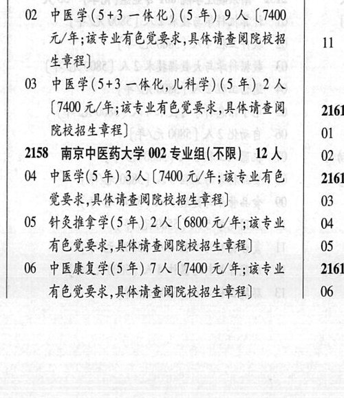
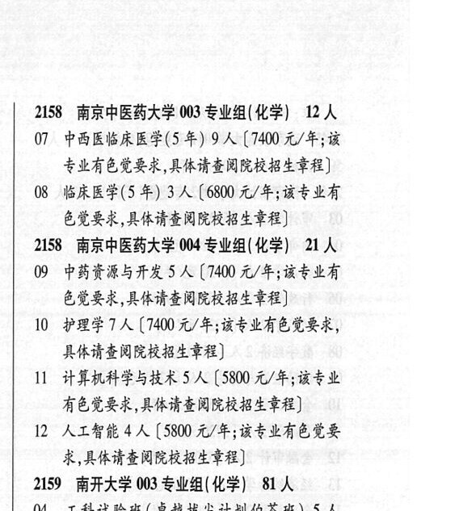

# 2158 南京中医药大学

- PDF页码：103
- 书内页码：152
- 专业组：6；专业条目：42

## 001专业组

- 选科要求：不限
- 招生计划：12 人
- 校验：review

| 专业代码 | 专业名称 | 计划人数 | 学费（元/年） | 备注/完整OCR内容 |
|---|---|---:|---:|---|
| 01 | 中医学(拔失创新人才培养模式改革) (9 +) | 1 | 1400 | (1400 元/年;该专业有色觉要求,具体请 10: 查阅院校招生章程] |
| 02 | 中医学(5+3 一体化) (5 年) 9A ( |  | 7400 | 7400 元/年;该专业有色觉要求,具体请查阅院校招 \| 11 生章程] |
| 03 | 中医学(5+3 一体化,儿科学) (5 年) | 2 | 7400 | [7400 元/年;该专业有色觉要求,具体请查阅 2161 院校招生章程] 01 4 |

<details><summary>本专业组OCR原文</summary>

```text
2158 ”南京中医药大学 001 专业组(不限) 12 人
Ol 中医学(拔失创新人才培养模式改革) (9 +)    ;
1人 (1400 元/年;该专业有色觉要求,具体请   10:
查阅院校招生章程]
02 中医学(5+3 一体化) (5 年) 9A (7400
元/年;该专业有色觉要求,具体请查阅院校招 | 11
生章程]
03 中医学(5+3 一体化,儿科学) (5 年) 2 人
[7400 元/年;该专业有色觉要求,具体请查阅   2161
院校招生章程]             01 4
```
</details>

## 002专业组

- 选科要求：化学
- 招生计划：157 人
- 校验：review

| 专业代码 | 专业名称 | 计划人数 | 学费（元/年） | 备注/完整OCR内容 |
|---|---|---:|---:|---|
| 02 | 通信工程 | 5 | 6380 | 【6380元/年] 09 |
| 03 | BFERLE ILA ( |  | 6380 | 6380 元/年] |
| 04 | 广播电视工程 | 3 | 6380 | 【6380 元/年] 10. |
| 05 | 电子科学与技术 10A (6380 4/4) |  |  | 05 电子科学与技术 10A (6380 4/4) |
| 06 | 光电信息科学与工程 | 5 | 6380 | 【6380元/年] Me |
| 07 | 电磁场与无线技术 | 3 | 6380 | 【6380元/年] |
| 08 | 柔性电子学 | 4 |  | (6380 4/#) 2, |
| 09 | 微电子科学与工程 | 6 |  | 【6380 4/4) |
| 10 | 集成电路设计与集成系统 | 9 | 6380 | 【6380元/年] \| 2159 |
| 11 | 集成电路科学与工程 | 6 | 5800 | [5800元/年] 人 |
| 12 | 计算机科学与技术 | 9 | 6380 | 【6380元/年] |
| 13 | 软件工程 | 6 | 6380 | [6380元/年] |
| 14 | 信息安全 | 10 | 6380 | [6380 元/年] |
| 15 | 测控技术与仪器 | 5 | 6380 | 【6380元/年] ° |
| 16 | 电气工程及其自动化 | 2 | 6380 | 【6380元/年] |
| 17 | 智能电网信息工程 | 2 | 6380 | [6380 元/年] |
| 18 | 自动化 | 3 | 6380 | 【6380元/年] |
| 19 | 人工智能 | 7 | 6380 | 【6380元/年] |
| 20 | 机器人工程 | 2 | 5800 | [5800 元/年] |
| 21 | 数据科学与大数据技术 | 4 | 6380 | 【6380元/年 |
| 22 | 新能源材料与器件 | 6 | 6380 | 【6380 元/年] |
| 23 | 电子信息材料 | 6 | 5800 | [5800元/年] Ps |
| 24 | 智能感知工程 | 4 |  | (5800 4/4) |
| 25 | 网络工程 | 2 | 6380 | [6380元/年] |
| 26 | MRALES A ( |  | 6380 | 6380 元/年] 08 |
| 27 | 信息与计算科学 | 5 | 6050 | 【6050 元/年] |
| 28 | 邮政工程(双学士学位复合型人才培养项目邮 SRI) | 3 | 5800 | [5800 元/年;邮政工程+大数 据管理与应用双学士学位复合型人才培养项 0 A MERI) |
| 29 | 数字媒体技术4 A (6380 4/4) |  |  | 29 数字媒体技术4 A (6380 4/4) |

<details><summary>本专业组OCR原文</summary>

```text
2157 南京邮电大学 002 专业组(化学) 157 人   2158
02 通信工程 5 人【6380元/年]         09
03 BFERLE ILA (6380 元/年]
04 广播电视工程3人【6380 元/年]        10.
05 电子科学与技术 10A (6380 4/4)
06 光电信息科学与工程5 人【6380元/年]     Me
07 电磁场与无线技术3 人【6380元/年]
08 柔性电子学4人 (6380 4/#)         2,
09 微电子科学与工程6 人【6380 4/4)
10 集成电路设计与集成系统9 人【6380元/年] | 2159
11 集成电路科学与工程6人 [5800元/年]    人
12 计算机科学与技术9 人【6380元/年]
13 软件工程6人[6380元/年]
14 信息安全 10 人[6380 元/年]
15 测控技术与仪器5 人【6380元/年]       °
16 电气工程及其自动化2 人【6380元/年]
17 智能电网信息工程 2人[6380 元/年]
18 自动化3人【6380元/年]
19 人工智能7人【6380元/年]
20 机器人工程2人[5800 元/年]
21 数据科学与大数据技术4 人【6380元/年
22 新能源材料与器件 6 人【6380 元/年]
23 电子信息材料6 人[5800元/年]       Ps
24 智能感知工程4人 (5800 4/4)
25 网络工程2人[6380元/年]
26 MRALES A (6380 元/年]         08
27 信息与计算科学5人【6050 元/年]
28 邮政工程(双学士学位复合型人才培养项目邮
SRI) 3 人[5800 元/年;邮政工程+大数
据管理与应用双学士学位复合型人才培养项   0
A MERI)
29 数字媒体技术4 A (6380 4/4)
```
</details>

## 002专业组

- 选科要求：不限
- 招生计划：12 人
- 校验：review

| 专业代码 | 专业名称 | 计划人数 | 学费（元/年） | 备注/完整OCR内容 |
|---|---|---:|---:|---|
| 04 | 中医学(5年) 3A ( |  | 7400 | 7400 元/年;该专业有色 2161 觉要求,具体请查阅院校招生章程] 03 3 |
| 05 | 针灸推拿学(5 年) 2A ( |  | 6800 | 6800 元/年;该专业 04 有色觉有要求,具体请查阅院校招生章程] 05 3 |
| 06 | 中医康复学(5 年) 7A ( |  | 1400 | 1400 元/年;该专业 2161 有色觉要求,具体请查阅院校招生章程] 06 4 |

<details><summary>本专业组OCR原文</summary>

```text
2158 南京中医药大学 002 专业组( 不限) 12 人   02 4
04 中医学(5年) 3A (7400 元/年;该专业有色   2161
觉要求,具体请查阅院校招生章程]       03 3
05 针灸推拿学(5 年) 2A (6800 元/年;该专业   04
有色觉有要求,具体请查阅院校招生章程]     05 3
06 中医康复学(5 年) 7A (1400 元/年;该专业   2161
有色觉要求,具体请查阅院校招生章程]     06 4
```
</details>

## 003专业组

- 选科要求：化学
- 招生计划：12 人
- 校验：review

| 专业代码 | 专业名称 | 计划人数 | 学费（元/年） | 备注/完整OCR内容 |
|---|---|---:|---:|---|
| 07 | 中西医临床医学(5 年) 9A ( |  | 1400 | 1400 元/年;该 专业有色觉要求,具体请查阅院校招生章程] |
| 08 | 临床医学(5 年) | 3 | 6800 | 【6800 元/年;该专业有 色觉有要求,具体请查阅院校招生章程] |

<details><summary>本专业组OCR原文</summary>

```text
2158 ”南京中医药大学 003 专业组(化学) 12 人
07 中西医临床医学(5 年) 9A (1400 元/年;该
专业有色觉要求,具体请查阅院校招生章程]
08 临床医学(5 年) 3 人【6800 元/年;该专业有
色觉有要求,具体请查阅院校招生章程]
```
</details>

## 004专业组

- 选科要求：化学
- 招生计划：21 人
- 校验：review

| 专业代码 | 专业名称 | 计划人数 | 学费（元/年） | 备注/完整OCR内容 |
|---|---|---:|---:|---|
| 09 | 中药资源与开发 | 5 | 7400 | [7400 元/年;该专业有 色觉要求,具体请查阅院校招生章程] |
| 10 | 护理学? 人 |  | 7400 | 7400 元/年;该专业有色觉要求， 具体请查阅院校招生章程] |
| 11 | 计算机科学与技术 | 5 | 5800 | 【5800 元/年;该专业 有色觉要求,具体请查阅院校招生章程] |
| 12 | 人工智能 | 4 | 5800 | [5800 元/年;该专业有色觉要 求,具体请查阅院校招生章程] |

<details><summary>本专业组OCR原文</summary>

```text
2158 南京中医药大学 004 专业组(化学) 21 人
09 中药资源与开发 5 人[7400 元/年;该专业有
色觉要求,具体请查阅院校招生章程]
10 护理学? 人【7400 元/年;该专业有色觉要求，
具体请查阅院校招生章程]
11 计算机科学与技术5 人【5800 元/年;该专业
有色觉要求,具体请查阅院校招生章程]
12 人工智能4 人[5800 元/年;该专业有色觉要
求,具体请查阅院校招生章程]
```
</details>

## 012专业组

- 选科要求：化学
- 招生计划：5 人
- 校验：ok

| 专业代码 | 专业名称 | 计划人数 | 学费（元/年） | 备注/完整OCR内容 |
|---|---|---:|---:|---|
| 12 | 护理学 | 5 | 6800 | [6800元/年;有色党要求,具体请“\| 07 查阅院校招生章程;常州校区] 2156 南京艺术学院 001 专业组( 化学) 1A 08 |
| 01 | 智能交互设计 1A ( |  | 10000 | 10000 元/年] |

<details><summary>本专业组OCR原文</summary>

```text
2155 南京医科大学 012 专业组(化学) 5人    2158
12 护理学5人[6800元/年;有色党要求,具体请“| 07
查阅院校招生章程;常州校区]
2156 南京艺术学院 001 专业组( 化学) 1A    08
Ol 智能交互设计 1A (10000 元/年]
```
</details>

## 附：院校完整OCR原文

```text
--- PDF第103页（书内第152页），第2栏 ---
2155 南京医科大学 012 专业组(化学) 5人    2158
12 护理学5人[6800元/年;有色党要求,具体请“| 07
查阅院校招生章程;常州校区]
2156 南京艺术学院 001 专业组( 化学) 1A    08
Ol 智能交互设计 1A (10000 元/年]
2157 南京邮电大学 002 专业组(化学) 157 人   2158
02 通信工程 5 人【6380元/年]         09
03 BFERLE ILA (6380 元/年]
04 广播电视工程3人【6380 元/年]        10.
05 电子科学与技术 10A (6380 4/4)
06 光电信息科学与工程5 人【6380元/年]     Me
07 电磁场与无线技术3 人【6380元/年]
08 柔性电子学4人 (6380 4/#)         2,
09 微电子科学与工程6 人【6380 4/4)
10 集成电路设计与集成系统9 人【6380元/年] | 2159
11 集成电路科学与工程6人 [5800元/年]    人
12 计算机科学与技术9 人【6380元/年]
13 软件工程6人[6380元/年]
14 信息安全 10 人[6380 元/年]
15 测控技术与仪器5 人【6380元/年]       °
16 电气工程及其自动化2 人【6380元/年]
17 智能电网信息工程 2人[6380 元/年]
18 自动化3人【6380元/年]
19 人工智能7人【6380元/年]
20 机器人工程2人[5800 元/年]
21 数据科学与大数据技术4 人【6380元/年
22 新能源材料与器件 6 人【6380 元/年]
23 电子信息材料6 人[5800元/年]       Ps
24 智能感知工程4人 (5800 4/4)
25 网络工程2人[6380元/年]
26 MRALES A (6380 元/年]         08
27 信息与计算科学5人【6050 元/年]
28 邮政工程(双学士学位复合型人才培养项目邮
SRI) 3 人[5800 元/年;邮政工程+大数
据管理与应用双学士学位复合型人才培养项   0
A MERI)
29 数字媒体技术4 A (6380 4/4)
2158 ”南京中医药大学 001 专业组(不限) 12 人
Ol 中医学(拔失创新人才培养模式改革) (9 +)    ;
1人 (1400 元/年;该专业有色觉要求,具体请   10:
查阅院校招生章程]
02 中医学(5+3 一体化) (5 年) 9A (7400
元/年;该专业有色觉要求,具体请查阅院校招 | 11
生章程]
03 中医学(5+3 一体化,儿科学) (5 年) 2 人
[7400 元/年;该专业有色觉要求,具体请查阅   2161
院校招生章程]             01 4
2158 南京中医药大学 002 专业组( 不限) 12 人   02 4
04 中医学(5年) 3A (7400 元/年;该专业有色   2161
觉要求,具体请查阅院校招生章程]       03 3
05 针灸推拿学(5 年) 2A (6800 元/年;该专业   04
有色觉有要求,具体请查阅院校招生章程]     05 3
06 中医康复学(5 年) 7A (1400 元/年;该专业   2161
有色觉要求,具体请查阅院校招生章程]     06 4

--- PDF第103页（书内第152页），第3栏 ---
2158 ”南京中医药大学 003 专业组(化学) 12 人
07 中西医临床医学(5 年) 9A (1400 元/年;该
专业有色觉要求,具体请查阅院校招生章程]
08 临床医学(5 年) 3 人【6800 元/年;该专业有
色觉有要求,具体请查阅院校招生章程]
2158 南京中医药大学 004 专业组(化学) 21 人
09 中药资源与开发 5 人[7400 元/年;该专业有
色觉要求,具体请查阅院校招生章程]
10 护理学? 人【7400 元/年;该专业有色觉要求，
具体请查阅院校招生章程]
11 计算机科学与技术5 人【5800 元/年;该专业
有色觉要求,具体请查阅院校招生章程]
12 人工智能4 人[5800 元/年;该专业有色觉要
求,具体请查阅院校招生章程]
```

## 源图


