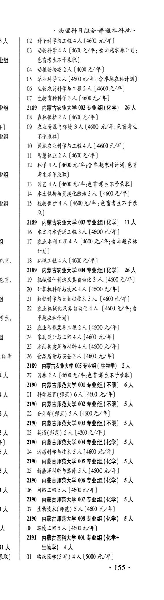
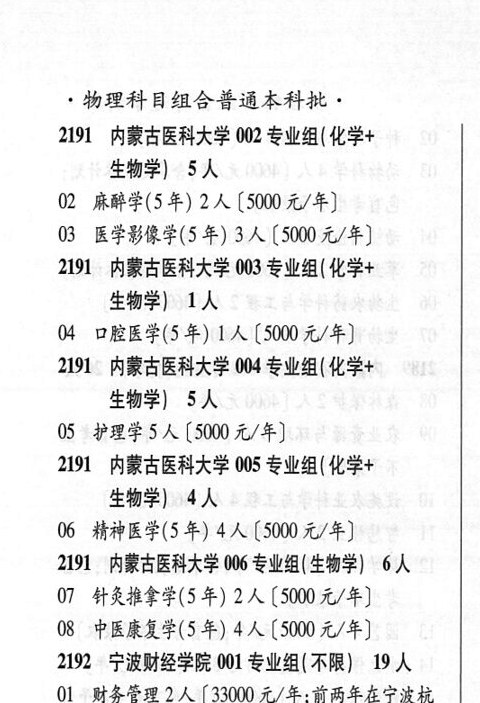

# 2191 内蒙古医科大学

- PDF页码：106, 107
- 书内页码：155, 156
- 专业组：6；专业条目：7

## 001专业组

- 选科要求：化学+、生物学
- 招生计划：4 人
- 校验：review

| 专业代码 | 专业名称 | 计划人数 | 学费（元/年） | 备注/完整OCR内容 |
|---|---|---:|---:|---|
|  | 结构化OCR未稳定切分，请查看下方原文及源图 |  |  |  |

<details><summary>本专业组OCR原文</summary>

```text
2191 内蒙古医科大学 001 专业组(化学+ 、     生物学) 4人
、     生物学) 4人
J   Ol 临床医学(5 年) 4A (500 元/年]
155+
物理科目组合普通本科批，
```
</details>

## 002专业组

- 选科要求：OCR未稳定识别
- 招生计划：5 人
- 校验：ok

| 专业代码 | 专业名称 | 计划人数 | 学费（元/年） | 备注/完整OCR内容 |
|---|---|---:|---:|---|
| 02 | 麻醉学(5年) | 2 | 5000 | 【5000 元/年] |
| 03 | 医学影像学(5年) | 3 | 5000 | 【5000元/年] |

<details><summary>本专业组OCR原文</summary>

```text
2191 内蒙古医科大学 002 专业组( 化学+ 生物学| 5人
02 麻醉学(5年) 2人【5000 元/年]
03 医学影像学(5年) 3人【5000元/年]
```
</details>

## 003专业组

- 选科要求：化学+生物学
- 招生计划：1 人
- 校验：sum-corrected

| 专业代码 | 专业名称 | 计划人数 | 学费（元/年） | 备注/完整OCR内容 |
|---|---|---:|---:|---|
| 04 | 口腔医学(5年) | 1 | 5000 | [5000 元/年] |

<details><summary>本专业组OCR原文</summary>

```text
2191 内蒙古医科大学 003 专业组( 化学+ 生物学) 14
04 口腔医学(5年) 1 人[5000 元/年]
```
</details>

## 004专业组

- 选科要求：OCR未稳定识别
- 招生计划：5 人
- 校验：ok

| 专业代码 | 专业名称 | 计划人数 | 学费（元/年） | 备注/完整OCR内容 |
|---|---|---:|---:|---|
| 05 | “护理学 | 5 | 5000 | [5000 元/年] |

<details><summary>本专业组OCR原文</summary>

```text
2191 内蒙古医科大学 004 专业组( 化学+ 生物学| 5人
05 “护理学5人[5000 元/年]
```
</details>

## 005专业组

- 选科要求：化学+生物学
- 招生计划：4 人
- 校验：ok

| 专业代码 | 专业名称 | 计划人数 | 学费（元/年） | 备注/完整OCR内容 |
|---|---|---:|---:|---|
| 06 | 精神医学(5年) | 4 | 5000 | [5000元/年] |

<details><summary>本专业组OCR原文</summary>

```text
2191 内蒙古医科大学 005 专业组( 化学+ 生物学) 4人
06 精神医学(5年) 4人[5000元/年]
```
</details>

## 006专业组

- 选科要求：OCR未稳定识别
- 招生计划：6 人
- 校验：ok

| 专业代码 | 专业名称 | 计划人数 | 学费（元/年） | 备注/完整OCR内容 |
|---|---|---:|---:|---|
| 07 | 针灸推拿学(5 年) | 2 | 5000 | 【5000元/年] |
| 08 | 中医康复学(5 年) | 4 | 5000 | 【5000 元/年] |

<details><summary>本专业组OCR原文</summary>

```text
2191 内蒙古医科大学 006 专业组( 生物学| 6人
07 针灸推拿学(5 年) 2 人【5000元/年]
08 中医康复学(5 年) 4 人【5000 元/年]
```
</details>

## 附：院校完整OCR原文

```text
--- PDF第106页（书内第155页），第3栏 ---
2191 内蒙古医科大学 001 专业组(化学+
、     生物学) 4人
J   Ol 临床医学(5 年) 4A (500 元/年]
155+

--- PDF第107页（书内第156页），第1栏 ---
物理科目组合普通本科批，
2191 内蒙古医科大学 002 专业组( 化学+
生物学| 5人
02 麻醉学(5年) 2人【5000 元/年]
03 医学影像学(5年) 3人【5000元/年]
2191 内蒙古医科大学 003 专业组( 化学+
生物学) 14
04 口腔医学(5年) 1 人[5000 元/年]
2191 内蒙古医科大学 004 专业组( 化学+
生物学| 5人
05 “护理学5人[5000 元/年]
2191 内蒙古医科大学 005 专业组( 化学+
生物学) 4人
06 精神医学(5年) 4人[5000元/年]
2191 内蒙古医科大学 006 专业组( 生物学| 6人
07 针灸推拿学(5 年) 2 人【5000元/年]
08 中医康复学(5 年) 4 人【5000 元/年]
```

## 源图


