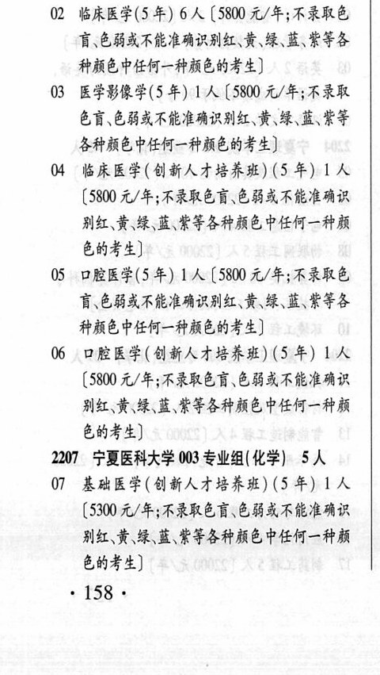
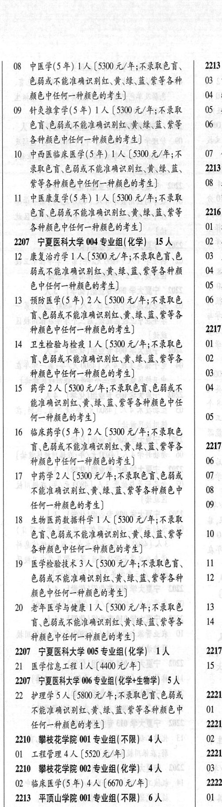

# 2207 宁夏医科大学

- PDF页码：109
- 书内页码：158
- 专业组：6；专业条目：22

## 001专业组

- 选科要求：不限
- 招生计划：1 人
- 校验：ok

| 专业代码 | 专业名称 | 计划人数 | 学费（元/年） | 备注/完整OCR内容 |
|---|---|---:|---:|---|
| 01 | 公共事业管理 | 1 | 4400 | 【4400 元/年] |

<details><summary>本专业组OCR原文</summary>

```text
2207 ”宁夏医科大学 001 专业组(不限) 1人
01 公共事业管理 1 人【4400 元/年]
```
</details>

## 002专业组

- 选科要求：化学
- 招生计划：10 人
- 校验：review

| 专业代码 | 专业名称 | 计划人数 | 学费（元/年） | 备注/完整OCR内容 |
|---|---|---:|---:|---|
| 02 | 临床医学(5 年) | 6 | 5800 | 【5800 元/年;不录取色 盲\色弱或不能准确识别红\黄、绿、蓝此等各 种颜色中任何一种颜色的考生] |
| 03 | 医学影像学(5 年) ] 人 |  | 5800 | 5800 元/年;不录取 色盲色弱或不能准确识别红、黄、绿、蓝、紫等 各种颜色中任何一种颜色的考生] |
| 04 | 临床医学(创新人才培养班) (5 年) | 1 | 5800 | (5800 元/年;不录取色盲\色弱或不能准确识 别红、\黄`绿\蓝\紫等各种颜色中任何一种颜 色的考生] |
| 05 | 口腔医学(5 年) 1A ( |  | 5800 | 5800 元/年;不录取色 讶色弱或不能准确识别红、黄\绿、蓝此等各 种颜色中任何一种颜色的考生] |
| 06 | 口腔医学(创新人才培养班) (SH) LA ( |  | 5800 | 5800 元/年;不录取色盲色弱或不能准确识 别红\黄\绿\蓝此等各种颜色中任何一种颜 色的考生] |

<details><summary>本专业组OCR原文</summary>

```text
2207 “宁夏医科大学 002 专业组(化学) 10 人
02 临床医学(5 年) 6 人【5800 元/年;不录取色
盲\色弱或不能准确识别红\黄、绿、蓝此等各
种颜色中任何一种颜色的考生]
03 医学影像学(5 年) ] 人【5800 元/年;不录取
色盲色弱或不能准确识别红、黄、绿、蓝、紫等
各种颜色中任何一种颜色的考生]
04 临床医学(创新人才培养班) (5 年) 1 人
(5800 元/年;不录取色盲\色弱或不能准确识
别红、\黄`绿\蓝\紫等各种颜色中任何一种颜
色的考生]
05 口腔医学(5 年) 1A (5800 元/年;不录取色
讶色弱或不能准确识别红、黄\绿、蓝此等各
种颜色中任何一种颜色的考生]
06 口腔医学(创新人才培养班) (SH) LA
(5800 元/年;不录取色盲色弱或不能准确识
别红\黄\绿\蓝此等各种颜色中任何一种颜
色的考生]
```
</details>

## 003专业组

- 选科要求：化学
- 招生计划：OCR未稳定识别 人
- 校验：review

| 专业代码 | 专业名称 | 计划人数 | 学费（元/年） | 备注/完整OCR内容 |
|---|---|---:|---:|---|
| 07 | 基础医学(创新人才培养班) (5 年) | 1 | 5300 | [5300元/年;不录取色盲\色能或不能准确识 别红\黄\绿\蓝\紫等各种颜色中任何一种颜 色的考生] 158+ |
| 08 | 中医学(5年) [人 |  | 5300 | 5300 元/年;不录取色言、 2213 色弱或不能准确识别红、黄`绿、蓝、紫等各种 03 8 颜色中任何一种颜色的考生] 04 刷 |
| 09 | 针灸推拿学(5 年) | 1 | 5300 | 【5300 元/年;不录取 05 # 色盲色弱或不能准确识别红、黄`\绿、蓝、紫等 06 & 各种颜色中任何一种颜色的考生] é |
| 10 | PHRBREF(5 #) 1A (5300 元/年;不 | 7 | 5300 | 录取色盲色弱或不能准确识别红、黄\绿、蓝、 2213 紫等各种颜色中任何一种颜色的考生] 08 38 |
| 11 | 中医康复学(5 #4) 1A ( |  | 5300 | 5300 元/年;不录取 色盲、色弱或不能准确识别红、黄\绿\蓝此等”\| 2216 各种颜色中任何一种颜色的考生] 01 书 |

<details><summary>本专业组OCR原文</summary>

```text
2207 宁夏医科大学 003 专业组(化学) SA
07 基础医学(创新人才培养班) (5 年) 1 人
[5300元/年;不录取色盲\色能或不能准确识
别红\黄\绿\蓝\紫等各种颜色中任何一种颜
色的考生]
158+
08 中医学(5年) [人【5300 元/年;不录取色言、   2213
色弱或不能准确识别红、黄`绿、蓝、紫等各种   03 8
颜色中任何一种颜色的考生]         04 刷
09 针灸推拿学(5 年) 1 人【5300 元/年;不录取   05 #
色盲色弱或不能准确识别红、黄`\绿、蓝、紫等   06 &
各种颜色中任何一种颜色的考生]          é
10 PHRBREF(5 #) 1A (5300 元/年;不   07 人
录取色盲色弱或不能准确识别红、黄\绿、蓝、   2213
紫等各种颜色中任何一种颜色的考生]      08 38
11 中医康复学(5 #4) 1A (5300 元/年;不录取
色盲、色弱或不能准确识别红、黄\绿\蓝此等”| 2216
各种颜色中任何一种颜色的考生]       01 书
```
</details>

## 004专业组

- 选科要求：化学
- 招生计划：15 人
- 校验：review

| 专业代码 | 专业名称 | 计划人数 | 学费（元/年） | 备注/完整OCR内容 |
|---|---|---:|---:|---|
| 12 | 康复治疗学 | 1 | 5300 | 【5300 元/年;不录取色盲\色 \| 03 Z 能或不能准确识别红、黄\绿、蓝、紫等各种颜 \| 04 色中任何一种颜色的考生] 05 4 |
| 13 | 预防医学(5 年) 2A ( |  | 530 | 530 元/年;不录取色 \| 06 4 育、色能或不能准确识别红、黄、绿、蓝、紫等各 J 种颜色中任何一种颜色的考生] 2217 |
| 14 | 卫生检验与检疫 ] 人 |  | 5300 | 5300 元/年;不录取色 Ol & 讶色弱或不能准确识别红\黄\绿、蓝、紫等各 \| 02 8 种颜色中任何一种颜色的考生] 03 4 |
| 15 | 药学 | 2 | 5300 | [5300 元/年;不录取色育\色弱或不 04 3 能准确识别红\黄\绿、蓝、紫等各种颜色中任 J 何一种颜色的考生] 05 3 |
| 16 | 临床药学(5 年) 2A ( |  | 5300 | 5300 元/年;不录取色 和 盲、色弱或不能准确识别红\黄\绿\蓝、紫等各 \| 2217 种颜色中任何一种颜色的考生] 06 8 |
| 17 | 中药学 | 2 | 5300 | [5300 元/年;不录取色盲.色弱或 07 3 不能准确识别红、黄\绿、蓝、紫等各种颜色中 08 4 任何一种颜色的考生] 09 名 |
| 18 | 生物医药数据科学 | 1 | 5300 | 【5300 元/年;不录取 色育、色弱或不能准确识别红`黄\绿\蓝,此等 \| 10 2 各种颜色中任何一种颜色的考生] |
| 19 | ”医学检验技术 | 3 | 5300 | 【5300 元/年;不录取色育、 11 人4 色弱或不能准确识别红、黄\绿、蓝、紫等各种 2 4 颜色中任何一种颜色的考生] |
| 20 | 老年医学与健康 ] 人 |  | 5300 | 5300 元/年;不录取色 13 3 讶色弱或不能准确识别红、黄`\绿\蓝\紫等各 14 3 种颜色中任何一种颜色的考生] J |

<details><summary>本专业组OCR原文</summary>

```text
2207 宁夏医科大学 004 专业组(化学) 15 人    OQ 4
12 康复治疗学1人【5300 元/年;不录取色盲\色 | 03 Z
能或不能准确识别红、黄\绿、蓝、紫等各种颜 | 04
色中任何一种颜色的考生]          05 4
13 预防医学(5 年) 2A (530 元/年;不录取色 | 06 4
育、色能或不能准确识别红、黄、绿、蓝、紫等各     J
种颜色中任何一种颜色的考生]        2217
14 卫生检验与检疫 ] 人【5300 元/年;不录取色  Ol &
讶色弱或不能准确识别红\黄\绿、蓝、紫等各 | 02 8
种颜色中任何一种颜色的考生]         03 4
15 药学2人[5300 元/年;不录取色育\色弱或不   04 3
能准确识别红\黄\绿、蓝、紫等各种颜色中任     J
何一种颜色的考生]            05 3
16 临床药学(5 年) 2A (5300 元/年;不录取色     和
盲、色弱或不能准确识别红\黄\绿\蓝、紫等各 | 2217
种颜色中任何一种颜色的考生]        06 8
17 中药学2 人[5300 元/年;不录取色盲.色弱或   07 3
不能准确识别红、黄\绿、蓝、紫等各种颜色中   08 4
任何一种颜色的考生]            09 名
18 生物医药数据科学 1 人【5300 元/年;不录取
色育、色弱或不能准确识别红`黄\绿\蓝,此等 | 10 2
各种颜色中任何一种颜色的考生]
19 ”医学检验技术 3 人【5300 元/年;不录取色育、   11 人4
色弱或不能准确识别红、黄\绿、蓝、紫等各种   2 4
颜色中任何一种颜色的考生]
20 老年医学与健康 ] 人【5300 元/年;不录取色   13 3
讶色弱或不能准确识别红、黄`\绿\蓝\紫等各   14 3
种颜色中任何一种颜色的考生]          J
```
</details>

## 005专业组

- 选科要求：化学
- 招生计划：1 人
- 校验：sum-corrected

| 专业代码 | 专业名称 | 计划人数 | 学费（元/年） | 备注/完整OCR内容 |
|---|---|---:|---:|---|
| 21 | 医学信息工程 | 1 | 4400 | 【4400元/年] 15 4 |

<details><summary>本专业组OCR原文</summary>

```text
2207 宁夏医科大学 005 专业组(化学) 1A    2217
21 医学信息工程1人【4400元/年]       15 4
```
</details>

## 006专业组

- 选科要求：化学+生物学
- 招生计划：5 人
- 校验：sum-corrected

| 专业代码 | 专业名称 | 计划人数 | 学费（元/年） | 备注/完整OCR内容 |
|---|---|---:|---:|---|
| 22 | 护理学 | 5 | 5800 | [5800元/年;不录取色盲.色弱或 2221 不能准确识别红\黄\绿、蓝、紫等各种颜色中 01 1 任何一种颜色的考生] 2221 |

<details><summary>本专业组OCR原文</summary>

```text
2207 “宁夏医科大学 006 专业组(化学+生物学) SA     4
22 护理学5人[5800元/年;不录取色盲.色弱或   2221
不能准确识别红\黄\绿、蓝、紫等各种颜色中  01 1
任何一种颜色的考生]            2221
```
</details>

## 附：院校完整OCR原文

```text
--- PDF第109页（书内第158页），第1栏 ---
2207 ”宁夏医科大学 001 专业组(不限) 1人
01 公共事业管理 1 人【4400 元/年]
2207 “宁夏医科大学 002 专业组(化学) 10 人
02 临床医学(5 年) 6 人【5800 元/年;不录取色
盲\色弱或不能准确识别红\黄、绿、蓝此等各
种颜色中任何一种颜色的考生]
03 医学影像学(5 年) ] 人【5800 元/年;不录取
色盲色弱或不能准确识别红、黄、绿、蓝、紫等
各种颜色中任何一种颜色的考生]
04 临床医学(创新人才培养班) (5 年) 1 人
(5800 元/年;不录取色盲\色弱或不能准确识
别红、\黄`绿\蓝\紫等各种颜色中任何一种颜
色的考生]
05 口腔医学(5 年) 1A (5800 元/年;不录取色
讶色弱或不能准确识别红、黄\绿、蓝此等各
种颜色中任何一种颜色的考生]
06 口腔医学(创新人才培养班) (SH) LA
(5800 元/年;不录取色盲色弱或不能准确识
别红\黄\绿\蓝此等各种颜色中任何一种颜
色的考生]
2207 宁夏医科大学 003 专业组(化学) SA
07 基础医学(创新人才培养班) (5 年) 1 人
[5300元/年;不录取色盲\色能或不能准确识
别红\黄\绿\蓝\紫等各种颜色中任何一种颜
色的考生]
158+

--- PDF第109页（书内第158页），第2栏 ---
08 中医学(5年) [人【5300 元/年;不录取色言、   2213
色弱或不能准确识别红、黄`绿、蓝、紫等各种   03 8
颜色中任何一种颜色的考生]         04 刷
09 针灸推拿学(5 年) 1 人【5300 元/年;不录取   05 #
色盲色弱或不能准确识别红、黄`\绿、蓝、紫等   06 &
各种颜色中任何一种颜色的考生]          é
10 PHRBREF(5 #) 1A (5300 元/年;不   07 人
录取色盲色弱或不能准确识别红、黄\绿、蓝、   2213
紫等各种颜色中任何一种颜色的考生]      08 38
11 中医康复学(5 #4) 1A (5300 元/年;不录取
色盲、色弱或不能准确识别红、黄\绿\蓝此等”| 2216
各种颜色中任何一种颜色的考生]       01 书
2207 宁夏医科大学 004 专业组(化学) 15 人    OQ 4
12 康复治疗学1人【5300 元/年;不录取色盲\色 | 03 Z
能或不能准确识别红、黄\绿、蓝、紫等各种颜 | 04
色中任何一种颜色的考生]          05 4
13 预防医学(5 年) 2A (530 元/年;不录取色 | 06 4
育、色能或不能准确识别红、黄、绿、蓝、紫等各     J
种颜色中任何一种颜色的考生]        2217
14 卫生检验与检疫 ] 人【5300 元/年;不录取色  Ol &
讶色弱或不能准确识别红\黄\绿、蓝、紫等各 | 02 8
种颜色中任何一种颜色的考生]         03 4
15 药学2人[5300 元/年;不录取色育\色弱或不   04 3
能准确识别红\黄\绿、蓝、紫等各种颜色中任     J
何一种颜色的考生]            05 3
16 临床药学(5 年) 2A (5300 元/年;不录取色     和
盲、色弱或不能准确识别红\黄\绿\蓝、紫等各 | 2217
种颜色中任何一种颜色的考生]        06 8
17 中药学2 人[5300 元/年;不录取色盲.色弱或   07 3
不能准确识别红、黄\绿、蓝、紫等各种颜色中   08 4
任何一种颜色的考生]            09 名
18 生物医药数据科学 1 人【5300 元/年;不录取
色育、色弱或不能准确识别红`黄\绿\蓝,此等 | 10 2
各种颜色中任何一种颜色的考生]
19 ”医学检验技术 3 人【5300 元/年;不录取色育、   11 人4
色弱或不能准确识别红、黄\绿、蓝、紫等各种   2 4
颜色中任何一种颜色的考生]
20 老年医学与健康 ] 人【5300 元/年;不录取色   13 3
讶色弱或不能准确识别红、黄`\绿\蓝\紫等各   14 3
种颜色中任何一种颜色的考生]          J
2207 宁夏医科大学 005 专业组(化学) 1A    2217
21 医学信息工程1人【4400元/年]       15 4
2207 “宁夏医科大学 006 专业组(化学+生物学) SA     4
22 护理学5人[5800元/年;不录取色盲.色弱或   2221
不能准确识别红\黄\绿、蓝、紫等各种颜色中  01 1
任何一种颜色的考生]            2221
```

## 源图


