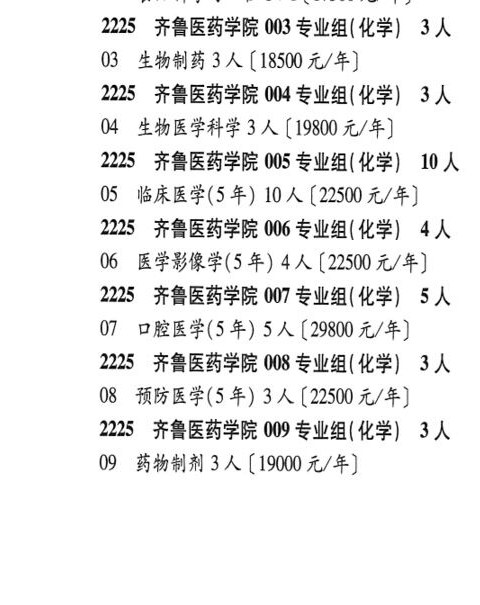
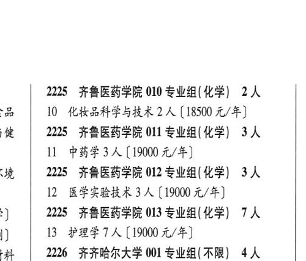

# 2225 齐鲁医药学院

- PDF页码：110
- 书内页码：159
- 专业组：13；专业条目：11

## 001专业组

- 选科要求：化学
- 招生计划：3 人
- 校验：review

| 专业代码 | 专业名称 | 计划人数 | 学费（元/年） | 备注/完整OCR内容 |
|---|---|---:|---:|---|
| 01 | 生物医学工程3 ( |  | 18500 | 18500 元/年] |

<details><summary>本专业组OCR原文</summary>

```text
2225 齐鲁医药学院 001 专业组( 化学) 3 人
Ol 生物医学工程3 (18500 元/年]
```
</details>

## 002专业组

- 选科要求：化学
- 招生计划：3 人
- 校验：ok

| 专业代码 | 专业名称 | 计划人数 | 学费（元/年） | 备注/完整OCR内容 |
|---|---|---:|---:|---|
| 02 | 食品科学与工程 | 3 | 17500 | [17500 元/年] |

<details><summary>本专业组OCR原文</summary>

```text
2225 齐鲁医药学院 002 专业组(化学) 3 人
02 食品科学与工程3人[17500 元/年]
```
</details>

## 003专业组

- 选科要求：化学
- 招生计划：3 人
- 校验：ok

| 专业代码 | 专业名称 | 计划人数 | 学费（元/年） | 备注/完整OCR内容 |
|---|---|---:|---:|---|
| 03 | 生物制药 | 3 | 18500 | 【18500 元/年] |

<details><summary>本专业组OCR原文</summary>

```text
2225 齐鲁医药学院 003 专业组(化学) 3 人
03 生物制药 3 人【18500 元/年]
```
</details>

## 004专业组

- 选科要求：化学
- 招生计划：3 人
- 校验：review

| 专业代码 | 专业名称 | 计划人数 | 学费（元/年） | 备注/完整OCR内容 |
|---|---|---:|---:|---|
| 04 | 生物医学科学 3 A ( |  | 19800 | 19800 元/年] |

<details><summary>本专业组OCR原文</summary>

```text
2225 齐鲁医药学院 004 专业组(化学) 3 人
04 生物医学科学 3 A (19800 元/年]
```
</details>

## 005专业组

- 选科要求：OCR未稳定识别
- 招生计划：10 人
- 校验：ok

| 专业代码 | 专业名称 | 计划人数 | 学费（元/年） | 备注/完整OCR内容 |
|---|---|---:|---:|---|
| 05 | 临床医学(5 年) | 10 | 22500 | 【22500 元/年] |

<details><summary>本专业组OCR原文</summary>

```text
2225 齐鲁医药学院 005 专业组(化学| 10 人
05 临床医学(5 年) 10 人【22500 元/年]
```
</details>

## 006专业组

- 选科要求：OCR未稳定识别
- 招生计划：4 人
- 校验：ok

| 专业代码 | 专业名称 | 计划人数 | 学费（元/年） | 备注/完整OCR内容 |
|---|---|---:|---:|---|
| 06 | 医学影像学(5 年) | 4 | 22500 | 【22500元/年] |

<details><summary>本专业组OCR原文</summary>

```text
2225 齐鲁医药学院 006 专业组(化学| 4人
06 医学影像学(5 年) 4 人【22500元/年]
```
</details>

## 007专业组

- 选科要求：化学
- 招生计划：5 人
- 校验：sum-corrected

| 专业代码 | 专业名称 | 计划人数 | 学费（元/年） | 备注/完整OCR内容 |
|---|---|---:|---:|---|
| 07 | 口腔医学(5年) | 5 | 29800 | 【29800 元/年] |

<details><summary>本专业组OCR原文</summary>

```text
2225 齐鲁医药学院 007 专业组(化学) SA
07 口腔医学(5年) 5 人【29800 元/年]
```
</details>

## 008专业组

- 选科要求：化学
- 招生计划：3 人
- 校验：review

| 专业代码 | 专业名称 | 计划人数 | 学费（元/年） | 备注/完整OCR内容 |
|---|---|---:|---:|---|
| 08 | 预防医学(5 年) 3A ( |  | 22500 | 22500 元/年] |

<details><summary>本专业组OCR原文</summary>

```text
2225 齐鲁医药学院 008 专业组( 化学) 3人
08 预防医学(5 年) 3A (22500 元/年]
```
</details>

## 009专业组

- 选科要求：化学
- 招生计划：3 人
- 校验：ok

| 专业代码 | 专业名称 | 计划人数 | 学费（元/年） | 备注/完整OCR内容 |
|---|---|---:|---:|---|
| 09 | 药物制剂 | 3 | 19000 | 【19000 元/年] |

<details><summary>本专业组OCR原文</summary>

```text
2225 齐鲁医药学院 009 专业组( 化学) 3人
09 药物制剂 3 人【19000 元/年]
```
</details>

## 010专业组

- 选科要求：化学
- 招生计划：2 人
- 校验：review

| 专业代码 | 专业名称 | 计划人数 | 学费（元/年） | 备注/完整OCR内容 |
|---|---|---:|---:|---|
|  | 结构化OCR未稳定切分，请查看下方原文及源图 |  |  |  |

<details><summary>本专业组OCR原文</summary>

```text
2225 齐鲁医药学院 010 专业组(化学) 2人
Se   10 化妆品科学与技术2 人【18500 元/年]
```
</details>

## 011专业组

- 选科要求：化学
- 招生计划：3 人
- 校验：ok

| 专业代码 | 专业名称 | 计划人数 | 学费（元/年） | 备注/完整OCR内容 |
|---|---|---:|---:|---|
| 11 | 中药学 | 3 | 19000 | 【19000 元/年] |

<details><summary>本专业组OCR原文</summary>

```text
Ae   2225 齐鲁医药学院 011 专业组(化学) 3 人
11 中药学3人【19000 元/年]
```
</details>

## 012专业组

- 选科要求：化学
- 招生计划：3 人
- 校验：ok

| 专业代码 | 专业名称 | 计划人数 | 学费（元/年） | 备注/完整OCR内容 |
|---|---|---:|---:|---|
| 12 | 医学实验技术 | 3 | 19000 | 【19000 元/年] |

<details><summary>本专业组OCR原文</summary>

```text
| 2225 齐鲁医药学院 012 专业组(化学) 3人
12 医学实验技术 3 人【19000 元/年]
```
</details>

## 013专业组

- 选科要求：化学
- 招生计划：7 人
- 校验：review

| 专业代码 | 专业名称 | 计划人数 | 学费（元/年） | 备注/完整OCR内容 |
|---|---|---:|---:|---|
|  | 结构化OCR未稳定切分，请查看下方原文及源图 |  |  |  |

<details><summary>本专业组OCR原文</summary>

```text
:)   25 齐鲁医药学院 013 专业组( 化学) 7 人
1)   13 护理学?人[19000元/年]
```
</details>

## 附：院校完整OCR原文

```text
--- PDF第110页（书内第159页），第1栏 ---
2225 齐鲁医药学院 001 专业组( 化学) 3 人
Ol 生物医学工程3 (18500 元/年]
2225 齐鲁医药学院 002 专业组(化学) 3 人
02 食品科学与工程3人[17500 元/年]
2225 齐鲁医药学院 003 专业组(化学) 3 人
03 生物制药 3 人【18500 元/年]
2225 齐鲁医药学院 004 专业组(化学) 3 人
04 生物医学科学 3 A (19800 元/年]
2225 齐鲁医药学院 005 专业组(化学| 10 人
05 临床医学(5 年) 10 人【22500 元/年]
2225 齐鲁医药学院 006 专业组(化学| 4人
06 医学影像学(5 年) 4 人【22500元/年]
2225 齐鲁医药学院 007 专业组(化学) SA
07 口腔医学(5年) 5 人【29800 元/年]
2225 齐鲁医药学院 008 专业组( 化学) 3人
08 预防医学(5 年) 3A (22500 元/年]
2225 齐鲁医药学院 009 专业组( 化学) 3人
09 药物制剂 3 人【19000 元/年]

--- PDF第110页（书内第159页），第2栏 ---
2225 齐鲁医药学院 010 专业组(化学) 2人
Se   10 化妆品科学与技术2 人【18500 元/年]
Ae   2225 齐鲁医药学院 011 专业组(化学) 3 人
11 中药学3人【19000 元/年]
| 2225 齐鲁医药学院 012 专业组(化学) 3人
12 医学实验技术 3 人【19000 元/年]
:)   25 齐鲁医药学院 013 专业组( 化学) 7 人
1)   13 护理学?人[19000元/年]
```

## 源图


