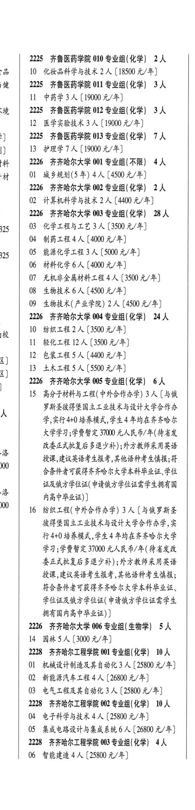
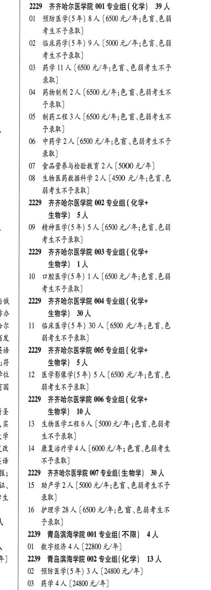

# 2229 齐齐哈尔医学院

- PDF页码：110
- 书内页码：159
- 专业组：13；专业条目：25

## 001专业组

- 选科要求：OCR未稳定识别
- 招生计划：10 人
- 校验：ok

| 专业代码 | 专业名称 | 计划人数 | 学费（元/年） | 备注/完整OCR内容 |
|---|---|---:|---:|---|
| 01 | 机械设计制造及其自动化 | 3 |  | 【25800 4/4) ; |
| 02 | 新能源汽车工程 | 4 |  | 【26800 4/4) ( |
| 03 | 电气工程及其自动化 | 3 | 25800 | 【25800 元/年] |

<details><summary>本专业组OCR原文</summary>

```text
2228 齐齐哈尔工程学院 001 专业组(化学| 10 人
01 机械设计制造及其自动化3 人【25800 4/4)   ;
02 新能源汽车工程4 人【26800 4/4)      (
03 电气工程及其自动化 3 人【25800 元/年]
```
</details>

## 001专业组

- 选科要求：化学
- 招生计划：39 人
- 校验：review

| 专业代码 | 专业名称 | 计划人数 | 学费（元/年） | 备注/完整OCR内容 |
|---|---|---:|---:|---|
| 01 | 预防医学(了年) | 8 | 6500 | 【6500 元/年;色盲色弱 考生不予录取] |
| 02 | 临床药学(5年) | 9 | 5000 | [5000 元/年;色盲色弱 考生不予录取] |
| 03 | 药学 | 11 | 6500 | [6500 元/年;色育、色弱考生不也 录取] |
| 04 | 药物制剂 | 2 | 6500 | 【6500 元/年;色盲、色弱考生不 FRR) |
| 05 | 制药工程 | 3 | 6500 | [6500 元/年;色盲色弱考生不 FRR) |
| 06 | 中药学 | 2 | 6500 | 【6500 元/年;色育、色弱考生不也 录取] |
| 07 | 食品营养与检验教育 2 ( |  | 5000 | 5000 元/年] |
| 08 | 生物医药教据科学 | 2 | 4500 | 【4500 元/年;色盲\色 能考生不予录取] |

<details><summary>本专业组OCR原文</summary>

```text
2229 齐齐哈尔医学院 001 专业组 ( 化学) 39 人
Ol 预防医学(了年) 8 人【6500 元/年;色盲色弱
考生不予录取]
02 临床药学(5年) 9 人[5000 元/年;色盲色弱
考生不予录取]
03 药学11 人[6500 元/年;色育、色弱考生不也
录取]
04 药物制剂2人【6500 元/年;色盲、色弱考生不
FRR)
05 制药工程3人[6500 元/年;色盲色弱考生不
FRR)
06 中药学2 人【6500 元/年;色育、色弱考生不也
录取]
07 食品营养与检验教育 2 (5000 元/年]
08 生物医药教据科学 2 人【4500 元/年;色盲\色
能考生不予录取]
```
</details>

## 002专业组

- 选科要求：OCR未稳定识别
- 招生计划：10 人
- 校验：ok

| 专业代码 | 专业名称 | 计划人数 | 学费（元/年） | 备注/完整OCR内容 |
|---|---|---:|---:|---|
| 04 | 电子科学与技术 | 4 | 25800 | 【25800 元/年] ( |
| 05 | 集成电路设计与集成系统 | 6 | 26800 | 【26800 元/年] |

<details><summary>本专业组OCR原文</summary>

```text
2228 齐齐哈尔工程学院 002 专业组(化学| 10 人   (
04 电子科学与技术4 人【25800 元/年]      (
05 集成电路设计与集成系统 6 人【26800 元/年]
```
</details>

## 002专业组

- 选科要求：化学+生物学
- 招生计划：5 人
- 校验：ok

| 专业代码 | 专业名称 | 计划人数 | 学费（元/年） | 备注/完整OCR内容 |
|---|---|---:|---:|---|
| 09 | 精神医学(5年) | 5 | 6500 | 6500 元/年;色盲、色弱 考生不予录取] |

<details><summary>本专业组OCR原文</summary>

```text
2229 齐齐哈尔医学院 002 专业组 ( 化学+ 生物学) 5人
09 精神医学(5年) 5 人6500 元/年;色盲、色弱
考生不予录取]
```
</details>

## 003专业组

- 选科要求：化学
- 招生计划：4 人
- 校验：ok

| 专业代码 | 专业名称 | 计划人数 | 学费（元/年） | 备注/完整OCR内容 |
|---|---|---:|---:|---|
| 06 | 智能建造 | 4 |  | 【25800 4/4) ( ' 物理科目组合普通本科批。 |

<details><summary>本专业组OCR原文</summary>

```text
2228 齐齐哈尔工程学院 003 专业组(化学) 4人    (
06 智能建造4 人【25800 4/4)         (
' 物理科目组合普通本科批。
```
</details>

## 003专业组

- 选科要求：化学+生物学
- 招生计划：OCR未稳定识别 人
- 校验：review

| 专业代码 | 专业名称 | 计划人数 | 学费（元/年） | 备注/完整OCR内容 |
|---|---|---:|---:|---|
| 10 | 口腔医学(5年) 1A ( |  | 6500 | 6500 元/年;色盲色弱 考生不予录取] |

<details><summary>本专业组OCR原文</summary>

```text
2229 齐齐哈尔医学院 003 专业组 ( 化学+ 生物学) 1h
10 口腔医学(5年) 1A (6500 元/年;色盲色弱
考生不予录取]
```
</details>

## 004专业组

- 选科要求：OCR未稳定识别
- 招生计划：4 人
- 校验：ok

| 专业代码 | 专业名称 | 计划人数 | 学费（元/年） | 备注/完整OCR内容 |
|---|---|---:|---:|---|
| 07 | 护理学 | 4 | 27800 | [27800 元/年] |

<details><summary>本专业组OCR原文</summary>

```text
2228 齐齐哈尔工程学院 004 专业组 ( 生物学| 4 人
07 护理学4 人[27800 元/年]
```
</details>

## 004专业组

- 选科要求：化学+生物学
- 招生计划：30 人
- 校验：ok

| 专业代码 | 专业名称 | 计划人数 | 学费（元/年） | 备注/完整OCR内容 |
|---|---|---:|---:|---|
| 11 | 临床医学(5年) | 30 | 6500 | 【6500 元/年;色盲、色 BALAF RR) |

<details><summary>本专业组OCR原文</summary>

```text
2229 齐齐哈尔医学院 004 专业组 ( 化学+ 生物学) 30 人
11 临床医学(5年) 30 人【6500 元/年;色盲、色
BALAF RR)
```
</details>

## 005专业组

- 选科要求：化学
- 招生计划：3 人
- 校验：sum-corrected

| 专业代码 | 专业名称 | 计划人数 | 学费（元/年） | 备注/完整OCR内容 |
|---|---|---:|---:|---|
| 15 | 高分子材料与工程( 中外合作办学) | 3 |  | 【与俄 \| \| 人 罗斯圣彼得堡国立工业技术与设计大学合作办 学,实行4+0 培养模式,学生4 年均在齐齐哈尔 KEPT FRR 3100 元人民币/年(待省发 网 改委正式批复后多退少补) ;外方教师采用英语 ne 授课,建议英语考生报考,其他语种考生慎报;符 合条件者可获得齐齐哈尔大学本科毕业证,学位 \| ; BRA PLE PHA PLES F EAA = 内高中毕业证) MO \| 16 纺织工程(中外合作办学) 3 人【与人罗斯对 彼得堡国立工业技术与设计大学合作办学,实 \| 行4+0 培养模式,学生4年均在齐齐哈尔大学 学习;学费暂定 37000 元人民币/年( 待省发改 委正式批复后多退少补) ; 外方教师采用英语 授课,建议英语考生报考,其他语种考生慎报; 符合条件者可获得齐齐哈尔大学本科毕业证、 学位证及俄方学位证( 申请俄方学位证需学生 拥有国内高中毕业证) ] |

<details><summary>本专业组OCR原文</summary>

```text
2226 齐齐哈尔大学 005 专业组(化学) 6人
15 高分子材料与工程( 中外合作办学) 3人【与俄 | |
人     罗斯圣彼得堡国立工业技术与设计大学合作办
学,实行4+0 培养模式,学生4 年均在齐齐哈尔
KEPT FRR 3100 元人民币/年(待省发
网    改委正式批复后多退少补) ;外方教师采用英语
ne    授课,建议英语考生报考,其他语种考生慎报;符
合条件者可获得齐齐哈尔大学本科毕业证,学位 |
;                 BRA PLE PHA PLES F EAA
=     内高中毕业证)
MO | 16 纺织工程(中外合作办学) 3 人【与人罗斯对
彼得堡国立工业技术与设计大学合作办学,实   |
行4+0 培养模式,学生4年均在齐齐哈尔大学
学习;学费暂定 37000 元人民币/年( 待省发改
委正式批复后多退少补) ; 外方教师采用英语
授课,建议英语考生报考,其他语种考生慎报;
符合条件者可获得齐齐哈尔大学本科毕业证、
学位证及俄方学位证( 申请俄方学位证需学生
拥有国内高中毕业证) ]
```
</details>

## 005专业组

- 选科要求：化学+生物学
- 招生计划：5 人
- 校验：ok

| 专业代码 | 专业名称 | 计划人数 | 学费（元/年） | 备注/完整OCR内容 |
|---|---|---:|---:|---|
| 12 | 医学影像学(5年) | 5 | 6500 | 【6500 元/年;色育、色 弱考生不予录取] |

<details><summary>本专业组OCR原文</summary>

```text
2229 齐齐哈尔医学院 005 专业组 ( 化学+ 生物学) 5人
12 医学影像学(5年) 5 人【6500 元/年;色育、色
弱考生不予录取]
```
</details>

## 006专业组

- 选科要求：生物学
- 招生计划：5 人
- 校验：ok

| 专业代码 | 专业名称 | 计划人数 | 学费（元/年） | 备注/完整OCR内容 |
|---|---|---:|---:|---|
| 14 | 园林 | 5 | 3000 | [3000元/年] j |

<details><summary>本专业组OCR原文</summary>

```text
2226 齐齐哈尔大学 006 专业组( 生物学) 5 人
14 园林5人[3000元/年]           j
```
</details>

## 006专业组

- 选科要求：化学+生物学
- 招生计划：10 人
- 校验：ok

| 专业代码 | 专业名称 | 计划人数 | 学费（元/年） | 备注/完整OCR内容 |
|---|---|---:|---:|---|
| 13 | 生物医学工程 | 6 | 5000 | [5000 元/年;色盲、色弱考 ERFTRR) |
| 14 | 康复治疗学 | 4 |  | 【6000 4/4; 色盲色弱考生 不予录取] |

<details><summary>本专业组OCR原文</summary>

```text
2229 齐齐哈尔医学院 006 专业组 ( 化学+ 生物学) 10人
13 生物医学工程6 人[5000 元/年;色盲、色弱考
ERFTRR)
14 康复治疗学4人【6000 4/4; 色盲色弱考生
不予录取]
```
</details>

## 007专业组

- 选科要求：OCR未稳定识别
- 招生计划：30 人
- 校验：ok

| 专业代码 | 专业名称 | 计划人数 | 学费（元/年） | 备注/完整OCR内容 |
|---|---|---:|---:|---|
| 15 | 助产学 | 2 | 5000 | [5000 元/年;色盲、色弱考生不予 录取] |
| 16 | 护理学 | 28 | 6500 | [6500 元/年;色盲、色弱考生不 FRE) |

<details><summary>本专业组OCR原文</summary>

```text
2229 齐齐哈尔医学院 007 专业组( 生物学| 30 人
15 助产学2 人[5000 元/年;色盲、色弱考生不予
录取]
16 护理学28 人[6500 元/年;色盲、色弱考生不
FRE)
```
</details>

## 附：院校完整OCR原文

```text
--- PDF第110页（书内第159页），第2栏 ---
2226 齐齐哈尔大学 005 专业组(化学) 6人
15 高分子材料与工程( 中外合作办学) 3人【与俄 | |
人     罗斯圣彼得堡国立工业技术与设计大学合作办
学,实行4+0 培养模式,学生4 年均在齐齐哈尔
KEPT FRR 3100 元人民币/年(待省发
网    改委正式批复后多退少补) ;外方教师采用英语
ne    授课,建议英语考生报考,其他语种考生慎报;符
合条件者可获得齐齐哈尔大学本科毕业证,学位 |
;                 BRA PLE PHA PLES F EAA
=     内高中毕业证)
MO | 16 纺织工程(中外合作办学) 3 人【与人罗斯对
彼得堡国立工业技术与设计大学合作办学,实   |
行4+0 培养模式,学生4年均在齐齐哈尔大学
学习;学费暂定 37000 元人民币/年( 待省发改
委正式批复后多退少补) ; 外方教师采用英语
授课,建议英语考生报考,其他语种考生慎报;
符合条件者可获得齐齐哈尔大学本科毕业证、
学位证及俄方学位证( 申请俄方学位证需学生
拥有国内高中毕业证) ]
2226 齐齐哈尔大学 006 专业组( 生物学) 5 人
14 园林5人[3000元/年]           j
2228 齐齐哈尔工程学院 001 专业组(化学| 10 人
01 机械设计制造及其自动化3 人【25800 4/4)   ;
02 新能源汽车工程4 人【26800 4/4)      (
03 电气工程及其自动化 3 人【25800 元/年]
2228 齐齐哈尔工程学院 002 专业组(化学| 10 人   (
04 电子科学与技术4 人【25800 元/年]      (
05 集成电路设计与集成系统 6 人【26800 元/年]
2228 齐齐哈尔工程学院 003 专业组(化学) 4人    (
06 智能建造4 人【25800 4/4)         (

--- PDF第110页（书内第159页），第3栏 ---
' 物理科目组合普通本科批。
2228 齐齐哈尔工程学院 004 专业组 ( 生物学| 4 人
07 护理学4 人[27800 元/年]
2229 齐齐哈尔医学院 001 专业组 ( 化学) 39 人
Ol 预防医学(了年) 8 人【6500 元/年;色盲色弱
考生不予录取]
02 临床药学(5年) 9 人[5000 元/年;色盲色弱
考生不予录取]
03 药学11 人[6500 元/年;色育、色弱考生不也
录取]
04 药物制剂2人【6500 元/年;色盲、色弱考生不
FRR)
05 制药工程3人[6500 元/年;色盲色弱考生不
FRR)
06 中药学2 人【6500 元/年;色育、色弱考生不也
录取]
07 食品营养与检验教育 2 (5000 元/年]
08 生物医药教据科学 2 人【4500 元/年;色盲\色
能考生不予录取]
2229 齐齐哈尔医学院 002 专业组 ( 化学+
生物学) 5人
09 精神医学(5年) 5 人6500 元/年;色盲、色弱
考生不予录取]
2229 齐齐哈尔医学院 003 专业组 ( 化学+
生物学) 1h
10 口腔医学(5年) 1A (6500 元/年;色盲色弱
考生不予录取]
2229 齐齐哈尔医学院 004 专业组 ( 化学+
生物学) 30 人
11 临床医学(5年) 30 人【6500 元/年;色盲、色
BALAF RR)
2229 齐齐哈尔医学院 005 专业组 ( 化学+
生物学) 5人
12 医学影像学(5年) 5 人【6500 元/年;色育、色
弱考生不予录取]
2229 齐齐哈尔医学院 006 专业组 ( 化学+
生物学) 10人
13 生物医学工程6 人[5000 元/年;色盲、色弱考
ERFTRR)
14 康复治疗学4人【6000 4/4; 色盲色弱考生
不予录取]
2229 齐齐哈尔医学院 007 专业组( 生物学| 30 人
15 助产学2 人[5000 元/年;色盲、色弱考生不予
录取]
16 护理学28 人[6500 元/年;色盲、色弱考生不
FRE)
```

## 源图


