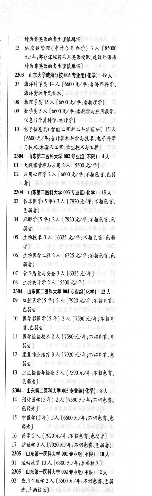

# 2304 山东第二医科大学

- PDF页码：115
- 书内页码：164
- 专业组：4；专业条目：17

## 002专业组

- 选科要求：不限
- 招生计划：4 人
- 校验：ok

| 专业代码 | 专业名称 | 计划人数 | 学费（元/年） | 备注/完整OCR内容 |
|---|---|---:|---:|---|
| 01 | 大数据管理与应用 | 2 | 5500 | (5500 元/年] |
| 02 | 应用心理学 | 2 | 6600 | 【6600 元/年;不招色育\色弱 者] |

<details><summary>本专业组OCR原文</summary>

```text
2304 山东第二医科大学 002 专业组(不限)】 4 人
01 大数据管理与应用2 人 (5500 元/年]
02 应用心理学 2 人【6600 元/年;不招色育\色弱
者]
```
</details>

## 003专业组

- 选科要求：化学
- 招生计划：1 人
- 校验：review

| 专业代码 | 专业名称 | 计划人数 | 学费（元/年） | 备注/完整OCR内容 |
|---|---|---:|---:|---|
| 03 | 临床医学(5 年) 3A ( |  | 7920 | 7920 元/年;不招色言、 色磁者] |
| 04 | 麻醉学(5年) 2A ( |  | 1920 | 1920 元/年;不招色盲、色 弱者] |
| 05 | 生物技术 | 3 | 6325 | 【6325 元/年;不招色盲色弱 4) |
| 06 | 生物医学工程 | 2 | 6325 | 【6325 元/年;不招色盲\色 弱者] |
| 07 | 食品质量与安全 | 3 | 6325 | 【6325 元/年] |
| 08 | 生物统计学 | 2 | 5500 | 【5500 元/年] |

<details><summary>本专业组OCR原文</summary>

```text
2304 山东第二医科大学 003 专业组(化学) 1 人
03 临床医学(5 年) 3A (7920 元/年;不招色言、
色磁者]
04 麻醉学(5年) 2A (1920 元/年;不招色盲、色
弱者]
05 生物技术 3 人【6325 元/年;不招色盲色弱
4)
06 生物医学工程 2 人【6325 元/年;不招色盲\色
弱者]
07 食品质量与安全3 人【6325 元/年]
08 生物统计学 2 人【5500 元/年]
```
</details>

## 004专业组

- 选科要求：化学
- 招生计划：12 人
- 校验：review

| 专业代码 | 专业名称 | 计划人数 | 学费（元/年） | 备注/完整OCR内容 |
|---|---|---:|---:|---|
| 09 | 口腔医学(5 年) 2A ( |  | 7920 | 7920 元/年;不招色盲、 684) |
| 10 | 医学影像学(5 年) | 2 | 7590 | 【7590 元/年;不招色 育\色弱者] |
| 11 | 医学检验技术 | 2 | 7590 | 【7590 元/年;不招色盲\色 弱者] |
| 12 | 康复作业治疗 | 3 | 7920 | 【7920元/年;不招色育、色 弱者] |
| 13 | ”卫生检验与检疫 | 3 | 7590 | 【7590 元/年;不招色言、 色弱者] |

<details><summary>本专业组OCR原文</summary>

```text
2304 山东第二医科大学 004 专业组(化学) 12 人
09 口腔医学(5 年) 2A (7920 元/年;不招色盲、
684)
10 医学影像学(5 年) 2 人【7590 元/年;不招色
育\色弱者]
11 医学检验技术 2 人【7590 元/年;不招色盲\色
弱者]
12 康复作业治疗 3 人【7920元/年;不招色育、色
弱者]
13 ”卫生检验与检疫 3 人【7590 元/年;不招色言、
色弱者]
```
</details>

## 005专业组

- 选科要求：化学
- 招生计划：8 人
- 校验：review

| 专业代码 | 专业名称 | 计划人数 | 学费（元/年） | 备注/完整OCR内容 |
|---|---|---:|---:|---|
| 14 | 预防医学(5 年) 2A ( |  | 7590 | 7590 元/年;不招色育、 色弱者] |
| 15 | 中医学(5年) | 1 | 6600 | 【6600 元/年;不招色盲、.色 84) |
| 16 | 药学 | 2 | 7920 | [7920元/年;不招色育、色弱者] |
| 17 | 护理学 | 3 | 7920 | 【7920元/年;不招色育色弱者] |

<details><summary>本专业组OCR原文</summary>

```text
2304 山东第二医科大学 005 专业组(化学) 8 人
14 预防医学(5 年) 2A (7590 元/年;不招色育、
色弱者]
15 中医学(5年) 1人【6600 元/年;不招色盲、.色
84)
16 药学2人[7920元/年;不招色育、色弱者]
17 护理学3 人【7920元/年;不招色育色弱者]
```
</details>

## 附：院校完整OCR原文

```text
--- PDF第115页（书内第164页），第3栏 ---
2304 山东第二医科大学 002 专业组(不限)】 4 人
01 大数据管理与应用2 人 (5500 元/年]
02 应用心理学 2 人【6600 元/年;不招色育\色弱
者]
2304 山东第二医科大学 003 专业组(化学) 1 人
03 临床医学(5 年) 3A (7920 元/年;不招色言、
色磁者]
04 麻醉学(5年) 2A (1920 元/年;不招色盲、色
弱者]
05 生物技术 3 人【6325 元/年;不招色盲色弱
4)
06 生物医学工程 2 人【6325 元/年;不招色盲\色
弱者]
07 食品质量与安全3 人【6325 元/年]
08 生物统计学 2 人【5500 元/年]
2304 山东第二医科大学 004 专业组(化学) 12 人
09 口腔医学(5 年) 2A (7920 元/年;不招色盲、
684)
10 医学影像学(5 年) 2 人【7590 元/年;不招色
育\色弱者]
11 医学检验技术 2 人【7590 元/年;不招色盲\色
弱者]
12 康复作业治疗 3 人【7920元/年;不招色育、色
弱者]
13 ”卫生检验与检疫 3 人【7590 元/年;不招色言、
色弱者]
2304 山东第二医科大学 005 专业组(化学) 8 人
14 预防医学(5 年) 2A (7590 元/年;不招色育、
色弱者]
15 中医学(5年) 1人【6600 元/年;不招色盲、.色
84)
16 药学2人[7920元/年;不招色育、色弱者]
17 护理学3 人【7920元/年;不招色育色弱者]
```

## 源图

