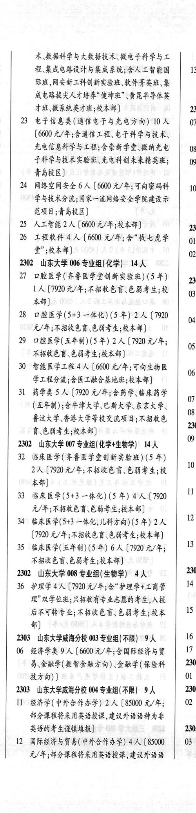
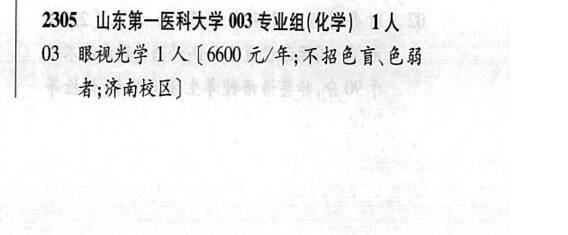
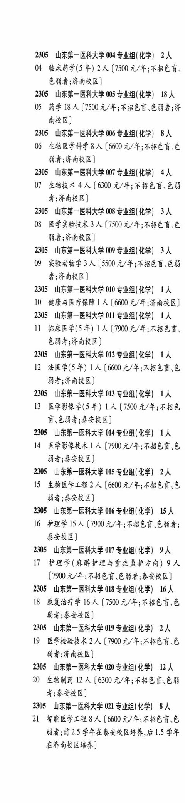
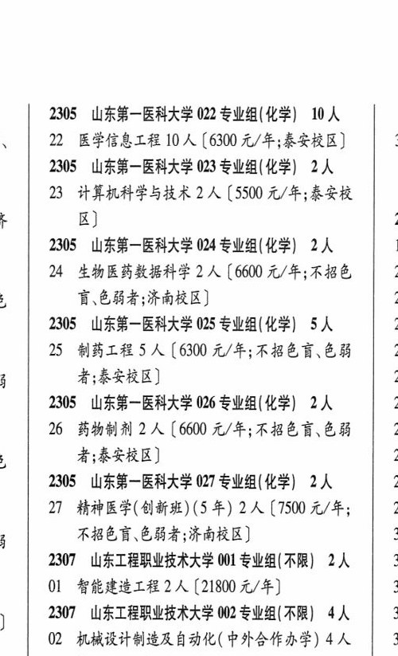

# 2305 山东第一医科大学

- PDF页码：115, 116
- 书内页码：164, 165
- 专业组：32；专业条目：50

## 001专业组

- 选科要求：不限
- 招生计划：10 人
- 校验：ok

| 专业代码 | 专业名称 | 计划人数 | 学费（元/年） | 备注/完整OCR内容 |
|---|---|---:|---:|---|
| 01 | 运动康复 | 10 | 6300 | 【6300 元/年;素安校区] |

<details><summary>本专业组OCR原文</summary>

```text
2305 山东第一医科大学 001 专业组(不限】 10 人
01 运动康复 10 人【6300 元/年;素安校区]
```
</details>

## 002专业组

- 选科要求：不限
- 招生计划：4 人
- 校验：ok

| 专业代码 | 专业名称 | 计划人数 | 学费（元/年） | 备注/完整OCR内容 |
|---|---|---:|---:|---|
| 01 | 大数据管理与应用 | 2 | 5500 | (5500 元/年] |
| 02 | 应用心理学 | 2 | 6600 | 【6600 元/年;不招色育\色弱 者] |

<details><summary>本专业组OCR原文</summary>

```text
2304 山东第二医科大学 002 专业组(不限)】 4 人
01 大数据管理与应用2 人 (5500 元/年]
02 应用心理学 2 人【6600 元/年;不招色育\色弱
者]
```
</details>

## 002专业组

- 选科要求：不限
- 招生计划：2 人
- 校验：ok

| 专业代码 | 专业名称 | 计划人数 | 学费（元/年） | 备注/完整OCR内容 |
|---|---|---:|---:|---|
| 02 | 应用心理学 | 2 |  | 【5500 A/F; ABER OH 者;济南校区] |

<details><summary>本专业组OCR原文</summary>

```text
2305 山东第一医科大学 002 专业组(不限) 2 人
02 应用心理学2人【5500 A/F; ABER OH
者;济南校区]
```
</details>

## 003专业组

- 选科要求：化学
- 招生计划：1 人
- 校验：review

| 专业代码 | 专业名称 | 计划人数 | 学费（元/年） | 备注/完整OCR内容 |
|---|---|---:|---:|---|
| 03 | 临床医学(5 年) 3A ( |  | 7920 | 7920 元/年;不招色言、 色磁者] |
| 04 | 麻醉学(5年) 2A ( |  | 1920 | 1920 元/年;不招色盲、色 弱者] |
| 05 | 生物技术 | 3 | 6325 | 【6325 元/年;不招色盲色弱 4) |
| 06 | 生物医学工程 | 2 | 6325 | 【6325 元/年;不招色盲\色 弱者] |
| 07 | 食品质量与安全 | 3 | 6325 | 【6325 元/年] |
| 08 | 生物统计学 | 2 | 5500 | 【5500 元/年] |

<details><summary>本专业组OCR原文</summary>

```text
2304 山东第二医科大学 003 专业组(化学) 1 人
03 临床医学(5 年) 3A (7920 元/年;不招色言、
色磁者]
04 麻醉学(5年) 2A (1920 元/年;不招色盲、色
弱者]
05 生物技术 3 人【6325 元/年;不招色盲色弱
4)
06 生物医学工程 2 人【6325 元/年;不招色盲\色
弱者]
07 食品质量与安全3 人【6325 元/年]
08 生物统计学 2 人【5500 元/年]
```
</details>

## 003专业组

- 选科要求：化学
- 招生计划：OCR未稳定识别 人
- 校验：review

| 专业代码 | 专业名称 | 计划人数 | 学费（元/年） | 备注/完整OCR内容 |
|---|---|---:|---:|---|
| 03 | 眼视光学 ] A (6600 A/#; ABER EH 者;济南校区 |  |  | 03 眼视光学 ] A (6600 A/#; ABER EH 者;济南校区] |

<details><summary>本专业组OCR原文</summary>

```text
2305 ”山东第一医科大学 003 专业组(化学) 工人
03 眼视光学 ] A (6600 A/#; ABER EH
者;济南校区]
```
</details>

## 004专业组

- 选科要求：不限
- 招生计划：9 人
- 校验：review

| 专业代码 | 专业名称 | 计划人数 | 学费（元/年） | 备注/完整OCR内容 |
|---|---|---:|---:|---|
| 11 | 经济学(中外合作办学) | 2 | 85000 | 【85000 元/年; \| 02 部分课程将采用英语授课,建议外语语种为非 SRS AEB) 2305 |
| 12 | 国际经济与贸易(中外合作办学) 4A (85000 \| 03 ， 元/年;部分课程将采用英语授课,建议外语语 种为非英语的考生尊愤填报 |  |  | 12 国际经济与贸易(中外合作办学) 4A (85000 \| 03 ， 元/年;部分课程将采用英语授课,建议外语语 种为非英语的考生尊愤填报] |
| 13 | 供应链管理(中外合作办学) | 3 | 85000 | 【85000 元/年;部分课程将采用英语授课,建议外语语 MARRS ABUL) 2303 ”山东大学威海分校 005 专业组(化学) 49 人 |
| 07 | 海洋科学类 | 14 | 6600 | 【6600 元/年;含海洋科学、 \| 海洋资源开发技术] |
| 08 | 物理学类 | 15 | 6600 | 【6600 元/年;含物理学] |
| 09 | 数学类 | 5 | 6600 | 【6600 元/年;含才学与应用数学、 信息与计算科学统计学] |
| 10 | 电子信息类(智能工程新工科实验班) | 15 | 6600 | ( 6600 元/年;含计算机科学与技术、电子科学 与技术\机器人工程\低空技术与工程] |

<details><summary>本专业组OCR原文</summary>

```text
2303 山东大学威海分校 004 专业组(不限) 9 人    2305
11 经济学(中外合作办学) 2 人【85000 元/年; | 02
部分课程将采用英语授课,建议外语语种为非
SRS AEB)            2305
12 国际经济与贸易(中外合作办学) 4A (85000 | 03 ，
元/年;部分课程将采用英语授课,建议外语语
种为非英语的考生尊愤填报]
13 供应链管理(中外合作办学) 3 人【85000
元/年;部分课程将采用英语授课,建议外语语
MARRS ABUL)
2303 ”山东大学威海分校 005 专业组(化学) 49 人
07 海洋科学类 14 人【6600 元/年;含海洋科学、
|   海洋资源开发技术]
08 物理学类 15 人【6600 元/年;含物理学]
09 数学类5 人【6600 元/年;含才学与应用数学、
信息与计算科学统计学]
10 电子信息类(智能工程新工科实验班) 15 人
( 6600 元/年;含计算机科学与技术、电子科学
与技术\机器人工程\低空技术与工程]
```
</details>

## 004专业组

- 选科要求：化学
- 招生计划：12 人
- 校验：review

| 专业代码 | 专业名称 | 计划人数 | 学费（元/年） | 备注/完整OCR内容 |
|---|---|---:|---:|---|
| 09 | 口腔医学(5 年) 2A ( |  | 7920 | 7920 元/年;不招色盲、 684) |
| 10 | 医学影像学(5 年) | 2 | 7590 | 【7590 元/年;不招色 育\色弱者] |
| 11 | 医学检验技术 | 2 | 7590 | 【7590 元/年;不招色盲\色 弱者] |
| 12 | 康复作业治疗 | 3 | 7920 | 【7920元/年;不招色育、色 弱者] |
| 13 | ”卫生检验与检疫 | 3 | 7590 | 【7590 元/年;不招色言、 色弱者] |

<details><summary>本专业组OCR原文</summary>

```text
2304 山东第二医科大学 004 专业组(化学) 12 人
09 口腔医学(5 年) 2A (7920 元/年;不招色盲、
684)
10 医学影像学(5 年) 2 人【7590 元/年;不招色
育\色弱者]
11 医学检验技术 2 人【7590 元/年;不招色盲\色
弱者]
12 康复作业治疗 3 人【7920元/年;不招色育、色
弱者]
13 ”卫生检验与检疫 3 人【7590 元/年;不招色言、
色弱者]
```
</details>

## 004专业组

- 选科要求：OCR未稳定识别
- 招生计划：2 人
- 校验：review

| 专业代码 | 专业名称 | 计划人数 | 学费（元/年） | 备注/完整OCR内容 |
|---|---|---:|---:|---|
| 04 | 临床药学(5 年) 2A ( |  | 1500 | 1500 元/年;不招色盲、 色磁者;济南校区] |

<details><summary>本专业组OCR原文</summary>

```text
2305 山东第一医科大学 004 专业组(化学| 2人
04 临床药学(5 年) 2A (1500 元/年;不招色盲、
色磁者;济南校区]
```
</details>

## 005专业组

- 选科要求：化学
- 招生计划：8 人
- 校验：review

| 专业代码 | 专业名称 | 计划人数 | 学费（元/年） | 备注/完整OCR内容 |
|---|---|---:|---:|---|
| 14 | 预防医学(5 年) 2A ( |  | 7590 | 7590 元/年;不招色育、 色弱者] |
| 15 | 中医学(5年) | 1 | 6600 | 【6600 元/年;不招色盲、.色 84) |
| 16 | 药学 | 2 | 7920 | [7920元/年;不招色育、色弱者] |
| 17 | 护理学 | 3 | 7920 | 【7920元/年;不招色育色弱者] |

<details><summary>本专业组OCR原文</summary>

```text
2304 山东第二医科大学 005 专业组(化学) 8 人
14 预防医学(5 年) 2A (7590 元/年;不招色育、
色弱者]
15 中医学(5年) 1人【6600 元/年;不招色盲、.色
84)
16 药学2人[7920元/年;不招色育、色弱者]
17 护理学3 人【7920元/年;不招色育色弱者]
```
</details>

## 005专业组

- 选科要求：OCR未稳定识别
- 招生计划：18 人
- 校验：review

| 专业代码 | 专业名称 | 计划人数 | 学费（元/年） | 备注/完整OCR内容 |
|---|---|---:|---:|---|
| 05 | 药学 18 A (7500 A/F; ABER CBA 南校区 |  |  | 05 药学 18 A (7500 A/F; ABER CBA 南校区] |

<details><summary>本专业组OCR原文</summary>

```text
2305 山东第一医科大学 005 专业组(化学| 18 人
05 药学 18 A (7500 A/F; ABER CBA
南校区]
```
</details>

## 006专业组

- 选科要求：OCR未稳定识别
- 招生计划：8 人
- 校验：ok

| 专业代码 | 专业名称 | 计划人数 | 学费（元/年） | 备注/完整OCR内容 |
|---|---|---:|---:|---|
| 06 | 生物医学科学 | 8 | 6600 | 【6600 元/年;不招色盲\色 能者;济南校区] |

<details><summary>本专业组OCR原文</summary>

```text
2305 山东第一医科大学 006 专业组(化学| 8人
06 生物医学科学 8 人【6600 元/年;不招色盲\色
能者;济南校区]
```
</details>

## 007专业组

- 选科要求：OCR未稳定识别
- 招生计划：4 人
- 校验：ok

| 专业代码 | 专业名称 | 计划人数 | 学费（元/年） | 备注/完整OCR内容 |
|---|---|---:|---:|---|
| 07 | 生物技术 | 4 |  | [6300 4/4; KBE HEB 者;济南校区] |

<details><summary>本专业组OCR原文</summary>

```text
2305 山东第一医科大学 007 专业组(化学| 4人
07 生物技术 4 人[6300 4/4; KBE HEB
者;济南校区]
```
</details>

## 008专业组

- 选科要求：化学
- 招生计划：3 人
- 校验：ok

| 专业代码 | 专业名称 | 计划人数 | 学费（元/年） | 备注/完整OCR内容 |
|---|---|---:|---:|---|
| 08 | 医学实验技术 | 3 | 7500 | 【7500 元/年;不招色育、色 弱者;济南校区] |

<details><summary>本专业组OCR原文</summary>

```text
2305 山东第一医科大学 008 专业组(化学) 3人
08 医学实验技术 3 人【7500 元/年;不招色育、色
弱者;济南校区]
```
</details>

## 009专业组

- 选科要求：化学
- 招生计划：3 人
- 校验：ok

| 专业代码 | 专业名称 | 计划人数 | 学费（元/年） | 备注/完整OCR内容 |
|---|---|---:|---:|---|
| 09 | 实验动物学 | 3 | 5500 | 【5500 元/年;不招色盲.色弱 者;济南校区] |

<details><summary>本专业组OCR原文</summary>

```text
2305 山东第一医科大学 009 专业组(化学) 3 人
09 实验动物学 3 人【5500 元/年;不招色盲.色弱
者;济南校区]
```
</details>

## 010专业组

- 选科要求：化学
- 招生计划：1 人
- 校验：sum-corrected

| 专业代码 | 专业名称 | 计划人数 | 学费（元/年） | 备注/完整OCR内容 |
|---|---|---:|---:|---|
| 10 | 健康与医疗保障 | 1 | 6600 | 【6600 元/年;济南校区] |

<details><summary>本专业组OCR原文</summary>

```text
2305 山东第一医科大学 010 专业组(化学) 1A
10 健康与医疗保障 1 人【6600 元/年;济南校区]
```
</details>

## 011专业组

- 选科要求：化学
- 招生计划：OCR未稳定识别 人
- 校验：review

| 专业代码 | 专业名称 | 计划人数 | 学费（元/年） | 备注/完整OCR内容 |
|---|---|---:|---:|---|
| 11 | 临床医学(5 年) 1A ( |  | 7900 | 7900 元/年;不招色言、 色磁者;济南校区] |

<details><summary>本专业组OCR原文</summary>

```text
2305 山东第一医科大学 011 专业组(化学) 1A
11 临床医学(5 年) 1A (7900 元/年;不招色言、
色磁者;济南校区]
```
</details>

## 012专业组

- 选科要求：化学
- 招生计划：1 人
- 校验：sum-corrected

| 专业代码 | 专业名称 | 计划人数 | 学费（元/年） | 备注/完整OCR内容 |
|---|---|---:|---:|---|
| 12 | 法医学(5年) | 1 | 6600 | 【6600 元/年;不招色盲、色 弱者;济南校区] |

<details><summary>本专业组OCR原文</summary>

```text
2305 山东第一医科大学 012 专业组(化学) 1A
12 法医学(5年) 1 人【6600 元/年;不招色盲、色
弱者;济南校区]
```
</details>

## 013专业组

- 选科要求：化学
- 招生计划：1 人
- 校验：sum-corrected

| 专业代码 | 专业名称 | 计划人数 | 学费（元/年） | 备注/完整OCR内容 |
|---|---|---:|---:|---|
| 13 | 医学影像学(5 年) | 1 | 7500 | 【7500 元/年;不招色 育\色弱者;素安校区] |

<details><summary>本专业组OCR原文</summary>

```text
2305 山东第一医科大学 013 专业组(化学) 工人
13 医学影像学(5 年) 1 人【7500 元/年;不招色
育\色弱者;素安校区]
```
</details>

## 014专业组

- 选科要求：OCR未稳定识别
- 招生计划：1 人
- 校验：sum-corrected

| 专业代码 | 专业名称 | 计划人数 | 学费（元/年） | 备注/完整OCR内容 |
|---|---|---:|---:|---|
| 14 | 医学影像技术 | 1 | 7900 | 【7900 元/年;不招色言、色 弱者;素安校区] |

<details><summary>本专业组OCR原文</summary>

```text
2305 山东第一医科大学 014 专业组(化学| 工人
14 医学影像技术 1 人【7900 元/年;不招色言、色
弱者;素安校区]
```
</details>

## 015专业组

- 选科要求：化学
- 招生计划：2 人
- 校验：ok

| 专业代码 | 专业名称 | 计划人数 | 学费（元/年） | 备注/完整OCR内容 |
|---|---|---:|---:|---|
| 15 | 生物医学工程 | 2 | 6600 | 【6600 元/年;不招色言\色 弱者;泰安校区] |

<details><summary>本专业组OCR原文</summary>

```text
2305 山东第一医科大学 015 专业组(化学) 2人
15 生物医学工程 2 人【6600 元/年;不招色言\色
弱者;泰安校区]
```
</details>

## 016专业组

- 选科要求：化学
- 招生计划：15 人
- 校验：sum-corrected

| 专业代码 | 专业名称 | 计划人数 | 学费（元/年） | 备注/完整OCR内容 |
|---|---|---:|---:|---|
| 16 | 护理学 | 15 |  | 【7900 4/4, FABER EHS; ERB) |

<details><summary>本专业组OCR原文</summary>

```text
2305 山东第一医科大学 016 专业组(化学) 1 人
16 护理学15 人【7900 4/4, FABER EHS;
ERB)
```
</details>

## 017专业组

- 选科要求：OCR未稳定识别
- 招生计划：9 人
- 校验：ok

| 专业代码 | 专业名称 | 计划人数 | 学费（元/年） | 备注/完整OCR内容 |
|---|---|---:|---:|---|
| 17 | 护理学(麻贾护理与重症监护方向) | 9 | 1900 | (1900 元/年;不招色育、色弱者;素安校区] |

<details><summary>本专业组OCR原文</summary>

```text
2305 山东第一医科大学 017 专业组(化学| 9人
17 护理学(麻贾护理与重症监护方向) 9 人
(1900 元/年;不招色育、色弱者;素安校区]
```
</details>

## 018专业组

- 选科要求：化学
- 招生计划：16 人
- 校验：ok

| 专业代码 | 专业名称 | 计划人数 | 学费（元/年） | 备注/完整OCR内容 |
|---|---|---:|---:|---|
| 18 | 康复治疗学 | 16 | 7500 | 【7500 元/年;不招色盲、色 弱者;泰安校区] |

<details><summary>本专业组OCR原文</summary>

```text
2305 山东第一医科大学 018 专业组(化学) 16 人
18 康复治疗学 16 人【7500 元/年;不招色盲、色
弱者;泰安校区]
```
</details>

## 019专业组

- 选科要求：OCR未稳定识别
- 招生计划：2 人
- 校验：ok

| 专业代码 | 专业名称 | 计划人数 | 学费（元/年） | 备注/完整OCR内容 |
|---|---|---:|---:|---|
| 19 | 医学检验技术 | 2 | 7900 | 【7900 元/年;不招色盲、色 弱者;济南校区] |

<details><summary>本专业组OCR原文</summary>

```text
2305 山东第一医科大学 019 专业组(化学| 2人
19 医学检验技术 2 人【7900 元/年;不招色盲、色
弱者;济南校区]
```
</details>

## 020专业组

- 选科要求：化学
- 招生计划：12 人
- 校验：ok

| 专业代码 | 专业名称 | 计划人数 | 学费（元/年） | 备注/完整OCR内容 |
|---|---|---:|---:|---|
| 20 | 生物制药 | 12 |  | 【6300 4/4; KBE EB 者;泰安校区] |

<details><summary>本专业组OCR原文</summary>

```text
2305 山东第一医科大学 020 专业组(化学) 12 人
20 生物制药 12 人【6300 4/4; KBE EB
者;泰安校区]
```
</details>

## 021专业组

- 选科要求：化学
- 招生计划：8 人
- 校验：sum-corrected

| 专业代码 | 专业名称 | 计划人数 | 学费（元/年） | 备注/完整OCR内容 |
|---|---|---:|---:|---|
| 21 | 智能医学工程 | 8 | 6600 | 【6600 元/年;不招色育.色 能者;前2.5 学年在素安校区培养,后 1.5 学年 在济南校区培养] |

<details><summary>本专业组OCR原文</summary>

```text
2305 山东第一医科大学 021 专业组( 化学) 8A 能者;前2.5 学年在素安校区培养,后 1.5 学年
21 智能医学工程 8 人【6600 元/年;不招色育.色
能者;前2.5 学年在素安校区培养,后 1.5 学年
在济南校区培养]
```
</details>

## 022专业组

- 选科要求：OCR未稳定识别
- 招生计划：10 人
- 校验：review

| 专业代码 | 专业名称 | 计划人数 | 学费（元/年） | 备注/完整OCR内容 |
|---|---|---:|---:|---|
|  | 结构化OCR未稳定切分，请查看下方原文及源图 |  |  |  |

<details><summary>本专业组OCR原文</summary>

```text
2305 山东第一医科大学 022 专业组(化学| 10 人
‘   2 医学信息工程 10 人[6300 元/年;泰安校区]   x
```
</details>

## 023专业组

- 选科要求：OCR未稳定识别
- 招生计划：2 人
- 校验：ok

| 专业代码 | 专业名称 | 计划人数 | 学费（元/年） | 备注/完整OCR内容 |
|---|---|---:|---:|---|
| 23 | 计算机科学与技术 | 2 | 5500 | (5500 元/年;泰安校 7 K) 2 |

<details><summary>本专业组OCR原文</summary>

```text
2305 山东第一医科大学 023 专业组(化学| 2人
23 计算机科学与技术 2 人 (5500 元/年;泰安校
7     K)                   2
```
</details>

## 024专业组

- 选科要求：OCR未稳定识别
- 招生计划：2 人
- 校验：ok

| 专业代码 | 专业名称 | 计划人数 | 学费（元/年） | 备注/完整OCR内容 |
|---|---|---:|---:|---|
| 24 | 生物医药数据科学 | 2 | 6600 | 【6600 元/年;不招色 2( 盲.色弱者;济南校区] 21 |

<details><summary>本专业组OCR原文</summary>

```text
2305 山东第一医科大学 024 专业组(化学| 2人    i
24 生物医药数据科学 2 人【6600 元/年;不招色   2(
盲.色弱者;济南校区]            21
```
</details>

## 025专业组

- 选科要求：化学|SA25者;泰安校区
- 招生计划：OCR未稳定识别 人
- 校验：review

| 专业代码 | 专业名称 | 计划人数 | 学费（元/年） | 备注/完整OCR内容 |
|---|---|---:|---:|---|
| 25 | 制药工程 A (6300 4/4; FREE ER 2: 5 者;泰安校区] 24 |  |  | 25 制药工程 A (6300 4/4; FREE ER 2: 5 者;泰安校区] 24 |

<details><summary>本专业组OCR原文</summary>

```text
2305 山东第一医科大学 025 专业组(化学| SA    2 5     者;泰安校区]               24
25 制药工程 A (6300 4/4; FREE ER   2:
5     者;泰安校区]               24
```
</details>

## 026专业组

- 选科要求：化学
- 招生计划：2 人
- 校验：ok

| 专业代码 | 专业名称 | 计划人数 | 学费（元/年） | 备注/完整OCR内容 |
|---|---|---:|---:|---|
| 26 | 药物制剂 | 2 | 6600 | 【6600 元/年;不招色盲、色弱 2 者;泰安校区] 27 |

<details><summary>本专业组OCR原文</summary>

```text
2305 山东第一医科大学 026 专业组(化学) 2人    23
26 药物制剂 2 人【6600 元/年;不招色盲、色弱   2
者;泰安校区]               27
```
</details>

## 027专业组

- 选科要求：化学
- 招生计划：2 人
- 校验：review

| 专业代码 | 专业名称 | 计划人数 | 学费（元/年） | 备注/完整OCR内容 |
|---|---|---:|---:|---|
| 27 | 精神医学(创新班) (5 年) 2A ( |  | 7500 | 7500 元/年; 2s 不招色盲、色甬者;济南校区] x |

<details><summary>本专业组OCR原文</summary>

```text
2305 山东第一医科大学 027 专业组(化学) 2人    28
27 精神医学(创新班) (5 年) 2A (7500 元/年;   2s
不招色盲、色甬者;济南校区]         x
```
</details>

## 附：院校完整OCR原文

```text
--- PDF第115页（书内第164页），第2栏 ---
2303 山东大学威海分校 004 专业组(不限) 9 人    2305
11 经济学(中外合作办学) 2 人【85000 元/年; | 02
部分课程将采用英语授课,建议外语语种为非
SRS AEB)            2305
12 国际经济与贸易(中外合作办学) 4A (85000 | 03 ，
元/年;部分课程将采用英语授课,建议外语语

--- PDF第115页（书内第164页），第3栏 ---
种为非英语的考生尊愤填报]
13 供应链管理(中外合作办学) 3 人【85000
元/年;部分课程将采用英语授课,建议外语语
MARRS ABUL)
2303 ”山东大学威海分校 005 专业组(化学) 49 人
07 海洋科学类 14 人【6600 元/年;含海洋科学、
|   海洋资源开发技术]
08 物理学类 15 人【6600 元/年;含物理学]
09 数学类5 人【6600 元/年;含才学与应用数学、
信息与计算科学统计学]
10 电子信息类(智能工程新工科实验班) 15 人
( 6600 元/年;含计算机科学与技术、电子科学
与技术\机器人工程\低空技术与工程]
2304 山东第二医科大学 002 专业组(不限)】 4 人
01 大数据管理与应用2 人 (5500 元/年]
02 应用心理学 2 人【6600 元/年;不招色育\色弱
者]
2304 山东第二医科大学 003 专业组(化学) 1 人
03 临床医学(5 年) 3A (7920 元/年;不招色言、
色磁者]
04 麻醉学(5年) 2A (1920 元/年;不招色盲、色
弱者]
05 生物技术 3 人【6325 元/年;不招色盲色弱
4)
06 生物医学工程 2 人【6325 元/年;不招色盲\色
弱者]
07 食品质量与安全3 人【6325 元/年]
08 生物统计学 2 人【5500 元/年]
2304 山东第二医科大学 004 专业组(化学) 12 人
09 口腔医学(5 年) 2A (7920 元/年;不招色盲、
684)
10 医学影像学(5 年) 2 人【7590 元/年;不招色
育\色弱者]
11 医学检验技术 2 人【7590 元/年;不招色盲\色
弱者]
12 康复作业治疗 3 人【7920元/年;不招色育、色
弱者]
13 ”卫生检验与检疫 3 人【7590 元/年;不招色言、
色弱者]
2304 山东第二医科大学 005 专业组(化学) 8 人
14 预防医学(5 年) 2A (7590 元/年;不招色育、
色弱者]
15 中医学(5年) 1人【6600 元/年;不招色盲、.色
84)
16 药学2人[7920元/年;不招色育、色弱者]
17 护理学3 人【7920元/年;不招色育色弱者]
2305 山东第一医科大学 001 专业组(不限】 10 人
01 运动康复 10 人【6300 元/年;素安校区]
2305 山东第一医科大学 002 专业组(不限) 2 人
02 应用心理学2人【5500 A/F; ABER OH
者;济南校区]
2305 ”山东第一医科大学 003 专业组(化学) 工人
03 眼视光学 ] A (6600 A/#; ABER EH
者;济南校区]

--- PDF第116页（书内第165页），第1栏 ---
2305 山东第一医科大学 004 专业组(化学| 2人
04 临床药学(5 年) 2A (1500 元/年;不招色盲、
色磁者;济南校区]
2305 山东第一医科大学 005 专业组(化学| 18 人
05 药学 18 A (7500 A/F; ABER CBA
南校区]
2305 山东第一医科大学 006 专业组(化学| 8人
06 生物医学科学 8 人【6600 元/年;不招色盲\色
能者;济南校区]
2305 山东第一医科大学 007 专业组(化学| 4人
07 生物技术 4 人[6300 4/4; KBE HEB
者;济南校区]
2305 山东第一医科大学 008 专业组(化学) 3人
08 医学实验技术 3 人【7500 元/年;不招色育、色
弱者;济南校区]
2305 山东第一医科大学 009 专业组(化学) 3 人
09 实验动物学 3 人【5500 元/年;不招色盲.色弱
者;济南校区]
2305 山东第一医科大学 010 专业组(化学) 1A
10 健康与医疗保障 1 人【6600 元/年;济南校区]
2305 山东第一医科大学 011 专业组(化学) 1A
11 临床医学(5 年) 1A (7900 元/年;不招色言、
色磁者;济南校区]
2305 山东第一医科大学 012 专业组(化学) 1A
12 法医学(5年) 1 人【6600 元/年;不招色盲、色
弱者;济南校区]
2305 山东第一医科大学 013 专业组(化学) 工人
13 医学影像学(5 年) 1 人【7500 元/年;不招色
育\色弱者;素安校区]
2305 山东第一医科大学 014 专业组(化学| 工人
14 医学影像技术 1 人【7900 元/年;不招色言、色
弱者;素安校区]
2305 山东第一医科大学 015 专业组(化学) 2人
15 生物医学工程 2 人【6600 元/年;不招色言\色
弱者;泰安校区]
2305 山东第一医科大学 016 专业组(化学) 1 人
16 护理学15 人【7900 4/4, FABER EHS;
ERB)
2305 山东第一医科大学 017 专业组(化学| 9人
17 护理学(麻贾护理与重症监护方向) 9 人
(1900 元/年;不招色育、色弱者;素安校区]
2305 山东第一医科大学 018 专业组(化学) 16 人
18 康复治疗学 16 人【7500 元/年;不招色盲、色
弱者;泰安校区]
2305 山东第一医科大学 019 专业组(化学| 2人
19 医学检验技术 2 人【7900 元/年;不招色盲、色
弱者;济南校区]
2305 山东第一医科大学 020 专业组(化学) 12 人
20 生物制药 12 人【6300 4/4; KBE EB
者;泰安校区]
2305 山东第一医科大学 021 专业组( 化学) 8A
21 智能医学工程 8 人【6600 元/年;不招色育.色
能者;前2.5 学年在素安校区培养,后 1.5 学年
在济南校区培养]

--- PDF第116页（书内第165页），第2栏 ---
2305 山东第一医科大学 022 专业组(化学| 10 人
‘   2 医学信息工程 10 人[6300 元/年;泰安校区]   x
2305 山东第一医科大学 023 专业组(化学| 2人
23 计算机科学与技术 2 人 (5500 元/年;泰安校
7     K)                   2
2305 山东第一医科大学 024 专业组(化学| 2人    i
24 生物医药数据科学 2 人【6600 元/年;不招色   2(
盲.色弱者;济南校区]            21
2305 山东第一医科大学 025 专业组(化学| SA    2
25 制药工程 A (6300 4/4; FREE ER   2:
5     者;泰安校区]               24
2305 山东第一医科大学 026 专业组(化学) 2人    23
26 药物制剂 2 人【6600 元/年;不招色盲、色弱   2
者;泰安校区]               27
2305 山东第一医科大学 027 专业组(化学) 2人    28
27 精神医学(创新班) (5 年) 2A (7500 元/年;   2s
不招色盲、色甬者;济南校区]         x
```

## 源图




