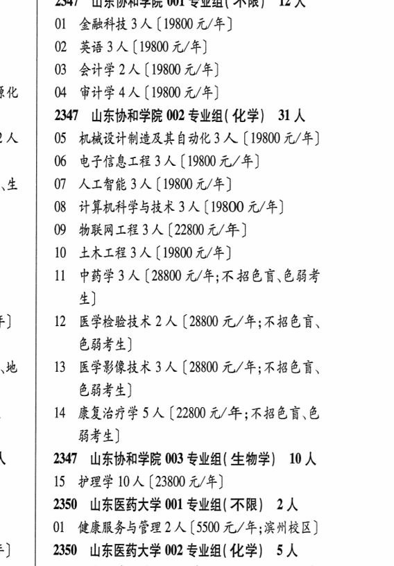

# 2347 山东协和学院

- PDF页码：118
- 书内页码：167
- 专业组：3；专业条目：15

## 001专业组

- 选科要求：不限
- 招生计划：12 人
- 校验：ok

| 专业代码 | 专业名称 | 计划人数 | 学费（元/年） | 备注/完整OCR内容 |
|---|---|---:|---:|---|
| 01 | 金融科技 | 3 | 19800 | 【19800元/年] |
| 02 | 英语 | 3 | 19800 | [19800元/年] |
| 03 | 会计学 | 2 | 19800 | 【19800 元/年] |
| 04 | 审计学 | 4 | 19800 | [19800 元/年] |

<details><summary>本专业组OCR原文</summary>

```text
2347 山东协和学院 001 专业组( 不限】 12 人
01 金融科技 3 人【19800元/年]
02 英语3人[19800元/年]
03 会计学2人【19800 元/年]
04 审计学4人[19800 元/年]
```
</details>

## 002专业组

- 选科要求：化学
- 招生计划：31 人
- 校验：review

| 专业代码 | 专业名称 | 计划人数 | 学费（元/年） | 备注/完整OCR内容 |
|---|---|---:|---:|---|
| 05 | 机械设计制造及其自动化3 A ( |  | 19800 | 19800 元/年] |
| 06 | 电子信息工程 | 3 | 19800 | [19800元/年] |
| 07 | ALBH 3A (19800 4/4) |  |  | 07 ALBH 3A (19800 4/4) |
| 08 | 计算机科学与技术 3 A ( |  | 19800 | 19800 元/年] |
| 09 | MRALE3A (22800 t/#) |  |  | 09 MRALE3A (22800 t/#) |
| 10 | 土木工程 | 3 | 19800 | 【19800元/年] |
| 11 | 中药学 | 3 |  | [28800 4/4; KBER CBF 生] |
| 12 | 医学检验技术 | 2 | 28800 | 【28800 元/年;不招色言、 色弱考生] |
| 13 | 医学影像技术 | 3 | 28800 | 【28800 元/年;不招色言、 色弱考生] |
| 14 | 康复治疗学 | 5 | 22800 | 【22800 元/年;不招色盲、色 能考生] |

<details><summary>本专业组OCR原文</summary>

```text
2347 山东协和学院 002 专业组( 化学) 31人
05 机械设计制造及其自动化3 A (19800 元/年]
06 电子信息工程3人[19800元/年]
07 ALBH 3A (19800 4/4)
08 计算机科学与技术 3 A (19800 元/年]
09 MRALE3A (22800 t/#)
10 土木工程3人【19800元/年]
11 中药学3 人[28800 4/4; KBER CBF
生]
12 医学检验技术 2 人【28800 元/年;不招色言、
色弱考生]
13 医学影像技术 3 人【28800 元/年;不招色言、
色弱考生]
14 康复治疗学5 人【22800 元/年;不招色盲、色
能考生]
```
</details>

## 003专业组

- 选科要求：生物学
- 招生计划：10 人
- 校验：ok

| 专业代码 | 专业名称 | 计划人数 | 学费（元/年） | 备注/完整OCR内容 |
|---|---|---:|---:|---|
| 15 | 护理学 | 10 | 23800 | 【23800 元/年] |

<details><summary>本专业组OCR原文</summary>

```text
2347 山东协和学院 003 专业组( 生物学) 10 人
15 护理学 10 人【23800 元/年]
```
</details>

## 附：院校完整OCR原文

```text
--- PDF第118页（书内第167页），第3栏 ---
2347 山东协和学院 001 专业组( 不限】 12 人
01 金融科技 3 人【19800元/年]
02 英语3人[19800元/年]
03 会计学2人【19800 元/年]
04 审计学4人[19800 元/年]
2347 山东协和学院 002 专业组( 化学) 31人
05 机械设计制造及其自动化3 A (19800 元/年]
06 电子信息工程3人[19800元/年]
07 ALBH 3A (19800 4/4)
08 计算机科学与技术 3 A (19800 元/年]
09 MRALE3A (22800 t/#)
10 土木工程3人【19800元/年]
11 中药学3 人[28800 4/4; KBER CBF
生]
12 医学检验技术 2 人【28800 元/年;不招色言、
色弱考生]
13 医学影像技术 3 人【28800 元/年;不招色言、
色弱考生]
14 康复治疗学5 人【22800 元/年;不招色盲、色
能考生]
2347 山东协和学院 003 专业组( 生物学) 10 人
15 护理学 10 人【23800 元/年]
```

## 源图

