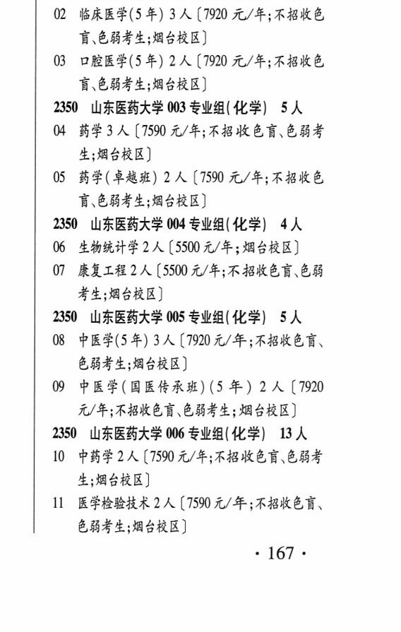
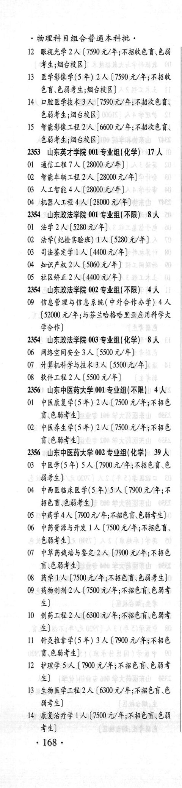

# 2350 山东医药大学

- PDF页码：118, 119
- 书内页码：167, 168
- 专业组：6；专业条目：15

## 001专业组

- 选科要求：不限
- 招生计划：2 人
- 校验：ok

| 专业代码 | 专业名称 | 计划人数 | 学费（元/年） | 备注/完整OCR内容 |
|---|---|---:|---:|---|
| 01 | 健康服务与管理 | 2 | 5500 | 【5500 元/年;滨州校区] |

<details><summary>本专业组OCR原文</summary>

```text
2350 山东医药大学 001 专业组( 不限】 2人
01 健康服务与管理 2 人【5500 元/年;滨州校区]
```
</details>

## 002专业组

- 选科要求：化学
- 招生计划：5 人
- 校验：sum-corrected

| 专业代码 | 专业名称 | 计划人数 | 学费（元/年） | 备注/完整OCR内容 |
|---|---|---:|---:|---|
| 02 | 临床医学(5 年) | 3 | 7920 | 【7920 元/年;不招收色 讶.色弱考生;烟台校区] |
| 03 | 口腔医学(5 年) | 2 | 7920 | 【7920 元/年;不招收色 盲\色弱考生;烟台校区] |

<details><summary>本专业组OCR原文</summary>

```text
2350 山东医药大学 002 专业组( 化学) SA 讶.色弱考生;烟台校区]
02 临床医学(5 年) 3 人【7920 元/年;不招收色
讶.色弱考生;烟台校区]
03 口腔医学(5 年) 2 人【7920 元/年;不招收色
盲\色弱考生;烟台校区]
```
</details>

## 003专业组

- 选科要求：化学
- 招生计划：5 人
- 校验：sum-corrected

| 专业代码 | 专业名称 | 计划人数 | 学费（元/年） | 备注/完整OCR内容 |
|---|---|---:|---:|---|
| 04 | 药学 | 3 | 7590 | [7590 元/年;不招收色盲色弱考 生;烟台校区] |
| 05 | 药学(卓越班) | 2 | 7590 | 【7590 元/年;不招收色 讶色弱考生;烟台校区] |

<details><summary>本专业组OCR原文</summary>

```text
2350 山东医药大学 003 专业组( 化学) SA 生;烟台校区]
04 药学3 人[7590 元/年;不招收色盲色弱考
生;烟台校区]
05 药学(卓越班) 2 人【7590 元/年;不招收色
讶色弱考生;烟台校区]
```
</details>

## 004专业组

- 选科要求：化学
- 招生计划：4 人
- 校验：ok

| 专业代码 | 专业名称 | 计划人数 | 学费（元/年） | 备注/完整OCR内容 |
|---|---|---:|---:|---|
| 06 | 生物统计学 | 2 | 5500 | 【5500 元/年;烟台校区] |
| 07 | 康复工程 | 2 | 5500 | [5500 元/年;不招收色盲色弱 考生;烟台校区] |

<details><summary>本专业组OCR原文</summary>

```text
2350 山东医药大学 004 专业组( 化学) 4人
06 生物统计学 2 人【5500 元/年;烟台校区]
07 康复工程2人[5500 元/年;不招收色盲色弱
考生;烟台校区]
```
</details>

## 005专业组

- 选科要求：化学|
- 招生计划：OCR未稳定识别 人
- 校验：review

| 专业代码 | 专业名称 | 计划人数 | 学费（元/年） | 备注/完整OCR内容 |
|---|---|---:|---:|---|
| 08 | 中医学(5年) 3A ( |  | 7920 | 7920 元/年;不招收色言、 色弱考生;烟台校区] |
| 09 | 中医学(国医传承班) (5 年) | 2 | 7920 | 【7920 元/年;不招收色育、色弱考生; 烟台校区] |

<details><summary>本专业组OCR原文</summary>

```text
2350 山东医药大学 005 专业组(化学|) SA 色弱考生;烟台校区]
08 中医学(5年) 3A (7920 元/年;不招收色言、
色弱考生;烟台校区]
09 中医学(国医传承班) (5 年) 2 人【7920
元/年;不招收色育、色弱考生; 烟台校区]
```
</details>

## 006专业组

- 选科要求：化学
- 招生计划：OCR未稳定识别 人
- 校验：review

| 专业代码 | 专业名称 | 计划人数 | 学费（元/年） | 备注/完整OCR内容 |
|---|---|---:|---:|---|
| 10 | 中药学 | 2 | 7590 | 【7590 元/年;不招收色盲.色弱考 生;烟台校区] |
| 11 | 医学检验技术 | 2 | 7590 | 【7590 元/年;不招收色盲、 色弱考生;烟台校区] 167+ 物理科目组合普通本科批。 |
| 12 | 眼视光学 | 2 | 7590 | 【7590 元/年;不招收色盲色弱 考生;烟台校区] |
| 13 | 医学影像学(5 年) 2A ( |  | 7590 | 7590 元/年;不招收 色盲.色弱考生;烟台校区] |
| 14 | 口腔医学技术 | 3 | 7590 | [7590元/年;不招收色盲、 色弱考生;烟台校区] |
| 15 | 智能影像工程 | 2 | 6600 | 【6600 元/年;不招收色言、 色弱考生;烟台校区] |

<details><summary>本专业组OCR原文</summary>

```text
2350 山东医药大学 006 专业组( 化学) BA 生;烟台校区]
10 中药学 2 人【7590 元/年;不招收色盲.色弱考
生;烟台校区]
11 医学检验技术2 人【7590 元/年;不招收色盲、
色弱考生;烟台校区]
167+
物理科目组合普通本科批。
12 眼视光学 2 人【7590 元/年;不招收色盲色弱
考生;烟台校区]
13 医学影像学(5 年) 2A (7590 元/年;不招收
色盲.色弱考生;烟台校区]
14 口腔医学技术3 人 [7590元/年;不招收色盲、
色弱考生;烟台校区]
15 智能影像工程 2人【6600 元/年;不招收色言、
色弱考生;烟台校区]
```
</details>

## 附：院校完整OCR原文

```text
--- PDF第118页（书内第167页），第3栏 ---
2350 山东医药大学 001 专业组( 不限】 2人
01 健康服务与管理 2 人【5500 元/年;滨州校区]
2350 山东医药大学 002 专业组( 化学) SA
02 临床医学(5 年) 3 人【7920 元/年;不招收色
讶.色弱考生;烟台校区]
03 口腔医学(5 年) 2 人【7920 元/年;不招收色
盲\色弱考生;烟台校区]
2350 山东医药大学 003 专业组( 化学) SA
04 药学3 人[7590 元/年;不招收色盲色弱考
生;烟台校区]
05 药学(卓越班) 2 人【7590 元/年;不招收色
讶色弱考生;烟台校区]
2350 山东医药大学 004 专业组( 化学) 4人
06 生物统计学 2 人【5500 元/年;烟台校区]
07 康复工程2人[5500 元/年;不招收色盲色弱
考生;烟台校区]
2350 山东医药大学 005 专业组(化学|) SA
08 中医学(5年) 3A (7920 元/年;不招收色言、
色弱考生;烟台校区]
09 中医学(国医传承班) (5 年) 2 人【7920
元/年;不招收色育、色弱考生; 烟台校区]
2350 山东医药大学 006 专业组( 化学) BA
10 中药学 2 人【7590 元/年;不招收色盲.色弱考
生;烟台校区]
11 医学检验技术2 人【7590 元/年;不招收色盲、
色弱考生;烟台校区]
167+

--- PDF第119页（书内第168页），第1栏 ---
物理科目组合普通本科批。
12 眼视光学 2 人【7590 元/年;不招收色盲色弱
考生;烟台校区]
13 医学影像学(5 年) 2A (7590 元/年;不招收
色盲.色弱考生;烟台校区]
14 口腔医学技术3 人 [7590元/年;不招收色盲、
色弱考生;烟台校区]
15 智能影像工程 2人【6600 元/年;不招收色言、
色弱考生;烟台校区]
```

## 源图


