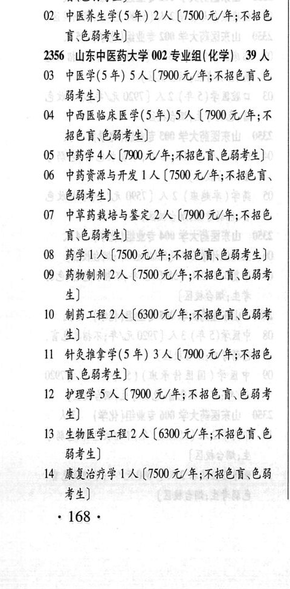
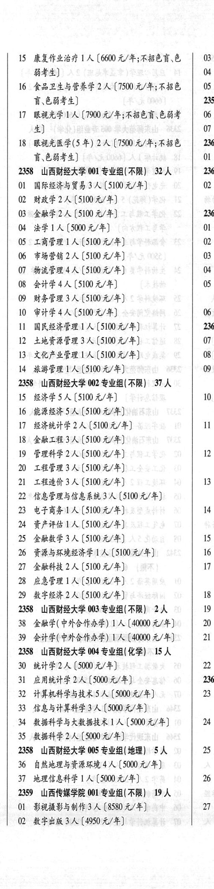

# 2356 山东中医药大学

- PDF页码：119
- 书内页码：168
- 专业组：2；专业条目：18

## 001专业组

- 选科要求：不限
- 招生计划：4 人
- 校验：ok

| 专业代码 | 专业名称 | 计划人数 | 学费（元/年） | 备注/完整OCR内容 |
|---|---|---:|---:|---|
| 01 | 中医康复学(5 年) | 2 | 7500 | 【7500 元/年;不招色 讶.色弱考生] |
| 02 | ”中医养生学(5 年) | 2 | 7500 | 【7500 元/年;不招色 讶:色弱考生] |

<details><summary>本专业组OCR原文</summary>

```text
2356 山东中医药大学 001 专业组(不限) 4人
01 中医康复学(5 年) 2 人【7500 元/年;不招色
讶.色弱考生]
02 ”中医养生学(5 年) 2 人【7500 元/年;不招色
讶:色弱考生]
```
</details>

## 002专业组

- 选科要求：化学
- 招生计划：39 人
- 校验：review

| 专业代码 | 专业名称 | 计划人数 | 学费（元/年） | 备注/完整OCR内容 |
|---|---|---:|---:|---|
| 03 | 中医学(5年) | 5 | 7900 | 【7900元/年;不招色盲、色 弱考生] |
| 04 | 中西医临床医学(5 年) | 53 | 7900 | 【7900 元/年;不 BER CHES) |
| 05 | “中药学 | 4 | 7900 | 【7900 元/年;不招色盲.色弱考生] |
| 06 | 中药资源与开发 | 1 | 7500 | 【7500 元/年;不招色盲、 色弱考生] |
| 07 | 中草药栽培与鉴定 | 2 | 7900 | 【7900 元/年;不招色 谨\色弱考生] |
| 08 | 药学 | 1 |  | 【7500 A/#; FABER CHF 4) |
| 09 | 药物制剂 | 2 | 7500 | 【7500 元/年;不招色盲色弱考 生] |
| 10 | HHLH2A (0004/4; ABER CHF 4) |  |  | 10 HHLH2A (0004/4; ABER CHF 4) |
| 11 | 针灸推拿学(5 年) | 3 | 7900 | 【7900 元/年;不招色 讶.色弱考生] |
| 12 | 护理学 | 5 | 7900 | 【7900 元/年;不招色盲\色弱考 生] |
| 13 | 生物医学工程 | 2 | 6300 | 【6300元/年;不招色盲、色 B44) |
| 14 | 康复治疗学 | 1 |  | [7500 A/F ABER EB 考生] 168 . |
| 15 | 康复作业治疗 | 1 | 6600 | 【6600 元/年;不招色盲色 \| 03 B44) 4 |
| 16 | 食品卫生与营养学 | 2 | 7500 | 【7500 元/年;不招色 05 BeHF4) 2359 |
| 17 | RAAF LA (1900 0/4 ABER CBF 06 4) 0 |  |  | 17 RAAF LA (1900 0/4 ABER CBF 06 4) 0 |
| 18 | 眼视光医学(5 年) 2A ( |  | 1500 | 1500 元/年;不招色 2360 育、色弱考生] 01 |

<details><summary>本专业组OCR原文</summary>

```text
2356 山东中医药大学 002 专业组(化学) 39 人
03 中医学(5年) 5 人【7900元/年;不招色盲、色
弱考生]
04 中西医临床医学(5 年) 53 人【7900 元/年;不
BER CHES)
05 “中药学4人【7900 元/年;不招色盲.色弱考生]
06 中药资源与开发 1 人【7500 元/年;不招色盲、
色弱考生]
07 中草药栽培与鉴定 2 人【7900 元/年;不招色
谨\色弱考生]
08 药学1人【7500 A/#; FABER CHF 4)
09 :药物制剂2人【7500 元/年;不招色盲色弱考
生]
10 HHLH2A (0004/4; ABER CHF
4)
11 针灸推拿学(5 年) 3 人【7900 元/年;不招色
讶.色弱考生]
12 护理学5人【7900 元/年;不招色盲\色弱考
生]
13 生物医学工程2人【6300元/年;不招色盲、色
B44)
14 康复治疗学 1 人[7500 A/F ABER EB
考生]
168 .
15 康复作业治疗 1 人【6600 元/年;不招色盲色 | 03
B44)                 4
16 食品卫生与营养学 2 人【7500 元/年;不招色   05
BeHF4)               2359
17 RAAF LA (1900 0/4 ABER CBF   06
4)                   0
18 眼视光医学(5 年) 2A (1500 元/年;不招色   2360
育、色弱考生]               01
```
</details>

## 附：院校完整OCR原文

```text
--- PDF第119页（书内第168页），第1栏 ---
2356 山东中医药大学 001 专业组(不限) 4人
01 中医康复学(5 年) 2 人【7500 元/年;不招色
讶.色弱考生]
02 ”中医养生学(5 年) 2 人【7500 元/年;不招色
讶:色弱考生]
2356 山东中医药大学 002 专业组(化学) 39 人
03 中医学(5年) 5 人【7900元/年;不招色盲、色
弱考生]
04 中西医临床医学(5 年) 53 人【7900 元/年;不
BER CHES)
05 “中药学4人【7900 元/年;不招色盲.色弱考生]
06 中药资源与开发 1 人【7500 元/年;不招色盲、
色弱考生]
07 中草药栽培与鉴定 2 人【7900 元/年;不招色
谨\色弱考生]
08 药学1人【7500 A/#; FABER CHF 4)
09 :药物制剂2人【7500 元/年;不招色盲色弱考
生]
10 HHLH2A (0004/4; ABER CHF
4)
11 针灸推拿学(5 年) 3 人【7900 元/年;不招色
讶.色弱考生]
12 护理学5人【7900 元/年;不招色盲\色弱考
生]
13 生物医学工程2人【6300元/年;不招色盲、色
B44)
14 康复治疗学 1 人[7500 A/F ABER EB
考生]
168 .

--- PDF第119页（书内第168页），第2栏 ---
15 康复作业治疗 1 人【6600 元/年;不招色盲色 | 03
B44)                 4
16 食品卫生与营养学 2 人【7500 元/年;不招色   05
BeHF4)               2359
17 RAAF LA (1900 0/4 ABER CBF   06
4)                   0
18 眼视光医学(5 年) 2A (1500 元/年;不招色   2360
育、色弱考生]               01
```

## 源图


