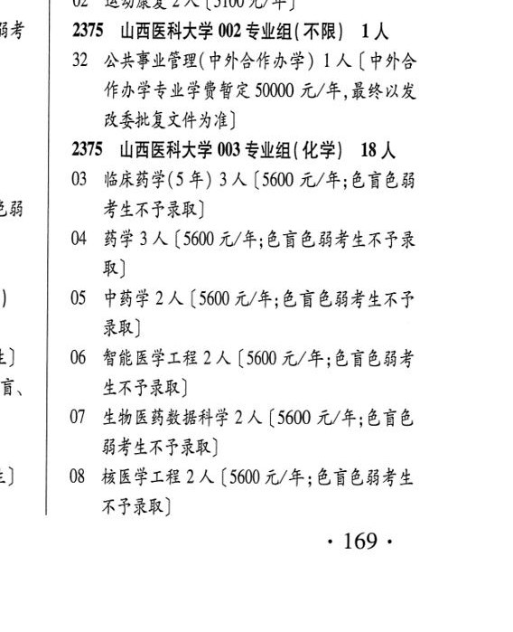
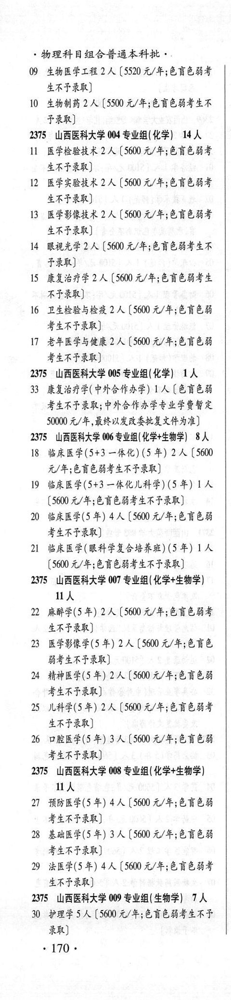
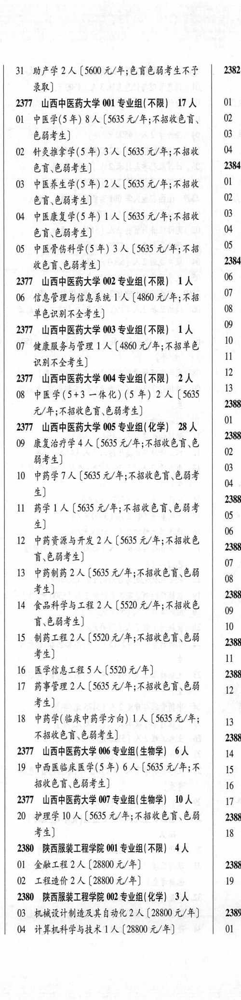

# 2375 山西医科大学

- PDF页码：120, 121
- 书内页码：169, 170
- 专业组：9；专业条目：33

## 001专业组

- 选科要求：AR
- 招生计划：4 人
- 校验：ok

| 专业代码 | 专业名称 | 计划人数 | 学费（元/年） | 备注/完整OCR内容 |
|---|---|---:|---:|---|
| 01 | 信息管理与信息系统(医学信息学方向) | 2 | 5100 | [5100元/年] |
| 02 | 运动康复 | 2 | 5100 | 【5100 元/年] |

<details><summary>本专业组OCR原文</summary>

```text
2375 山西医科大学 001 专业组( AR) 4人
01 信息管理与信息系统(医学信息学方向) 2 人
[5100元/年]
02 运动康复 2 人【5100 元/年]
```
</details>

## 002专业组

- 选科要求：不限
- 招生计划：1 人
- 校验：ok

| 专业代码 | 专业名称 | 计划人数 | 学费（元/年） | 备注/完整OCR内容 |
|---|---|---:|---:|---|
| 32 | 公共事业管理(中外合作办学) | 1 | 50000 | 【中外合 作办学专业学费暂定 50000 元/年,最终以发 KERTH AB) |

<details><summary>本专业组OCR原文</summary>

```text
2375 山西医科大学 002 专业组( 不限) 1人
32 公共事业管理(中外合作办学) 1 人【中外合
作办学专业学费暂定 50000 元/年,最终以发
KERTH AB)
```
</details>

## 003专业组

- 选科要求：化学
- 招生计划：18 人
- 校验：review

| 专业代码 | 专业名称 | 计划人数 | 学费（元/年） | 备注/完整OCR内容 |
|---|---|---:|---:|---|
| 03 | 临床药学(5 年) 3A ( |  | 5600 | 5600 元/年;色盲色弱 考生不予录取] |
| 04 | 药学 | 3 | 5600 | [5600 元/年;色讶色弱考生不予录 取] |
| 05 | 中药学 | 2 | 5600 | 【5600 元/年;色盲色弱考生不巴 RR) |
| 06 | 智能医学工程 | 2 |  | 【5600 4/4; 68 EBS 生不予录取] |
| 07 | 生物医药数据科学 | 2 | 5600 | 【5600 元/年;色盲色 BALAF RR) |
| 08 | 核医学工程 | 2 | 5600 | 【5600 元/年;色盲色弱考生 不予录取] 169: 物理科目组合普通本科批。 |
| 09 | 生物医学工程 2 ( |  | 5520 | 5520 元/年;色盲色弱考 生不予录取] |
| 10 | 生物制药 | 2 | 5500 | 【5500 元/年;色盲色弱考生不 FRR) |

<details><summary>本专业组OCR原文</summary>

```text
2375 山西医科大学 003 专业组(化学) 18 人
03 临床药学(5 年) 3A (5600 元/年;色盲色弱
考生不予录取]
04 药学3人[5600 元/年;色讶色弱考生不予录
取]
05 中药学 2 人【5600 元/年;色盲色弱考生不巴
RR)
06 智能医学工程 2 人【5600 4/4; 68 EBS
生不予录取]
07 生物医药数据科学 2 人【5600 元/年;色盲色
BALAF RR)
08 核医学工程 2 人【5600 元/年;色盲色弱考生
不予录取]
169:
物理科目组合普通本科批。
09 生物医学工程 2 (5520 元/年;色盲色弱考
生不予录取]
10 生物制药 2 人【5500 元/年;色盲色弱考生不
FRR)
```
</details>

## 004专业组

- 选科要求：OCR未稳定识别
- 招生计划：14 人
- 校验：review

| 专业代码 | 专业名称 | 计划人数 | 学费（元/年） | 备注/完整OCR内容 |
|---|---|---:|---:|---|
| 11 | 医学检验技术 2A ( |  | 5000 | 5000 元/年;色盲色弱考 生不予录取] |
| 12 | 医学实验技术 | 2 | 5600 | 【5600 元/年;色盲色弱考 生不予录取] |
| 13 | 医学影像技术 | 2 |  | 【5600 2/4; ET EHF 生不予录取] |
| 14 | 眼视光学 | 2 | 5600 | 【5600 元/年;色盲色弱考生不 FRR) |
| 15 | 康复治疗学 | 2 |  | 【5600 4/4; FEBS S RF RB) |
| 16 | 卫生检验与检疫 | 2 |  | [5600 1/4; 67 OK 考生不予录取] |
| 17 | 老年医学与健康 | 2 | 5600 | 【5600 元/年;色育色能 考生不予录取] |

<details><summary>本专业组OCR原文</summary>

```text
2375 山西医科大学 004 专业组(化学| 14人
11 医学检验技术 2A (5000 元/年;色盲色弱考
生不予录取]
12 医学实验技术 2 人【5600 元/年;色盲色弱考
生不予录取]
13 医学影像技术 2 人【5600 2/4; ET EHF
生不予录取]
14 眼视光学 2 人【5600 元/年;色盲色弱考生不
FRR)
15 康复治疗学2 人【5600 4/4; FEBS S
RF RB)
16 卫生检验与检疫 2 人[5600 1/4; 67 OK
考生不予录取]
17 老年医学与健康 2 人【5600 元/年;色育色能
考生不予录取]
```
</details>

## 005专业组

- 选科要求：化学
- 招生计划：1 人
- 校验：sum-corrected

| 专业代码 | 专业名称 | 计划人数 | 学费（元/年） | 备注/完整OCR内容 |
|---|---|---:|---:|---|
| 33 | 康复治疗学(中外合作办学) | 1 | 50000 | 【色谨色弱 考生不予录取; 中外合作办学专业学费暂定 50000 元/年,最终以发改委批复文件为准] |

<details><summary>本专业组OCR原文</summary>

```text
2375 山西医科大学 005 专业组(化学) 1A
33 康复治疗学(中外合作办学) 1 人【色谨色弱
考生不予录取; 中外合作办学专业学费暂定
50000 元/年,最终以发改委批复文件为准]
```
</details>

## 006专业组

- 选科要求：化学+生物学
- 招生计划：8 人
- 校验：review

| 专业代码 | 专业名称 | 计划人数 | 学费（元/年） | 备注/完整OCR内容 |
|---|---|---:|---:|---|
| 18 | 临床医学(5+3 一体化) (5 年) | 2 | 5600 | 【5600 元/年;色盲色弱考生不予录取] |
| 19 | 临床医学(5+3 一体化儿科学) (5 年) LA ( |  | 5600 | 5600 元/年;色盲色弱考生不予录取] |
| 20 | 临床医学(5 年) | 4 | 5600 | 【5600 元/年;色言色能 考生不予录取] |
| 21 | 临床医学(眼科学复合培养班) (5 年) LA ( |  | 5600 | 5600 元/年;色盲色弱考生不予录取] |

<details><summary>本专业组OCR原文</summary>

```text
2375 山西医科大学 006 专业组(化学+生物学) 8 人
18 临床医学(5+3 一体化) (5 年) 2 人【5600
元/年;色盲色弱考生不予录取]
19 临床医学(5+3 一体化儿科学) (5 年) LA
(5600 元/年;色盲色弱考生不予录取]
20 临床医学(5 年) 4 人【5600 元/年;色言色能
考生不予录取]
21 临床医学(眼科学复合培养班) (5 年) LA
(5600 元/年;色盲色弱考生不予录取]
```
</details>

## 007专业组

- 选科要求：化学+生物学
- 招生计划：OCR未稳定识别 人
- 校验：review

| 专业代码 | 专业名称 | 计划人数 | 学费（元/年） | 备注/完整OCR内容 |
|---|---|---:|---:|---|
| 22 | 麻醉学(5 年) 2A ( |  | 5000 | 5000 元/年;色盲色弱考 生不予录取] |
| 23 | 医学影像学(5 年) 2A ( |  | 5600 | 5600 元/年;色盲色 能考生不予录取] |
| 24 | 精神医学(5 年) 2A ( |  | 5000 | 5000 元/年;色育色弱 考生不予录取] |
| 25 | 儿科学(5年) | 2 | 5600 | [5600 元/年;色育色能考 生不予录取] |
| 26 | 口腔医学(5 年) | 3 | 5600 | 【5600 元/年;色盲色能 考生不予录取] |

<details><summary>本专业组OCR原文</summary>

```text
2375 山西医科大学 007 专业组( 化学+生物学) nA
22 麻醉学(5 年) 2A (5000 元/年;色盲色弱考
生不予录取]
23 医学影像学(5 年) 2A (5600 元/年;色盲色
能考生不予录取]
24 精神医学(5 年) 2A (5000 元/年;色育色弱
考生不予录取]
25 儿科学(5年) 2人[5600 元/年;色育色能考
生不予录取]
26 口腔医学(5 年) 3 人【5600 元/年;色盲色能
考生不予录取]
```
</details>

## 008专业组

- 选科要求：化学+生物学
- 招生计划：OCR未稳定识别 人
- 校验：review

| 专业代码 | 专业名称 | 计划人数 | 学费（元/年） | 备注/完整OCR内容 |
|---|---|---:|---:|---|
| 27 | 预防医学(5 年) 4A (5600 4/4; 68 EK FERF AR) |  |  | 27 预防医学(5 年) 4A (5600 4/4; 68 EK FERF AR) |
| 28 | 基础医学(5 年) 3A ( |  | 5600 | 5600 元/年;色盲色弱 FERF RR) |
| 29 | 法医学(5年) 4A ( |  | 5600 | 5600 元/年;色盲色弱考 ERF RR) |

<details><summary>本专业组OCR原文</summary>

```text
2375 山西医科大学 008 专业组( 化学+生物学) nA
27 预防医学(5 年) 4A (5600 4/4; 68 EK
FERF AR)
28 基础医学(5 年) 3A (5600 元/年;色盲色弱
FERF RR)
29 法医学(5年) 4A (5600 元/年;色盲色弱考
ERF RR)
```
</details>

## 009专业组

- 选科要求：生物学
- 招生计划：7 人
- 校验：ok

| 专业代码 | 专业名称 | 计划人数 | 学费（元/年） | 备注/完整OCR内容 |
|---|---|---:|---:|---|
| 30 | 护理学 | 5 | 5600 | 5600 元/年;色盲色弱考生不予 录取] .170 . |
| 31 | 助产学 | 2 | 5600 | 【5600 元/年;色盲色弱考生不予 2382 录取] |

<details><summary>本专业组OCR原文</summary>

```text
2375 山西医科大学 009 专业组( 生物学) 7 人
30 护理学5人5600 元/年;色盲色弱考生不予
录取]
.170 .
31 助产学 2 人【5600 元/年;色盲色弱考生不予  2382
录取]
```
</details>

## 附：院校完整OCR原文

```text
--- PDF第120页（书内第169页），第3栏 ---
2375 山西医科大学 001 专业组( AR) 4人
01 信息管理与信息系统(医学信息学方向) 2 人
[5100元/年]
02 运动康复 2 人【5100 元/年]
2375 山西医科大学 002 专业组( 不限) 1人
32 公共事业管理(中外合作办学) 1 人【中外合
作办学专业学费暂定 50000 元/年,最终以发
KERTH AB)
2375 山西医科大学 003 专业组(化学) 18 人
03 临床药学(5 年) 3A (5600 元/年;色盲色弱
考生不予录取]
04 药学3人[5600 元/年;色讶色弱考生不予录
取]
05 中药学 2 人【5600 元/年;色盲色弱考生不巴
RR)
06 智能医学工程 2 人【5600 4/4; 68 EBS
生不予录取]
07 生物医药数据科学 2 人【5600 元/年;色盲色
BALAF RR)
08 核医学工程 2 人【5600 元/年;色盲色弱考生
不予录取]
169:

--- PDF第121页（书内第170页），第1栏 ---
物理科目组合普通本科批。
09 生物医学工程 2 (5520 元/年;色盲色弱考
生不予录取]
10 生物制药 2 人【5500 元/年;色盲色弱考生不
FRR)
2375 山西医科大学 004 专业组(化学| 14人
11 医学检验技术 2A (5000 元/年;色盲色弱考
生不予录取]
12 医学实验技术 2 人【5600 元/年;色盲色弱考
生不予录取]
13 医学影像技术 2 人【5600 2/4; ET EHF
生不予录取]
14 眼视光学 2 人【5600 元/年;色盲色弱考生不
FRR)
15 康复治疗学2 人【5600 4/4; FEBS S
RF RB)
16 卫生检验与检疫 2 人[5600 1/4; 67 OK
考生不予录取]
17 老年医学与健康 2 人【5600 元/年;色育色能
考生不予录取]
2375 山西医科大学 005 专业组(化学) 1A
33 康复治疗学(中外合作办学) 1 人【色谨色弱
考生不予录取; 中外合作办学专业学费暂定
50000 元/年,最终以发改委批复文件为准]
2375 山西医科大学 006 专业组(化学+生物学) 8 人
18 临床医学(5+3 一体化) (5 年) 2 人【5600
元/年;色盲色弱考生不予录取]
19 临床医学(5+3 一体化儿科学) (5 年) LA
(5600 元/年;色盲色弱考生不予录取]
20 临床医学(5 年) 4 人【5600 元/年;色言色能
考生不予录取]
21 临床医学(眼科学复合培养班) (5 年) LA
(5600 元/年;色盲色弱考生不予录取]
2375 山西医科大学 007 专业组( 化学+生物学)
nA
22 麻醉学(5 年) 2A (5000 元/年;色盲色弱考
生不予录取]
23 医学影像学(5 年) 2A (5600 元/年;色盲色
能考生不予录取]
24 精神医学(5 年) 2A (5000 元/年;色育色弱
考生不予录取]
25 儿科学(5年) 2人[5600 元/年;色育色能考
生不予录取]
26 口腔医学(5 年) 3 人【5600 元/年;色盲色能
考生不予录取]
2375 山西医科大学 008 专业组( 化学+生物学)
nA
27 预防医学(5 年) 4A (5600 4/4; 68 EK
FERF AR)
28 基础医学(5 年) 3A (5600 元/年;色盲色弱
FERF RR)
29 法医学(5年) 4A (5600 元/年;色盲色弱考
ERF RR)
2375 山西医科大学 009 专业组( 生物学) 7 人
30 护理学5人5600 元/年;色盲色弱考生不予
录取]
.170 .

--- PDF第121页（书内第170页），第2栏 ---
31 助产学 2 人【5600 元/年;色盲色弱考生不予  2382
录取]
```

## 源图



