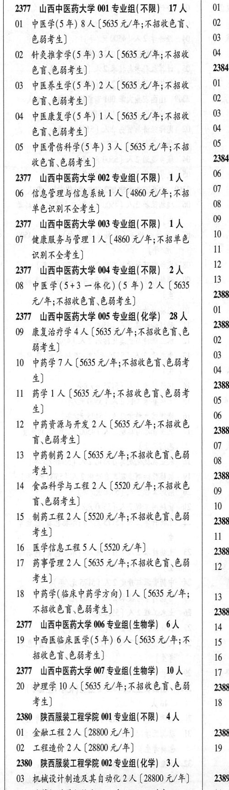

# 2377 山西中医药大学

- PDF页码：121
- 书内页码：170
- 专业组：7；专业条目：15

## 001专业组

- 选科要求：不限
- 招生计划：17 人
- 校验：review

| 专业代码 | 专业名称 | 计划人数 | 学费（元/年） | 备注/完整OCR内容 |
|---|---|---:|---:|---|
|  | 结构化OCR未稳定切分，请查看下方原文及源图 |  |  |  |

<details><summary>本专业组OCR原文</summary>

```text
2377山西中医药大学001专业组（不限）17人
```
</details>

## 002专业组

- 选科要求：不限
- 招生计划：OCR未稳定识别 人
- 校验：review

| 专业代码 | 专业名称 | 计划人数 | 学费（元/年） | 备注/完整OCR内容 |
|---|---|---:|---:|---|
| 06 | 信息管理与信息系统 \| 人 |  | 4860 | 4860元/年;不牛 \| 7 3 单色识别不全考生] |

<details><summary>本专业组OCR原文</summary>

```text
2377 山西中医药大学 002 专业组(不限) 1A | % 4 单色识别不全考生]
06 信息管理与信息系统 | 人[4860元/年;不牛 | 7 3
单色识别不全考生]
```
</details>

## 003专业组

- 选科要求：不限
- 招生计划：1 人
- 校验：review

| 专业代码 | 专业名称 | 计划人数 | 学费（元/年） | 备注/完整OCR内容 |
|---|---|---:|---:|---|
| 07 | 健康服务与管理 ] 人 |  | 4860 | 4860 元/年;不招音色 \| 10 识别不全考生] iy |

<details><summary>本专业组OCR原文</summary>

```text
2377 山西中医药大学 003 专业组(不限) 1人 | 吧
07 健康服务与管理 ] 人【4860 元/年;不招音色 | 10
识别不全考生]              iy
```
</details>

## 004专业组

- 选科要求：不限
- 招生计划：2 人
- 校验：review

| 专业代码 | 专业名称 | 计划人数 | 学费（元/年） | 备注/完整OCR内容 |
|---|---|---:|---:|---|
| 08 | 中医学(543 一体化) (5年) | 2 |  | (5635 \| BF WF RBRED BBE) me 2377 山西中医药大学 0专业组(化学 BA \|, |
| 09 | 康复治疗学 | 4 | 5635 | [5635 元/年;不招收色盲.色 0 4 弱考生] |
| 10 | PRETA ( |  | 5635 | 5635 元/年;不招收色盲色弱考 宙 4) |
| 11 | BELA (5635 A/#; FBKED BHF nash 4) |  |  | 11 BELA (5635 A/#; FBKED BHF nash 4) |
| 12 | 中药资源与开发 | 2 | 5635 | 【5635 元/年;不招收色 a 言\色能考生] “e |
| 13 | PHBA (SOF RMKET EH \| og #4) a |  |  | 13 PHBA (SOF RMKET EH \| og #4) a |
| 14 | 食品科学与工程 | 2 | 5520 | 【5520 元/年;不招收色 09 3 W844) 0 3 |
| 15 | 制药工程 | 2 |  | [5520 A/F; FBKEDEH \| 2388 考生] 1 |
| 16 | 医学信息工程 | 5 | 5520 | [5520 元/年] 2388 |
| 17 | 药事管理 | 2 | 5635 | [5635 元/年;不招收色盲\色弱 \| 12 考生] j |
| 18 | 中药学(临床中药学方向) | 1 | 5635 | 【5635元/年; \| 13 4 不招收色盲\色弱考生] 2388 |

<details><summary>本专业组OCR原文</summary>

```text
2377 山西中医药大学 004 专业组(不限) 2人 | P|
08 中医学(543 一体化) (5年) 2 人(5635 | BF
WF RBRED BBE)         me
2377 山西中医药大学 0专业组(化学 BA |,
09 康复治疗学4 人[5635 元/年;不招收色盲.色   0 4
弱考生]
10 PRETA (5635 元/年;不招收色盲色弱考   宙
4)
11 BELA (5635 A/#; FBKED BHF  nash
4)
12 中药资源与开发 2 人【5635 元/年;不招收色  a
言\色能考生]              “e
13 PHBA (SOF RMKET EH | og
#4)                  a
14 食品科学与工程 2 人【5520 元/年;不招收色   09 3
W844)                0 3
15 制药工程2人[5520 A/F; FBKEDEH | 2388
考生]                1
16 医学信息工程5人[5520 元/年]       2388
17 药事管理 2 人[5635 元/年;不招收色盲\色弱 | 12
考生]                    j
18 中药学(临床中药学方向) 1 人 【5635元/年; | 13 4
不招收色盲\色弱考生]           2388
```
</details>

## 005专业组

- 选科要求：化学
- 招生计划：28 人
- 校验：review

| 专业代码 | 专业名称 | 计划人数 | 学费（元/年） | 备注/完整OCR内容 |
|---|---|---:|---:|---|
|  | 结构化OCR未稳定切分，请查看下方原文及源图 |  |  |  |

<details><summary>本专业组OCR原文</summary>

```text
2377山西中医药大学005专业组（化学）28人
```
</details>

## 006专业组

- 选科要求：OCR未稳定识别
- 招生计划：6 人
- 校验：ok

| 专业代码 | 专业名称 | 计划人数 | 学费（元/年） | 备注/完整OCR内容 |
|---|---|---:|---:|---|
| 19 | 中西医临床医学(5 年) | 6 | 5635 | 【5635 元/年;不 \| 15 \| 招收色言\色弱考生] 16 1 |

<details><summary>本专业组OCR原文</summary>

```text
2377 山西中医药大学 006 专业组(生物学| 6人    14
19 中西医临床医学(5 年) 6 人【5635 元/年;不 | 15 |
招收色言\色弱考生]             16 1
```
</details>

## 007专业组

- 选科要求：生物学
- 招生计划：10 人
- 校验：ok

| 专业代码 | 专业名称 | 计划人数 | 学费（元/年） | 备注/完整OCR内容 |
|---|---|---:|---:|---|
| 20 | 护理学 | 10 | 5635 | 【5635 元/年;不招收色盲.色弱 2388 #4) 18 J |

<details><summary>本专业组OCR原文</summary>

```text
2377 山西中医药大学 007 专业组(生物学) 10 人   17 4
20 护理学 10 人【5635 元/年;不招收色盲.色弱   2388
#4)                  18 J
```
</details>

## 附：院校完整OCR原文

```text
--- PDF第121页（书内第170页），第2栏 ---
2377 山西中医药大学 001 SAAR) ITA | 01 4
Ol 中医学(5年) 8 人【5635 元/年;不招收色谨、 | 02 3
色弱考生]                 0
02 针灸推拿学(5年) 3 人【5635 元/年;不招收 | OF f
色盲\色能考生]              cond
03 中医养生学(5年) 2 人【5635 元/年;不招收 | O 4
色盲、色弱考生]             a
04 中医康复学(5 年) 1A (505 元/年;不招收 | BF
68.6844)               a
05 PRRGHE(S£) 3A (S035 元/年;不招 | 05 |
KEG 6844)             ees
2377 山西中医药大学 002 专业组(不限) 1A | % 4
06 信息管理与信息系统 | 人[4860元/年;不牛 | 7 3
单色识别不全考生]
2377 山西中医药大学 003 专业组(不限) 1人 | 吧
07 健康服务与管理 ] 人【4860 元/年;不招音色 | 10
识别不全考生]              iy
2377 山西中医药大学 004 专业组(不限) 2人 | P|
08 中医学(543 一体化) (5年) 2 人(5635 | BF
WF RBRED BBE)         me
2377 山西中医药大学 0专业组(化学 BA |,
09 康复治疗学4 人[5635 元/年;不招收色盲.色   0 4
弱考生]
10 PRETA (5635 元/年;不招收色盲色弱考   宙
4)
11 BELA (5635 A/#; FBKED BHF  nash
4)
12 中药资源与开发 2 人【5635 元/年;不招收色  a
言\色能考生]              “e
13 PHBA (SOF RMKET EH | og
#4)                  a
14 食品科学与工程 2 人【5520 元/年;不招收色   09 3
W844)                0 3
15 制药工程2人[5520 A/F; FBKEDEH | 2388
考生]                1
16 医学信息工程5人[5520 元/年]       2388
17 药事管理 2 人[5635 元/年;不招收色盲\色弱 | 12
考生]                    j
18 中药学(临床中药学方向) 1 人 【5635元/年; | 13 4
不招收色盲\色弱考生]           2388
2377 山西中医药大学 006 专业组(生物学| 6人    14
19 中西医临床医学(5 年) 6 人【5635 元/年;不 | 15 |
招收色言\色弱考生]             16 1
2377 山西中医药大学 007 专业组(生物学) 10 人   17 4
20 护理学 10 人【5635 元/年;不招收色盲.色弱   2388
#4)                  18 J
```

## 源图

