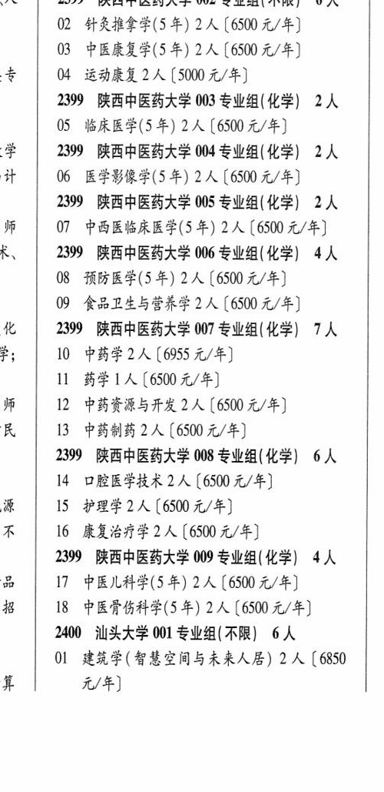

# 2399 陕西中医药大学

- PDF页码：122
- 书内页码：171
- 专业组：9；专业条目：9

## 001专业组

- 选科要求：不限
- 招生计划：2 人
- 校验：ok

| 专业代码 | 专业名称 | 计划人数 | 学费（元/年） | 备注/完整OCR内容 |
|---|---|---:|---:|---|
| 01 | 中医学(5 年) | 2 | 6955 | 【6955 元/年] |

<details><summary>本专业组OCR原文</summary>

```text
融 | 2399 陕西中医药大学 001 专业组(不限】 2 人
01 中医学(5 年) 2 人【6955 元/年]
```
</details>

## 002专业组

- 选科要求：不限
- 招生计划：6 人
- 校验：review

| 专业代码 | 专业名称 | 计划人数 | 学费（元/年） | 备注/完整OCR内容 |
|---|---|---:|---:|---|
| 02 | 针灸推拿学(5 年) | 2 | 6500 | 【6500元/年] |
| 03 | 中医康复学(5 +) 2A ( |  | 6500 | 6500 元/年] |
| 04 | HRA 2A ( |  | 5000 | 5000 元/年] |

<details><summary>本专业组OCR原文</summary>

```text
A   2399 陕西中医药大学 002 专业组(不限) 6 人
02 针灸推拿学(5 年) 2 人【6500元/年]
03 中医康复学(5 +) 2A (6500 元/年]
04 HRA 2A (5000 元/年]
```
</details>

## 003专业组

- 选科要求：WH
- 招生计划：2 人
- 校验：ok

| 专业代码 | 专业名称 | 计划人数 | 学费（元/年） | 备注/完整OCR内容 |
|---|---|---:|---:|---|
| 05 | 临床医学(5 年) | 2 | 6500 | 【6500 元/年] |

<details><summary>本专业组OCR原文</summary>

```text
2399 陕西中医药大学 003 专业组( WH) 2A 学“| 2399 陕西中医药大学 004 专业组(化学) 2人
05 临床医学(5 年) 2 人【6500 元/年]
```
</details>

## 004专业组

- 选科要求：化学
- 招生计划：2 人
- 校验：review

| 专业代码 | 专业名称 | 计划人数 | 学费（元/年） | 备注/完整OCR内容 |
|---|---|---:|---:|---|
|  | 结构化OCR未稳定切分，请查看下方原文及源图 |  |  |  |

<details><summary>本专业组OCR原文</summary>

```text
学“| 2399 陕西中医药大学 004 专业组(化学) 2人
计   06 医学影像学(5 +) 2A (6500 元/年]
```
</details>

## 005专业组

- 选科要求：化学
- 招生计划：2 人
- 校验：review

| 专业代码 | 专业名称 | 计划人数 | 学费（元/年） | 备注/完整OCR内容 |
|---|---|---:|---:|---|
|  | 结构化OCR未稳定切分，请查看下方原文及源图 |  |  |  |

<details><summary>本专业组OCR原文</summary>

```text
2399 陕西中医药大学 005 专业组( 化学) 2 人
师   07 中西医临床医学(5 年) 2A (6500 元/年]
```
</details>

## 006专业组

- 选科要求：化学
- 招生计划：4 人
- 校验：review

| 专业代码 | 专业名称 | 计划人数 | 学费（元/年） | 备注/完整OCR内容 |
|---|---|---:|---:|---|
| 08 | 预防医学(5年) 2A ( |  | 6500 | 6500 元/年] |
| 09 | 食品卫生与营养学 | 2 | 6500 | (6500 元/年] ( |

<details><summary>本专业组OCR原文</summary>

```text
KR, | 2399 陕西中医药大学 006 专业组(化学) 4人
08 预防医学(5年) 2A (6500 元/年]
09 食品卫生与营养学2 人 (6500 元/年]      (
```
</details>

## 007专业组

- 选科要求：化学
- 招生计划：1 人
- 校验：sum-corrected

| 专业代码 | 专业名称 | 计划人数 | 学费（元/年） | 备注/完整OCR内容 |
|---|---|---:|---:|---|
| 11 | 药学 | 1 | 6500 | [6500元/年] f 师 12 中药资源与开发 2 (6500 元/年] ( 民 13 中药制药2 人【6500 元/年] ( |

<details><summary>本专业组OCR原文</summary>

```text
化  2399 陕西中医药大学 007 专业组( 化学) 7人   7
11 药学1人[6500元/年]          f
师   12 中药资源与开发 2 (6500 元/年]      (
民   13 中药制药2 人【6500 元/年]        (
```
</details>

## 008专业组

- 选科要求：化学
- 招生计划：2 人
- 校验：sum-corrected

| 专业代码 | 专业名称 | 计划人数 | 学费（元/年） | 备注/完整OCR内容 |
|---|---|---:|---:|---|
| 14 | 口腔医学技术 | 2 | 6500 | 【6500 元/年] ( & 15 护理学2 人[6500元/年] ( 不 16 康复治疗学2人【6500 元/年] ( |

<details><summary>本专业组OCR原文</summary>

```text
2399 陕西中医药大学 008 专业组(化学) 6人   7
14 口腔医学技术2 人【6500 元/年]       (
&   15 护理学2 人[6500元/年]          (
不   16 康复治疗学2人【6500 元/年]         (
```
</details>

## 009专业组

- 选科要求：化学
- 招生计划：4 人
- 校验：review

| 专业代码 | 专业名称 | 计划人数 | 学费（元/年） | 备注/完整OCR内容 |
|---|---|---:|---:|---|
|  | 结构化OCR未稳定切分，请查看下方原文及源图 |  |  |  |

<details><summary>本专业组OCR原文</summary>

```text
2399 陕西中医药大学 009 专业组(化学) 4人   0
品   17 中医儿科学(5年) 2 人[6500 元/年]
#8   18 中医骨伤科学(5年) 2A (6500 元/年]     2
```
</details>

## 附：院校完整OCR原文

```text
--- PDF第122页（书内第171页），第2栏 ---
融 | 2399 陕西中医药大学 001 专业组(不限】 2 人
01 中医学(5 年) 2 人【6955 元/年]
A   2399 陕西中医药大学 002 专业组(不限) 6 人
02 针灸推拿学(5 年) 2 人【6500元/年]
03 中医康复学(5 +) 2A (6500 元/年]
04 HRA 2A (5000 元/年]
2399 陕西中医药大学 003 专业组( WH) 2A
05 临床医学(5 年) 2 人【6500 元/年]
学“| 2399 陕西中医药大学 004 专业组(化学) 2人
计   06 医学影像学(5 +) 2A (6500 元/年]
2399 陕西中医药大学 005 专业组( 化学) 2 人
师   07 中西医临床医学(5 年) 2A (6500 元/年]
KR, | 2399 陕西中医药大学 006 专业组(化学) 4人
08 预防医学(5年) 2A (6500 元/年]
09 食品卫生与营养学2 人 (6500 元/年]      (
化  2399 陕西中医药大学 007 专业组( 化学) 7人   7
f;   10 中药学2人[6955元/年]          (
11 药学1人[6500元/年]          f
师   12 中药资源与开发 2 (6500 元/年]      (
民   13 中药制药2 人【6500 元/年]        (
2399 陕西中医药大学 008 专业组(化学) 6人   7
14 口腔医学技术2 人【6500 元/年]       (
&   15 护理学2 人[6500元/年]          (
不   16 康复治疗学2人【6500 元/年]         (
2399 陕西中医药大学 009 专业组(化学) 4人   0
品   17 中医儿科学(5年) 2 人[6500 元/年]
#8   18 中医骨伤科学(5年) 2A (6500 元/年]     2
```

## 源图

