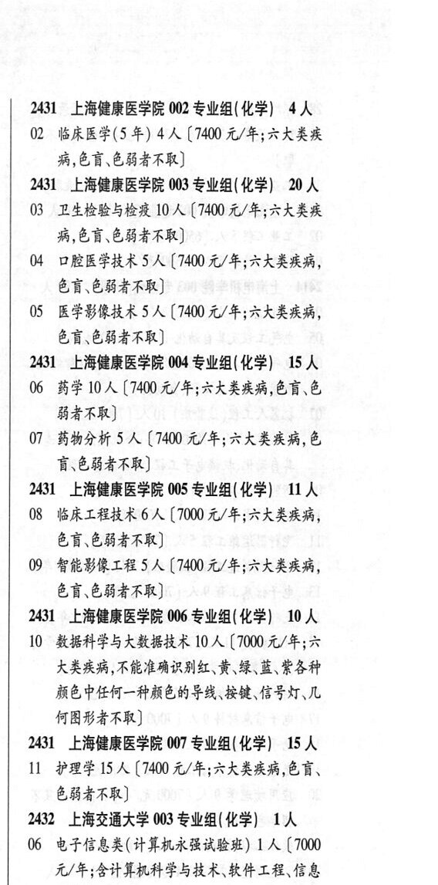

# 2431 上海健康医学院

- PDF页码：125
- 书内页码：174
- 专业组：9；专业条目：40

## 001专业组

- 选科要求：不限
- 招生计划：5 人
- 校验：ok

| 专业代码 | 专业名称 | 计划人数 | 学费（元/年） | 备注/完整OCR内容 |
|---|---|---:|---:|---|
| 01 | 医疗产品管理 | 5 | 6500 | 【6500 元/年;六大类疾病， } 不能准确识别红\黄\绿、蓝\紫各种颜色中任 a 何一种颜色的导线、\按键\信号灯\几何图形者 3 AR) 14 4 |

<details><summary>本专业组OCR原文</summary>

```text
2431 ”上海健康医学院 001 专业组( 不限) 5 人     fi
Ol 医疗产品管理5人【6500 元/年;六大类疾病，    }
不能准确识别红\黄\绿、蓝\紫各种颜色中任    a
何一种颜色的导线、\按键\信号灯\几何图形者     3
AR)                  14 4
```
</details>

## 002专业组

- 选科要求：不限
- 招生计划：14 人
- 校验：review

| 专业代码 | 专业名称 | 计划人数 | 学费（元/年） | 备注/完整OCR内容 |
|---|---|---:|---:|---|
| 03 | 数字经济 | 6 | 42000 | 【42000 元/年] 10 4 |
| 04 | SRILA (42000 4/4) : |  |  | 04 SRILA (42000 4/4) : |
| 05 | 物流管理 | 2 | 42000 | [42000 元/年] j |
| 06 | 电子商务 | 2 | 42000 | 【42000 元/年] 4 |
| 07 | 工商管理(奢侈品管理) | 2 | 42000 | 【42000 元/年] 2431 2429 上海建桥学院 003 专业组(化学) 40 人 11 4 |
| 08 | 机械设计制造及其自动化加人 (42000 4/4) |  |  | 08 机械设计制造及其自动化加人 (42000 4/4) |
| 09 | 计算机科学与技术 | 20 | 42000 | 【42000 元/年] 2432 2429 上海建桥学院 004 专业组(化学) 112 人 06 4 |
| 10 | 汽车服务工程 | 4 |  | 【42000 4/4) 5 |
| 11 | 智能制造工程 15 A (42000 4/4) 4 |  |  | 11 智能制造工程 15 A (42000 4/4) 4 |
| 12 | 宝石及材料工艺学 | 10 | 42000 | 【42000 元/年] 2432 |
| 13 | 电子科学与技术 16 A ( |  | 42000 | 42000 元/年] 7. |
| 14 | MBFAHFS LA 13 A ( |  | 42000 | 42000 元/年] |
| 15 | 电子封装技术 10 A (42000 4/4) 0s. |  |  | 15 电子封装技术 10 A (42000 4/4) 0s. |
| 16 | AL#HE 4A ( |  | 42000 | 42000 元/年] ; |
| 17 | KALA IS A (42000 4/4) 09 4 |  |  | 17 KALA IS A (42000 4/4) 09 4 |
| 18 | 网络工程 | 5 | 42000 | 【42000元/年] |
| 19 | 物联网工程 | 5 | 42000 | 【42000 元/年] 人 |
| 20 | 数字媒体技术 | 15 | 42000 | 【42000元/年] ( 2429 上海建桥学院 005 专业组( 化学) 8 人 到 |
| 21 | 计算机科学与技术(双语班) | 6 |  | 【45000 10 2 元/年;外语与国际教育学院;入学后专业教学 A 外语语种为日语;中日学分互认] J |
| 22 | 网络工程(双语班) 2A (45000 元/年; 外话 11 # 与国际教育学院;入学后专业教学外语语种为 A 日语;中日学分互认] 12 1 2429 ”上海建桥学院 006 专业组( 生物学) | 12 | 45000 | ( |
| 23 | 护理学 | 12 | 42000 | [42000元/年] 13 书 |

<details><summary>本专业组OCR原文</summary>

```text
2429 上海建桥学院 002 专业组(不限) 14 人    2431
03 数字经济6人【42000 元/年]         10 4
04 SRILA (42000 4/4)            :
05 物流管理 2 人[42000 元/年]           j
06 电子商务 2 人【42000 元/年]          4
07 工商管理(奢侈品管理) 2 人【42000 元/年]   2431
2429 上海建桥学院 003 专业组(化学) 40 人    11 4
08 机械设计制造及其自动化加人 (42000 4/4)
09 计算机科学与技术 20 人【42000 元/年]     2432
2429 上海建桥学院 004 专业组(化学) 112 人   06 4
10 汽车服务工程4人【42000 4/4)         5
11 智能制造工程 15 A (42000 4/4)        4
12 宝石及材料工艺学 10 人【42000 元/年]     2432
13 电子科学与技术 16 A (42000 元/年]     7.
14 MBFAHFS LA 13 A (42000 元/年]
15 电子封装技术 10 A (42000 4/4)      0s.
16 AL#HE 4A (42000 元/年]           ;
17 KALA IS A (42000 4/4)        09 4
18 网络工程5人【42000元/年]
19 物联网工程5 人【42000 元/年]          人
20 数字媒体技术 15 人【42000元/年]         (
2429 上海建桥学院 005 专业组( 化学) 8 人      到
21 计算机科学与技术(双语班) 6 人【45000   10 2
元/年;外语与国际教育学院;入学后专业教学     A
外语语种为日语;中日学分互认]         J
22 网络工程(双语班) 2A (45000 元/年; 外话   11 #
与国际教育学院;入学后专业教学外语语种为     A
日语;中日学分互认]          12 1
2429 ”上海建桥学院 006 专业组( 生物学) 12 人     (
23 护理学12 人[42000元/年]          13 书
```
</details>

## 002专业组

- 选科要求：化学
- 招生计划：4 人
- 校验：ok

| 专业代码 | 专业名称 | 计划人数 | 学费（元/年） | 备注/完整OCR内容 |
|---|---|---:|---:|---|
| 02 | 临床医学(5 年) | 4 | 7400 | 【7400 元/年;六大类疾 ACH CHEER) |

<details><summary>本专业组OCR原文</summary>

```text
2431 上海健康医学院 002 专业组(化学) 4 人
02 临床医学(5 年) 4 人【7400 元/年;六大类疾
ACH CHEER)
```
</details>

## 003专业组

- 选科要求：化学
- 招生计划：20 人
- 校验：ok

| 专业代码 | 专业名称 | 计划人数 | 学费（元/年） | 备注/完整OCR内容 |
|---|---|---:|---:|---|
| 03 | 卫生检验与检疫 | 10 | 7400 | 【7400 元/年;六大类疾 病,色盲,色弱者不取] |
| 04 | 口腔医学技术 | 5 | 7400 | 【7400 元/年;六大类疾病， 色盲\色弱者不取] |
| 05 | 医学影像技术 | 5 | 7400 | 【7400 元/年;六大类疾病， 色育、色弱者不取] |

<details><summary>本专业组OCR原文</summary>

```text
2431 上海健康医学院 003 专业组(化学) 20 人
03 卫生检验与检疫 10 人【7400 元/年;六大类疾
病,色盲,色弱者不取]
04 口腔医学技术5人【7400 元/年;六大类疾病，
色盲\色弱者不取]
05 医学影像技术5 人【7400 元/年;六大类疾病，
色育、色弱者不取]
```
</details>

## 004专业组

- 选科要求：化学
- 招生计划：65 人
- 校验：review

| 专业代码 | 专业名称 | 计划人数 | 学费（元/年） | 备注/完整OCR内容 |
|---|---|---:|---:|---|
| 14 | 机械设计制造及其自动化 | 15 | 7000 | 【7000 元/年] 06 3 |
| 15 | 电气工程及其自动化 15 A ( |  | 1000 | 1000 元/年] |
| 16 | 测控技术与仪器 | 10 | 7000 | 【7000 元/年] 07 3 |
| 17 | 机器人工程 | 10 | 7000 | 【7000元/年] i |
| 18 | 计算机科学与技术8 A ( |  | 7000 | 7000 元/年] 2431 |
| 19 | 数据科学与大数据技术 | 7 | 7000 | 【7000 元/年] 08 \| 2429 上海建桥学院 001 专业组(不限) 6A |
| 01 | 国际经济与贸易 | 3 | 42000 | 【42000元/年] 09 \| |
| 02 | 会计学 | 3 | 42000 | (42000 元/年] |

<details><summary>本专业组OCR原文</summary>

```text
2427 ”上海海洋大学 004 专业组(化学) 65 人    2431
14 机械设计制造及其自动化 15 人【7000 元/年]   06 3
15 电气工程及其自动化 15 A (1000 元/年]
16 测控技术与仪器 10 人【7000 元/年]      07 3
17 机器人工程10人【7000元/年]          i
18 计算机科学与技术8 A (7000 元/年]      2431
19 数据科学与大数据技术7 人【7000 元/年]    08 |
2429 上海建桥学院 001 专业组(不限) 6A
01 国际经济与贸易 3 人【42000元/年]      09 |
02 会计学3人 (42000 元/年]
```
</details>

## 004专业组

- 选科要求：化学
- 招生计划：15 人
- 校验：ok

| 专业代码 | 专业名称 | 计划人数 | 学费（元/年） | 备注/完整OCR内容 |
|---|---|---:|---:|---|
| 06 | 药学 | 10 | 7400 | [7400 元/年;六大灶疾病,色盲、色 HARK) |
| 07 | 药物分析 | 5 | 7400 | 【7400 元/年;六大类疾病,色 讶色弱者不取] |

<details><summary>本专业组OCR原文</summary>

```text
2431 上海健康医学院 004 专业组(化学) 15 人
06 药学 10 人[7400 元/年;六大灶疾病,色盲、色
HARK)
07 药物分析 5 人【7400 元/年;六大类疾病,色
讶色弱者不取]
```
</details>

## 005专业组

- 选科要求：化学
- 招生计划：11 人
- 校验：ok

| 专业代码 | 专业名称 | 计划人数 | 学费（元/年） | 备注/完整OCR内容 |
|---|---|---:|---:|---|
| 08 | 临床工程技术 | 6 | 7000 | 【7000 元/年;六大类疾病， 色言、色弱者不取] |
| 09 | 智能影像工程 | 5 | 7400 | 【7400 元/年;六大类疾病， 色盲、色弱者不取] |

<details><summary>本专业组OCR原文</summary>

```text
2431 ”上海健康医学院 005 专业组(化学) 11 人
08 临床工程技术6 人【7000 元/年;六大类疾病，
色言、色弱者不取]
09 智能影像工程5人【7400 元/年;六大类疾病，
色盲、色弱者不取]
```
</details>

## 006专业组

- 选科要求：化学
- 招生计划：10 人
- 校验：ok

| 专业代码 | 专业名称 | 计划人数 | 学费（元/年） | 备注/完整OCR内容 |
|---|---|---:|---:|---|
| 10 | 数据科学与大数据技术 | 10 | 7000 | 【7000 元/年;六 大类疾病,不能准确识别红、黄、绿、蓝、紫各种 凑色中任何一种颜色的导线、按键、信号灯\几 何图形者不取] |

<details><summary>本专业组OCR原文</summary>

```text
2431 上海健康医学院 006 专业组(化学) 10 人
10 数据科学与大数据技术 10 人【7000 元/年;六
大类疾病,不能准确识别红、黄、绿、蓝、紫各种
凑色中任何一种颜色的导线、按键、信号灯\几
何图形者不取]
```
</details>

## 007专业组

- 选科要求：化学
- 招生计划：15 人
- 校验：ok

| 专业代码 | 专业名称 | 计划人数 | 学费（元/年） | 备注/完整OCR内容 |
|---|---|---:|---:|---|
| 11 | 护理学 | 15 | 7400 | (7400 元/年;六大类疾病,色盲、 色磁者不取] |

<details><summary>本专业组OCR原文</summary>

```text
2431 ”上海健康医学院 007 专业组(化学) 15 人
11 护理学15 人 (7400 元/年;六大类疾病,色盲、
色磁者不取]
```
</details>

## 附：院校完整OCR原文

```text
--- PDF第125页（书内第174页），第2栏 ---
2427 ”上海海洋大学 004 专业组(化学) 65 人    2431
14 机械设计制造及其自动化 15 人【7000 元/年]   06 3
15 电气工程及其自动化 15 A (1000 元/年]
16 测控技术与仪器 10 人【7000 元/年]      07 3
17 机器人工程10人【7000元/年]          i
18 计算机科学与技术8 A (7000 元/年]      2431
19 数据科学与大数据技术7 人【7000 元/年]    08 |
2429 上海建桥学院 001 专业组(不限) 6A
01 国际经济与贸易 3 人【42000元/年]      09 |
02 会计学3人 (42000 元/年]
2429 上海建桥学院 002 专业组(不限) 14 人    2431
03 数字经济6人【42000 元/年]         10 4
04 SRILA (42000 4/4)            :
05 物流管理 2 人[42000 元/年]           j
06 电子商务 2 人【42000 元/年]          4
07 工商管理(奢侈品管理) 2 人【42000 元/年]   2431
2429 上海建桥学院 003 专业组(化学) 40 人    11 4
08 机械设计制造及其自动化加人 (42000 4/4)
09 计算机科学与技术 20 人【42000 元/年]     2432
2429 上海建桥学院 004 专业组(化学) 112 人   06 4
10 汽车服务工程4人【42000 4/4)         5
11 智能制造工程 15 A (42000 4/4)        4
12 宝石及材料工艺学 10 人【42000 元/年]     2432
13 电子科学与技术 16 A (42000 元/年]     7.
14 MBFAHFS LA 13 A (42000 元/年]
15 电子封装技术 10 A (42000 4/4)      0s.
16 AL#HE 4A (42000 元/年]           ;
17 KALA IS A (42000 4/4)        09 4
18 网络工程5人【42000元/年]
19 物联网工程5 人【42000 元/年]          人
20 数字媒体技术 15 人【42000元/年]         (
2429 上海建桥学院 005 专业组( 化学) 8 人      到
21 计算机科学与技术(双语班) 6 人【45000   10 2
元/年;外语与国际教育学院;入学后专业教学     A
外语语种为日语;中日学分互认]         J
22 网络工程(双语班) 2A (45000 元/年; 外话   11 #
与国际教育学院;入学后专业教学外语语种为     A
日语;中日学分互认]          12 1
2429 ”上海建桥学院 006 专业组( 生物学) 12 人     (
23 护理学12 人[42000元/年]          13 书
2431 ”上海健康医学院 001 专业组( 不限) 5 人     fi
Ol 医疗产品管理5人【6500 元/年;六大类疾病，    }
不能准确识别红\黄\绿、蓝\紫各种颜色中任    a
何一种颜色的导线、\按键\信号灯\几何图形者     3
AR)                  14 4

--- PDF第125页（书内第174页），第3栏 ---
2431 上海健康医学院 002 专业组(化学) 4 人
02 临床医学(5 年) 4 人【7400 元/年;六大类疾
ACH CHEER)
2431 上海健康医学院 003 专业组(化学) 20 人
03 卫生检验与检疫 10 人【7400 元/年;六大类疾
病,色盲,色弱者不取]
04 口腔医学技术5人【7400 元/年;六大类疾病，
色盲\色弱者不取]
05 医学影像技术5 人【7400 元/年;六大类疾病，
色育、色弱者不取]
2431 上海健康医学院 004 专业组(化学) 15 人
06 药学 10 人[7400 元/年;六大灶疾病,色盲、色
HARK)
07 药物分析 5 人【7400 元/年;六大类疾病,色
讶色弱者不取]
2431 ”上海健康医学院 005 专业组(化学) 11 人
08 临床工程技术6 人【7000 元/年;六大类疾病，
色言、色弱者不取]
09 智能影像工程5人【7400 元/年;六大类疾病，
色盲、色弱者不取]
2431 上海健康医学院 006 专业组(化学) 10 人
10 数据科学与大数据技术 10 人【7000 元/年;六
大类疾病,不能准确识别红、黄、绿、蓝、紫各种
凑色中任何一种颜色的导线、按键、信号灯\几
何图形者不取]
2431 ”上海健康医学院 007 专业组(化学) 15 人
11 护理学15 人 (7400 元/年;六大类疾病,色盲、
色磁者不取]
```

## 源图


