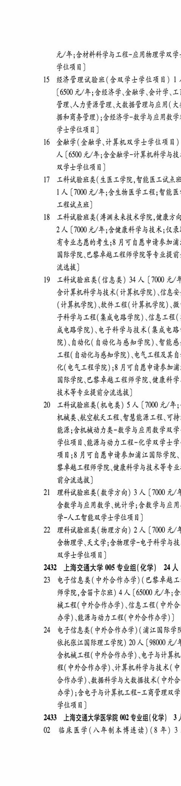
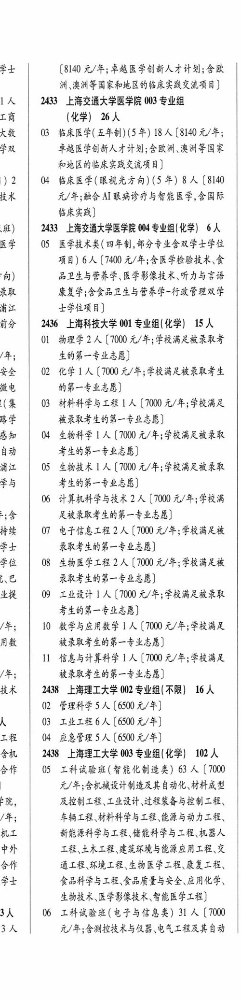

# 2433 上海交通大学医学院

- PDF页码：126
- 书内页码：175
- 专业组：4；专业条目：5

## 002专业组

- 选科要求：化学
- 招生计划：OCR未稳定识别 人
- 校验：review

| 专业代码 | 专业名称 | 计划人数 | 学费（元/年） | 备注/完整OCR内容 |
|---|---|---:|---:|---|
| 02 | BREF (AFAR) (8 年) 3 #4 (8140 A/#; FRE FA AAA HR; OK 洲、澳洲等国家和地区的临床实践交流项目 |  |  | 02 BREF (AFAR) (8 年) 3 #4 (8140 A/#; FRE FA AAA HR; OK 洲、澳洲等国家和地区的临床实践交流项目] |

<details><summary>本专业组OCR原文</summary>

```text
2433 ”上海交通大学医学院 002 专业组(化学) 3
02 BREF (AFAR) (8 年) 3
#4     (8140 A/#; FRE FA AAA HR; OK
洲、澳洲等国家和地区的临床实践交流项目]
```
</details>

## 003专业组

- 选科要求：OCR未稳定识别
- 招生计划：26 人
- 校验：review

| 专业代码 | 专业名称 | 计划人数 | 学费（元/年） | 备注/完整OCR内容 |
|---|---|---:|---:|---|
|  | 结构化OCR未稳定切分，请查看下方原文及源图 |  |  |  |

<details><summary>本专业组OCR原文</summary>

```text
1人   2433 上海交通大学医学院 003 专业组 工商     (化学| 26人
工商     (化学| 26人
Kk   03 临床医学(五年制) (5 #) 18 A (8140 2/4;
ER     草越医学创新人才计划;含欧洲、澳洲等国家
和地区的临床实践交流项目]
) 2 | 04 临床医学(眼视光方向) (5 年) 8 人【8140
BR     元/年;融合 AI 眼病诊疗与智能医学,含国际
临床实践]
```
</details>

## 004专业组

- 选科要求：化学
- 招生计划：6 人
- 校验：review

| 专业代码 | 专业名称 | 计划人数 | 学费（元/年） | 备注/完整OCR内容 |
|---|---|---:|---:|---|
| 06 | 计算机科学与技术 2A (1000 元/年;学校江 Eee 足被录取考生的第一专业志愿] 持续 07 电子信息工程 | 2 | 1000 | 【7000 元/年;学校满足被 学十 录取考生的第一专业志愿] 学位“\| 08 生物医学工程 2 人【7000 元/年;学校满足被 已 录取考生的第一专业志愿] 业提 \| 09 工业设计 LA (1000 元/年;学校满足被录取 考生的第一专业志愿] /年; 10 数学与应用数学 ] 人【7000 元/年;学校满足 用数 被录取考生的第一专业志愿] |
| 11 | 信息与计算科学 ] 人 |  | 7000 | 7000 元/年学校满足 /年; 被录取考生的第一专业志愿] |

<details><summary>本专业组OCR原文</summary>

```text
班)   2433 上海交通大学医学院 04 专业组(化学) 6A 医学  05 医学技术类(四年制,部分专业含双学士学位 项目) 6 人 (1400 元/年;含医学检验技术、食
医学  05 医学技术类(四年制,部分专业含双学士学位
项目) 6 人 (1400 元/年;含医学检验技术、食
向)     品卫生与营养学、医学影像技术听力与言语
录取     康复学;含食品卫生与营养学-行政管理双学
浦江     士学位项目]
首分“| 236 上海科技大学 001 专业组(化学) 15 人
OL 物理学 2 人【7000 元/年;学校满足被录取者
/年;     生的第一专业志愿]
安全   02 化学1 人[7000 元/年;学校满足被录取考生
fe,     的第一专业志愿]
(集   03 材料科学与工程 | 人【7000 元/年;学校满足
路学     被录取考生的第一专业志愿]
感知 | 04 生物科学 1 人【7000 元/年;学校满足被录取
自动     考生的第一专业志愿]
浦江   05 生物技术 1 人【7000 元/年;学校满足被录取
学与     考生的第一专业志愿]
06 计算机科学与技术 2A (1000 元/年;学校江
Eee     足被录取考生的第一专业志愿]
持续   07 电子信息工程 2 人【7000 元/年;学校满足被
学十     录取考生的第一专业志愿]
学位“| 08 生物医学工程 2 人【7000 元/年;学校满足被
已     录取考生的第一专业志愿]
业提 | 09 工业设计 LA (1000 元/年;学校满足被录取
考生的第一专业志愿]
/年;   10 数学与应用数学 ] 人【7000 元/年;学校满足
用数     被录取考生的第一专业志愿]
11 信息与计算科学 ] 人[7000 元/年学校满足
/年;     被录取考生的第一专业志愿]
```
</details>

## 005专业组

- 选科要求：化学
- 招生计划：24 人
- 校验：sum-corrected

| 专业代码 | 专业名称 | 计划人数 | 学费（元/年） | 备注/完整OCR内容 |
|---|---|---:|---:|---|
| 23 | 电子信息类(中外合作办学) (巴黎卓越工 师学院,含备卡尔班) | 4 | 65000 | 【65000 元/年;含 械工程( 中外合作办学)、\信息工程( 中外合 DF) 能源与动力工程( 中外合作办学) ] |
| 24 | 电子信息类(中外合作办学) (浦江国际学 依托张江国际理工学院) | 20 |  | 【98000 元/4 含机械工程( 中外合作办学) 电子与计算机 程(中外合作办学) 计算机科学与技术(中 合作办学) 数据科学与大数据技术( 中外合 DF) ;含电子与计算机工程-工商管理双学 学位项目] |

<details><summary>本专业组OCR原文</summary>

```text
2432 上海交通大学 005 专业组(化学) WA
23 电子信息类(中外合作办学) (巴黎卓越工
师学院,含备卡尔班) 4 人【65000 元/年;含
械工程( 中外合作办学)、\信息工程( 中外合
DF) 能源与动力工程( 中外合作办学) ]
24 电子信息类(中外合作办学) (浦江国际学
依托张江国际理工学院) 20 人【98000 元/4
含机械工程( 中外合作办学) 电子与计算机
程(中外合作办学) 计算机科学与技术(中
合作办学) 数据科学与大数据技术( 中外合
DF) ;含电子与计算机工程-工商管理双学
学位项目]
```
</details>

## 附：院校完整OCR原文

```text
--- PDF第126页（书内第175页），第1栏 ---
2432 上海交通大学 005 专业组(化学) WA
23 电子信息类(中外合作办学) (巴黎卓越工
师学院,含备卡尔班) 4 人【65000 元/年;含
械工程( 中外合作办学)、\信息工程( 中外合
DF) 能源与动力工程( 中外合作办学) ]
24 电子信息类(中外合作办学) (浦江国际学
依托张江国际理工学院) 20 人【98000 元/4
含机械工程( 中外合作办学) 电子与计算机
程(中外合作办学) 计算机科学与技术(中
合作办学) 数据科学与大数据技术( 中外合
DF) ;含电子与计算机工程-工商管理双学
学位项目]
2433 ”上海交通大学医学院 002 专业组(化学) 3
02 BREF (AFAR) (8 年) 3

--- PDF第126页（书内第175页），第2栏 ---
#4     (8140 A/#; FRE FA AAA HR; OK
洲、澳洲等国家和地区的临床实践交流项目]
1人   2433 上海交通大学医学院 003 专业组
工商     (化学| 26人
Kk   03 临床医学(五年制) (5 #) 18 A (8140 2/4;
ER     草越医学创新人才计划;含欧洲、澳洲等国家
和地区的临床实践交流项目]
) 2 | 04 临床医学(眼视光方向) (5 年) 8 人【8140
BR     元/年;融合 AI 眼病诊疗与智能医学,含国际
临床实践]
班)   2433 上海交通大学医学院 04 专业组(化学) 6A
医学  05 医学技术类(四年制,部分专业含双学士学位
项目) 6 人 (1400 元/年;含医学检验技术、食
向)     品卫生与营养学、医学影像技术听力与言语
录取     康复学;含食品卫生与营养学-行政管理双学
浦江     士学位项目]
首分“| 236 上海科技大学 001 专业组(化学) 15 人
OL 物理学 2 人【7000 元/年;学校满足被录取者
/年;     生的第一专业志愿]
安全   02 化学1 人[7000 元/年;学校满足被录取考生
fe,     的第一专业志愿]
(集   03 材料科学与工程 | 人【7000 元/年;学校满足
路学     被录取考生的第一专业志愿]
感知 | 04 生物科学 1 人【7000 元/年;学校满足被录取
自动     考生的第一专业志愿]
浦江   05 生物技术 1 人【7000 元/年;学校满足被录取
学与     考生的第一专业志愿]
06 计算机科学与技术 2A (1000 元/年;学校江
Eee     足被录取考生的第一专业志愿]
持续   07 电子信息工程 2 人【7000 元/年;学校满足被
学十     录取考生的第一专业志愿]
学位“| 08 生物医学工程 2 人【7000 元/年;学校满足被
已     录取考生的第一专业志愿]
业提 | 09 工业设计 LA (1000 元/年;学校满足被录取
考生的第一专业志愿]
/年;   10 数学与应用数学 ] 人【7000 元/年;学校满足
用数     被录取考生的第一专业志愿]
11 信息与计算科学 ] 人[7000 元/年学校满足
/年;     被录取考生的第一专业志愿]
```

## 源图


