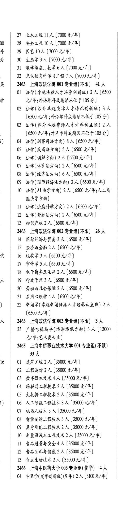
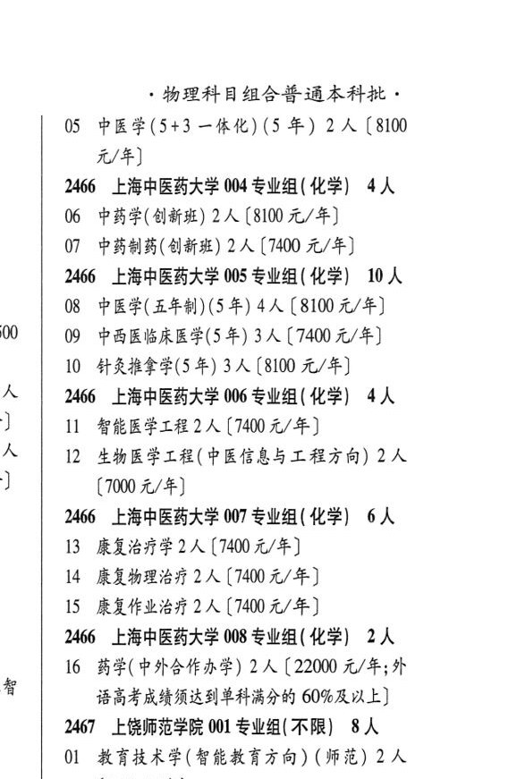

# 2466 上海中医药大学

- PDF页码：128
- 书内页码：177
- 专业组：6；专业条目：13

## 003专业组

- 选科要求：OCR未稳定识别
- 招生计划：4 人
- 校验：review

| 专业代码 | 专业名称 | 计划人数 | 学费（元/年） | 备注/完整OCR内容 |
|---|---|---:|---:|---|
| 04 | 中医学(龙华创新班)(9 年) | 2 | 8100 | [8100 元/年] 1 物理科目组合普通本科批， |
| 05 | 中医学(5+3 一体化) (5 年) 2A ( |  | 8100 | 8100 元/年] |

<details><summary>本专业组OCR原文</summary>

```text
2466 ”上海中医药大学 003 专业组(化学| 4人   1
04 中医学(龙华创新班)(9 年) 2人[8100 元/年]   1
物理科目组合普通本科批，
05 中医学(5+3 一体化) (5 年) 2A (8100
元/年]
```
</details>

## 004专业组

- 选科要求：OCR未稳定识别
- 招生计划：4 人
- 校验：review

| 专业代码 | 专业名称 | 计划人数 | 学费（元/年） | 备注/完整OCR内容 |
|---|---|---:|---:|---|
| 06 | 中药学(创新班) | 2 | 8100 | 【8100 元/年] |
| 07 | 中药制药(创新班) 2 A ( |  | 7400 | 7400 元/年] |

<details><summary>本专业组OCR原文</summary>

```text
2466 ”上海中医药大学 004 专业组( 化学| 4人
06 中药学(创新班) 2 人【8100 元/年]
07 中药制药(创新班) 2 A (7400 元/年]
```
</details>

## 005专业组

- 选科要求：化学
- 招生计划：10 人
- 校验：review

| 专业代码 | 专业名称 | 计划人数 | 学费（元/年） | 备注/完整OCR内容 |
|---|---|---:|---:|---|
| 08 | 中医学(五年制)(5 年) 4A ( |  | 8100 | 8100 元/年] |
| 09 | 中西医临床医学(5 年) 3A (7400 4/4) |  |  | 09 中西医临床医学(5 年) 3A (7400 4/4) |
| 10 | 针灸推拿学(5 年) | 3 | 8100 | 【8100 元/年] |

<details><summary>本专业组OCR原文</summary>

```text
2466 ”上海中医药大学 005 专业组 ( 化学) 10 人
08 中医学(五年制)(5 年) 4A (8100 元/年]
09 中西医临床医学(5 年) 3A (7400 4/4)
10 针灸推拿学(5 年) 3 人【8100 元/年]
```
</details>

## 006专业组

- 选科要求：OCR未稳定识别
- 招生计划：4 人
- 校验：ok

| 专业代码 | 专业名称 | 计划人数 | 学费（元/年） | 备注/完整OCR内容 |
|---|---|---:|---:|---|
| 11 | 智能医学工程 | 2 | 7400 | 【7400 元/年] |
| 12 | 生物医学工程(中医信息与工程方向) | 2 | 7000 | [7000元/年] |

<details><summary>本专业组OCR原文</summary>

```text
2466 ”上海中医药大学 006 专业组 ( 化学| 4人
11 智能医学工程2 人【7400 元/年]
12 生物医学工程(中医信息与工程方向) 2 人
[7000元/年]
```
</details>

## 007专业组

- 选科要求：化学
- 招生计划：6 人
- 校验：ok

| 专业代码 | 专业名称 | 计划人数 | 学费（元/年） | 备注/完整OCR内容 |
|---|---|---:|---:|---|
| 13 | 康复治疗学 | 2 |  | (7400 4/4) |
| 14 | 康复物理治疗 | 2 | 7400 | 【7400元/年] |
| 15 | 康复作业治疗 | 2 | 7400 | [7400元/年] |

<details><summary>本专业组OCR原文</summary>

```text
2466 ”上海中医药大学 007 专业组( 化学) 6人
13 康复治疗学2人 (7400 4/4)
14 康复物理治疗2人【7400元/年]
15 康复作业治疗2人[7400元/年]
```
</details>

## 008专业组

- 选科要求：化学
- 招生计划：2 人
- 校验：ok

| 专业代码 | 专业名称 | 计划人数 | 学费（元/年） | 备注/完整OCR内容 |
|---|---|---:|---:|---|
| 16 | 药学( 中外合作办学) | 2 | 22000 | 【22000 元/年;外 语高考成绩须达到单科满分的 60%及以上] |

<details><summary>本专业组OCR原文</summary>

```text
2466 ”上海中医药大学 008 专业组( 化学) 2人
16 药学( 中外合作办学) 2 人【22000 元/年;外
语高考成绩须达到单科满分的 60%及以上]
```
</details>

## 附：院校完整OCR原文

```text
--- PDF第128页（书内第177页），第2栏 ---
2466 ”上海中医药大学 003 专业组(化学| 4人   1
04 中医学(龙华创新班)(9 年) 2人[8100 元/年]   1

--- PDF第128页（书内第177页），第3栏 ---
物理科目组合普通本科批，
05 中医学(5+3 一体化) (5 年) 2A (8100
元/年]
2466 ”上海中医药大学 004 专业组( 化学| 4人
06 中药学(创新班) 2 人【8100 元/年]
07 中药制药(创新班) 2 A (7400 元/年]
2466 ”上海中医药大学 005 专业组 ( 化学) 10 人
08 中医学(五年制)(5 年) 4A (8100 元/年]
09 中西医临床医学(5 年) 3A (7400 4/4)
10 针灸推拿学(5 年) 3 人【8100 元/年]
2466 ”上海中医药大学 006 专业组 ( 化学| 4人
11 智能医学工程2 人【7400 元/年]
12 生物医学工程(中医信息与工程方向) 2 人
[7000元/年]
2466 ”上海中医药大学 007 专业组( 化学) 6人
13 康复治疗学2人 (7400 4/4)
14 康复物理治疗2人【7400元/年]
15 康复作业治疗2人[7400元/年]
2466 ”上海中医药大学 008 专业组( 化学) 2人
16 药学( 中外合作办学) 2 人【22000 元/年;外
语高考成绩须达到单科满分的 60%及以上]
```

## 源图


