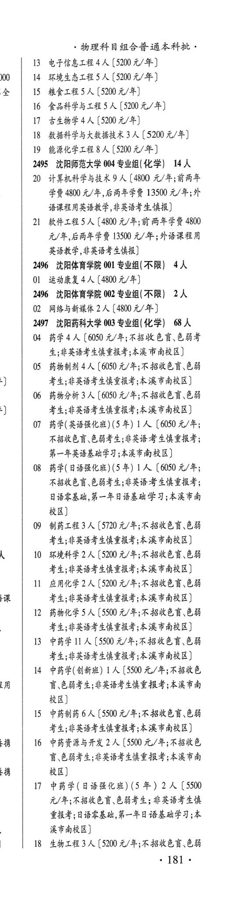
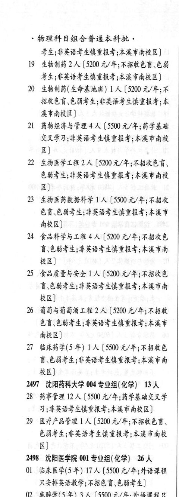

# 2497 沈阳药科大学

- PDF页码：132, 133
- 书内页码：181, 182
- 专业组：2；专业条目：25

## 003专业组

- 选科要求：化学
- 招生计划：68 人
- 校验：review

| 专业代码 | 专业名称 | 计划人数 | 学费（元/年） | 备注/完整OCR内容 |
|---|---|---:|---:|---|
| 04 | 药学 | 4 | 6050 | 【6050 元/年;不招收色盲色弱考 生;非英语考生慎重报考;本溪市南校区] |
| 05 | 药物制剂 | 4 | 6050 | 【6050 元/年;不 招收色盲色弱 考生;非英语考生慎重报考;本溪市南校区] |
| 06 | 药物分析 | 3 | 6050 | 【6050 元/年;不招收色盲、色弱 考生;非英语考生避重报考;本溪市南校区] |
| 07 | 药学(英语强化班)(5 年) 1A ( |  | 6050 | 6050 元/年; 不招收色盲、色弱考生;非英语考生慎重报考; 第一年英语基础学习;本溪市南校区] |
| 08 | 药学(日语强化班)(5 年) 1A ( |  | 6050 | 6050 元/年; 不招收色盲、色弱考生;非英语考生慎重报考; 日语零基础,第一年日语基础学习;本肖市南 RE) |
| 09 | 制药工程 | 3 | 5720 | 【5720 元/年;不招收色盲、色弱 考生;非英语考生慎重报考;本溪市南校区] |
| 10 | 环境科学 | 2 | 5200 | [5200 元/年;不招收色盲、色弱 考生;非英语考生慎重报考;本溪市南校区] |
| 11 | 应用化学 | 2 | 5200 | [5200 元/年;不招收色盲色弱 考生;非英语考生慎重报考;本溪市南校区] |
| 12 | 药物化学 | 5 | 5500 | 【5500 元/年;不招收色盲、色弱 考生;非英语考生慎重报考;本溪市南校区] |
| 13 | 中药学 | 11 | 5500 | 【5500 元/年;不招收色盲\色弱 考生;非英语考生慎重报考;本溪市南校区] |
| 14 | 中药学(创新班) LA ( |  | 5500 | 5500 元/年;不招收色 盲\色弱考生;非英语考生慎重报考;本溪市南 校区] |
| 15 | 中药制药 | 6 | 5500 | [5500 元/年;不招收色盲色弱 考生;非英语考生慎重报考;本溪市南校区] |
| 16 | 中药资源与开发 | 2 | 5500 | 【5500 元/年;不招收色 讶色弱考生;非英语考生慎重报考;本溪市南 RB) |
| 17 | 中药学(日语强化班) (5 年) 2A ( |  | 5500 | 5500 元/年;不招收色育、色弱考生; REFER 重报考;日语零基础,第一年日语基础学习;本 溪市南校区] |
| 18 | 生物工程 | 3 | 5200 | 【5200 元/年;不招收色盲色弱 . 181 ， 物理科目组合普通本科批。 考生;非英语考生慎重报考;本省市南校区] |
| 19 | 生物制药 | 2 | 5200 | 【5200 元/年;不招收色盲色弱 考生;非英语考生慎重报考;本溪市南校区] |
| 20 | 生物制药( 生命基地班) 1A ( |  | 5200 | 5200 元/年;不 招收色盲色弱考生;非英语考生慎重报考;本 RAHRE) |
| 21 | 药物经济与管理 | 4 | 5500 | 【5500 元/年;药学基础 交叉学习;非英语考生慎重报考;本溪市南校 区] |
| 22 | 生物医学工程 | 2 | 5200 | 【5200 元/年;不招收色盲、 色弱考生;非英语考生慎重报考;本溪市南校 区] |
| 23 | 生物医药数据科学 | 1 | 5500 | 【5500 元/年;不招收 ER CFL PREFER GRE ART 南校区] |
| 24 | 食品科学与工程 | 4 | 5200 | 【5200 元/年;不招收色 讶色弱考生;非英语考生慎重报考;本溪市南 RE) |
| 25 | 食品质量与安全 | 1 | 5200 | 【5200 元/年;不招收色 HGHFL PRES ARERS ART H RE) 6 葡萄与葡萄酒工程 2 人【5200 元/年;不招收 色盲\色弱考生;非英语考生慎重报考;本演市 南校区] |
| 27 | 临床药学(5 年) LA ( |  | 5500 | 5500 元/年;不招收色 盲\色弱考生;非英语考生慎重报考;本溪市南 RE) |

<details><summary>本专业组OCR原文</summary>

```text
249%7 沈阳药科大学 003 专业组( 化学) 68 人
04 药学4 人【6050 元/年;不招收色盲色弱考
生;非英语考生慎重报考;本溪市南校区]
05 药物制剂4 人【6050 元/年;不 招收色盲色弱
考生;非英语考生慎重报考;本溪市南校区]
06 药物分析3 人【6050 元/年;不招收色盲、色弱
考生;非英语考生避重报考;本溪市南校区]
07 药学(英语强化班)(5 年) 1A (6050 元/年;
不招收色盲、色弱考生;非英语考生慎重报考;
第一年英语基础学习;本溪市南校区]
08 药学(日语强化班)(5 年) 1A (6050 元/年;
不招收色盲、色弱考生;非英语考生慎重报考;
日语零基础,第一年日语基础学习;本肖市南
RE)
09 制药工程 3 人【5720 元/年;不招收色盲、色弱
考生;非英语考生慎重报考;本溪市南校区]
10 环境科学 2 人[5200 元/年;不招收色盲、色弱
考生;非英语考生慎重报考;本溪市南校区]
11 应用化学2 人[5200 元/年;不招收色盲色弱
考生;非英语考生慎重报考;本溪市南校区]
12 药物化学5 人【5500 元/年;不招收色盲、色弱
考生;非英语考生慎重报考;本溪市南校区]
13 中药学 11 人【5500 元/年;不招收色盲\色弱
考生;非英语考生慎重报考;本溪市南校区]
14 中药学(创新班) LA (5500 元/年;不招收色
盲\色弱考生;非英语考生慎重报考;本溪市南
校区]
15 中药制药6 人[5500 元/年;不招收色盲色弱
考生;非英语考生慎重报考;本溪市南校区]
16 中药资源与开发 2 人【5500 元/年;不招收色
讶色弱考生;非英语考生慎重报考;本溪市南
RB)
17 中药学(日语强化班) (5 年) 2A (5500
元/年;不招收色育、色弱考生; REFER
重报考;日语零基础,第一年日语基础学习;本
溪市南校区]
18 生物工程3 人【5200 元/年;不招收色盲色弱
. 181 ，
物理科目组合普通本科批。
考生;非英语考生慎重报考;本省市南校区]
19 生物制药 2 人【5200 元/年;不招收色盲色弱
考生;非英语考生慎重报考;本溪市南校区]
20 生物制药( 生命基地班) 1A (5200 元/年;不
招收色盲色弱考生;非英语考生慎重报考;本
RAHRE)
21 药物经济与管理 4 人【5500 元/年;药学基础
交叉学习;非英语考生慎重报考;本溪市南校
区]
22 生物医学工程 2 人【5200 元/年;不招收色盲、
色弱考生;非英语考生慎重报考;本溪市南校
区]
23 生物医药数据科学 1 人【5500 元/年;不招收
ER CFL PREFER GRE ART
南校区]
24 食品科学与工程 4 人【5200 元/年;不招收色
讶色弱考生;非英语考生慎重报考;本溪市南
RE)
25 食品质量与安全 1 人【5200 元/年;不招收色
HGHFL PRES ARERS ART H
RE)
6 葡萄与葡萄酒工程 2 人【5200 元/年;不招收
色盲\色弱考生;非英语考生慎重报考;本演市
南校区]
27 临床药学(5 年) LA (5500 元/年;不招收色
盲\色弱考生;非英语考生慎重报考;本溪市南
RE)
```
</details>

## 004专业组

- 选科要求：化学
- 招生计划：13 人
- 校验：review

| 专业代码 | 专业名称 | 计划人数 | 学费（元/年） | 备注/完整OCR内容 |
|---|---|---:|---:|---|
| 28 | 药事管理 | 12 | 5500 | 【5500 元/年;药学基础交叉学 习;非英语考生慎重报考;本溪市南校区] |
| 29 | 医疗产品管理 ] 人 |  | 5200 | 5200 元/年;不招收色言、 色弱考生;非英语考生慎重报考;本溪市南校 区] |

<details><summary>本专业组OCR原文</summary>

```text
2497 沈阳药科大学 004 专业组( 化学) 13 人
28 药事管理 12 人【5500 元/年;药学基础交叉学
习;非英语考生慎重报考;本溪市南校区]
29 医疗产品管理 ] 人【5200 元/年;不招收色言、
色弱考生;非英语考生慎重报考;本溪市南校
区]
```
</details>

## 附：院校完整OCR原文

```text
--- PDF第132页（书内第181页），第3栏 ---
249%7 沈阳药科大学 003 专业组( 化学) 68 人
04 药学4 人【6050 元/年;不招收色盲色弱考
生;非英语考生慎重报考;本溪市南校区]
05 药物制剂4 人【6050 元/年;不 招收色盲色弱
考生;非英语考生慎重报考;本溪市南校区]
06 药物分析3 人【6050 元/年;不招收色盲、色弱
考生;非英语考生避重报考;本溪市南校区]
07 药学(英语强化班)(5 年) 1A (6050 元/年;
不招收色盲、色弱考生;非英语考生慎重报考;
第一年英语基础学习;本溪市南校区]
08 药学(日语强化班)(5 年) 1A (6050 元/年;
不招收色盲、色弱考生;非英语考生慎重报考;
日语零基础,第一年日语基础学习;本肖市南
RE)
09 制药工程 3 人【5720 元/年;不招收色盲、色弱
考生;非英语考生慎重报考;本溪市南校区]
10 环境科学 2 人[5200 元/年;不招收色盲、色弱
考生;非英语考生慎重报考;本溪市南校区]
11 应用化学2 人[5200 元/年;不招收色盲色弱
考生;非英语考生慎重报考;本溪市南校区]
12 药物化学5 人【5500 元/年;不招收色盲、色弱
考生;非英语考生慎重报考;本溪市南校区]
13 中药学 11 人【5500 元/年;不招收色盲\色弱
考生;非英语考生慎重报考;本溪市南校区]
14 中药学(创新班) LA (5500 元/年;不招收色
盲\色弱考生;非英语考生慎重报考;本溪市南
校区]
15 中药制药6 人[5500 元/年;不招收色盲色弱
考生;非英语考生慎重报考;本溪市南校区]
16 中药资源与开发 2 人【5500 元/年;不招收色
讶色弱考生;非英语考生慎重报考;本溪市南
RB)
17 中药学(日语强化班) (5 年) 2A (5500
元/年;不招收色育、色弱考生; REFER
重报考;日语零基础,第一年日语基础学习;本
溪市南校区]
18 生物工程3 人【5200 元/年;不招收色盲色弱
. 181 ，

--- PDF第133页（书内第182页），第1栏 ---
物理科目组合普通本科批。
考生;非英语考生慎重报考;本省市南校区]
19 生物制药 2 人【5200 元/年;不招收色盲色弱
考生;非英语考生慎重报考;本溪市南校区]
20 生物制药( 生命基地班) 1A (5200 元/年;不
招收色盲色弱考生;非英语考生慎重报考;本
RAHRE)
21 药物经济与管理 4 人【5500 元/年;药学基础
交叉学习;非英语考生慎重报考;本溪市南校
区]
22 生物医学工程 2 人【5200 元/年;不招收色盲、
色弱考生;非英语考生慎重报考;本溪市南校
区]
23 生物医药数据科学 1 人【5500 元/年;不招收
ER CFL PREFER GRE ART
南校区]
24 食品科学与工程 4 人【5200 元/年;不招收色
讶色弱考生;非英语考生慎重报考;本溪市南
RE)
25 食品质量与安全 1 人【5200 元/年;不招收色
HGHFL PRES ARERS ART H
RE)
6 葡萄与葡萄酒工程 2 人【5200 元/年;不招收
色盲\色弱考生;非英语考生慎重报考;本演市
南校区]
27 临床药学(5 年) LA (5500 元/年;不招收色
盲\色弱考生;非英语考生慎重报考;本溪市南
RE)
2497 沈阳药科大学 004 专业组( 化学) 13 人
28 药事管理 12 人【5500 元/年;药学基础交叉学
习;非英语考生慎重报考;本溪市南校区]
29 医疗产品管理 ] 人【5200 元/年;不招收色言、
色弱考生;非英语考生慎重报考;本溪市南校
区]
```

## 源图


