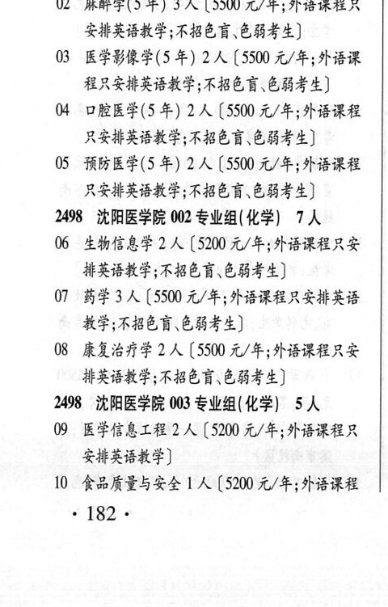
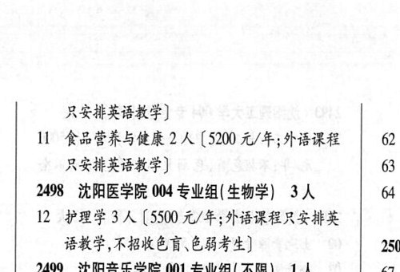

# 2498 沈阳医学院

- PDF页码：133
- 书内页码：182
- 专业组：4；专业条目：11

## 001专业组

- 选科要求：化学
- 招生计划：26 人
- 校验：review

| 专业代码 | 专业名称 | 计划人数 | 学费（元/年） | 备注/完整OCR内容 |
|---|---|---:|---:|---|
| 01 | 临床医学(5 年) | 17 | 5500 | 【5500 元/年;外语课程 只安排英语教学;不招色证、色弱考生] |
| 02 | “麻醉学(5年) | 3 | 5500 | 【5500 元/年;外语课程只 安排英语教学;不招色盲色弱考生] |
| 03 | 医学影像学(5 年) 2A ( |  | 5500 | 5500 元/年;外语课 程只安排英语教学;不招色盲.色弱考生] 4 口腔医学(5 年) 2A (5500 元/年;外语课程 只安排英语教学;不招色谨、色弱考生] |
| 05 | 预防医学(5 年) 2A ( |  | 5500 | 5500 元/年;外语课程 只安排英语教学;不招色盲色弱考生] |

<details><summary>本专业组OCR原文</summary>

```text
2498 沈阳医学院 001 专业组(化学) 26 人
01 临床医学(5 年) 17 人【5500 元/年;外语课程
只安排英语教学;不招色证、色弱考生]
02 “麻醉学(5年) 3 人【5500 元/年;外语课程只
安排英语教学;不招色盲色弱考生]
03 医学影像学(5 年) 2A (5500 元/年;外语课
程只安排英语教学;不招色盲.色弱考生]
4 口腔医学(5 年) 2A (5500 元/年;外语课程
只安排英语教学;不招色谨、色弱考生]
05 预防医学(5 年) 2A (5500 元/年;外语课程
只安排英语教学;不招色盲色弱考生]
```
</details>

## 002专业组

- 选科要求：化学
- 招生计划：7 人
- 校验：review

| 专业代码 | 专业名称 | 计划人数 | 学费（元/年） | 备注/完整OCR内容 |
|---|---|---:|---:|---|
| 06 | 生物信息学 | 2 | 5200 | 【5200 元/年;外语课程只安 HRBRF RBED EBSA) |
| 07 | HE 3A ( |  | 5500 | 5500 元/年;外语课程只安排英语 教学;不招色盲.色弱考生] |
| 08 | 康复治疗学 | 2 | 5500 | 【5500 元/年;外语课程只安 排英语教学;不招色盲色弱考生] |

<details><summary>本专业组OCR原文</summary>

```text
2498 沈阳医学院 002 专业组(化学) 7人
06 生物信息学 2 人【5200 元/年;外语课程只安
HRBRF RBED EBSA)
07 HE 3A (5500 元/年;外语课程只安排英语
教学;不招色盲.色弱考生]
08 康复治疗学 2 人【5500 元/年;外语课程只安
排英语教学;不招色盲色弱考生]
```
</details>

## 003专业组

- 选科要求：OCR未稳定识别
- 招生计划：OCR未稳定识别 人
- 校验：review

| 专业代码 | 专业名称 | 计划人数 | 学费（元/年） | 备注/完整OCR内容 |
|---|---|---:|---:|---|
| 09 | 医学信息工程 2 ( |  | 5200 | 5200 元/年;外语课程只 安排英语教学] |
| 10 | 食品质量与安全 1A ( |  | 5200 | 5200 元/年;外语课程 182+ 只安排英语教学] |
| 11 | 食品营养与健康 | 2 | 5200 | 【5200 元/年;外语课程 62 只安排英语教学] 6 |

<details><summary>本专业组OCR原文</summary>

```text
2498 沈阳医学院 003 专业组(化学| SA
09 医学信息工程 2 (5200 元/年;外语课程只
安排英语教学]
10 食品质量与安全 1A (5200 元/年;外语课程
182+
只安排英语教学]
11 食品营养与健康 2 人【5200 元/年;外语课程   62
只安排英语教学]              6
```
</details>

## 004专业组

- 选科要求：生物学
- 招生计划：3 人
- 校验：review

| 专业代码 | 专业名称 | 计划人数 | 学费（元/年） | 备注/完整OCR内容 |
|---|---|---:|---:|---|
| 12 | PREIA ( |  | 5500 | 5500 元/年; 外语课程只安排英 BHF ROKER CHF) 2501 |

<details><summary>本专业组OCR原文</summary>

```text
2498 沈阳医学院 004 专业组( 生物学) 3人    64
12 PREIA (5500 元/年; 外语课程只安排英
BHF ROKER CHF)         2501
```
</details>

## 附：院校完整OCR原文

```text
--- PDF第133页（书内第182页），第1栏 ---
2498 沈阳医学院 001 专业组(化学) 26 人
01 临床医学(5 年) 17 人【5500 元/年;外语课程
只安排英语教学;不招色证、色弱考生]
02 “麻醉学(5年) 3 人【5500 元/年;外语课程只
安排英语教学;不招色盲色弱考生]
03 医学影像学(5 年) 2A (5500 元/年;外语课
程只安排英语教学;不招色盲.色弱考生]
4 口腔医学(5 年) 2A (5500 元/年;外语课程
只安排英语教学;不招色谨、色弱考生]
05 预防医学(5 年) 2A (5500 元/年;外语课程
只安排英语教学;不招色盲色弱考生]
2498 沈阳医学院 002 专业组(化学) 7人
06 生物信息学 2 人【5200 元/年;外语课程只安
HRBRF RBED EBSA)
07 HE 3A (5500 元/年;外语课程只安排英语
教学;不招色盲.色弱考生]
08 康复治疗学 2 人【5500 元/年;外语课程只安
排英语教学;不招色盲色弱考生]
2498 沈阳医学院 003 专业组(化学| SA
09 医学信息工程 2 (5200 元/年;外语课程只
安排英语教学]
10 食品质量与安全 1A (5200 元/年;外语课程
182+

--- PDF第133页（书内第182页），第2栏 ---
只安排英语教学]
11 食品营养与健康 2 人【5200 元/年;外语课程   62
只安排英语教学]              6
2498 沈阳医学院 004 专业组( 生物学) 3人    64
12 PREIA (5500 元/年; 外语课程只安排英
BHF ROKER CHF)         2501
```

## 源图


