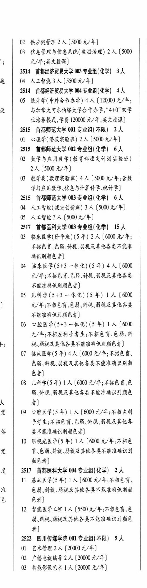

# 2517 首都医科大学

- PDF页码：134
- 书内页码：183
- 专业组：2；专业条目：9

## 003专业组

- 选科要求：化学
- 招生计划：15 人
- 校验：review

| 专业代码 | 专业名称 | 计划人数 | 学费（元/年） | 备注/完整OCR内容 |
|---|---|---:|---:|---|
| 03 | 临床医学(阶平班) (5 年) 2A ( |  | 6000 | 6000 元/年; \| ABED EB HL BARRERA 2 确识别颜色者 ( |
| 04 | 临床医学(5+3 一体化) (5 年) 4A ( |  | 6000 | 6000 元/年;不招色讶色弱、儿视、弱视及其他各类 ( 不能准确识别颜色者] |
| 05 | 儿科学(5+3 一体化) (5年) 1A (6000 \| 2 ] 元/年;不招色盲.色弱、镍视、弱视及其他各类 ( 不能准确识别颜色者 |  |  | 05 儿科学(5+3 一体化) (5年) 1A (6000 \| 2 ] 元/年;不招色盲.色弱、镍视、弱视及其他各类 ( 不能准确识别颜色者] |
| 06 | 口腔医学(5+3 一体化) (5 #) | 1 | 6000 | 【6000 元/年;不招左利手考生;不招色盲\色弱、镍 ie BR BABAWERA AAR A AES) 1 |
| 07 | 临床医学(5 年) 4A ( |  | 600 | 600 元/年;不招色育、 色弱、针视、弱视及其他各类不能准确识别颜 色者] 1 |
| 08 | 儿科学(5年) | 1 | 6000 | [6000 元/年;不招色盲.色 1 BHM BREWER ELAR AME 人 者] 党 09 口腔医学(5年) 1A (6000 元/年;不招左利 ] FHA ABER EB AR BARKS 从 类不能准确识别颜色者] |
| 10 | 根视光医学(5 年) | 1 | 6000 | 【6000 元/年;不招色 \| \| 觉 讶色弱、针视、弱视及其他各类不能准确识别 1 颜色者] |

<details><summary>本专业组OCR原文</summary>

```text
2517 ARENAS 003 专业组(化学) 15 人    1
03 临床医学(阶平班) (5 年) 2A (6000 元/年;   |
ABED EB HL BARRERA    2
确识别颜色者               (
04 临床医学(5+3 一体化) (5 年) 4A (6000
元/年;不招色讶色弱、儿视、弱视及其他各类   (
不能准确识别颜色者]
05 儿科学(5+3 一体化) (5年) 1A (6000 | 2
]     元/年;不招色盲.色弱、镍视、弱视及其他各类   (
不能准确识别颜色者]
06 口腔医学(5+3 一体化) (5 #) 1 人【6000
元/年;不招左利手考生;不招色盲\色弱、镍
ie     BR BABAWERA AAR A AES)    1
07 临床医学(5 年) 4A (600 元/年;不招色育、
色弱、针视、弱视及其他各类不能准确识别颜
色者]                   1
08 儿科学(5年) 1 人[6000 元/年;不招色盲.色   1
BHM BREWER ELAR AME
人     者]
党   09 口腔医学(5年) 1A (6000 元/年;不招左利   ]
FHA ABER EB AR BARKS
从     类不能准确识别颜色者]
10 根视光医学(5 年) 1 人【6000 元/年;不招色 | |
觉     讶色弱、针视、弱视及其他各类不能准确识别   1
颜色者]
```
</details>

## 004专业组

- 选科要求：化学
- 招生计划：2 人
- 校验：review

| 专业代码 | 专业名称 | 计划人数 | 学费（元/年） | 备注/完整OCR内容 |
|---|---|---:|---:|---|
| 11 | 基础医学(5年) 1A ( |  | 6000 | 6000 元/年;不招色言、 ] 准 色弱、针视、弱视及其他各类不能准确识别颜 色 色者] ] |
| 12 | 智能医学工程 1]人 |  | 5500 | 5500 元/年;不招色盲\色 弱、针视、絮视及其他各类不能准确识别颜色 4) |

<details><summary>本专业组OCR原文</summary>

```text
度 | 2517 首都医科大学 004 专业组(化学) 2人
11 基础医学(5年) 1A (6000 元/年;不招色言、   ]
准     色弱、针视、弱视及其他各类不能准确识别颜
色     色者]                   ]
12 智能医学工程 1]人[5500 元/年;不招色盲\色
弱、针视、絮视及其他各类不能准确识别颜色
4)
```
</details>

## 附：院校完整OCR原文

```text
--- PDF第134页（书内第183页），第2栏 ---
2517 ARENAS 003 专业组(化学) 15 人    1
03 临床医学(阶平班) (5 年) 2A (6000 元/年;   |
ABED EB HL BARRERA    2
确识别颜色者               (
04 临床医学(5+3 一体化) (5 年) 4A (6000
元/年;不招色讶色弱、儿视、弱视及其他各类   (
不能准确识别颜色者]
05 儿科学(5+3 一体化) (5年) 1A (6000 | 2
]     元/年;不招色盲.色弱、镍视、弱视及其他各类   (
不能准确识别颜色者]
06 口腔医学(5+3 一体化) (5 #) 1 人【6000
元/年;不招左利手考生;不招色盲\色弱、镍
ie     BR BABAWERA AAR A AES)    1
07 临床医学(5 年) 4A (600 元/年;不招色育、
色弱、针视、弱视及其他各类不能准确识别颜
色者]                   1
08 儿科学(5年) 1 人[6000 元/年;不招色盲.色   1
BHM BREWER ELAR AME
人     者]
党   09 口腔医学(5年) 1A (6000 元/年;不招左利   ]
FHA ABER EB AR BARKS
从     类不能准确识别颜色者]
10 根视光医学(5 年) 1 人【6000 元/年;不招色 | |
觉     讶色弱、针视、弱视及其他各类不能准确识别   1
颜色者]
度 | 2517 首都医科大学 004 专业组(化学) 2人
11 基础医学(5年) 1A (6000 元/年;不招色言、   ]
准     色弱、针视、弱视及其他各类不能准确识别颜
色     色者]                   ]
12 智能医学工程 1]人[5500 元/年;不招色盲\色
弱、针视、絮视及其他各类不能准确识别颜色
4)
```

## 源图

