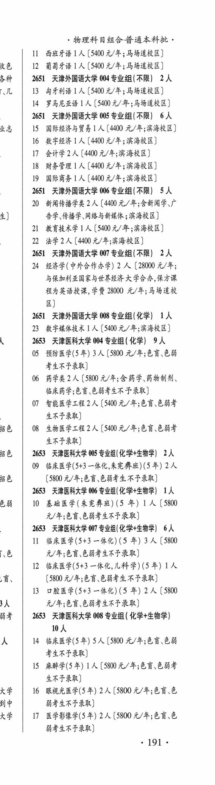
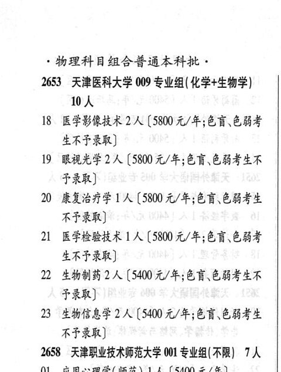

# 2653 天津医科大学

- PDF页码：142, 143
- 书内页码：191, 192
- 专业组：6；专业条目：18

## 004专业组

- 选科要求：WF
- 招生计划：7 人
- 校验：sum-corrected

| 专业代码 | 专业名称 | 计划人数 | 学费（元/年） | 备注/完整OCR内容 |
|---|---|---:|---:|---|
| 05 | 预防医学(5年) | 3 |  | (5800 4/4; 68,68 考生不予录取] |
| 06 | 药学类 | 2 | 5800 | [5800 元/年;含药学、药物制剂、 临床药学;色盲 、色弱考生不子录取] |
| 07 | 智能医学工程 | 2 | 5400 | 【5400 4/4;68 CBF ARF RR) i 08 生物医学工程 2 (5400 元/年;色盲\色弱考 生不予录取] |

<details><summary>本专业组OCR原文</summary>

```text
2653 ”天津医科大学 004 专业组 ( WF) 9 人
05 预防医学(5年) 3 人 (5800 4/4; 68,68
考生不予录取]
06 药学类2 人[5800 元/年;含药学、药物制剂、
临床药学;色盲 、色弱考生不子录取]
07 智能医学工程2人【5400 4/4;68 CBF
ARF RR)
i 08 生物医学工程 2 (5400 元/年;色盲\色弱考
生不予录取]
```
</details>

## 005专业组

- 选科要求：OCR未稳定识别
- 招生计划：2 人
- 校验：ok

| 专业代码 | 专业名称 | 计划人数 | 学费（元/年） | 备注/完整OCR内容 |
|---|---|---:|---:|---|
| 09 | 临床医学(5+3 AK, REF) (SH) | 2 |  | ， (5800 4/#;88 E84 * AFRR) |

<details><summary>本专业组OCR原文</summary>

```text
， | 2653 天津医科大学 005 专业组化学+生物学| 2人 ，     (5800 4/#;88 E84 * AFRR)
09 临床医学(5+3 AK, REF) (SH) 2 人
，     (5800 4/#;88 E84 * AFRR)
```
</details>

## 006专业组

- 选科要求：OCR未稳定识别
- 招生计划：1 人
- 校验：sum-corrected

| 专业代码 | 专业名称 | 计划人数 | 学费（元/年） | 备注/完整OCR内容 |
|---|---|---:|---:|---|
| 10 | 基础医学(朱宪兽班) (5 年) | 1 | 5800 | 【5800 元/年;色育\色弱考生不予录取] |

<details><summary>本专业组OCR原文</summary>

```text
2653 天津医科大学 006 专业组(化学+生物学| 工人
10 基础医学(朱宪兽班) (5 年) 1 人【5800
元/年;色育\色弱考生不予录取]
```
</details>

## 007专业组

- 选科要求：化学+生物学
- 招生计划：6 人
- 校验：review

| 专业代码 | 专业名称 | 计划人数 | 学费（元/年） | 备注/完整OCR内容 |
|---|---|---:|---:|---|
| 11 | 临床医学(5+3 一体化) (5 年) 3A (5800 i 元/年;色盲\色弱考生不也录取 |  |  | 11 临床医学(5+3 一体化) (5 年) 3A (5800 i 元/年;色盲\色弱考生不也录取] |
| 12 | 临床医学(5+3 一体化,儿科学) (5年) LA |  | 5800 | 5800 元/年;色盲、色弱考生不予录取] |
| 13 | 口腔医学(5+3 一体化) (5 年) 2A ( |  | 5800 | 5800 元/年;色谨\色弱考生不予录取] |

<details><summary>本专业组OCR原文</summary>

```text
2653 天津医科大学 007 专业组(化学+生物学) 6人
11 临床医学(5+3 一体化) (5 年) 3A (5800
i     元/年;色盲\色弱考生不也录取]
12 临床医学(5+3 一体化,儿科学) (5年) LA
[5800 元/年;色盲、色弱考生不予录取]
13 口腔医学(5+3 一体化) (5 年) 2A (5800
元/年;色谨\色弱考生不予录取]
```
</details>

## 008专业组

- 选科要求：化学+生物学
- 招生计划：OCR未稳定识别 人
- 校验：review

| 专业代码 | 专业名称 | 计划人数 | 学费（元/年） | 备注/完整OCR内容 |
|---|---|---:|---:|---|
| 10 | 人 |  |  | 10人 |
| 14 | 临床医学(5 年) | 5 | 5800 | (5800 元/年;色盲、色弱 考生不予录取] |
| 15 | 麻醉学(5年) LA (5800 0/4; 68 684 生不子录取] } 16 限视光医学(5年) | 2 | 5800 | [5800 4/#;68 8 弱考生不予录取] 4 17 医学影像学(5 年) 2A (5800 元/年;色盲\色 BSLAF RR) 191+ 物理科目组合普通本科批。 |

<details><summary>本专业组OCR原文</summary>

```text
| 2653 天津医科大学 008 专业组 ( 化学+生物学)
10人
14 临床医学(5 年) 5 人 (5800 元/年;色盲、色弱
考生不予录取]
15 麻醉学(5年) LA (5800 0/4; 68 684
生不子录取]
}   16 限视光医学(5年) 2 人[5800 4/#;68 8
弱考生不予录取]
4   17 医学影像学(5 年) 2A (5800 元/年;色盲\色
BSLAF RR)
191+
物理科目组合普通本科批。
```
</details>

## 009专业组

- 选科要求：化学+生物学
- 招生计划：OCR未稳定识别 人
- 校验：review

| 专业代码 | 专业名称 | 计划人数 | 学费（元/年） | 备注/完整OCR内容 |
|---|---|---:|---:|---|
| 10 | 人 |  |  | 10人 |
| 18 | 医学影像技术 | 2 | 5800 | [5800 元/年;色盲色弱考 ERF RRB) |
| 19 | RMAF 2A ( |  | 5800 | 5800 元/年;色盲色弱考生不 FRB) |
| 20 | 康复治疗学 | 1 |  | 【5800 4/4; 68 CBSE 不予录取] |
| 21 | 医学检验技术 | 1 | 5800 | 【5800 元/年;色盲、色弱考 生不予录取] |
| 22 | 生物制药 | 2 | 5400 | [5400元/年;色育\色弱考生不 FRR) |
| 23 | 生物信息学 | 2 | 5400 | [5400 元/年;色盲色弱考生 不予录取] |

<details><summary>本专业组OCR原文</summary>

```text
2653 ”天津医科大学 009 专业组( 化学+生物学)
10人
18 医学影像技术 2 人[5800 元/年;色盲色弱考
ERF RRB)
19 RMAF 2A (5800 元/年;色盲色弱考生不
FRB)
20 康复治疗学1人【5800 4/4; 68 CBSE
不予录取]
21 医学检验技术 1 人【5800 元/年;色盲、色弱考
生不予录取]
22 生物制药2 人 [5400元/年;色育\色弱考生不
FRR)
23 生物信息学 2 人[5400 元/年;色盲色弱考生
不予录取]
```
</details>

## 附：院校完整OCR原文

```text
--- PDF第142页（书内第191页），第3栏 ---
2653 ”天津医科大学 004 专业组 ( WF) 9 人
05 预防医学(5年) 3 人 (5800 4/4; 68,68
考生不予录取]
06 药学类2 人[5800 元/年;含药学、药物制剂、
临床药学;色盲 、色弱考生不子录取]
07 智能医学工程2人【5400 4/4;68 CBF
ARF RR)
i 08 生物医学工程 2 (5400 元/年;色盲\色弱考
生不予录取]
， | 2653 天津医科大学 005 专业组化学+生物学| 2人
09 临床医学(5+3 AK, REF) (SH) 2 人
，     (5800 4/#;88 E84 * AFRR)
2653 天津医科大学 006 专业组(化学+生物学| 工人
10 基础医学(朱宪兽班) (5 年) 1 人【5800
元/年;色育\色弱考生不予录取]
2653 天津医科大学 007 专业组(化学+生物学) 6人
11 临床医学(5+3 一体化) (5 年) 3A (5800
i     元/年;色盲\色弱考生不也录取]
12 临床医学(5+3 一体化,儿科学) (5年) LA
[5800 元/年;色盲、色弱考生不予录取]
13 口腔医学(5+3 一体化) (5 年) 2A (5800
元/年;色谨\色弱考生不予录取]
| 2653 天津医科大学 008 专业组 ( 化学+生物学)
10人
14 临床医学(5 年) 5 人 (5800 元/年;色盲、色弱
考生不予录取]
15 麻醉学(5年) LA (5800 0/4; 68 684
生不子录取]
}   16 限视光医学(5年) 2 人[5800 4/#;68 8
弱考生不予录取]
4   17 医学影像学(5 年) 2A (5800 元/年;色盲\色
BSLAF RR)
191+

--- PDF第143页（书内第192页），第1栏 ---
物理科目组合普通本科批。
2653 ”天津医科大学 009 专业组( 化学+生物学)
10人
18 医学影像技术 2 人[5800 元/年;色盲色弱考
ERF RRB)
19 RMAF 2A (5800 元/年;色盲色弱考生不
FRB)
20 康复治疗学1人【5800 4/4; 68 CBSE
不予录取]
21 医学检验技术 1 人【5800 元/年;色盲、色弱考
生不予录取]
22 生物制药2 人 [5400元/年;色育\色弱考生不
FRR)
23 生物信息学 2 人[5400 元/年;色盲色弱考生
不予录取]
```

## 源图


