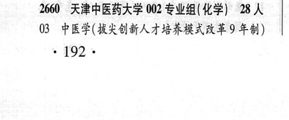
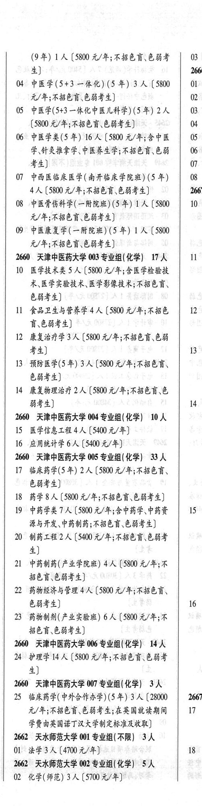

# 2660 天津中医药大学

- PDF页码：143
- 书内页码：192
- 专业组：7；专业条目：24

## 001专业组

- 选科要求：不限
- 招生计划：5 人
- 校验：sum-corrected

| 专业代码 | 专业名称 | 计划人数 | 学费（元/年） | 备注/完整OCR内容 |
|---|---|---:|---:|---|
| 01 | 公共管理类 | 3 | 4400 | 【4400 元/年;含公共事业管 理、健康服务与管理;不招不能准确识别红、 黄\绿\蓝\此任何一种颜色的考生] |
| 02 | 传播学 | 2 | 4400 | [4400元/年] |

<details><summary>本专业组OCR原文</summary>

```text
2660 ”天津中医药大学 001 专业组(不限】 SA 理、健康服务与管理;不招不能准确识别红、
Ol 公共管理类 3 人【4400 元/年;含公共事业管
理、健康服务与管理;不招不能准确识别红、
黄\绿\蓝\此任何一种颜色的考生]
O2 传播学2人 [4400元/年]
```
</details>

## 002专业组

- 选科要求：化学
- 招生计划：28 人
- 校验：review

| 专业代码 | 专业名称 | 计划人数 | 学费（元/年） | 备注/完整OCR内容 |
|---|---|---:|---:|---|
| 03 | 中医学(拔失创新人才培养模式改革 9 年制) .192 . (9年) LA (5800 2/4; KBE CBF 03: 4) 2666 |  |  | 03 中医学(拔失创新人才培养模式改革 9 年制) .192 . (9年) LA (5800 2/4; KBE CBF 03: 4) 2666 |
| 04 | 中医学(5+3 一体化) (5 年) 3A (5800 \| 0l 元/年;不招色盲色弱考生] 0 |  |  | 04 中医学(5+3 一体化) (5 年) 3A (5800 \| 0l 元/年;不招色盲色弱考生] 0 |
| 05 | 中医学(5+3 一体化中医儿科学) (5 年) 2A 0 ( |  | 5800 | 5800 元/年;不招色盲、色弱考生] 4 |
| 06 | ”中医学类(5 年) 16 A ( |  | 5800 | 5800 元/年;含中医 0 学针灸推拿学、中医养生学;不招色盲、色弱 06 考生] 0 |
| 07 | 中西医临床医学(南开临床学院班) (5 年) 08 4K |  | 5800 | 5800 元/年;不招色盲色弱考生] 2667 |
| 08 | 中医骨伤科学(一附院班) (5 年) | 1 |  | 【5800 10 元/年;不招色育、色弱考生] |
| 09 | 中医康复学(一附院班) (5 年) | 1 |  | 【5800 WF FRED EHF 4) |

<details><summary>本专业组OCR原文</summary>

```text
2660 天津中医药大学 002 专业组(化学) 28 人
03 中医学(拔失创新人才培养模式改革 9 年制)
.192 .
(9年) LA (5800 2/4; KBE CBF   03:
4)                   2666
04 中医学(5+3 一体化) (5 年) 3A (5800 | 0l
元/年;不招色盲色弱考生]          0
05 中医学(5+3 一体化中医儿科学) (5 年) 2A   0
(5800 元/年;不招色盲、色弱考生]       4
06 ”中医学类(5 年) 16 A (5800 元/年;含中医   0
学针灸推拿学、中医养生学;不招色盲、色弱   06
考生]                  0
07 中西医临床医学(南开临床学院班) (5 年)   08
4K [5800 元/年;不招色盲色弱考生]     2667
08 中医骨伤科学(一附院班) (5 年) 1 人【5800   10
元/年;不招色育、色弱考生]
09 中医康复学(一附院班) (5 年) 1 人【5800
WF FRED EHF 4)
```
</details>

## 003专业组

- 选科要求：化学
- 招生计划：17 人
- 校验：review

| 专业代码 | 专业名称 | 计划人数 | 学费（元/年） | 备注/完整OCR内容 |
|---|---|---:|---:|---|
| 10 | 医学技术类 SA ( |  | 5800 | 5800 元/年;含医学检验技 术、医学实验技术、医学影像技术;不招色育、 色弱考生] |
| 11 | 食品卫生与营养学 | 4 | 5800 | 【5800 元/年;不招色 12 盲\色弱考生] |
| 12 | 康复治疗学 | 3 |  | 【5800 4/4; FBER ES 1 考生] 1353 |
| 13 | 预防医学(5 年) 3A ( |  | 5800 | 5800 元/年;不招色盲、 { 色弱考生] : |
| 14 | 康复物理治疗 | 2 | 5800 | 【5800 元/年;不招色育、色 BHR) 14 . |

<details><summary>本专业组OCR原文</summary>

```text
2660 天津中医药大学 003 专业组(化学) 17 人   I
10 医学技术类 SA (5800 元/年;含医学检验技
术、医学实验技术、医学影像技术;不招色育、
色弱考生]
11 食品卫生与营养学4 人【5800 元/年;不招色   12
盲\色弱考生]
12 康复治疗学3 人【5800 4/4; FBER ES     1
考生]                  1353
13 预防医学(5 年) 3A (5800 元/年;不招色盲、     {
色弱考生]                  :
14 康复物理治疗 2 人【5800 元/年;不招色育、色
BHR)                 14 .
```
</details>

## 004专业组

- 选科要求：化学
- 招生计划：10 人
- 校验：ok

| 专业代码 | 专业名称 | 计划人数 | 学费（元/年） | 备注/完整OCR内容 |
|---|---|---:|---:|---|
| 15 | 医学信息工程 | 4 | 5400 | 【5400 元/年] |
| 16 | 应用统计学 | 6 | 5400 | [5400元/年] |

<details><summary>本专业组OCR原文</summary>

```text
2660 天津中医药大学 004 专业组(化学) 10 人
15 医学信息工程4人【5400 元/年]
16 应用统计学6人 [5400元/年]
```
</details>

## 005专业组

- 选科要求：化学
- 招生计划：33 人
- 校验：review

| 专业代码 | 专业名称 | 计划人数 | 学费（元/年） | 备注/完整OCR内容 |
|---|---|---:|---:|---|
| 17 | 临床药学(5 年) 2A ( |  | 5800 | 5800 元/年;不招色言、 色弱考生] 1 |
| 18 | 药学 | 8 |  | [5800 A/F; ABER CHF) : |
| 19 | 中药学类了人 |  | 5800 | 5800 元/年;含中药学、中药资 IS. 源与开发中药制药;不招色盲.色弱考生] ? |
| 20 | 制药工程 | 2 | 5400 | 【5400 元/年;不招包育\色弱考 和 生] |
| 21 | 中药制药(产业学院班) | 4 | 5800 | 【5800 元/年;不 和 BEG EHF 4) 4 2 药物经济与管理 4 人【5800 元/年;不招色育、 和 色弱考生] 16 3 |
| 23 | 药物制剂(产业实验班) 6 A ( |  | 5800 | 5800 元/年;不 招色盲色弱考生] |

<details><summary>本专业组OCR原文</summary>

```text
2660 天津中医药大学 005 专业组(化学) 33 人     i
17 临床药学(5 年) 2A (5800 元/年;不招色言、
色弱考生]                  1
18 药学8人[5800 A/F; ABER CHF)     :
19 中药学类了人【5800 元/年;含中药学、中药资   IS.
源与开发中药制药;不招色盲.色弱考生]      ?
20 制药工程2 人【5400 元/年;不招包育\色弱考     和
生]
21 中药制药(产业学院班) 4 人【5800 元/年;不    和
BEG EHF 4)               4
2 药物经济与管理 4 人【5800 元/年;不招色育、     和
色弱考生]                 16 3
23 药物制剂(产业实验班) 6 A (5800 元/年;不
招色盲色弱考生]
```
</details>

## 006专业组

- 选科要求：化学
- 招生计划：14 人
- 校验：ok

| 专业代码 | 专业名称 | 计划人数 | 学费（元/年） | 备注/完整OCR内容 |
|---|---|---:|---:|---|
| 24 | 护理学 | 14 | 5800 | [5800 元/年;不招色盲色弱考 ( 4) 1 |

<details><summary>本专业组OCR原文</summary>

```text
2660 天津中医药大学 006 专业组(化学) 14 人
24 护理学14 人[5800 元/年;不招色盲色弱考     (
4)                    1
```
</details>

## 007专业组

- 选科要求：化学
- 招生计划：3 人
- 校验：ok

| 专业代码 | 专业名称 | 计划人数 | 学费（元/年） | 备注/完整OCR内容 |
|---|---|---:|---:|---|
| 25 | 临床药学(中外合作办学) (5年) | 3 | 2667 | 【28000 \| 2667 元/年;不招色盲\色弱考生;在英国就读期间 17 \| 学费由英国诺丁汉大学制定标准及收取] j |

<details><summary>本专业组OCR原文</summary>

```text
2660 ”天津中医药大学 007 专业组(化学) 3 人
25 临床药学(中外合作办学) (5年) 3 人【28000 | 2667
元/年;不招色盲\色弱考生;在英国就读期间   17 |
学费由英国诺丁汉大学制定标准及收取]              j
```
</details>

## 附：院校完整OCR原文

```text
--- PDF第143页（书内第192页），第1栏 ---
2660 ”天津中医药大学 001 专业组(不限】 SA
Ol 公共管理类 3 人【4400 元/年;含公共事业管
理、健康服务与管理;不招不能准确识别红、
黄\绿\蓝\此任何一种颜色的考生]
O2 传播学2人 [4400元/年]
2660 天津中医药大学 002 专业组(化学) 28 人
03 中医学(拔失创新人才培养模式改革 9 年制)
.192 .

--- PDF第143页（书内第192页），第2栏 ---
(9年) LA (5800 2/4; KBE CBF   03:
4)                   2666
04 中医学(5+3 一体化) (5 年) 3A (5800 | 0l
元/年;不招色盲色弱考生]          0
05 中医学(5+3 一体化中医儿科学) (5 年) 2A   0
(5800 元/年;不招色盲、色弱考生]       4
06 ”中医学类(5 年) 16 A (5800 元/年;含中医   0
学针灸推拿学、中医养生学;不招色盲、色弱   06
考生]                  0
07 中西医临床医学(南开临床学院班) (5 年)   08
4K [5800 元/年;不招色盲色弱考生]     2667
08 中医骨伤科学(一附院班) (5 年) 1 人【5800   10
元/年;不招色育、色弱考生]
09 中医康复学(一附院班) (5 年) 1 人【5800
WF FRED EHF 4)
2660 天津中医药大学 003 专业组(化学) 17 人   I
10 医学技术类 SA (5800 元/年;含医学检验技
术、医学实验技术、医学影像技术;不招色育、
色弱考生]
11 食品卫生与营养学4 人【5800 元/年;不招色   12
盲\色弱考生]
12 康复治疗学3 人【5800 4/4; FBER ES     1
考生]                  1353
13 预防医学(5 年) 3A (5800 元/年;不招色盲、     {
色弱考生]                  :
14 康复物理治疗 2 人【5800 元/年;不招色育、色
BHR)                 14 .
2660 天津中医药大学 004 专业组(化学) 10 人
15 医学信息工程4人【5400 元/年]
16 应用统计学6人 [5400元/年]
2660 天津中医药大学 005 专业组(化学) 33 人     i
17 临床药学(5 年) 2A (5800 元/年;不招色言、
色弱考生]                  1
18 药学8人[5800 A/F; ABER CHF)     :
19 中药学类了人【5800 元/年;含中药学、中药资   IS.
源与开发中药制药;不招色盲.色弱考生]      ?
20 制药工程2 人【5400 元/年;不招包育\色弱考     和
生]
21 中药制药(产业学院班) 4 人【5800 元/年;不    和
BEG EHF 4)               4
2 药物经济与管理 4 人【5800 元/年;不招色育、     和
色弱考生]                 16 3
23 药物制剂(产业实验班) 6 A (5800 元/年;不
招色盲色弱考生]
2660 天津中医药大学 006 专业组(化学) 14 人
24 护理学14 人[5800 元/年;不招色盲色弱考     (
4)                    1
2660 ”天津中医药大学 007 专业组(化学) 3 人
25 临床药学(中外合作办学) (5年) 3 人【28000 | 2667
元/年;不招色盲\色弱考生;在英国就读期间   17 |
学费由英国诺丁汉大学制定标准及收取]              j
```

## 源图


