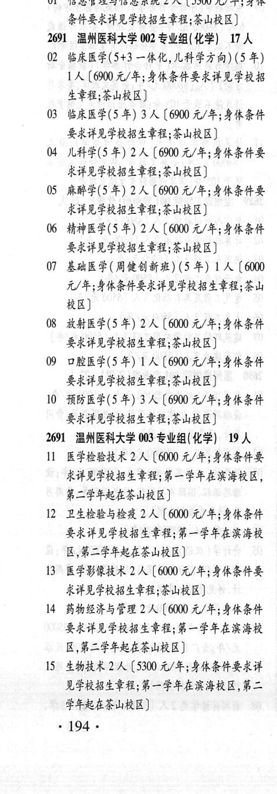
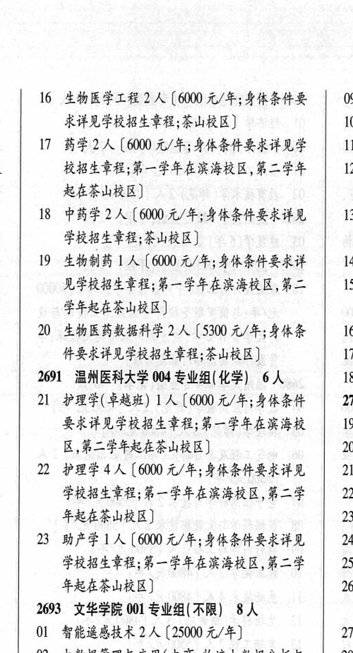

# 2691 温州医科大学

- PDF页码：145
- 书内页码：194
- 专业组：4；专业条目：23

## 001专业组

- 选科要求：不限
- 招生计划：2 人
- 校验：review

| 专业代码 | 专业名称 | 计划人数 | 学费（元/年） | 备注/完整OCR内容 |
|---|---|---:|---:|---|
| 01 | 信息管理与信息系统 2 ( |  | 5300 | 5300 元/年;身体 条件有要求详见学校招生章程;茶山校区] |

<details><summary>本专业组OCR原文</summary>

```text
2691 温州医科大学 001 专业组(不限) 2人
01 信息管理与信息系统 2 (5300 元/年;身体
条件有要求详见学校招生章程;茶山校区]
```
</details>

## 002专业组

- 选科要求：化学
- 招生计划：17 人
- 校验：review

| 专业代码 | 专业名称 | 计划人数 | 学费（元/年） | 备注/完整OCR内容 |
|---|---|---:|---:|---|
| 02 | 临床医学(5+3 一体化,儿科学方向) (5 年) | 1 | 6900 | [6900元/年;身体条件要求详见学校招 生章程;茶山校区] |
| 03 | 临床医学(5 年) | 3 | 6900 | 【6900 元/年;身体条件 要求详见学校招生章程;茶山校区] |
| 04 | 儿科学(5年) | 2 | 6900 | 【6900 元/年;身体条件要 求详见学校招生章程;茶山校区] |
| 05 | 麻醉学(5 年) 2A ( |  | 6900 | 6900 元/年;身体条件要 求详见学校招生章程;茶山校区] |
| 06 | 精神医学(5 年) | 2 | 6000 | 【6000 元/年;身体条件 要求详见学校招生章程;茶山校区] |
| 07 | 基础医学(周健创新班) (5 年) | 1 | 6000 | 【6000 元/年;身体条件要求详见学校招生章程;茶山 RE) |
| 08 | 放射医学(5 年) 2A ( |  | 6000 | 6000 元/年;身体条件 要求详见学校招生章程;茶山校区] |
| 09 | 口腔医学(5 年) | 1 | 6900 | 【6900 元/年;身体条件 要求详见学校招生章程;茶山校区] |
| 10 | 预防医学(5 年) | 3 | 6900 | 【6900 元/年;身体条件 有要求详见学校招生章程;茶山校区] |

<details><summary>本专业组OCR原文</summary>

```text
2691 温州医科大学 002 专业组(化学) 17 人
02 临床医学(5+3 一体化,儿科学方向) (5 年)
1人[6900元/年;身体条件要求详见学校招
生章程;茶山校区]
03 临床医学(5 年) 3 人【6900 元/年;身体条件
要求详见学校招生章程;茶山校区]
04 儿科学(5年) 2 人【6900 元/年;身体条件要
求详见学校招生章程;茶山校区]
05 麻醉学(5 年) 2A (6900 元/年;身体条件要
求详见学校招生章程;茶山校区]
06 精神医学(5 年) 2 人【6000 元/年;身体条件
要求详见学校招生章程;茶山校区]
07 基础医学(周健创新班) (5 年) 1 人【6000
元/年;身体条件要求详见学校招生章程;茶山
RE)
08 放射医学(5 年) 2A (6000 元/年;身体条件
要求详见学校招生章程;茶山校区]
09 口腔医学(5 年) 1 人【6900 元/年;身体条件
要求详见学校招生章程;茶山校区]
10 预防医学(5 年) 3 人【6900 元/年;身体条件
有要求详见学校招生章程;茶山校区]
```
</details>

## 003专业组

- 选科要求：化学
- 招生计划：19 人
- 校验：review

| 专业代码 | 专业名称 | 计划人数 | 学费（元/年） | 备注/完整OCR内容 |
|---|---|---:|---:|---|
| 11 | 医学检验技术 | 2 | 6000 | 【6000 元/年;身体条件要 求详见学校招生章程;第一学年在滨海校区， 第二学年起在茶山校区] |
| 12 | 卫生检验与检疫 | 2 | 6000 | 【6000 元/年;身体条件 要求详见学校招生章程;第一学年在滨海校 区,第二学年起在茶山校区)] |
| 13 | 医学影像技术 | 2 | 6000 | 【6000 元/年;身体条件要 求详见学校招生章程;茶山校区] |
| 14 | 药物经济与管理 | 2 | 6000 | 【6000 元/年;身体条件 有要求详见学校招生章程;第一学年在滨海校 区,第二学年起在茶山校区] |
| 15 | 生物技术 | 2 | 5300 | 【5300 元/年;身体条件要求详 见学校招生章程;第一学年在滨海校区,第二 学年起在茶山校区] .194 ， |
| 16 | 生物医学工程 | 2 | 6000 | 【6000 元/年;身体条件要 09 求详见学校招生章程;茶山校区] 10 |
| 17 | 药学 | 2 | 6000 | 【6000 元/年;身体条件要求详见学 11 校招生章程;第一学年在滨海校区,第二学年 12 起在茶山校区 |
| 18 | 中药学 | 2 | 6000 | [6000 元/年;身体条件要求详见 13 学校招生章程;茶山校区] |
| 19 | 生物制药 ] 人 |  | 6000 | 6000 元/年;身体条件要求详 14 见学校招生章程;第一学年在滨海校区,第二 15 学年起在茶山校区] |
| 20 | 生物医药数据科学 | 2 | 5300 | 【5300 元/年;身体条 16 件要求详见学校招生章程;茶山校区] 17 |

<details><summary>本专业组OCR原文</summary>

```text
269%1 温州医科大学 003 专业组(化学) 19 人
11 医学检验技术 2 人【6000 元/年;身体条件要
求详见学校招生章程;第一学年在滨海校区，
第二学年起在茶山校区]
12 卫生检验与检疫 2 人【6000 元/年;身体条件
要求详见学校招生章程;第一学年在滨海校
区,第二学年起在茶山校区)]
13 医学影像技术 2 人【6000 元/年;身体条件要
求详见学校招生章程;茶山校区]
14 药物经济与管理 2 人【6000 元/年;身体条件
有要求详见学校招生章程;第一学年在滨海校
区,第二学年起在茶山校区]
15 生物技术 2 人【5300 元/年;身体条件要求详
见学校招生章程;第一学年在滨海校区,第二
学年起在茶山校区]
.194 ，
16 生物医学工程 2 人【6000 元/年;身体条件要   09
求详见学校招生章程;茶山校区]        10
17 药学2 人【6000 元/年;身体条件要求详见学   11
校招生章程;第一学年在滨海校区,第二学年   12
起在茶山校区
18 中药学2 人[6000 元/年;身体条件要求详见   13
学校招生章程;茶山校区]
19 生物制药 ] 人【6000 元/年;身体条件要求详   14
见学校招生章程;第一学年在滨海校区,第二   15
学年起在茶山校区]
20 生物医药数据科学 2 人【5300 元/年;身体条   16
件要求详见学校招生章程;茶山校区]      17
```
</details>

## 004专业组

- 选科要求：化学
- 招生计划：6 人
- 校验：review

| 专业代码 | 专业名称 | 计划人数 | 学费（元/年） | 备注/完整OCR内容 |
|---|---|---:|---:|---|
| 21 | 护理学( 卓越班) | 1 | 6000 | 【6000 元/年;身体条件 270 要求详见学校招生章程;第一学年在滨海校 19 区,第二学年起在茶山校区] 20 |
| 22 | 护理学 | 4 | 6000 | 【6000 元/年;身体条件要求详见 21 学校招生章程;第一学年在滨海校区,第二学 2 年起在茶山校区] 23 |
| 23 | EF LA ( |  | 6000 | 6000 元/年;身体条件要求详见 24 学校招生章程;第一学年在滨海校区,第二学 25 年起在茶山校区] 26 |

<details><summary>本专业组OCR原文</summary>

```text
2691 温州医科大学 004 专业组(化学) 6人    18
21 护理学( 卓越班) 1 人【6000 元/年;身体条件   270
要求详见学校招生章程;第一学年在滨海校   19
区,第二学年起在茶山校区]          20
22 护理学4人【6000 元/年;身体条件要求详见   21
学校招生章程;第一学年在滨海校区,第二学   2
年起在茶山校区]              23
23 EF LA (6000 元/年;身体条件要求详见   24
学校招生章程;第一学年在滨海校区,第二学   25
年起在茶山校区]              26
```
</details>

## 附：院校完整OCR原文

```text
--- PDF第145页（书内第194页），第1栏 ---
2691 温州医科大学 001 专业组(不限) 2人
01 信息管理与信息系统 2 (5300 元/年;身体
条件有要求详见学校招生章程;茶山校区]
2691 温州医科大学 002 专业组(化学) 17 人
02 临床医学(5+3 一体化,儿科学方向) (5 年)
1人[6900元/年;身体条件要求详见学校招
生章程;茶山校区]
03 临床医学(5 年) 3 人【6900 元/年;身体条件
要求详见学校招生章程;茶山校区]
04 儿科学(5年) 2 人【6900 元/年;身体条件要
求详见学校招生章程;茶山校区]
05 麻醉学(5 年) 2A (6900 元/年;身体条件要
求详见学校招生章程;茶山校区]
06 精神医学(5 年) 2 人【6000 元/年;身体条件
要求详见学校招生章程;茶山校区]
07 基础医学(周健创新班) (5 年) 1 人【6000
元/年;身体条件要求详见学校招生章程;茶山
RE)
08 放射医学(5 年) 2A (6000 元/年;身体条件
要求详见学校招生章程;茶山校区]
09 口腔医学(5 年) 1 人【6900 元/年;身体条件
要求详见学校招生章程;茶山校区]
10 预防医学(5 年) 3 人【6900 元/年;身体条件
有要求详见学校招生章程;茶山校区]
269%1 温州医科大学 003 专业组(化学) 19 人
11 医学检验技术 2 人【6000 元/年;身体条件要
求详见学校招生章程;第一学年在滨海校区，
第二学年起在茶山校区]
12 卫生检验与检疫 2 人【6000 元/年;身体条件
要求详见学校招生章程;第一学年在滨海校
区,第二学年起在茶山校区)]
13 医学影像技术 2 人【6000 元/年;身体条件要
求详见学校招生章程;茶山校区]
14 药物经济与管理 2 人【6000 元/年;身体条件
有要求详见学校招生章程;第一学年在滨海校
区,第二学年起在茶山校区]
15 生物技术 2 人【5300 元/年;身体条件要求详
见学校招生章程;第一学年在滨海校区,第二
学年起在茶山校区]
.194 ，

--- PDF第145页（书内第194页），第2栏 ---
16 生物医学工程 2 人【6000 元/年;身体条件要   09
求详见学校招生章程;茶山校区]        10
17 药学2 人【6000 元/年;身体条件要求详见学   11
校招生章程;第一学年在滨海校区,第二学年   12
起在茶山校区
18 中药学2 人[6000 元/年;身体条件要求详见   13
学校招生章程;茶山校区]
19 生物制药 ] 人【6000 元/年;身体条件要求详   14
见学校招生章程;第一学年在滨海校区,第二   15
学年起在茶山校区]
20 生物医药数据科学 2 人【5300 元/年;身体条   16
件要求详见学校招生章程;茶山校区]      17
2691 温州医科大学 004 专业组(化学) 6人    18
21 护理学( 卓越班) 1 人【6000 元/年;身体条件   270
要求详见学校招生章程;第一学年在滨海校   19
区,第二学年起在茶山校区]          20
22 护理学4人【6000 元/年;身体条件要求详见   21
学校招生章程;第一学年在滨海校区,第二学   2
年起在茶山校区]              23
23 EF LA (6000 元/年;身体条件要求详见   24
学校招生章程;第一学年在滨海校区,第二学   25
年起在茶山校区]              26
```

## 源图


