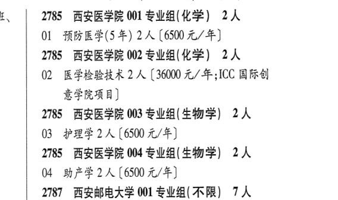

# 2785 西安医学院

- PDF页码：154
- 书内页码：203
- 专业组：4；专业条目：4

## 001专业组

- 选科要求：化学
- 招生计划：2 人
- 校验：ok

| 专业代码 | 专业名称 | 计划人数 | 学费（元/年） | 备注/完整OCR内容 |
|---|---|---:|---:|---|
| 01 | 预防医学(5 年) | 2 | 6500 | 【6500 元/年] |

<details><summary>本专业组OCR原文</summary>

```text
2785 ”西安医学院 001 专业组(化学) 2人
01 预防医学(5 年) 2 人【6500 元/年]
```
</details>

## 002专业组

- 选科要求：化学
- 招生计划：2 人
- 校验：ok

| 专业代码 | 专业名称 | 计划人数 | 学费（元/年） | 备注/完整OCR内容 |
|---|---|---:|---:|---|
| 02 | ”医学检验技术 | 2 | 36000 | 【36000 元/年;ICC 国际创 意学院项目] |

<details><summary>本专业组OCR原文</summary>

```text
2785 ”西安医学院 002 专业组(化学) 2人
02 ”医学检验技术 2 人【36000 元/年;ICC 国际创
意学院项目]
```
</details>

## 003专业组

- 选科要求：生物学
- 招生计划：2 人
- 校验：ok

| 专业代码 | 专业名称 | 计划人数 | 学费（元/年） | 备注/完整OCR内容 |
|---|---|---:|---:|---|
| 03 | 护理学 | 2 | 6500 | [6500 元/年] |

<details><summary>本专业组OCR原文</summary>

```text
2785 西安医学院 003 专业组(生物学) 2人
03 护理学2 人[6500 元/年]
```
</details>

## 004专业组

- 选科要求：OCR未稳定识别
- 招生计划：2 人
- 校验：review

| 专业代码 | 专业名称 | 计划人数 | 学费（元/年） | 备注/完整OCR内容 |
|---|---|---:|---:|---|
| 04 | BhEEIA ( |  | 6500 | 6500 元/年] |

<details><summary>本专业组OCR原文</summary>

```text
2785 西安医学院 004 专业组生物学) 2人
04 BhEEIA (6500 元/年]
```
</details>

## 附：院校完整OCR原文

```text
--- PDF第154页（书内第203页），第3栏 ---
2785 ”西安医学院 001 专业组(化学) 2人
01 预防医学(5 年) 2 人【6500 元/年]
2785 ”西安医学院 002 专业组(化学) 2人
02 ”医学检验技术 2 人【36000 元/年;ICC 国际创
意学院项目]
2785 西安医学院 003 专业组(生物学) 2人
03 护理学2 人[6500 元/年]
2785 西安医学院 004 专业组生物学) 2人
04 BhEEIA (6500 元/年]
```

## 源图

