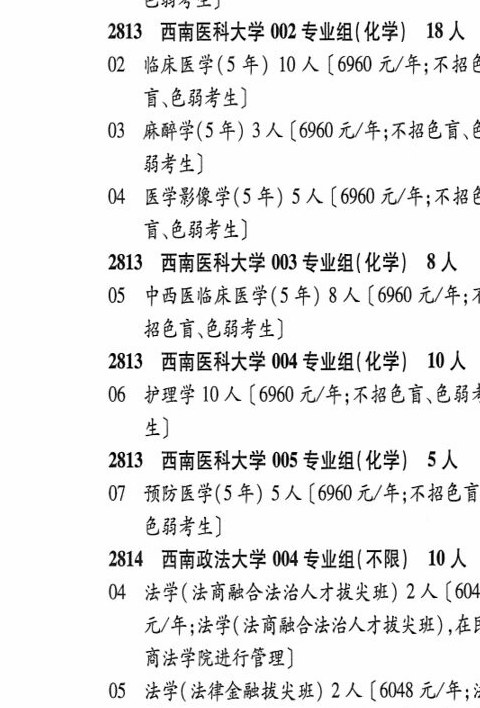

# 2813 西南医科大学

- PDF页码：160
- 书内页码：209
- 专业组：5；专业条目：7

## 001专业组

- 选科要求：化学|
- 招生计划：2 人
- 校验：ok

| 专业代码 | 专业名称 | 计划人数 | 学费（元/年） | 备注/完整OCR内容 |
|---|---|---:|---:|---|
| 01 | 口腔医学(5 年) | 2 | 6960 | 【6960 元/年;不招色言 色弱考生] |

<details><summary>本专业组OCR原文</summary>

```text
2813 西南医科大学 001 专业组(化学|) 2人
Ol 口腔医学(5 年) 2 人【6960 元/年;不招色言
色弱考生]
```
</details>

## 002专业组

- 选科要求：化学
- 招生计划：18 人
- 校验：review

| 专业代码 | 专业名称 | 计划人数 | 学费（元/年） | 备注/完整OCR内容 |
|---|---|---:|---:|---|
| 02 | 临床医学(5 年) | 10 |  | 【6960 4/4; KBE 盲\色弱考生] |
| 03 | 麻醉学(5 年) | 3 |  | 【6960 4/4; RBEE 6 844) |
| 04 | 医学影像学(5 年) 5A (6960 2/4; BiB 谨\色弱考生 |  |  | 04 医学影像学(5 年) 5A (6960 2/4; BiB 谨\色弱考生] |

<details><summary>本专业组OCR原文</summary>

```text
2813 西南医科大学 002 专业组(化学) 18 人
02 临床医学(5 年) 10 人【6960 4/4; KBE
盲\色弱考生]
03 麻醉学(5 年) 3 人【6960 4/4; RBEE 6
844)
04 医学影像学(5 年) 5A (6960 2/4; BiB
谨\色弱考生]
```
</details>

## 003专业组

- 选科要求：化学
- 招生计划：8 人
- 校验：review

| 专业代码 | 专业名称 | 计划人数 | 学费（元/年） | 备注/完整OCR内容 |
|---|---|---:|---:|---|
| 05 | 中西医临床医学(5年) 8A ( |  | 6960 | 6960 元/年;3 BED CBSE) |

<details><summary>本专业组OCR原文</summary>

```text
2813 西南医科大学 003 专业组(化学) 8 人
05 中西医临床医学(5年) 8A (6960 元/年;3
BED CBSE)
```
</details>

## 004专业组

- 选科要求：化学
- 招生计划：10 人
- 校验：ok

| 专业代码 | 专业名称 | 计划人数 | 学费（元/年） | 备注/完整OCR内容 |
|---|---|---:|---:|---|
| 06 | 护理学 | 10 |  | [6960 4/4; FEN OB? 生] |

<details><summary>本专业组OCR原文</summary>

```text
2813 西南医科大学 004 专业组(化学) 10 人
06 护理学 10 人[6960 4/4; FEN OB?
生]
```
</details>

## 005专业组

- 选科要求：化学
- 招生计划：5 人
- 校验：sum-corrected

| 专业代码 | 专业名称 | 计划人数 | 学费（元/年） | 备注/完整OCR内容 |
|---|---|---:|---:|---|
| 07 | 预防医学(5 年) | 5 |  | 【6960 4/4; FABER 色弱考生] |

<details><summary>本专业组OCR原文</summary>

```text
2813 西南医科大学 005 专业组(化学) SA
07 预防医学(5 年) 5 人【6960 4/4; FABER
色弱考生]
```
</details>

## 附：院校完整OCR原文

```text
--- PDF第160页（书内第209页），第1栏 ---
2813 西南医科大学 001 专业组(化学|) 2人
Ol 口腔医学(5 年) 2 人【6960 元/年;不招色言
色弱考生]
2813 西南医科大学 002 专业组(化学) 18 人
02 临床医学(5 年) 10 人【6960 4/4; KBE
盲\色弱考生]
03 麻醉学(5 年) 3 人【6960 4/4; RBEE 6
844)
04 医学影像学(5 年) 5A (6960 2/4; BiB
谨\色弱考生]
2813 西南医科大学 003 专业组(化学) 8 人
05 中西医临床医学(5年) 8A (6960 元/年;3
BED CBSE)
2813 西南医科大学 004 专业组(化学) 10 人
06 护理学 10 人[6960 4/4; FEN OB?
生]
2813 西南医科大学 005 专业组(化学) SA
07 预防医学(5 年) 5 人【6960 4/4; FABER
色弱考生]
```

## 源图

