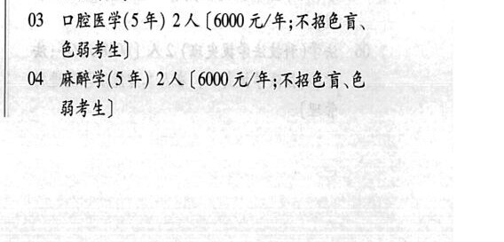
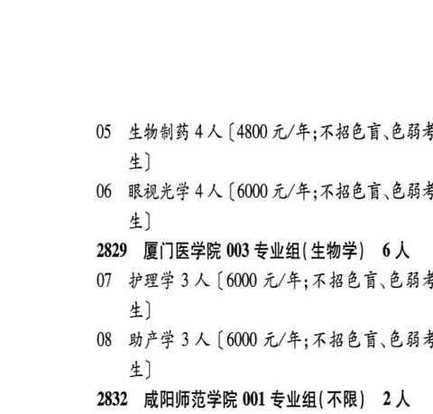

# 2829 厦门医学院

- PDF页码：161, 162
- 书内页码：210, 211
- 专业组：3；专业条目：8

## 001专业组

- 选科要求：不限
- 招生计划：3 人
- 校验：ok

| 专业代码 | 专业名称 | 计划人数 | 学费（元/年） | 备注/完整OCR内容 |
|---|---|---:|---:|---|
| 01 | 信息管理与信息系统 | 3 | 4800 | 【4800元/年] |

<details><summary>本专业组OCR原文</summary>

```text
2829 厦门医学院 001 专业组(不限) 3人
Ol 信息管理与信息系统 3 人【4800元/年]
```
</details>

## 002专业组

- 选科要求：化学
- 招生计划：16 人
- 校验：ok

| 专业代码 | 专业名称 | 计划人数 | 学费（元/年） | 备注/完整OCR内容 |
|---|---|---:|---:|---|
| 02 | 临床医学(5 年) | 4 | 6000 | 【6000元/年;不招色盲、 色弱考生] |
| 03 | 口腔医学(5年) | 2 | 6000 | 【6000 元/年;不招色育、 色弱考生] |
| 04 | “麻醉学(5 年) | 2 | 6000 | 【6000 元/年;不招色育、色 BA) |
| 05 | 生物制药 | 4 |  | 【4800 4/4; KBED CHF 4) |
| 06 | 眼视光学 | 4 |  | 【6000 4/4; KBE R EBA 生] |

<details><summary>本专业组OCR原文</summary>

```text
2829 厦门医学院 002 专业组(化学) 16人
02 临床医学(5 年) 4 人【6000元/年;不招色盲、
色弱考生]
03 口腔医学(5年) 2 人【6000 元/年;不招色育、
色弱考生]
04 “麻醉学(5 年) 2 人【6000 元/年;不招色育、色
BA)
05 生物制药 4 人【4800 4/4; KBED CHF
4)
06 眼视光学 4 人【6000 4/4; KBE R EBA
生]
```
</details>

## 003专业组

- 选科要求：生物学
- 招生计划：6 人
- 校验：ok

| 专业代码 | 专业名称 | 计划人数 | 学费（元/年） | 备注/完整OCR内容 |
|---|---|---:|---:|---|
| 07 | 护理学 | 3 | 6000 | 【6000 元/年;不招色盲、色弱才 生] |
| 08 | 助产学 | 3 | 6000 | 【6000 元/年;不招色盲、色弱才 生] |

<details><summary>本专业组OCR原文</summary>

```text
2829 厦门医学院 003 专业组( 生物学) 6 人
07 护理学3 人【6000 元/年;不招色盲、色弱才
生]
08 助产学 3 人【6000 元/年;不招色盲、色弱才
生]
```
</details>

## 附：院校完整OCR原文

```text
--- PDF第161页（书内第210页），第3栏 ---
2829 厦门医学院 001 专业组(不限) 3人
Ol 信息管理与信息系统 3 人【4800元/年]
2829 厦门医学院 002 专业组(化学) 16人
02 临床医学(5 年) 4 人【6000元/年;不招色盲、
色弱考生]
03 口腔医学(5年) 2 人【6000 元/年;不招色育、
色弱考生]
04 “麻醉学(5 年) 2 人【6000 元/年;不招色育、色
BA)

--- PDF第162页（书内第211页），第1栏 ---
05 生物制药 4 人【4800 4/4; KBED CHF
4)
06 眼视光学 4 人【6000 4/4; KBE R EBA
生]
2829 厦门医学院 003 专业组( 生物学) 6 人
07 护理学3 人【6000 元/年;不招色盲、色弱才
生]
08 助产学 3 人【6000 元/年;不招色盲、色弱才
生]
```

## 源图


