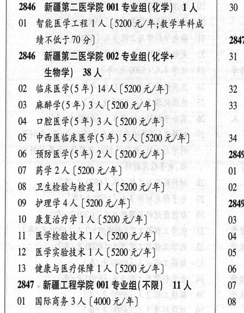

# 2846 新疆第二医学院

- PDF页码：163
- 书内页码：212
- 专业组：2；专业条目：12

## 001专业组

- 选科要求：化学
- 招生计划：OCR未稳定识别 人
- 校验：review

| 专业代码 | 专业名称 | 计划人数 | 学费（元/年） | 备注/完整OCR内容 |
|---|---|---:|---:|---|
| 01 | 智能医学工程\| 人 |  | 5200 | 5200 元/年;数学单科成 1 HART 109) 2847 |

<details><summary>本专业组OCR原文</summary>

```text
2846 新疆第二医学院 001 专业组( 化学) 1A   30 ， HART 109)              2847
Ol 智能医学工程| 人【5200 元/年;数学单科成    1
HART 109)              2847
```
</details>

## 002专业组

- 选科要求：化学+31生物学
- 招生计划：38 人
- 校验：review

| 专业代码 | 专业名称 | 计划人数 | 学费（元/年） | 备注/完整OCR内容 |
|---|---|---:|---:|---|
| 02 | 临床医学(5 年) | 14 | 5200 | 【5200 元/年] Lae |
| 03 | 麻醉学(5年) | 3 | 5200 | [5200 元/年] 33 |
| 04 | 口腔医学(5 年) | 3 | 5200 | 【5200元/年] 0S “中西医临床医学(5 年) 5 人【5200 元/年] 34 |
| 06 | 预防医学(5 年) 2A ( |  | 5200 | 5200 元/年] 2849 |
| 07 | 药学 | 2 | 5200 | [5200 元/年] Ol : |
| 08 | 卫生检验与检疫 ] 人 |  | 5200 | 5200元/年] 0 . |
| 09 | 护理学 | 4 | 5200 | [5200元/年] 2849 |
| 10 | 康复治疗学 | 1 | 5200 | [5200元/年] 03 4 |
| 11 | 医学检验技术 | 1 | 5200 | 【5200元/年] 04 3 |
| 12 | 医学实验技术 | 1 | 5200 | 【5200元/年] 05 3 |
| 13 | 健康与医疗保障 A ( |  | 5200 | 5200 元/年] 06 3 |

<details><summary>本专业组OCR原文</summary>

```text
2846 新疆第二医学院 002 专业组( 化学+      31 生物学) 38 人              :
02 临床医学(5 年) 14 人【5200 元/年]      Lae
03 麻醉学(5年) 3 人[5200 元/年]        33
04 口腔医学(5 年) 3人【5200元/年]
0S “中西医临床医学(5 年) 5 人【5200 元/年]    34
06 预防医学(5 年) 2A (5200 元/年]       2849
07 药学2人[5200 元/年]           Ol :
08 卫生检验与检疫 ] 人【5200元/年]       0 .
09 护理学4人[5200元/年]          2849
10 康复治疗学1 人[5200元/年]         03 4
11 医学检验技术 1 人【5200元/年]       04 3
12 医学实验技术1 人【5200元/年]       05 3
13 健康与医疗保障 A (5200 元/年]       06 3
```
</details>

## 附：院校完整OCR原文

```text
--- PDF第163页（书内第212页），第2栏 ---
2846 新疆第二医学院 001 专业组( 化学) 1A   30 ，
Ol 智能医学工程| 人【5200 元/年;数学单科成    1
HART 109)              2847
2846 新疆第二医学院 002 专业组( 化学+      31
生物学) 38 人              :
02 临床医学(5 年) 14 人【5200 元/年]      Lae
03 麻醉学(5年) 3 人[5200 元/年]        33
04 口腔医学(5 年) 3人【5200元/年]
0S “中西医临床医学(5 年) 5 人【5200 元/年]    34
06 预防医学(5 年) 2A (5200 元/年]       2849
07 药学2人[5200 元/年]           Ol :
08 卫生检验与检疫 ] 人【5200元/年]       0 .
09 护理学4人[5200元/年]          2849
10 康复治疗学1 人[5200元/年]         03 4
11 医学检验技术 1 人【5200元/年]       04 3
12 医学实验技术1 人【5200元/年]       05 3
13 健康与医疗保障 A (5200 元/年]       06 3
```

## 源图

