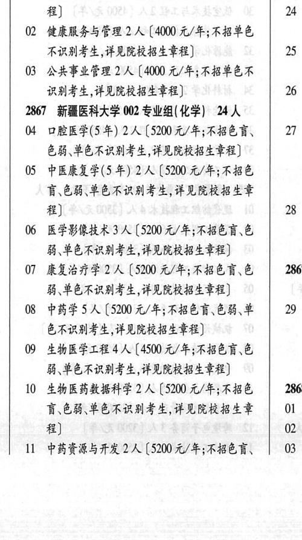
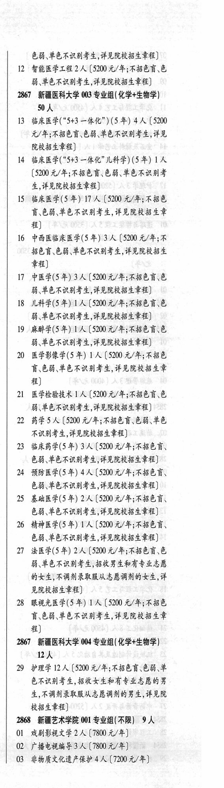

# 2867 新疆医科大学

- PDF页码：165
- 书内页码：214
- 专业组：4；专业条目：30

## 001专业组

- 选科要求：不限
- 招生计划：7 人
- 校验：review

| 专业代码 | 专业名称 | 计划人数 | 学费（元/年） | 备注/完整OCR内容 |
|---|---|---:|---:|---|
| 01 | 针灸推拿学(5 年) 3A ( |  | 5200 | 5200 元/年;不招色 23 讶,色弱,单色不识别考生;详见院校招生章 #) 24 |
| 02 | 健康服务与管理 | 2 | 4000 | 【4000 元/年;不招单色 不识别考生,详见院校招生章程] 5 |
| 03 | 公共事业管理 | 2 | 4000 | 【4000 元/年;不招单色不 识别考生,详见院校招生章程] 26 |

<details><summary>本专业组OCR原文</summary>

```text
2867 新疆医科大学 001 专业组(不限) 7 人
Ol 针灸推拿学(5 年) 3A (5200 元/年;不招色   23
讶,色弱,单色不识别考生;详见院校招生章
#)                    24
02 健康服务与管理 2 人【4000 元/年;不招单色
不识别考生,详见院校招生章程]        5
03 公共事业管理 2 人【4000 元/年;不招单色不
识别考生,详见院校招生章程]         26
```
</details>

## 002专业组

- 选科要求：化学
- 招生计划：24 人
- 校验：ok

| 专业代码 | 专业名称 | 计划人数 | 学费（元/年） | 备注/完整OCR内容 |
|---|---|---:|---:|---|
| 04 | 口腔医学(5 年) | 2 | 5200 | 【5200元/年;不招色言、 \| 27 色弱、单色不识别考生,详见院校招生章程] |
| 05 | 中医康复学(5 年) | 2 | 5200 | 【5200 元/年;不招色 讶色能\单色不识别考生,详见院校招生章 #) 28 |
| 06 | 医学影像技术 | 3 | 5200 | (5200 元/年;不招色盲\色 能、单色不识别考生,详见院校招生章程] |
| 07 | 康复治疗学 | 2 | 5200 | 【5200 元/年;不招色育、色 2867 弱、单色不识别考生,详见院校招生章程] |
| 08 | 中药学 | 5 | 5200 | [5200 元/年;不招色盲色弱、音 29 色不识别考生,详见院校招生章程] |
| 09 | 生物医学工程 | 4 | 4500 | 【4500 元/年;不招色盲\色 弱、单色不识别考生,详见院校招生章程] |
| 10 | 生物医药教据科学 | 2 | 5200 | 【5200 元/年;不招色 \| 2868 育\色能\单色不识别考生,详见院校招生章 \| 01 程] 02 |
| 11 | 中药资源与开发 | 2 | 5200 | 【5200元/年;不招色盲、 03 色弱、单色不识别考生,详见院校招生章程] |
| 12 | 智能医学工程 | 2 | 5200 | 【5200 元/年;不招色盲\色 弱.单色不识别考生,详见院校招生章程] |

<details><summary>本专业组OCR原文</summary>

```text
2867 新疆医科大学 002 专业组( 化学) 24 人
04 口腔医学(5 年) 2 人【5200元/年;不招色言、 | 27
色弱、单色不识别考生,详见院校招生章程]
05 中医康复学(5 年) 2 人【5200 元/年;不招色
讶色能\单色不识别考生,详见院校招生章
#)                    28
06 医学影像技术 3 人 (5200 元/年;不招色盲\色
能、单色不识别考生,详见院校招生章程]
07 康复治疗学2 人【5200 元/年;不招色育、色   2867
弱、单色不识别考生,详见院校招生章程]
08 中药学5 人[5200 元/年;不招色盲色弱、音  29
色不识别考生,详见院校招生章程]
09 生物医学工程 4 人【4500 元/年;不招色盲\色
弱、单色不识别考生,详见院校招生章程]
10 生物医药教据科学 2 人【5200 元/年;不招色 | 2868
育\色能\单色不识别考生,详见院校招生章 | 01
程]                    02
11 中药资源与开发2人【5200元/年;不招色盲、  03
色弱、单色不识别考生,详见院校招生章程]
12 智能医学工程 2 人【5200 元/年;不招色盲\色
弱.单色不识别考生,详见院校招生章程]
```
</details>

## 003专业组

- 选科要求：化学+生物学
- 招生计划：OCR未稳定识别 人
- 校验：review

| 专业代码 | 专业名称 | 计划人数 | 学费（元/年） | 备注/完整OCR内容 |
|---|---|---:|---:|---|
| 50 | 人 |  |  | 50人 |
| 13 | ”临床医学(“5+3 一体化")(5 年) 4 A ( |  | 5200 | 5200 元/年;不招色育、色絮\单色不识别考生,详见 院校招生章程] |
| 14 | 临床医学(“5+3 一体化"儿科学) (5 年) | 1 | 5200 | [5200 元/年;不招色盲色弱、单色不识别考 生,详见院校招生章程] |
| 15 | 临床医学(5年) | 17 | 5200 | 【5200 元/年;不招色 育\色弱,单色不识别考生,详见院校招生章 #) |
| 16 | 中西医临床医学(5 年) 3A ( |  | 5200 | 5200 元/年;不 招色盲色弱、单色不识别考生,详见院校招生 章程] |
| 17 | 中医学(5年) | 3 | 5200 | [5200元/年;不招色盲\色 能、单色不识别考生,详见院校招生章程] |
| 18 | 儿科学(5年) | 1 | 5200 | [5200元/年;不招色盲\色 能、单色不识别考生,详见院校招生章程] |
| 19 | 麻醉学(5年) [人 |  | 5200 | 5200元/年;不招色盲\色 能、单色不识别考生,详见院校招生章程] |
| 20 | 医学影像学(5 年) 1A ( |  | 5200 | 5200 元/年;不招色 盲\色弱,单色不识别考生,详见院校招生章 程] |
| 21 | 医学检验技术 人 |  | 5200 | 5200 元/年;不招色盲色 弱\单色不识别考生,详见院校招生章程] |
| 22 | HES A ( |  | 5200 | 5200 元/年;不招色盲色弱、单色 不识别考生,详见院校招生章程] |
| 23 | 临床药学(5 年) | 3 | 5200 | 【5200 元/年;不招色盲、 色弱、单色不识别考生,详见院校招生章程] |
| 24 | 预防医学(5 年) | 4 | 5200 | [5200 元/年;不招色言、 色能、单色不识别考生,详见院校招生章程] |
| 25 | 基础医学(5年) | 2 | 5200 | 【5200 元/年;不招色言、 色能、单色不识别考生,详见院校招生章程] |
| 26 | 精神医学(5 年) 1A ( |  | 5200 | 5200 元/年;不招色育、 色弱、单色不识别考生,详见院校招生章程] |
| 27 | 法医学(5年) | 2 | 5200 | 【5200元/年;不招色育\色 弱、单色不识别考生,招收男生和有专业志愿 的女生;不调剂录取服从志愿调剂的女生,详 见院校招生章程] |
| 28 | 眼视光医学(5 年) 1A ( |  | 5200 | 5200 元/年;不招色 盲\色能,单色不识别考生,详见院校招生章 #) |

<details><summary>本专业组OCR原文</summary>

```text
2867 新疆医科大学 003 专业组( 化学+生物学)
50人
13 ”临床医学(“5+3 一体化")(5 年) 4 A (5200
元/年;不招色育、色絮\单色不识别考生,详见
院校招生章程]
14 临床医学(“5+3 一体化"儿科学) (5 年) 1 人
[5200 元/年;不招色盲色弱、单色不识别考
生,详见院校招生章程]
15 临床医学(5年) 17 人【5200 元/年;不招色
育\色弱,单色不识别考生,详见院校招生章
#)
16 中西医临床医学(5 年) 3A (5200 元/年;不
招色盲色弱、单色不识别考生,详见院校招生
章程]
17 中医学(5年) 3 人[5200元/年;不招色盲\色
能、单色不识别考生,详见院校招生章程]
18 儿科学(5年) 1人[5200元/年;不招色盲\色
能、单色不识别考生,详见院校招生章程]
19 麻醉学(5年) [人【5200元/年;不招色盲\色
能、单色不识别考生,详见院校招生章程]
20 医学影像学(5 年) 1A (5200 元/年;不招色
盲\色弱,单色不识别考生,详见院校招生章
程]
21 医学检验技术 人【5200 元/年;不招色盲色
弱\单色不识别考生,详见院校招生章程]
22 HES A (5200 元/年;不招色盲色弱、单色
不识别考生,详见院校招生章程]
23 临床药学(5 年) 3 人【5200 元/年;不招色盲、
色弱、单色不识别考生,详见院校招生章程]
24 预防医学(5 年) 4人[5200 元/年;不招色言、
色能、单色不识别考生,详见院校招生章程]
25 基础医学(5年) 2人【5200 元/年;不招色言、
色能、单色不识别考生,详见院校招生章程]
26 精神医学(5 年) 1A (5200 元/年;不招色育、
色弱、单色不识别考生,详见院校招生章程]
27 法医学(5年) 2 人【5200元/年;不招色育\色
弱、单色不识别考生,招收男生和有专业志愿
的女生;不调剂录取服从志愿调剂的女生,详
见院校招生章程]
28 眼视光医学(5 年) 1A (5200 元/年;不招色
盲\色能,单色不识别考生,详见院校招生章
#)
```
</details>

## 004专业组

- 选科要求：化学+生物学
- 招生计划：OCR未稳定识别 人
- 校验：review

| 专业代码 | 专业名称 | 计划人数 | 学费（元/年） | 备注/完整OCR内容 |
|---|---|---:|---:|---|
| 29 | PRE IDA (520 4/4; FBO EB # 色不识别考生, 招收女生和有专业志愿的男 生,不调剂录取服从志愿调剂的男生，详见院 校招生章程 |  |  | 29 PRE IDA (520 4/4; FBO EB # 色不识别考生, 招收女生和有专业志愿的男 生,不调剂录取服从志愿调剂的男生，详见院 校招生章程] |

<details><summary>本专业组OCR原文</summary>

```text
2867 新疆医科大学 004 专业组(化学+生物学) RA
29 PRE IDA (520 4/4; FBO EB #
色不识别考生, 招收女生和有专业志愿的男
生,不调剂录取服从志愿调剂的男生，详见院
校招生章程]
```
</details>

## 附：院校完整OCR原文

```text
--- PDF第165页（书内第214页），第2栏 ---
2867 新疆医科大学 001 专业组(不限) 7 人
Ol 针灸推拿学(5 年) 3A (5200 元/年;不招色   23
讶,色弱,单色不识别考生;详见院校招生章
#)                    24
02 健康服务与管理 2 人【4000 元/年;不招单色
不识别考生,详见院校招生章程]        5
03 公共事业管理 2 人【4000 元/年;不招单色不
识别考生,详见院校招生章程]         26
2867 新疆医科大学 002 专业组( 化学) 24 人
04 口腔医学(5 年) 2 人【5200元/年;不招色言、 | 27
色弱、单色不识别考生,详见院校招生章程]
05 中医康复学(5 年) 2 人【5200 元/年;不招色
讶色能\单色不识别考生,详见院校招生章
#)                    28
06 医学影像技术 3 人 (5200 元/年;不招色盲\色
能、单色不识别考生,详见院校招生章程]
07 康复治疗学2 人【5200 元/年;不招色育、色   2867
弱、单色不识别考生,详见院校招生章程]
08 中药学5 人[5200 元/年;不招色盲色弱、音  29
色不识别考生,详见院校招生章程]
09 生物医学工程 4 人【4500 元/年;不招色盲\色
弱、单色不识别考生,详见院校招生章程]
10 生物医药教据科学 2 人【5200 元/年;不招色 | 2868
育\色能\单色不识别考生,详见院校招生章 | 01
程]                    02
11 中药资源与开发2人【5200元/年;不招色盲、  03

--- PDF第165页（书内第214页），第3栏 ---
色弱、单色不识别考生,详见院校招生章程]
12 智能医学工程 2 人【5200 元/年;不招色盲\色
弱.单色不识别考生,详见院校招生章程]
2867 新疆医科大学 003 专业组( 化学+生物学)
50人
13 ”临床医学(“5+3 一体化")(5 年) 4 A (5200
元/年;不招色育、色絮\单色不识别考生,详见
院校招生章程]
14 临床医学(“5+3 一体化"儿科学) (5 年) 1 人
[5200 元/年;不招色盲色弱、单色不识别考
生,详见院校招生章程]
15 临床医学(5年) 17 人【5200 元/年;不招色
育\色弱,单色不识别考生,详见院校招生章
#)
16 中西医临床医学(5 年) 3A (5200 元/年;不
招色盲色弱、单色不识别考生,详见院校招生
章程]
17 中医学(5年) 3 人[5200元/年;不招色盲\色
能、单色不识别考生,详见院校招生章程]
18 儿科学(5年) 1人[5200元/年;不招色盲\色
能、单色不识别考生,详见院校招生章程]
19 麻醉学(5年) [人【5200元/年;不招色盲\色
能、单色不识别考生,详见院校招生章程]
20 医学影像学(5 年) 1A (5200 元/年;不招色
盲\色弱,单色不识别考生,详见院校招生章
程]
21 医学检验技术 人【5200 元/年;不招色盲色
弱\单色不识别考生,详见院校招生章程]
22 HES A (5200 元/年;不招色盲色弱、单色
不识别考生,详见院校招生章程]
23 临床药学(5 年) 3 人【5200 元/年;不招色盲、
色弱、单色不识别考生,详见院校招生章程]
24 预防医学(5 年) 4人[5200 元/年;不招色言、
色能、单色不识别考生,详见院校招生章程]
25 基础医学(5年) 2人【5200 元/年;不招色言、
色能、单色不识别考生,详见院校招生章程]
26 精神医学(5 年) 1A (5200 元/年;不招色育、
色弱、单色不识别考生,详见院校招生章程]
27 法医学(5年) 2 人【5200元/年;不招色育\色
弱、单色不识别考生,招收男生和有专业志愿
的女生;不调剂录取服从志愿调剂的女生,详
见院校招生章程]
28 眼视光医学(5 年) 1A (5200 元/年;不招色
盲\色能,单色不识别考生,详见院校招生章
#)
2867 新疆医科大学 004 专业组(化学+生物学)
RA
29 PRE IDA (520 4/4; FBO EB #
色不识别考生, 招收女生和有专业志愿的男
生,不调剂录取服从志愿调剂的男生，详见院
校招生章程]
```

## 源图


