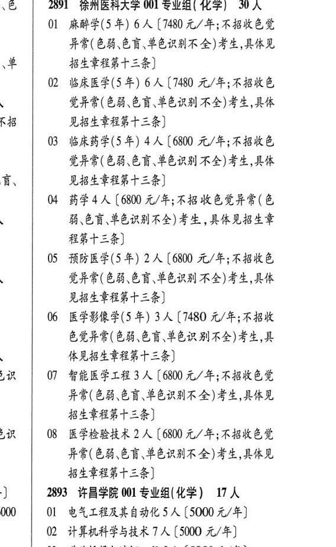

# 2891 徐州医科大学

- PDF页码：166
- 书内页码：215
- 专业组：1；专业条目：8

## 001专业组

- 选科要求：化学
- 招生计划：30 人
- 校验：review

| 专业代码 | 专业名称 | 计划人数 | 学费（元/年） | 备注/完整OCR内容 |
|---|---|---:|---:|---|
| 01 | 麻醉学(5 年) | 6 | 7480 | 【7480 元/年;不招收色觉 异常(色弱色盲、单色识别不全)考生,具体见 招生章程第十三条] |
| 02 | 临床医学(5 年) | 6 | 7480 | 【7480 元/年;不招收色 EHS ( EB CF SERS AS) 考生,具体 见招生章程第十三条] |
| 03 | 临床药学(5年) 4A ( |  | 6800 | 6800 元/年;不招收色 觉异常(色弱、色言单色识别不全)考生,具体 见招生章程第十三条] |
| 04 | 药学 | 4 | 6800 | [6800 元/年;不招收色觉异常(色 能色盲,单色识别不全)考生 ,具体见招生章 程第十三条] |
| 05 | 预防医学(5年) 2A ( |  | 6800 | 6800 元/年;不招收色 EFF ( EB CF PERI KA) FA AK 见招生章程第十三条] |
| 06 | 医学影像学(5 年) | 3 | 7480 | 【7480 元/年;不招收 色觉异常(色能、色言\单色识别不全)考生,具 体见招生章程第十三条] |
| 07 | 智能医学工程 | 3 | 6800 | 【6800 元/年;不招收色觉 异常(色弱.色盲音色识别不全)考生,具体见 招生章程第十三条] |
| 08 | 医学检验技术 | 2 | 6800 | [6800 元/年;不招收色觉 异常(色弱、色谨,单色识别不全)考生,具体见 招生章程第十三条] |

<details><summary>本专业组OCR原文</summary>

```text
2891 徐州医科大学 001 专业组( 化学) 30 人
01 麻醉学(5 年) 6 人【7480 元/年;不招收色觉
异常(色弱色盲、单色识别不全)考生,具体见
招生章程第十三条]
02 临床医学(5 年) 6 人【7480 元/年;不招收色
EHS ( EB CF SERS AS) 考生,具体
见招生章程第十三条]
03 临床药学(5年) 4A (6800 元/年;不招收色
觉异常(色弱、色言单色识别不全)考生,具体
见招生章程第十三条]
04 药学4 人[6800 元/年;不招收色觉异常(色
能色盲,单色识别不全)考生 ,具体见招生章
程第十三条]
05 预防医学(5年) 2A (6800 元/年;不招收色
EFF ( EB CF PERI KA) FA AK
见招生章程第十三条]
06 医学影像学(5 年) 3 人【7480 元/年;不招收
色觉异常(色能、色言\单色识别不全)考生,具
体见招生章程第十三条]
07 智能医学工程 3 人【6800 元/年;不招收色觉
异常(色弱.色盲音色识别不全)考生,具体见
招生章程第十三条]
08 医学检验技术 2 人[6800 元/年;不招收色觉
异常(色弱、色谨,单色识别不全)考生,具体见
招生章程第十三条]
```
</details>

## 附：院校完整OCR原文

```text
--- PDF第166页（书内第215页），第3栏 ---
2891 徐州医科大学 001 专业组( 化学) 30 人
01 麻醉学(5 年) 6 人【7480 元/年;不招收色觉
异常(色弱色盲、单色识别不全)考生,具体见
招生章程第十三条]
02 临床医学(5 年) 6 人【7480 元/年;不招收色
EHS ( EB CF SERS AS) 考生,具体
见招生章程第十三条]
03 临床药学(5年) 4A (6800 元/年;不招收色
觉异常(色弱、色言单色识别不全)考生,具体
见招生章程第十三条]
04 药学4 人[6800 元/年;不招收色觉异常(色
能色盲,单色识别不全)考生 ,具体见招生章
程第十三条]
05 预防医学(5年) 2A (6800 元/年;不招收色
EFF ( EB CF PERI KA) FA AK
见招生章程第十三条]
06 医学影像学(5 年) 3 人【7480 元/年;不招收
色觉异常(色能、色言\单色识别不全)考生,具
体见招生章程第十三条]
07 智能医学工程 3 人【6800 元/年;不招收色觉
异常(色弱.色盲音色识别不全)考生,具体见
招生章程第十三条]
08 医学检验技术 2 人[6800 元/年;不招收色觉
异常(色弱、色谨,单色识别不全)考生,具体见
招生章程第十三条]
```

## 源图

