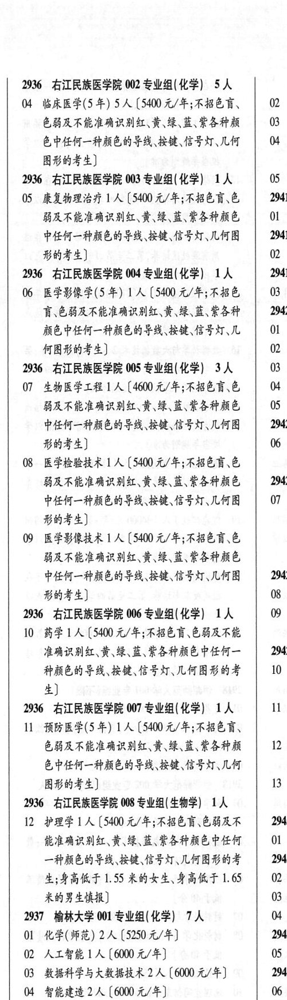

# 2936 右江民族医学院

- PDF页码：169
- 书内页码：218
- 专业组：8；专业条目：12

## 001专业组

- 选科要求：不限
- 招生计划：3 人
- 校验：ok

| 专业代码 | 专业名称 | 计划人数 | 学费（元/年） | 备注/完整OCR内容 |
|---|---|---:|---:|---|
| 01 | 大教据管理与应用 | 1 | 4600 | 【4600 元/年] |
| 02 | ”公共事业管理 | 1 | 4600 | 【4600 元/年] |
| 03 | ”健康服务与管理 | 1 | 4600 | 【4600 元/年] “218 ， |

<details><summary>本专业组OCR原文</summary>

```text
2936，右江民族医学院 001 专业组( 不限) 3 人
Ol 大教据管理与应用 1 人【4600 元/年]
02 ”公共事业管理 1 人【4600 元/年]
03 ”健康服务与管理 1 人【4600 元/年]
“218 ，
```
</details>

## 002专业组

- 选科要求：化学
- 招生计划：5 人
- 校验：sum-corrected

| 专业代码 | 专业名称 | 计划人数 | 学费（元/年） | 备注/完整OCR内容 |
|---|---|---:|---:|---|
| 04 | 临床医学(5 年) | 5 | 5400 | 【5400 元/年;不招色育、 OQ: 色弱及不能准确识别红、黄\、绿、蓝、紫各种颜 03: 色中任何一种颜色的导线、按键、信号灯\几何 04 1 图形的考生] |

<details><summary>本专业组OCR原文</summary>

```text
2936 ”右江民族医学院 002 专业组(化学) SA 色弱及不能准确识别红、黄\、绿、蓝、紫各种颜   03:
04 临床医学(5 年) 5 人【5400 元/年;不招色育、   OQ:
色弱及不能准确识别红、黄\、绿、蓝、紫各种颜   03:
色中任何一种颜色的导线、按键、信号灯\几何   04 1
图形的考生]
```
</details>

## 003专业组

- 选科要求：OCR未稳定识别
- 招生计划：OCR未稳定识别 人
- 校验：review

| 专业代码 | 专业名称 | 计划人数 | 学费（元/年） | 备注/完整OCR内容 |
|---|---|---:|---:|---|
| 05 | 康复物理治疗 ] 人 |  | 5400 | 5400 元/年;不招色盲\色 2941 能及不能准确识别红、黄\绿、蓝、紫各种颜色 \| OL ， 中任何一种颜色的导线\按键\信号灯\几何图 2941 形的考生] 0 |

<details><summary>本专业组OCR原文</summary>

```text
2936 右江民族医学院 003 专业组(化学| 1A   05 : 能及不能准确识别红、黄\绿、蓝、紫各种颜色 | OL ，
05 康复物理治疗 ] 人【5400 元/年;不招色盲\色   2941
能及不能准确识别红、黄\绿、蓝、紫各种颜色 | OL ，
中任何一种颜色的导线\按键\信号灯\几何图   2941
形的考生]                 0
```
</details>

## 004专业组

- 选科要求：化学
- 招生计划：OCR未稳定识别 人
- 校验：review

| 专业代码 | 专业名称 | 计划人数 | 学费（元/年） | 备注/完整OCR内容 |
|---|---|---:|---:|---|
| 06 | 医学影像学(5 年) 1A ( |  | 5400 | 5400 元/年;不招色 \| 03 A EHARERARAA RAR HES \| 2942 颜色中任何一种颜色的导线、按键、信号灯\几 01 ， 何图形的考生] QQ. |

<details><summary>本专业组OCR原文</summary>

```text
2936 ”右江民族医学院 004 专业组(化学) 1A   2941 A EHARERARAA RAR HES | 2942
06 医学影像学(5 年) 1A (5400 元/年;不招色 | 03
A EHARERARAA RAR HES | 2942
颜色中任何一种颜色的导线、按键、信号灯\几   01 ，
何图形的考生]              QQ.
```
</details>

## 005专业组

- 选科要求：化学
- 招生计划：3 人
- 校验：review

| 专业代码 | 专业名称 | 计划人数 | 学费（元/年） | 备注/完整OCR内容 |
|---|---|---:|---:|---|
| 07 | 生物医学工程 ] 人 |  | 4600 | 4600 元/年;不招色育、色 04 ， 能及不能准确识别红、黄\绿、蓝\紫各种颜色 05 中任何一种颜色的导线、按键、信号灯\几何图 2942 形的考生] 06 |
| 08 | 医学检验技术 | 1 | 5400 | 【5400 元/年;不招色育、色 能及不能准确识别红、黄\绿、蓝、紫各种颜色 2942 中任何一种颜色的导线、按键信号灯\几何图 0 形的考生] |
| 09 | 医学影像技术 LA ( |  | 5400 | 5400 元/年;不招色盲、色 能及不能准确识别红、黄\绿、蓝、紫各种颜色 中任何一种颜色的导线按键信号灯\几何图 2942 形的考生] 08 |

<details><summary>本专业组OCR原文</summary>

```text
2936 右江民族医学院 005 专业组( 化学) 3 人   0
07 生物医学工程 ] 人【4600 元/年;不招色育、色   04 ，
能及不能准确识别红、黄\绿、蓝\紫各种颜色   05
中任何一种颜色的导线、按键、信号灯\几何图   2942
形的考生]                 06
08 医学检验技术 1 人【5400 元/年;不招色育、色
能及不能准确识别红、黄\绿、蓝、紫各种颜色   2942
中任何一种颜色的导线、按键信号灯\几何图   0
形的考生]
09 医学影像技术 LA (5400 元/年;不招色盲、色
能及不能准确识别红、黄\绿、蓝、紫各种颜色
中任何一种颜色的导线按键信号灯\几何图   2942
形的考生]                08
```
</details>

## 006专业组

- 选科要求：化学
- 招生计划：1 人
- 校验：sum-corrected

| 专业代码 | 专业名称 | 计划人数 | 学费（元/年） | 备注/完整OCR内容 |
|---|---|---:|---:|---|
| 10 | 药学 | 1 | 5400 | [5400 元/年;不招色育\色弱及不能 准确识别红、黄、绿、蓝、紫各种颜色中任何一 2942 种颜色的导线、按键、信号灯\几何图形的考 10 4) |

<details><summary>本专业组OCR原文</summary>

```text
2936 ”右江民族医学院 006 专业组( 化学) 工人   09
10 药学1 人[5400 元/年;不招色育\色弱及不能
准确识别红、黄、绿、蓝、紫各种颜色中任何一   2942
种颜色的导线、按键、信号灯\几何图形的考   10
4)
```
</details>

## 007专业组

- 选科要求：化学
- 招生计划：OCR未稳定识别 人
- 校验：review

| 专业代码 | 专业名称 | 计划人数 | 学费（元/年） | 备注/完整OCR内容 |
|---|---|---:|---:|---|
| 11 | 预防医学(5 年) 1A ( |  | 5400 | 5400 元/年;不招色盲、 色弱及不能准确识别红、黄\绿、蓝、紫各种颜 12 CPE —ARE HER BO ES UT 图形的考生] 13 |

<details><summary>本专业组OCR原文</summary>

```text
2936 AVLRRE SH 007 专业组(化学) 1A   I 色弱及不能准确识别红、黄\绿、蓝、紫各种颜   12
11 预防医学(5 年) 1A (5400 元/年;不招色盲、
色弱及不能准确识别红、黄\绿、蓝、紫各种颜   12
CPE —ARE HER BO ES UT
图形的考生]               13
```
</details>

## 008专业组

- 选科要求：生物学
- 招生计划：1 人
- 校验：sum-corrected

| 专业代码 | 专业名称 | 计划人数 | 学费（元/年） | 备注/完整OCR内容 |
|---|---|---:|---:|---|
| 12 | 护理学 | 1 | 5400 | (5400 元/年;不招色盲色弱及不 2945 能准确识别红、黄\绿、蓝、紫各种颜色中任何 \| Ol 一种颜色的导线\按键、信号灯\几何图形的考 2945 生;身高低于1.55 米的女生、身高低于1.65 \| 02 米的男生导报] 03 |

<details><summary>本专业组OCR原文</summary>

```text
2936”右江民族医学院 008 专业组( 生物学) 工人
12 护理学1 人 (5400 元/年;不招色盲色弱及不   2945
能准确识别红、黄\绿、蓝、紫各种颜色中任何 | Ol
一种颜色的导线\按键、信号灯\几何图形的考   2945
生;身高低于1.55 米的女生、身高低于1.65 | 02
米的男生导报]              03
```
</details>

## 附：院校完整OCR原文

```text
--- PDF第169页（书内第218页），第1栏 ---
2936，右江民族医学院 001 专业组( 不限) 3 人
Ol 大教据管理与应用 1 人【4600 元/年]
02 ”公共事业管理 1 人【4600 元/年]
03 ”健康服务与管理 1 人【4600 元/年]
“218 ，

--- PDF第169页（书内第218页），第2栏 ---
2936 ”右江民族医学院 002 专业组(化学) SA
04 临床医学(5 年) 5 人【5400 元/年;不招色育、   OQ:
色弱及不能准确识别红、黄\、绿、蓝、紫各种颜   03:
色中任何一种颜色的导线、按键、信号灯\几何   04 1
图形的考生]
2936 右江民族医学院 003 专业组(化学| 1A   05 :
05 康复物理治疗 ] 人【5400 元/年;不招色盲\色   2941
能及不能准确识别红、黄\绿、蓝、紫各种颜色 | OL ，
中任何一种颜色的导线\按键\信号灯\几何图   2941
形的考生]                 0
2936 ”右江民族医学院 004 专业组(化学) 1A   2941
06 医学影像学(5 年) 1A (5400 元/年;不招色 | 03
A EHARERARAA RAR HES | 2942
颜色中任何一种颜色的导线、按键、信号灯\几   01 ，
何图形的考生]              QQ.
2936 右江民族医学院 005 专业组( 化学) 3 人   0
07 生物医学工程 ] 人【4600 元/年;不招色育、色   04 ，
能及不能准确识别红、黄\绿、蓝\紫各种颜色   05
中任何一种颜色的导线、按键、信号灯\几何图   2942
形的考生]                 06
08 医学检验技术 1 人【5400 元/年;不招色育、色
能及不能准确识别红、黄\绿、蓝、紫各种颜色   2942
中任何一种颜色的导线、按键信号灯\几何图   0
形的考生]
09 医学影像技术 LA (5400 元/年;不招色盲、色
能及不能准确识别红、黄\绿、蓝、紫各种颜色
中任何一种颜色的导线按键信号灯\几何图   2942
形的考生]                08
2936 ”右江民族医学院 006 专业组( 化学) 工人   09
10 药学1 人[5400 元/年;不招色育\色弱及不能
准确识别红、黄、绿、蓝、紫各种颜色中任何一   2942
种颜色的导线、按键、信号灯\几何图形的考   10
4)
2936 AVLRRE SH 007 专业组(化学) 1A   I
11 预防医学(5 年) 1A (5400 元/年;不招色盲、
色弱及不能准确识别红、黄\绿、蓝、紫各种颜   12
CPE —ARE HER BO ES UT
图形的考生]               13
2936”右江民族医学院 008 专业组( 生物学) 工人
12 护理学1 人 (5400 元/年;不招色盲色弱及不   2945
能准确识别红、黄\绿、蓝、紫各种颜色中任何 | Ol
一种颜色的导线\按键、信号灯\几何图形的考   2945
生;身高低于1.55 米的女生、身高低于1.65 | 02
米的男生导报]              03
```

## 源图


