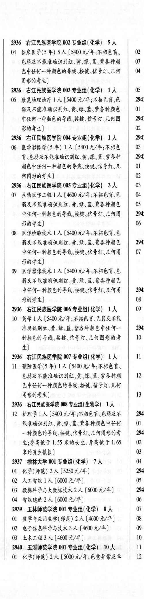
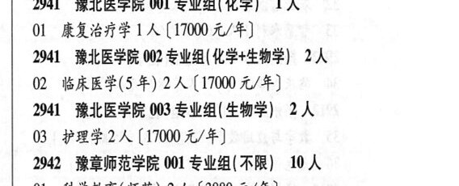
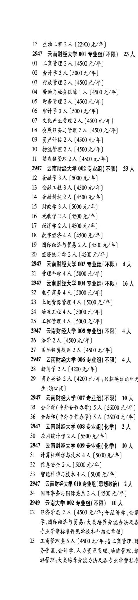

# 2941 豫北医学院

- PDF页码：169, 170
- 书内页码：218, 219
- 专业组：5；专业条目：76

## 001专业组

- 选科要求：化学
- 招生计划：1 人
- 校验：review

| 专业代码 | 专业名称 | 计划人数 | 学费（元/年） | 备注/完整OCR内容 |
|---|---|---:|---:|---|
|  | 结构化OCR未稳定切分，请查看下方原文及源图 |  |  |  |

<details><summary>本专业组OCR原文</summary>

```text
2941 瑰北医学院 001 专业组(化学) 1A OL 康复治疗学1人[17000元/年]
OL 康复治疗学1人[17000元/年]
```
</details>

## 002专业组

- 选科要求：化学+生物学
- 招生计划：2 人
- 校验：review

| 专业代码 | 专业名称 | 计划人数 | 学费（元/年） | 备注/完整OCR内容 |
|---|---|---:|---:|---|
| 02 | 临床医学(5 年) 2A ( |  | 17000 | 17000 元/年 |

<details><summary>本专业组OCR原文</summary>

```text
2941 RALPH 002 专业组( 化学+生物学) 2 人
02 临床医学(5 年) 2A (17000 元/年
```
</details>

## 003专业组

- 选科要求：生物学
- 招生计划：2 人
- 校验：review

| 专业代码 | 专业名称 | 计划人数 | 学费（元/年） | 备注/完整OCR内容 |
|---|---|---:|---:|---|
| 03 | 护理学 | 2 | 17000 | 【17000元/年] 2942 豫章师范学院 001 专业组(不限) 10 人 |
| 01 | 科学教育(师范) 2A ( |  | 3880 | 3880 元/年] |
| 02 | 小学教育(师范) 2A ( |  | 3880 | 3880 元/年] |
| 03 | 财务管理 | 2 | 3880 | 【3880 元/年] |
| 04 | 人力资源管理 | 2 | 3880 | 【3880元/年] |
| 05 | 网络与新媒体 | 2 | 3650 | 【3650元/年] 2942 RIGA HE 002 专业组( 不限】 2 人 |
| 06 | 儿童康复治疗 | 2 | 4120 | 【4120 元/年;不招色盲\色 84) 2942 RITE 003 专业组(化学\| 2 人 |
| 07 | 教据科学与大教据技术 | 2 | 4350 | 【4350 元/年;不 能准确在显示器上识别红、黄\绿、蓝、紫各种 颜色中任何一种颜色的数码、字母的考生不能 报考] 2942 和瑰章师范学院 004 专业组(化学) 4人 |
| 08 | 生态学 | 2 | 4120 | [4120 元/年;不招色言\色弱者] |
| 09 | 环境工程 | 2 |  | 【4350 A/F; F BER EB 4) 2942 RITA Be 005 专业组(化学) 8 人 |
| 10 | 资源环境科学 | 2 | 4350 | 【4350 元/年;色能( 育)、 单色识别不全的考生导报] |
| 11 | 人工智能 | 2 | 4350 | 【4350 元/年;色弱(育)、单色 识别不全的考生导报] |
| 12 | 新能源材料与器件 | 2 |  | 【4350 0/4; 68 (盲)、单色识别不全的考生愤报] |
| 13 | 光电信息材料与器件 | 2 | 4350 | 【4350 元/年;色弱 (H) ,单色识别不全的考生导报] 2945 岳阳学院 001 专业组(不限) 1人 |
| 01 | 法学 | 1 | 22000 | [22000元/年] 2945 ”岳阳学院 002 专业组(不限) 3 人 |
| 02 | 会计学 | 1 | 22000 | [22000元/年] |
| 03 | 广告学 | 1 |  | 【23000 4/4) |
| 04 | 网络与新媒体 | 1 | 23000 | 【23000 元/年] 2945 岳阳学院 003 专业组(不限) 2人 |
| 05 | 工程管理 | 2 | 22000 | 【22000 元/年] 2945 ”岳阳学院 004 专业组(化学) 1 人 |
| 06 | 应用化学 | 2 | 22900 | 【22900 元/年] |
| 07 | 高分子材料与工程 ] ( |  | 22900 | 22900 元/年] |
| 08 | 机械设计制造及其自动化 | 3 | 22900 | 【22900 元/年] |
| 09 | 机械电子工程 ] 人 |  | 22900 | 22900 元/年] |
| 10 | 计算机科学与技术 | 3 | 22900 | 【22900 元/年] |
| 11 | 电子信息工程 | 2 | 22900 | 【22900元/年] |
| 12 | 食品营养与健康 | 1 | 22900 | 【22900 元/年] |
| 13 | 生物工程 2 (22900 元/年] 2947 云南财经大学 001 专业组(不限) | 23 | 22900 | 13 生物工程 2 (22900 元/年] 2947 云南财经大学 001 专业组(不限) 23 人 |
| 01 | 工商管理 | 2 | 4500 | [4500 元/年] |
| 02 | 会计学 | 3 | 5000 | [5000元/年] |
| 03 | 行政管理 | 2 | 4500 | 【4500 元/年 |
| 04 | 劳动与社会保障 ] 人 |  | 4500 | 4500 元/年] |
| 05 | 财务管理 | 2 | 4500 | 【4500 元/年] |
| 06 | 审计学 | 3 | 5000 | [5000元/年] |
| 07 | 文化产业管理 | 2 | 4500 | 【4500 元/年] |
| 08 | 会展经济与管理 | 2 | 4500 | 【4500 元/年] |
| 09 | 资产评估 | 2 | 4500 | 【4500 元/年] |
| 10 | 物流管理 | 2 | 4500 | 【4500 元/年] |
| 11 | 供应链管理 | 2 | 4500 | 【4500 元/年] 2947 云南财经大学 002 专业组(不限】 BA |
| 12 | 金融学 | 3 | 5000 | 【5000 元/年] |
| 13 | 金融工程 | 3 | 4500 | 【4500 元/年] |
| 14 | 全融科技 | 2 | 4500 | 【4500 元/年] |
| 15 | 财政学 | 3 | 5000 | [5000元/年] |
| 16 | 税收学 | 2 | 4500 | [4500 元/年] |
| 17 | 经济学 | 2 | 4500 | [4500 元/年] |
| 18 | KFBR4A ( |  | 4500 | 4500 元/年] |
| 19 | 国际经济与贸易 | 2 | 4500 | [4500 元/年] |
| 20 | 经济统计学 | 2 | 4500 | 【4500 元/年] 2947 云南财经大学 003 专业组(不限) 4人 |
| 21 | 管理科学 | 4 | 5000 | [5000 元/年] 2947 云南财经大学 004 专业组(不限】 16 人 |
| 22 | 电子商务 | 4 | 5000 | 【5000 元/年] |
| 23 | 土地资源管理 | 4 |  | 【5000 4/4) |
| 24 | 物流工程 | 4 | 5000 | 【5000元/年] |
| 25 | 工程管理 | 4 | 5000 | (5000 元/年] 2947 云南财经大学 005 专业组(不限】 4 人 |
| 26 | 法学 | 2 | 4500 | [4500元/年] |
| 27 | 国际经贸规则 2A ( |  | 4500 | 4500 元/年] |

<details><summary>本专业组OCR原文</summary>

```text
2941 ACEH 003 专业组( 生物学) 2 人
03 护理学2人【17000元/年]
2942 豫章师范学院 001 专业组(不限) 10 人
01 科学教育(师范) 2A (3880 元/年]
02 小学教育(师范) 2A (3880 元/年]
03 财务管理 2 人【3880 元/年]
04 人力资源管理2 人【3880元/年]
05 网络与新媒体2 人【3650元/年]
2942 RIGA HE 002 专业组( 不限】 2 人
06 儿童康复治疗 2 人【4120 元/年;不招色盲\色
84)
2942 RITE 003 专业组(化学| 2 人
07 教据科学与大教据技术 2 人【4350 元/年;不
能准确在显示器上识别红、黄\绿、蓝、紫各种
颜色中任何一种颜色的数码、字母的考生不能
报考]
2942 和瑰章师范学院 004 专业组(化学) 4人
08 生态学2 人[4120 元/年;不招色言\色弱者]
09 环境工程 2 人【4350 A/F; F BER EB
4)
2942 RITA Be 005 专业组(化学) 8 人
10 资源环境科学 2 人【4350 元/年;色能( 育)、
单色识别不全的考生导报]
11 人工智能 2 人【4350 元/年;色弱(育)、单色
识别不全的考生导报]
12 新能源材料与器件 2 人【4350 0/4; 68
(盲)、单色识别不全的考生愤报]
13 光电信息材料与器件 2 人【4350 元/年;色弱
(H) ,单色识别不全的考生导报]
2945 岳阳学院 001 专业组(不限) 1人
01 法学1人[22000元/年]
2945 ”岳阳学院 002 专业组(不限) 3 人
02 会计学1人[22000元/年]
03 广告学1 人【23000 4/4)
04 网络与新媒体 1 人【23000 元/年]
2945 岳阳学院 003 专业组(不限) 2人
05 工程管理2 人【22000 元/年]
2945 ”岳阳学院 004 专业组(化学) 1 人
06 应用化学2 人【22900 元/年]
07 高分子材料与工程 ] (22900 元/年]
08 机械设计制造及其自动化3 人【22900 元/年]
09 机械电子工程 ] 人【22900 元/年]
10 计算机科学与技术 3 人【22900 元/年]
11 电子信息工程2人【22900元/年]
12 食品营养与健康 1 人【22900 元/年]
13 生物工程 2 (22900 元/年]
2947 云南财经大学 001 专业组(不限) 23 人
01 工商管理 2 人[4500 元/年]
02 会计学3人[5000元/年]
03 行政管理 2 人【4500 元/年
04 劳动与社会保障 ] 人【4500 元/年]
05 财务管理 2 人【4500 元/年]
06 审计学3人[5000元/年]
07 文化产业管理 2 人【4500 元/年]
08 会展经济与管理 2 人【4500 元/年]
09 资产评估 2 人【4500 元/年]
10 物流管理 2 人【4500 元/年]
11 供应链管理 2 人【4500 元/年]
2947 云南财经大学 002 专业组(不限】 BA
12 金融学3 人【5000 元/年]
13 金融工程3 人【4500 元/年]
14 全融科技 2 人【4500 元/年]
15 财政学3人[5000元/年]
16 税收学2人[4500 元/年]
17 经济学2人[4500 元/年]
18 KFBR4A (4500 元/年]
19 国际经济与贸易 2 人[4500 元/年]
20 经济统计学 2 人【4500 元/年]
2947 云南财经大学 003 专业组(不限) 4人
21 管理科学4人[5000 元/年]
2947 云南财经大学 004 专业组(不限】 16 人
22 电子商务4 人【5000 元/年]
23 土地资源管理 4 人【5000 4/4)
24 物流工程4 人【5000元/年]
25 工程管理4人 (5000 元/年]
2947 云南财经大学 005 专业组(不限】 4 人
26 法学2人[4500元/年]
27 国际经贸规则 2A (4500 元/年]
```
</details>

## 004专业组

- 选科要求：化学
- 招生计划：OCR未稳定识别 人
- 校验：review

| 专业代码 | 专业名称 | 计划人数 | 学费（元/年） | 备注/完整OCR内容 |
|---|---|---:|---:|---|
| 06 | 医学影像学(5 年) 1A (5400 元/年;不招色 \| 03 A EHARERARAA RAR HES \| 2942 颜色中任何一种颜色的导线、按键、信号灯\几 01 ， 何图形的考生] QQ. 2936 右江民族医学院 005 专业组( 化学) | 3 | 5400 | 0 |
| 07 | 生物医学工程 ] 人 |  | 4600 | 4600 元/年;不招色育、色 04 ， 能及不能准确识别红、黄\绿、蓝\紫各种颜色 05 中任何一种颜色的导线、按键、信号灯\几何图 2942 形的考生] 06 |
| 08 | 医学检验技术 | 1 | 5400 | 【5400 元/年;不招色育、色 能及不能准确识别红、黄\绿、蓝、紫各种颜色 2942 中任何一种颜色的导线、按键信号灯\几何图 0 形的考生] |
| 09 | 医学影像技术 LA ( |  | 5400 | 5400 元/年;不招色盲、色 能及不能准确识别红、黄\绿、蓝、紫各种颜色 中任何一种颜色的导线按键信号灯\几何图 2942 形的考生] 08 2936 ”右江民族医学院 006 专业组( 化学) 工人 09 |
| 10 | 药学 | 1 | 5400 | [5400 元/年;不招色育\色弱及不能 准确识别红、黄、绿、蓝、紫各种颜色中任何一 2942 种颜色的导线、按键、信号灯\几何图形的考 10 4) 2936 AVLRRE SH 007 专业组(化学) 1A I |
| 11 | 预防医学(5 年) 1A ( |  | 5400 | 5400 元/年;不招色盲、 色弱及不能准确识别红、黄\绿、蓝、紫各种颜 12 CPE —ARE HER BO ES UT 图形的考生] 13 2936”右江民族医学院 008 专业组( 生物学) 工人 |
| 12 | 护理学 | 1 | 5400 | (5400 元/年;不招色盲色弱及不 2945 能准确识别红、黄\绿、蓝、紫各种颜色中任何 \| Ol 一种颜色的导线\按键、信号灯\几何图形的考 2945 生;身高低于1.55 米的女生、身高低于1.65 \| 02 米的男生导报] 03 2937 榆林大学 001 专业组(化学) 7人 04 |
| 01 | 化学(师范) 2A (5250 4/4) 2945 |  |  | 01 化学(师范) 2A (5250 4/4) 2945 |
| 02 | 人工智能 | 1 | 6000 | 【6000 元/年] 05 |
| 03 | 数据科学与大数据技术 | 2 | 6000 | 【6000 元/年] 2945 |
| 04 | 智能建造?人 |  | 6000 | 6000 元/年] 06 2939 玉林师范学院 001 专业组(化学) 8A 0 |
| 01 | 数学与应用数学(师范) 2A (4600 4/4) 08 |  |  | Ol 数学与应用数学(师范) 2A (4600 4/4) 08 |
| 02 | 电子信息科学与技术 | 3 | 4600 | 【4600 元/年] 09 |
| 03 | 土木工程 | 3 | 4600 | [4600元/年] 10 2940 玉溪师范学院 001 专业组(化学) 10 人 11 |
| 01 | 化学(师范) 2A ( |  | 500 | 500 元/年;色觉异常及单 12 色识别不全考生不予录取] |
| 02 | 数学与应用数学(师范) | 2 | 5000 | 【5000 元/年] |
| 03 | 物理学(师范) 2A ( |  | 5000 | 5000 元/年] |
| 04 | 计算机科学与技术 | 2 | 5000 | 【5000 元/年;单色识 别不全考生不也录取] |
| 05 | 通信工程 | 2 | 5000 | [5000元/年] |

<details><summary>本专业组OCR原文</summary>

```text
2936 ”右江民族医学院 004 专业组(化学) 1A   2941 A EHARERARAA RAR HES | 2942
06 医学影像学(5 年) 1A (5400 元/年;不招色 | 03
A EHARERARAA RAR HES | 2942
颜色中任何一种颜色的导线、按键、信号灯\几   01 ，
何图形的考生]              QQ.
2936 右江民族医学院 005 专业组( 化学) 3 人   0
07 生物医学工程 ] 人【4600 元/年;不招色育、色   04 ，
能及不能准确识别红、黄\绿、蓝\紫各种颜色   05
中任何一种颜色的导线、按键、信号灯\几何图   2942
形的考生]                 06
08 医学检验技术 1 人【5400 元/年;不招色育、色
能及不能准确识别红、黄\绿、蓝、紫各种颜色   2942
中任何一种颜色的导线、按键信号灯\几何图   0
形的考生]
09 医学影像技术 LA (5400 元/年;不招色盲、色
能及不能准确识别红、黄\绿、蓝、紫各种颜色
中任何一种颜色的导线按键信号灯\几何图   2942
形的考生]                08
2936 ”右江民族医学院 006 专业组( 化学) 工人   09
10 药学1 人[5400 元/年;不招色育\色弱及不能
准确识别红、黄、绿、蓝、紫各种颜色中任何一   2942
种颜色的导线、按键、信号灯\几何图形的考   10
4)
2936 AVLRRE SH 007 专业组(化学) 1A   I
11 预防医学(5 年) 1A (5400 元/年;不招色盲、
色弱及不能准确识别红、黄\绿、蓝、紫各种颜   12
CPE —ARE HER BO ES UT
图形的考生]               13
2936”右江民族医学院 008 专业组( 生物学) 工人
12 护理学1 人 (5400 元/年;不招色盲色弱及不   2945
能准确识别红、黄\绿、蓝、紫各种颜色中任何 | Ol
一种颜色的导线\按键、信号灯\几何图形的考   2945
生;身高低于1.55 米的女生、身高低于1.65 | 02
米的男生导报]              03
2937 榆林大学 001 专业组(化学) 7人      04
01 化学(师范) 2A (5250 4/4)        2945
02 人工智能1人【6000 元/年]          05
03 数据科学与大数据技术 2 人【6000 元/年]    2945
04 智能建造?人【6000 元/年]         06
2939 玉林师范学院 001 专业组(化学) 8A    0
Ol 数学与应用数学(师范) 2A (4600 4/4)    08
02 电子信息科学与技术3 人【4600 元/年]     09
03 土木工程3人[4600元/年]         10
2940 玉溪师范学院 001 专业组(化学) 10 人    11
01 化学(师范) 2A (500 元/年;色觉异常及单   12
色识别不全考生不予录取]
02 数学与应用数学(师范) 2 人【5000 元/年]
03 物理学(师范) 2A (5000 元/年]
04 计算机科学与技术 2 人【5000 元/年;单色识
别不全考生不也录取]
05 通信工程2人[5000元/年]
```
</details>

## 006专业组

- 选科要求：不限
- 招生计划：4 人
- 校验：ok

| 专业代码 | 专业名称 | 计划人数 | 学费（元/年） | 备注/完整OCR内容 |
|---|---|---:|---:|---|
| 28 | 新闻学 | 2 | 4200 | [4200 元/年] |
| 29 | 商务英语 | 2 | 4200 | 【4200 元/年;只招英语语种芝 生;须口试] |

<details><summary>本专业组OCR原文</summary>

```text
2941 云南财经大学 006 专业组(不限) 4 人
28 新闻学2人[4200 元/年]
29 商务英语 2 人【4200 元/年;只招英语语种芝
生;须口试]
```
</details>

## 附：院校完整OCR原文

```text
--- PDF第169页（书内第218页），第2栏 ---
2936 ”右江民族医学院 004 专业组(化学) 1A   2941
06 医学影像学(5 年) 1A (5400 元/年;不招色 | 03
A EHARERARAA RAR HES | 2942
颜色中任何一种颜色的导线、按键、信号灯\几   01 ，
何图形的考生]              QQ.
2936 右江民族医学院 005 专业组( 化学) 3 人   0
07 生物医学工程 ] 人【4600 元/年;不招色育、色   04 ，
能及不能准确识别红、黄\绿、蓝\紫各种颜色   05
中任何一种颜色的导线、按键、信号灯\几何图   2942
形的考生]                 06
08 医学检验技术 1 人【5400 元/年;不招色育、色
能及不能准确识别红、黄\绿、蓝、紫各种颜色   2942
中任何一种颜色的导线、按键信号灯\几何图   0
形的考生]
09 医学影像技术 LA (5400 元/年;不招色盲、色
能及不能准确识别红、黄\绿、蓝、紫各种颜色
中任何一种颜色的导线按键信号灯\几何图   2942
形的考生]                08
2936 ”右江民族医学院 006 专业组( 化学) 工人   09
10 药学1 人[5400 元/年;不招色育\色弱及不能
准确识别红、黄、绿、蓝、紫各种颜色中任何一   2942
种颜色的导线、按键、信号灯\几何图形的考   10
4)
2936 AVLRRE SH 007 专业组(化学) 1A   I
11 预防医学(5 年) 1A (5400 元/年;不招色盲、
色弱及不能准确识别红、黄\绿、蓝、紫各种颜   12
CPE —ARE HER BO ES UT
图形的考生]               13
2936”右江民族医学院 008 专业组( 生物学) 工人
12 护理学1 人 (5400 元/年;不招色盲色弱及不   2945
能准确识别红、黄\绿、蓝、紫各种颜色中任何 | Ol
一种颜色的导线\按键、信号灯\几何图形的考   2945
生;身高低于1.55 米的女生、身高低于1.65 | 02
米的男生导报]              03
2937 榆林大学 001 专业组(化学) 7人      04
01 化学(师范) 2A (5250 4/4)        2945
02 人工智能1人【6000 元/年]          05
03 数据科学与大数据技术 2 人【6000 元/年]    2945
04 智能建造?人【6000 元/年]         06
2939 玉林师范学院 001 专业组(化学) 8A    0
Ol 数学与应用数学(师范) 2A (4600 4/4)    08
02 电子信息科学与技术3 人【4600 元/年]     09
03 土木工程3人[4600元/年]         10
2940 玉溪师范学院 001 专业组(化学) 10 人    11
01 化学(师范) 2A (500 元/年;色觉异常及单   12

--- PDF第169页（书内第218页），第3栏 ---
色识别不全考生不予录取]
02 数学与应用数学(师范) 2 人【5000 元/年]
03 物理学(师范) 2A (5000 元/年]
04 计算机科学与技术 2 人【5000 元/年;单色识
别不全考生不也录取]
05 通信工程2人[5000元/年]
2941 瑰北医学院 001 专业组(化学) 1A
OL 康复治疗学1人[17000元/年]
2941 RALPH 002 专业组( 化学+生物学) 2 人
02 临床医学(5 年) 2A (17000 元/年
2941 ACEH 003 专业组( 生物学) 2 人
03 护理学2人【17000元/年]
2942 豫章师范学院 001 专业组(不限) 10 人
01 科学教育(师范) 2A (3880 元/年]
02 小学教育(师范) 2A (3880 元/年]
03 财务管理 2 人【3880 元/年]
04 人力资源管理2 人【3880元/年]
05 网络与新媒体2 人【3650元/年]
2942 RIGA HE 002 专业组( 不限】 2 人
06 儿童康复治疗 2 人【4120 元/年;不招色盲\色
84)
2942 RITE 003 专业组(化学| 2 人
07 教据科学与大教据技术 2 人【4350 元/年;不
能准确在显示器上识别红、黄\绿、蓝、紫各种
颜色中任何一种颜色的数码、字母的考生不能
报考]
2942 和瑰章师范学院 004 专业组(化学) 4人
08 生态学2 人[4120 元/年;不招色言\色弱者]
09 环境工程 2 人【4350 A/F; F BER EB
4)
2942 RITA Be 005 专业组(化学) 8 人
10 资源环境科学 2 人【4350 元/年;色能( 育)、
单色识别不全的考生导报]
11 人工智能 2 人【4350 元/年;色弱(育)、单色
识别不全的考生导报]
12 新能源材料与器件 2 人【4350 0/4; 68
(盲)、单色识别不全的考生愤报]
13 光电信息材料与器件 2 人【4350 元/年;色弱
(H) ,单色识别不全的考生导报]
2945 岳阳学院 001 专业组(不限) 1人
01 法学1人[22000元/年]
2945 ”岳阳学院 002 专业组(不限) 3 人
02 会计学1人[22000元/年]
03 广告学1 人【23000 4/4)
04 网络与新媒体 1 人【23000 元/年]
2945 岳阳学院 003 专业组(不限) 2人
05 工程管理2 人【22000 元/年]
2945 ”岳阳学院 004 专业组(化学) 1 人
06 应用化学2 人【22900 元/年]
07 高分子材料与工程 ] (22900 元/年]
08 机械设计制造及其自动化3 人【22900 元/年]
09 机械电子工程 ] 人【22900 元/年]
10 计算机科学与技术 3 人【22900 元/年]
11 电子信息工程2人【22900元/年]
12 食品营养与健康 1 人【22900 元/年]

--- PDF第170页（书内第219页），第1栏 ---
13 生物工程 2 (22900 元/年]
2947 云南财经大学 001 专业组(不限) 23 人
01 工商管理 2 人[4500 元/年]
02 会计学3人[5000元/年]
03 行政管理 2 人【4500 元/年
04 劳动与社会保障 ] 人【4500 元/年]
05 财务管理 2 人【4500 元/年]
06 审计学3人[5000元/年]
07 文化产业管理 2 人【4500 元/年]
08 会展经济与管理 2 人【4500 元/年]
09 资产评估 2 人【4500 元/年]
10 物流管理 2 人【4500 元/年]
11 供应链管理 2 人【4500 元/年]
2947 云南财经大学 002 专业组(不限】 BA
12 金融学3 人【5000 元/年]
13 金融工程3 人【4500 元/年]
14 全融科技 2 人【4500 元/年]
15 财政学3人[5000元/年]
16 税收学2人[4500 元/年]
17 经济学2人[4500 元/年]
18 KFBR4A (4500 元/年]
19 国际经济与贸易 2 人[4500 元/年]
20 经济统计学 2 人【4500 元/年]
2947 云南财经大学 003 专业组(不限) 4人
21 管理科学4人[5000 元/年]
2947 云南财经大学 004 专业组(不限】 16 人
22 电子商务4 人【5000 元/年]
23 土地资源管理 4 人【5000 4/4)
24 物流工程4 人【5000元/年]
25 工程管理4人 (5000 元/年]
2947 云南财经大学 005 专业组(不限】 4 人
26 法学2人[4500元/年]
27 国际经贸规则 2A (4500 元/年]
2941 云南财经大学 006 专业组(不限) 4 人
28 新闻学2人[4200 元/年]
29 商务英语 2 人【4200 元/年;只招英语语种芝
生;须口试]
```

## 源图



