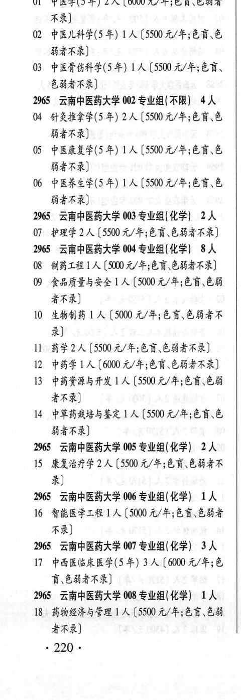
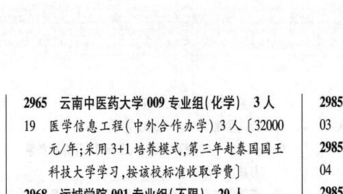

# 2965 云南中医药大学

- PDF页码：171
- 书内页码：220
- 专业组：9；专业条目：19

## 001专业组

- 选科要求：不限
- 招生计划：4 人
- 校验：review

| 专业代码 | 专业名称 | 计划人数 | 学费（元/年） | 备注/完整OCR内容 |
|---|---|---:|---:|---|
| 01 | 中医学(5年) | 2 | 6000 | [6000元/年;色盲\色弱者 不录] |
| 02 | 中医儿科学(5 #) 1A ( |  | 5500 | 5500 元/年;色盲\色 BARR) |
| 03 | 中医骨伤科学(5 年) 1A ( |  | 5500 | 5500 元/年;色育、 ERA) |

<details><summary>本专业组OCR原文</summary>

```text
2965 云南中医药大学 001 专业组(不限) 4人
01 中医学(5年) 2 人[6000元/年;色盲\色弱者
不录]
02 中医儿科学(5 #) 1A (5500 元/年;色盲\色
BARR)
03 中医骨伤科学(5 年) 1A (5500 元/年;色育、
ERA)
```
</details>

## 002专业组

- 选科要求：不限
- 招生计划：4 人
- 校验：review

| 专业代码 | 专业名称 | 计划人数 | 学费（元/年） | 备注/完整OCR内容 |
|---|---|---:|---:|---|
| 04 | 针灸推拿学(5 年) | 2 | 5500 | 【5500 元/年;色育、色 BARR) |
| 05 | 中医康复学(5 年) 1A ( |  | 5500 | 5500 元/年;色育、色 BARR) |
| 06 | 中医养生学(5 #) 1A (5500 4/4;68,6 BARR) |  |  | 06 中医养生学(5 #) 1A (5500 4/4;68,6 BARR) |

<details><summary>本专业组OCR原文</summary>

```text
2965 云南中医药大学 002 专业组(不限) 4人
04 针灸推拿学(5 年) 2 人【5500 元/年;色育、色
BARR)
05 中医康复学(5 年) 1A (5500 元/年;色育、色
BARR)
06 中医养生学(5 #) 1A (5500 4/4;68,6
BARR)
```
</details>

## 003专业组

- 选科要求：化学
- 招生计划：2 人
- 校验：ok

| 专业代码 | 专业名称 | 计划人数 | 学费（元/年） | 备注/完整OCR内容 |
|---|---|---:|---:|---|
| 07 | 护理学 | 2 | 5500 | 【5500 元/年;色盲色弱者不录] |

<details><summary>本专业组OCR原文</summary>

```text
2965 ”云南中医药大学 003 专业组(化学) 2人
07 护理学2 人【5500 元/年;色盲色弱者不录]
```
</details>

## 004专业组

- 选科要求：化学
- 招生计划：8 人
- 校验：review

| 专业代码 | 专业名称 | 计划人数 | 学费（元/年） | 备注/完整OCR内容 |
|---|---|---:|---:|---|
| 08 | 制药工程 | 1 | 5000 | 【5000 元/年;色盲\色弱者不录] |
| 09 | 食品质量与安全 ] 人 |  | 5000 | 5000 元/年;色盲、色弱 者不录] |
| 10 | 生物制药 1A ( |  | 5000 | 5000 元/年;色盲、色弱者不 录] |
| 11 | 药学 | 2 | 5500 | [5500 元/年;色盲\色弱者不录] |
| 12 | 中药学 | 1 | 6000 | 【6000 元/年;色盲、色弱者不录] |
| 13 | 中药资源与开发 1 ( |  | 5500 | 5500 元/年;色盲\色弱 者不录] |
| 14 | 中草药栽培与鉴定 | 1 | 5500 | 【5500 元/年;色盲\色 BARR) |

<details><summary>本专业组OCR原文</summary>

```text
2965 云南中医药大学 004 专业组(化学) 8人
08 制药工程 1人【5000 元/年;色盲\色弱者不录]
09 食品质量与安全 ] 人【5000 元/年;色盲、色弱
者不录]
10 生物制药 1A (5000 元/年;色盲、色弱者不
录]
11 药学2 人[5500 元/年;色盲\色弱者不录]
12 中药学 1人【6000 元/年;色盲、色弱者不录]
13 中药资源与开发 1 (5500 元/年;色盲\色弱
者不录]
14 中草药栽培与鉴定 1 人【5500 元/年;色盲\色
BARR)
```
</details>

## 005专业组

- 选科要求：化学
- 招生计划：2 人
- 校验：sum-corrected

| 专业代码 | 专业名称 | 计划人数 | 学费（元/年） | 备注/完整OCR内容 |
|---|---|---:|---:|---|
| 15 | 康复治疗学 | 2 | 5500 | 【5500 元/年;色盲\色弱者不 录] |

<details><summary>本专业组OCR原文</summary>

```text
2965 云南中医药大学 005 专业组(化学) 2A
15 康复治疗学2 人【5500 元/年;色盲\色弱者不
录]
```
</details>

## 006专业组

- 选科要求：化学
- 招生计划：1 人
- 校验：sum-corrected

| 专业代码 | 专业名称 | 计划人数 | 学费（元/年） | 备注/完整OCR内容 |
|---|---|---:|---:|---|
| 16 | 智能医学工程 | 1 |  | 【5000 4/4; 65, 684 不录] |

<details><summary>本专业组OCR原文</summary>

```text
2965 云南中医药大学 006 专业组(化学) 1A
16 智能医学工程1人【5000 4/4; 65, 684
不录]
```
</details>

## 007专业组

- 选科要求：化学
- 招生计划：3 人
- 校验：ok

| 专业代码 | 专业名称 | 计划人数 | 学费（元/年） | 备注/完整OCR内容 |
|---|---|---:|---:|---|
| 17 | 中西医临床医学(5 年) | 3 | 6000 | 【6000 元/年;色 育、色弱者不录] |

<details><summary>本专业组OCR原文</summary>

```text
2965 ”云南中医药大学 007 专业组(化学) 3 人
17 中西医临床医学(5 年) 3 人【6000 元/年;色
育、色弱者不录]
```
</details>

## 008专业组

- 选科要求：化学
- 招生计划：OCR未稳定识别 人
- 校验：review

| 专业代码 | 专业名称 | 计划人数 | 学费（元/年） | 备注/完整OCR内容 |
|---|---|---:|---:|---|
| 18 | 药物经济与管理 ] 人【5500 4/4;68, 68 者不录] 220- |  |  | 18 药物经济与管理 ] 人【5500 4/4;68, 68 者不录] 220- |

<details><summary>本专业组OCR原文</summary>

```text
2965 云南中医药大学 008 专业组(化学) 1A
18 药物经济与管理 ] 人【5500 4/4;68, 68
者不录]
220-
```
</details>

## 009专业组

- 选科要求：化学
- 招生计划：3 人
- 校验：review

| 专业代码 | 专业名称 | 计划人数 | 学费（元/年） | 备注/完整OCR内容 |
|---|---|---:|---:|---|
| 19 | 医学信息工程(中外合作办学) 3A (32000 3 8 元/年;采用 3+1 BRA, FFARR ADE 2985 科技大学学习,按该校标准收取学费] 4 |  |  | 19 医学信息工程(中外合作办学) 3A (32000 3 8 元/年;采用 3+1 BRA, FFARR ADE 2985 科技大学学习,按该校标准收取学费] 4 |

<details><summary>本专业组OCR原文</summary>

```text
2965 云南中医药大学 009 专业组( 化学) 3人   2985
19 医学信息工程(中外合作办学) 3A (32000  3 8
元/年;采用 3+1 BRA, FFARR ADE   2985
科技大学学习,按该校标准收取学费]      4
```
</details>

## 附：院校完整OCR原文

```text
--- PDF第171页（书内第220页），第1栏 ---
2965 云南中医药大学 001 专业组(不限) 4人
01 中医学(5年) 2 人[6000元/年;色盲\色弱者
不录]
02 中医儿科学(5 #) 1A (5500 元/年;色盲\色
BARR)
03 中医骨伤科学(5 年) 1A (5500 元/年;色育、
ERA)
2965 云南中医药大学 002 专业组(不限) 4人
04 针灸推拿学(5 年) 2 人【5500 元/年;色育、色
BARR)
05 中医康复学(5 年) 1A (5500 元/年;色育、色
BARR)
06 中医养生学(5 #) 1A (5500 4/4;68,6
BARR)
2965 ”云南中医药大学 003 专业组(化学) 2人
07 护理学2 人【5500 元/年;色盲色弱者不录]
2965 云南中医药大学 004 专业组(化学) 8人
08 制药工程 1人【5000 元/年;色盲\色弱者不录]
09 食品质量与安全 ] 人【5000 元/年;色盲、色弱
者不录]
10 生物制药 1A (5000 元/年;色盲、色弱者不
录]
11 药学2 人[5500 元/年;色盲\色弱者不录]
12 中药学 1人【6000 元/年;色盲、色弱者不录]
13 中药资源与开发 1 (5500 元/年;色盲\色弱
者不录]
14 中草药栽培与鉴定 1 人【5500 元/年;色盲\色
BARR)
2965 云南中医药大学 005 专业组(化学) 2A
15 康复治疗学2 人【5500 元/年;色盲\色弱者不
录]
2965 云南中医药大学 006 专业组(化学) 1A
16 智能医学工程1人【5000 4/4; 65, 684
不录]
2965 ”云南中医药大学 007 专业组(化学) 3 人
17 中西医临床医学(5 年) 3 人【6000 元/年;色
育、色弱者不录]
2965 云南中医药大学 008 专业组(化学) 1A
18 药物经济与管理 ] 人【5500 4/4;68, 68
者不录]
220-

--- PDF第171页（书内第220页），第2栏 ---
2965 云南中医药大学 009 专业组( 化学) 3人   2985
19 医学信息工程(中外合作办学) 3A (32000  3 8
元/年;采用 3+1 BRA, FFARR ADE   2985
科技大学学习,按该校标准收取学费]      4
```

## 源图


