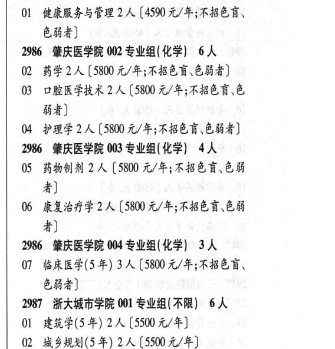

# 2986 肇庆医学院

- PDF页码：171
- 书内页码：220
- 专业组：4；专业条目：7

## 001专业组

- 选科要求：不限
- 招生计划：2 人
- 校验：ok

| 专业代码 | 专业名称 | 计划人数 | 学费（元/年） | 备注/完整OCR内容 |
|---|---|---:|---:|---|
| 01 | 健康服务与管理 | 2 | 4590 | 【4590 元/年;不招色育、 684) |

<details><summary>本专业组OCR原文</summary>

```text
2986 SERESR 001 专业组(不限】 2人
Ol 健康服务与管理 2 人【4590 元/年;不招色育、
684)
```
</details>

## 002专业组

- 选科要求：化学
- 招生计划：6 人
- 校验：sum-corrected

| 专业代码 | 专业名称 | 计划人数 | 学费（元/年） | 备注/完整OCR内容 |
|---|---|---:|---:|---|
| 02 | 药学 | 2 | 5800 | [5800 元/年;不招色育、色弱者] |
| 03 | 口腔医学技术 | 2 | 5800 | (5800 元/年;不招色育\.色 84) |
| 04 | 护理学 | 2 | 5800 | (5800 元/年;不招色盲、色弱者] |

<details><summary>本专业组OCR原文</summary>

```text
2986 PREF 02 专业组(化学) 6A
02 药学2人[5800 元/年;不招色育、色弱者]
03 口腔医学技术 2 人 (5800 元/年;不招色育\.色
84)
04 护理学2人 (5800 元/年;不招色盲、色弱者]
```
</details>

## 003专业组

- 选科要求：化学
- 招生计划：4 人
- 校验：ok

| 专业代码 | 专业名称 | 计划人数 | 学费（元/年） | 备注/完整OCR内容 |
|---|---|---:|---:|---|
| 05 | 药物制剂 | 2 | 5800 | 【5800 元/年;不招色盲.色弱 者] |
| 06 | 康复治疗学 | 2 |  | 【5800 4/4, FBER CH 4) |

<details><summary>本专业组OCR原文</summary>

```text
2986 ”秘庆医学院 003 专业组(化学) 4人
05 药物制剂 2 人【5800 元/年;不招色盲.色弱
者]
06 康复治疗学2 人【5800 4/4, FBER CH
4)
```
</details>

## 004专业组

- 选科要求：化学
- 招生计划：3 人
- 校验：review

| 专业代码 | 专业名称 | 计划人数 | 学费（元/年） | 备注/完整OCR内容 |
|---|---|---:|---:|---|
| 07 | 临床医学(5 年) 3A ( |  | 5800 | 5800 元/年;不招色盲、 684) |

<details><summary>本专业组OCR原文</summary>

```text
2986 REE 004 专业组(化学) 3人
07 临床医学(5 年) 3A (5800 元/年;不招色盲、
684)
```
</details>

## 附：院校完整OCR原文

```text
--- PDF第171页（书内第220页），第3栏 ---
2986 SERESR 001 专业组(不限】 2人
Ol 健康服务与管理 2 人【4590 元/年;不招色育、
684)
2986 PREF 02 专业组(化学) 6A
02 药学2人[5800 元/年;不招色育、色弱者]
03 口腔医学技术 2 人 (5800 元/年;不招色育\.色
84)
04 护理学2人 (5800 元/年;不招色盲、色弱者]
2986 ”秘庆医学院 003 专业组(化学) 4人
05 药物制剂 2 人【5800 元/年;不招色盲.色弱
者]
06 康复治疗学2 人【5800 4/4, FBER CH
4)
2986 REE 004 专业组(化学) 3人
07 临床医学(5 年) 3A (5800 元/年;不招色盲、
684)
```

## 源图

