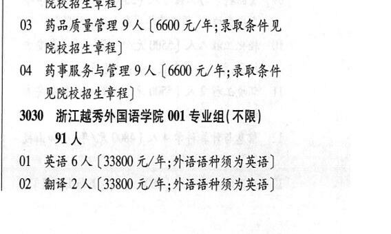

# 3025 浙江药科职业大学

- PDF页码：175
- 书内页码：224
- 专业组：1；专业条目：4

## 001专业组

- 选科要求：不限
- 招生计划：38 人
- 校验：ok

| 专业代码 | 专业名称 | 计划人数 | 学费（元/年） | 备注/完整OCR内容 |
|---|---|---:|---:|---|
| 01 | 药学 | 10 | 7590 | 【7590 元/年;录取条件见院校招生 章程] |
| 02 | 制药工程技术 | 10 | 6600 | 【6600 元/年;录取条件见 院校招生章程] |
| 03 | 药品质量管理 | 9 | 6600 | 【6600 元/年;录取条件见 院校招生章程] |
| 04 | 药事服务与管理 | 9 | 6600 | 【6600 元/年;录取条件 见院校招生章程] |

<details><summary>本专业组OCR原文</summary>

```text
3025 浙江药科职业大学 001 专业组(不限) 38 人
01 药学 10 人【7590 元/年;录取条件见院校招生
章程]
02 制药工程技术 10 人【6600 元/年;录取条件见
院校招生章程]
03 药品质量管理 9 人【6600 元/年;录取条件见
院校招生章程]
04 药事服务与管理 9 人【6600 元/年;录取条件
见院校招生章程]
```
</details>

## 附：院校完整OCR原文

```text
--- PDF第175页（书内第224页），第3栏 ---
3025 浙江药科职业大学 001 专业组(不限) 38 人
01 药学 10 人【7590 元/年;录取条件见院校招生
章程]
02 制药工程技术 10 人【6600 元/年;录取条件见
院校招生章程]
03 药品质量管理 9 人【6600 元/年;录取条件见
院校招生章程]
04 药事服务与管理 9 人【6600 元/年;录取条件
见院校招生章程]
```

## 源图

