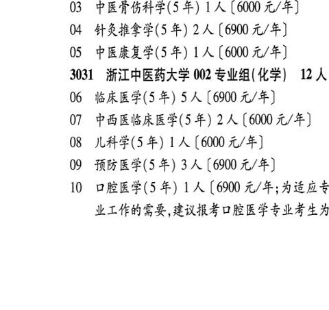
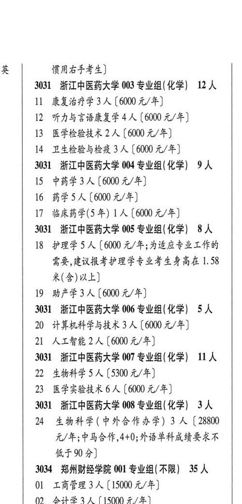

# 3031 浙江中医药大学

- PDF页码：176
- 书内页码：225
- 专业组：8；专业条目：24

## 001专业组

- 选科要求：化学
- 招生计划：OCR未稳定识别 人
- 校验：review

| 专业代码 | 专业名称 | 计划人数 | 学费（元/年） | 备注/完整OCR内容 |
|---|---|---:|---:|---|
| 01 | 中医学(5+3 一体化) (5 年) 1A ( |  | 6900 | 6900 元/年] |
| 02 | 中医学(5年) | 6 | 6900 | 【6900元/年] |
| 03 | ”中医骨伤科学(5 年) | 1 | 6000 | 【6000 元/年] |
| 04 | 针灸推拿学(5 年) | 2 | 6900 | 【6900元/年] |
| 05 | 中医康复学(5 年) | 1 | 6000 | 【6000 元/年] |

<details><summary>本专业组OCR原文</summary>

```text
3031 浙江中医药大学 001 专业组(化学) UA
Ol 中医学(5+3 一体化) (5 年) 1A (6900
元/年]
02 中医学(5年) 6 人【6900元/年]
03 ”中医骨伤科学(5 年) 1 人【6000 元/年]
04 针灸推拿学(5 年) 2 人【6900元/年]
05 中医康复学(5 年) 1 人【6000 元/年]
```
</details>

## 002专业组

- 选科要求：化学
- 招生计划：12 人
- 校验：review

| 专业代码 | 专业名称 | 计划人数 | 学费（元/年） | 备注/完整OCR内容 |
|---|---|---:|---:|---|
| 06 | 临床医学(5 年) 5A |  | 6900 | 6900 元/年] |
| 07 | 中西医临床医学(5年) | 2 | 6000 | 【6000 元/年] |
| 08 | 儿科学(5年) | 1 | 6000 | [6000元/年] |
| 09 | 预防医学(5年) | 3 | 6900 | 【6900元/年] |
| 10 | 口腔医学(5 年) 1A ( |  | 6900 | 6900 元/年;为适应专 业工作的需要,建议报考口腔医学专业考生为 英 惯用右手考生] ( |

<details><summary>本专业组OCR原文</summary>

```text
3031 浙江中医药大学 002 专业组(化学) 12 人
06 临床医学(5 年) 5A [6900 元/年]
07 中西医临床医学(5年) 2 人【6000 元/年]
08 儿科学(5年) 1 人[6000元/年]
09 预防医学(5年) 3 人【6900元/年]
10 口腔医学(5 年) 1A (6900 元/年;为适应专
业工作的需要,建议报考口腔医学专业考生为
英     惯用右手考生]               (
```
</details>

## 003专业组

- 选科要求：化学
- 招生计划：12 人
- 校验：review

| 专业代码 | 专业名称 | 计划人数 | 学费（元/年） | 备注/完整OCR内容 |
|---|---|---:|---:|---|
| 11 | 康复治疗学 | 3 | 6000 | 【6000元/年] |
| 12 | 听力与言语康复学 | 4 | 6000 | 【6000 元/年] ( |
| 13 | 医学检验技术 | 2 | 6000 | 【6000 元/年] |
| 14 | 卫生检验与检疫 3 ( |  | 600 | 600 元/年] |

<details><summary>本专业组OCR原文</summary>

```text
3031 浙江中医药大学 003 专业组(化学) 12 人
11 康复治疗学3人【6000元/年]
12 听力与言语康复学4 人【6000 元/年]      (
13 医学检验技术 2 人【6000 元/年]
14 卫生检验与检疫 3 (600 元/年]
```
</details>

## 004专业组

- 选科要求：化学
- 招生计划：9 人
- 校验：sum-corrected

| 专业代码 | 专业名称 | 计划人数 | 学费（元/年） | 备注/完整OCR内容 |
|---|---|---:|---:|---|
| 15 | 中药学 | 3 | 6000 | 【6000元/年] |
| 16 | 药学 | 5 | 6000 | [6000元/年] |
| 17 | 临床药学(5 年) | 1 | 6000 | 【6000元/年] ] |

<details><summary>本专业组OCR原文</summary>

```text
3031 浙江中医药大学 004 专业组(化学) IA
15 中药学3人【6000元/年]
16 药学5人[6000元/年]
17 临床药学(5 年) 1 人【6000元/年]         ]
```
</details>

## 005专业组

- 选科要求：化学
- 招生计划：OCR未稳定识别 人
- 校验：review

| 专业代码 | 专业名称 | 计划人数 | 学费（元/年） | 备注/完整OCR内容 |
|---|---|---:|---:|---|
| 18 | 护理学 | 5 | 6000 | 【6000 元/年;为适应专业工作的 需要,建议报考护理学专业考生身高在 1.58 米(含)以上] |
| 19 | HEEZA (6000 4/4) |  |  | 19 HEEZA (6000 4/4) |

<details><summary>本专业组OCR原文</summary>

```text
3031 浙江中医药大学 005 专业组(化学) 8A 需要,建议报考护理学专业考生身高在 1.58
18 护理学5人【6000 元/年;为适应专业工作的
需要,建议报考护理学专业考生身高在 1.58
米(含)以上]
19 HEEZA (6000 4/4)
```
</details>

## 006专业组

- 选科要求：化学
- 招生计划：5 人
- 校验：ok

| 专业代码 | 专业名称 | 计划人数 | 学费（元/年） | 备注/完整OCR内容 |
|---|---|---:|---:|---|
| 20 | 计算机科学与技术 | 3 | 6000 | 【6000 元/年] |
| 21 | 人工智能 | 2 | 6000 | 【6000元/年] |

<details><summary>本专业组OCR原文</summary>

```text
3031 浙江中医药大学 006 专业组(化学) 5 人   :
20 计算机科学与技术3 人【6000 元/年]
21 人工智能2人【6000元/年]
```
</details>

## 007专业组

- 选科要求：化学
- 招生计划：11 人
- 校验：sum-corrected

| 专业代码 | 专业名称 | 计划人数 | 学费（元/年） | 备注/完整OCR内容 |
|---|---|---:|---:|---|
| 22 | 生物科学 | 5 |  | (5300 4/4) |
| 23 | 医学实验技术 | 6 | 6000 | 【6000 元/年] |

<details><summary>本专业组OCR原文</summary>

```text
3031 浙江中医药大学 007 专业组( 化学) UWA
22 生物科学5人 (5300 4/4)
23 医学实验技术6 人【6000 元/年]
```
</details>

## 008专业组

- 选科要求：化学
- 招生计划：3 人
- 校验：ok

| 专业代码 | 专业名称 | 计划人数 | 学费（元/年） | 备注/完整OCR内容 |
|---|---|---:|---:|---|
| 24 | 生物科学(中外合作办学) | 3 | 28800 | 【28800 元/年;中马合作,4+0; 外语单科成绩要求不 KF 90H) : |

<details><summary>本专业组OCR原文</summary>

```text
3031 浙江中医药大学 008 专业组(化学) 3 人
24 生物科学(中外合作办学) 3 人【28800
元/年;中马合作,4+0; 外语单科成绩要求不
KF 90H)                :
```
</details>

## 附：院校完整OCR原文

```text
--- PDF第176页（书内第225页），第1栏 ---
3031 浙江中医药大学 001 专业组(化学) UA
Ol 中医学(5+3 一体化) (5 年) 1A (6900
元/年]
02 中医学(5年) 6 人【6900元/年]
03 ”中医骨伤科学(5 年) 1 人【6000 元/年]
04 针灸推拿学(5 年) 2 人【6900元/年]
05 中医康复学(5 年) 1 人【6000 元/年]
3031 浙江中医药大学 002 专业组(化学) 12 人
06 临床医学(5 年) 5A [6900 元/年]
07 中西医临床医学(5年) 2 人【6000 元/年]
08 儿科学(5年) 1 人[6000元/年]
09 预防医学(5年) 3 人【6900元/年]
10 口腔医学(5 年) 1A (6900 元/年;为适应专
业工作的需要,建议报考口腔医学专业考生为

--- PDF第176页（书内第225页），第2栏 ---
英     惯用右手考生]               (
3031 浙江中医药大学 003 专业组(化学) 12 人
11 康复治疗学3人【6000元/年]
12 听力与言语康复学4 人【6000 元/年]      (
13 医学检验技术 2 人【6000 元/年]
14 卫生检验与检疫 3 (600 元/年]
3031 浙江中医药大学 004 专业组(化学) IA
15 中药学3人【6000元/年]
16 药学5人[6000元/年]
17 临床药学(5 年) 1 人【6000元/年]         ]
3031 浙江中医药大学 005 专业组(化学) 8A
18 护理学5人【6000 元/年;为适应专业工作的
需要,建议报考护理学专业考生身高在 1.58
米(含)以上]
19 HEEZA (6000 4/4)
3031 浙江中医药大学 006 专业组(化学) 5 人   :
20 计算机科学与技术3 人【6000 元/年]
21 人工智能2人【6000元/年]
3031 浙江中医药大学 007 专业组( 化学) UWA
22 生物科学5人 (5300 4/4)
23 医学实验技术6 人【6000 元/年]
3031 浙江中医药大学 008 专业组(化学) 3 人
24 生物科学(中外合作办学) 3 人【28800
元/年;中马合作,4+0; 外语单科成绩要求不
KF 90H)                :
```

## 源图


