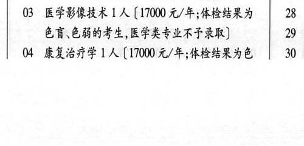
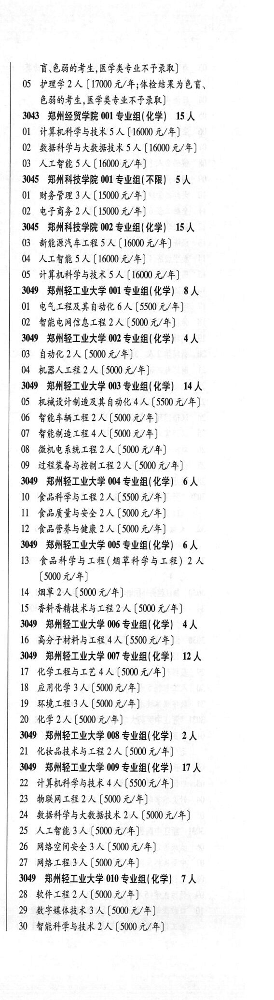

# 3042 郑州健康学院

- PDF页码：177
- 书内页码：226
- 专业组：1；专业条目：4

## 001专业组

- 选科要求：化学
- 招生计划：6 人
- 校验：review

| 专业代码 | 专业名称 | 计划人数 | 学费（元/年） | 备注/完整OCR内容 |
|---|---|---:|---:|---|
| 02 | 医学检验技术 1A ( |  | 1700 | 1700 元/年;体检结果为 27 \| 色盲、色有弱的考生,医学类专业不予录取] 3049 |
| 03 | 医学影像技术 | 1 | 17000 | 【17000 元/年;体检结果为 28 \| 色盲\色能的考生,医学类专业不予录取] 29: |
| 04 | 康复治疗学 | 1 | 17000 | 【17000 元/年;体检结果为色 30 7 讶色弱的考生,医学类专业不予录取] |
| 05 | 护理学 2 ( |  | 17000 | 17000 元/年;体检结果为色盲、 色弱的考生,医学类专业不予录取] |

<details><summary>本专业组OCR原文</summary>

```text
3042 郑州健康学院 001 专业组(化学) 6人    24
02 医学检验技术 1A (1700 元/年;体检结果为   27 |
色盲、色有弱的考生,医学类专业不予录取]     3049
03 医学影像技术 1 人【17000 元/年;体检结果为   28 |
色盲\色能的考生,医学类专业不予录取]     29:
04 康复治疗学 1 人【17000 元/年;体检结果为色   30 7
讶色弱的考生,医学类专业不予录取]
05 护理学 2 (17000 元/年;体检结果为色盲、
色弱的考生,医学类专业不予录取]
```
</details>

## 附：院校完整OCR原文

```text
--- PDF第177页（书内第226页），第2栏 ---
3042 郑州健康学院 001 专业组(化学) 6人    24
OL 药学1人【17000 元/年;体检结果为色盲\色   5,
HUFL, RFRELAF RK)       26 |
02 医学检验技术 1A (1700 元/年;体检结果为   27 |
色盲、色有弱的考生,医学类专业不予录取]     3049
03 医学影像技术 1 人【17000 元/年;体检结果为   28 |
色盲\色能的考生,医学类专业不予录取]     29:
04 康复治疗学 1 人【17000 元/年;体检结果为色   30 7

--- PDF第177页（书内第226页），第3栏 ---
讶色弱的考生,医学类专业不予录取]
05 护理学 2 (17000 元/年;体检结果为色盲、
色弱的考生,医学类专业不予录取]
```

## 源图


