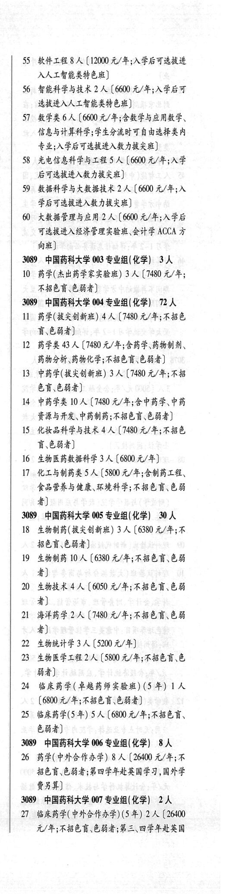
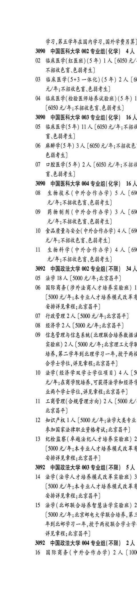

# 3089 中国药科大学

- PDF页码：185, 186
- 书内页码：234, 235
- 专业组：5；专业条目：18

## 003专业组

- 选科要求：化学
- 招生计划：3 人
- 校验：ok

| 专业代码 | 专业名称 | 计划人数 | 学费（元/年） | 备注/完整OCR内容 |
|---|---|---:|---:|---|
| 10 | 药学(杰出药学家实验班) | 3 | 7480 | 【7480 元/年 ABER EHS) |

<details><summary>本专业组OCR原文</summary>

```text
3089 中国药科大学 003 专业组(化学) 3人
10 药学(杰出药学家实验班) 3 人【7480 元/年
ABER EHS)
```
</details>

## 004专业组

- 选科要求：化学
- 招生计划：72 人
- 校验：ok

| 专业代码 | 专业名称 | 计划人数 | 学费（元/年） | 备注/完整OCR内容 |
|---|---|---:|---:|---|
| 11 | 药学(拔失创新班) | 4 | 7480 | 【7480 元/年;不招色 F684) |
| 12 | 药学类 | 43 | 7480 | 【7480 元/年;含药学、药物制剂、 药物分析、药物化学;不招色盲、色弱者] |
| 13 | 中药学(拔失创新班) | 3 | 7480 | 【7480 元/年;不招 色盲\色弱者] |
| 14 | 中药学类 | 10 | 7480 | 【7480 元/年;含中药学、中药 资源与开发、中药制药;不招色言\色弱者] |
| 15 | ”化妆品科学与技术 | 4 | 7480 | 【7480 元/年;不招色 F684) |
| 16 | 生物医药教据科学 | 3 | 6800 | 【6800 元/年] |
| 17 | 化工与制药类 | 5 | 5800 | 【5800 元/年;仿制药工程、 食品营养与健康、环境科学;不招色盲色弱 者] |

<details><summary>本专业组OCR原文</summary>

```text
3089 中国药科大学 004 专业组(化学) 72 人
11 药学(拔失创新班) 4 人【7480 元/年;不招色
F684)
12 药学类 43 人【7480 元/年;含药学、药物制剂、
药物分析、药物化学;不招色盲、色弱者]
13 中药学(拔失创新班) 3 人【7480 元/年;不招
色盲\色弱者]
14 中药学类 10 人【7480 元/年;含中药学、中药
资源与开发、中药制药;不招色言\色弱者]
15 ”化妆品科学与技术4 人【7480 元/年;不招色
F684)
16 生物医药教据科学 3 人【6800 元/年]
17 化工与制药类 5 人【5800 元/年;仿制药工程、
食品营养与健康、环境科学;不招色盲色弱
者]
```
</details>

## 005专业组

- 选科要求：化学
- 招生计划：30 人
- 校验：ok

| 专业代码 | 专业名称 | 计划人数 | 学费（元/年） | 备注/完整OCR内容 |
|---|---|---:|---:|---|
| 18 | 生物制药(拔失创新班) | 3 | 6380 | 【6380 元/年;不 招色盲\色弱者] |
| 19 | 生物制药 | 10 | 6380 | 【6380 元/年;不招色盲、色弱 者] |
| 20 | 生物技术 | 4 | 6050 | 【6050 元/年;不招色盲色弱 4) |
| 21 | 海洋药学 | 2 | 7480 | 【7480 元/年;不招色讶色弱 者] |
| 22 | ”生物统计学 | 3 |  | 【5200 4/4) |
| 23 | “生物医学工程 | 2 | 5800 | (5800 元/年;不招色盲、色 84) |
| 24 | 临床药学(卓越药师实验班) (5 年) | 1 | 6800 | [6800 元/年;不招色盲\色弱者] |
| 25 | 临床药学(5年) | 5 | 6800 | [6800 元/年;不招色言、 色弱者] |

<details><summary>本专业组OCR原文</summary>

```text
3089 中国药科大学 005 专业组(化学) 30 人
18 生物制药(拔失创新班) 3 人【6380 元/年;不
招色盲\色弱者]
19 生物制药 10 人【6380 元/年;不招色盲、色弱
者]
20 生物技术 4 人【6050 元/年;不招色盲色弱
4)
21 海洋药学 2 人【7480 元/年;不招色讶色弱
者]
22 ”生物统计学 3 人【5200 4/4)
23 “生物医学工程 2人 (5800 元/年;不招色盲、色
84)
24 临床药学(卓越药师实验班) (5 年) 1 人
[6800 元/年;不招色盲\色弱者]
25 临床药学(5年) 5 人[6800 元/年;不招色言、
色弱者]
```
</details>

## 006专业组

- 选科要求：化学
- 招生计划：8 人
- 校验：ok

| 专业代码 | 专业名称 | 计划人数 | 学费（元/年） | 备注/完整OCR内容 |
|---|---|---:|---:|---|
| 26 | 药学(中外合作办学) | 8 | 26400 | 【26400 元/年;不 招色谨、色弱者;第四学年赴英国学习,国外学 费另算] |

<details><summary>本专业组OCR原文</summary>

```text
3089 中国药科大学 006 专业组(化学) 8人
26 药学(中外合作办学) 8 人【26400 元/年;不
招色谨、色弱者;第四学年赴英国学习,国外学
费另算]
```
</details>

## 007专业组

- 选科要求：化学
- 招生计划：2 人
- 校验：ok

| 专业代码 | 专业名称 | 计划人数 | 学费（元/年） | 备注/完整OCR内容 |
|---|---|---:|---:|---|
| 27 | 临床药学(中外合作办学) (5年) | 2 | 26400 | [26400 元/年;不招色盲色弱者;第三\四学年赴英国 学习,第五学年在国内学习,国外学费另算) |

<details><summary>本专业组OCR原文</summary>

```text
3089 中国药科大学 007 专业组(化学) 2 人
27 临床药学(中外合作办学) (5年) 2 人[26400
元/年;不招色盲色弱者;第三\四学年赴英国
学习,第五学年在国内学习,国外学费另算)
```
</details>

## 附：院校完整OCR原文

```text
--- PDF第185页（书内第234页），第3栏 ---
3089 中国药科大学 003 专业组(化学) 3人
10 药学(杰出药学家实验班) 3 人【7480 元/年
ABER EHS)
3089 中国药科大学 004 专业组(化学) 72 人
11 药学(拔失创新班) 4 人【7480 元/年;不招色
F684)
12 药学类 43 人【7480 元/年;含药学、药物制剂、
药物分析、药物化学;不招色盲、色弱者]
13 中药学(拔失创新班) 3 人【7480 元/年;不招
色盲\色弱者]
14 中药学类 10 人【7480 元/年;含中药学、中药
资源与开发、中药制药;不招色言\色弱者]
15 ”化妆品科学与技术4 人【7480 元/年;不招色
F684)
16 生物医药教据科学 3 人【6800 元/年]
17 化工与制药类 5 人【5800 元/年;仿制药工程、
食品营养与健康、环境科学;不招色盲色弱
者]
3089 中国药科大学 005 专业组(化学) 30 人
18 生物制药(拔失创新班) 3 人【6380 元/年;不
招色盲\色弱者]
19 生物制药 10 人【6380 元/年;不招色盲、色弱
者]
20 生物技术 4 人【6050 元/年;不招色盲色弱
4)
21 海洋药学 2 人【7480 元/年;不招色讶色弱
者]
22 ”生物统计学 3 人【5200 4/4)
23 “生物医学工程 2人 (5800 元/年;不招色盲、色
84)
24 临床药学(卓越药师实验班) (5 年) 1 人
[6800 元/年;不招色盲\色弱者]
25 临床药学(5年) 5 人[6800 元/年;不招色言、
色弱者]
3089 中国药科大学 006 专业组(化学) 8人
26 药学(中外合作办学) 8 人【26400 元/年;不
招色谨、色弱者;第四学年赴英国学习,国外学
费另算]
3089 中国药科大学 007 专业组(化学) 2 人
27 临床药学(中外合作办学) (5年) 2 人[26400
元/年;不招色盲色弱者;第三\四学年赴英国

--- PDF第186页（书内第235页），第1栏 ---
学习,第五学年在国内学习,国外学费另算)
```

## 源图


