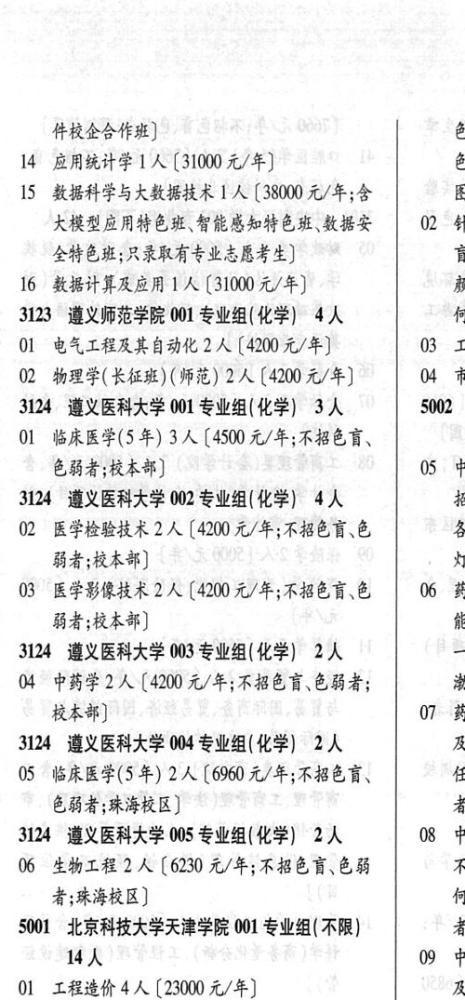

# 3124 遵义医科大学

- PDF页码：189
- 书内页码：238
- 专业组：5；专业条目：10

## 001专业组

- 选科要求：化学
- 招生计划：3 人
- 校验：review

| 专业代码 | 专业名称 | 计划人数 | 学费（元/年） | 备注/完整OCR内容 |
|---|---|---:|---:|---|
|  | 结构化OCR未稳定切分，请查看下方原文及源图 |  |  |  |

<details><summary>本专业组OCR原文</summary>

```text
3124 遵义医科大学 001 专业组(化学) 3 人    5002 :
OL 临床医学(5 年) 3 人【4500 元/年;不招色言、     |
色弱者;校本部]             05 中
```
</details>

## 002专业组

- 选科要求：化学
- 招生计划：4 人
- 校验：review

| 专业代码 | 专业名称 | 计划人数 | 学费（元/年） | 备注/完整OCR内容 |
|---|---|---:|---:|---|
| 02 | 医学检验技术 | 2 | 4200 | 【4200 元/年;不招色育\色 各 BA RAR) a, |
| 03 | 医学影像技术 2A ( |  | 4200 | 4200 元/年;不招色育、色 06 欧， Ba RAR) at: |

<details><summary>本专业组OCR原文</summary>

```text
3124 遵义医科大学 002 专业组(化学) 4人      招
02 医学检验技术 2 人【4200 元/年;不招色育\色    各
BA RAR)                a,
03 医学影像技术 2A (4200 元/年;不招色育、色   06 欧，
Ba RAR)                at:
```
</details>

## 003专业组

- 选科要求：OCR未稳定识别
- 招生计划：2 人
- 校验：ok

| 专业代码 | 专业名称 | 计划人数 | 学费（元/年） | 备注/完整OCR内容 |
|---|---|---:|---:|---|
| 04 | 中药学 | 2 | 4200 | 【4200 元/年;不招色盲、色弱者; wi 校本部] 07 药: |

<details><summary>本专业组OCR原文</summary>

```text
3124 遵义医科大学 003 专业组(化学| 2人      oo
04 中药学2 人【4200 元/年;不招色盲、色弱者;     wi
校本部]                07 药:
```
</details>

## 004专业组

- 选科要求：化学
- 招生计划：2 人
- 校验：ok

| 专业代码 | 专业名称 | 计划人数 | 学费（元/年） | 备注/完整OCR内容 |
|---|---|---:|---:|---|
| 05 | 临床医学(5年) | 2 | 6960 | 【6960 元/年;不招色育、 任人 色弱者;珠海校区] 者 |

<details><summary>本专业组OCR原文</summary>

```text
3124 遵义医科大学 04 专业组(化学) 2人      及
05 临床医学(5年) 2 人【6960 元/年;不招色育、    任人
色弱者;珠海校区]               者
```
</details>

## 005专业组

- 选科要求：化学
- 招生计划：2 人
- 校验：review

| 专业代码 | 专业名称 | 计划人数 | 学费（元/年） | 备注/完整OCR内容 |
|---|---|---:|---:|---|
| 06 | 生物工程 | 2 | 6230 | 【6230 元/年;不招色盲、色弱 不 者;珠海校区] 何- S001 北京科技大学天津学院 001 专业组( 不限) 者; WA 09 中 |
| 01 | 工程造价 | 4 | 23000 | 【23000 元/年] Be |
| 02 | ”国际经济与贸易 | 2 | 19000 | 【19000 元/年] te |
| 03 | HFA 3 A (19000 4/4) 者 |  |  | 03 HFA 3 A (19000 4/4) 者; |
| 04 | SRLB 3A (19000 4/#) 10 B |  |  | 04 SRLB 3A (19000 4/#) 10 B |
| 05 | 知识产权 | 2 | 19000 | 【19000 元/年] 色; |

<details><summary>本专业组OCR原文</summary>

```text
3124 遵义医科大学 005 专业组(化学) 2人    08 中
06 生物工程 2 人【6230 元/年;不招色盲、色弱     不
者;珠海校区]                何-
S001 北京科技大学天津学院 001 专业组( 不限)     者;
WA                09 中
01 工程造价4 人【23000 元/年]          Be
02 ”国际经济与贸易 2 人【19000 元/年]        te
03 HFA 3 A (19000 4/4)           者;
04 SRLB 3A (19000 4/#)         10 B
05 知识产权2 人【19000 元/年]           色;
```
</details>

## 附：院校完整OCR原文

```text
--- PDF第189页（书内第238页），第2栏 ---
3124 遵义医科大学 001 专业组(化学) 3 人    5002 :
OL 临床医学(5 年) 3 人【4500 元/年;不招色言、     |
色弱者;校本部]             05 中
3124 遵义医科大学 002 专业组(化学) 4人      招
02 医学检验技术 2 人【4200 元/年;不招色育\色    各
BA RAR)                a,
03 医学影像技术 2A (4200 元/年;不招色育、色   06 欧，
Ba RAR)                at:
3124 遵义医科大学 003 专业组(化学| 2人      oo
04 中药学2 人【4200 元/年;不招色盲、色弱者;     wi
校本部]                07 药:
3124 遵义医科大学 04 专业组(化学) 2人      及
05 临床医学(5年) 2 人【6960 元/年;不招色育、    任人
色弱者;珠海校区]               者
3124 遵义医科大学 005 专业组(化学) 2人    08 中
06 生物工程 2 人【6230 元/年;不招色盲、色弱     不
者;珠海校区]                何-
S001 北京科技大学天津学院 001 专业组( 不限)     者;
WA                09 中
01 工程造价4 人【23000 元/年]          Be
02 ”国际经济与贸易 2 人【19000 元/年]        te
03 HFA 3 A (19000 4/4)           者;
04 SRLB 3A (19000 4/#)         10 B
05 知识产权2 人【19000 元/年]           色;
```

## 源图

