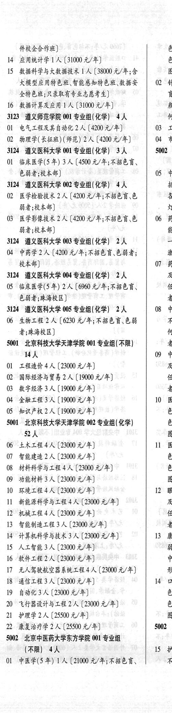
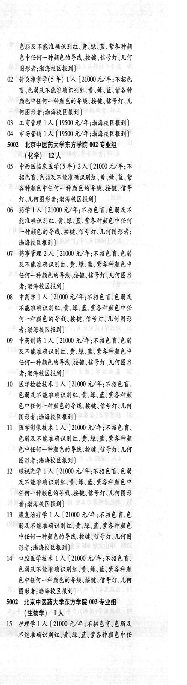
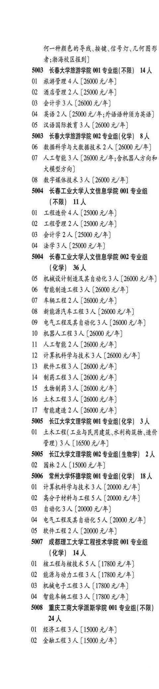

# 5002 北京中医药大学东方学院

- PDF页码：189, 190
- 书内页码：238, 239
- 专业组：4；专业条目：28

## 001专业组

- 选科要求：化学
- 招生计划：3 人
- 校验：review

| 专业代码 | 专业名称 | 计划人数 | 学费（元/年） | 备注/完整OCR内容 |
|---|---|---:|---:|---|
| 02 | 医学检验技术 | 2 | 4200 | 【4200 元/年;不招色育\色 各 BA RAR) a, |
| 03 | 医学影像技术 2A (4200 元/年;不招色育、色 06 欧， Ba RAR) at: 3124 遵义医科大学 003 专业组(化学\| | 2 | 4200 | oo |
| 04 | 中药学 | 2 | 4200 | 【4200 元/年;不招色盲、色弱者; wi 校本部] 07 药: 3124 遵义医科大学 04 专业组(化学) 2人 及 |
| 05 | 临床医学(5年) | 2 | 6960 | 【6960 元/年;不招色育、 任人 色弱者;珠海校区] 者 3124 遵义医科大学 005 专业组(化学) 2人 08 中 |
| 06 | 生物工程 | 2 | 6230 | 【6230 元/年;不招色盲、色弱 不 者;珠海校区] 何- S001 北京科技大学天津学院 001 专业组( 不限) 者; WA 09 中 |
| 01 | 工程造价 | 4 | 23000 | 【23000 元/年] Be |
| 02 | ”国际经济与贸易 | 2 | 19000 | 【19000 元/年] te |
| 03 | HFA 3 A (19000 4/4) 者 |  |  | 03 HFA 3 A (19000 4/4) 者; |
| 04 | SRLB 3A (19000 4/#) 10 B |  |  | 04 SRLB 3A (19000 4/#) 10 B |
| 05 | 知识产权 | 2 | 19000 | 【19000 元/年] 色; 5001 北京科技大学天津学院 002 专业组( 化学) a 524 Bi |
| 06 | 土木工程 | 4 |  | 【23000 4/4) ll B: |
| 07 | 智能建造 | 2 | 23000 | 【23000 元/年] 色; |
| 08 | 材料科学与工程 | 4 | 23000 | 【23000元/年] 色， |
| 09 | 功能材料 | 3 | 23000 | 【23000 元/年] 图; |
| 10 | 环境工程 | 4 | 23000 | 【23000 元/年] 12 RA |
| 11 | 新能源科学与工程 | 4 | 23000 | [23000 元/年] Be |
| 12 | “机械工程 | 4 | 23000 | 【23000 元/年] 任人 |
| 13 | 才能制造工程 | 3 | 23000 | 【23000元/年] 者; |
| 14 | “计算机科学与技术 | 3 | 23000 | 【23000 元/年] 13 康; |
| 15 | AL He | 3 | 23000 | 【23000元/年] B) |
| 16 | “软件工程 | 2 | 23000 | 【23000元/年] 中4 |
| 17 | 无人轰驶航空器系统工程 | 4 | 23000 | 【23000 元/年] 形: |
| 18 | 通信工程 | 3 | 23000 | 【23000元/年] 14 vf |
| 19 | 自动化 | 3 | 23000 | 【23000元/年] 6) |
| 20 | 飞行器设计与工程2 ( |  | 23000 | 23000 元/年] 色 |
| 21 | 护理学 | 2 | 25500 | 【25500 元/年] 图; |
| 22 | 康复治疗学 | 2 | 25500 | 【25500元/年] 5002 3 |

<details><summary>本专业组OCR原文</summary>

```text
3124 遵义医科大学 001 专业组(化学) 3 人    5002 :
OL 临床医学(5 年) 3 人【4500 元/年;不招色言、     |
色弱者;校本部]             05 中
3124 遵义医科大学 002 专业组(化学) 4人      招
02 医学检验技术 2 人【4200 元/年;不招色育\色    各
BA RAR)                a,
03 医学影像技术 2A (4200 元/年;不招色育、色   06 欧，
Ba RAR)                at:
3124 遵义医科大学 003 专业组(化学| 2人      oo
04 中药学2 人【4200 元/年;不招色盲、色弱者;     wi
校本部]                07 药:
3124 遵义医科大学 04 专业组(化学) 2人      及
05 临床医学(5年) 2 人【6960 元/年;不招色育、    任人
色弱者;珠海校区]               者
3124 遵义医科大学 005 专业组(化学) 2人    08 中
06 生物工程 2 人【6230 元/年;不招色盲、色弱     不
者;珠海校区]                何-
S001 北京科技大学天津学院 001 专业组( 不限)     者;
WA                09 中
01 工程造价4 人【23000 元/年]          Be
02 ”国际经济与贸易 2 人【19000 元/年]        te
03 HFA 3 A (19000 4/4)           者;
04 SRLB 3A (19000 4/#)         10 B
05 知识产权2 人【19000 元/年]           色;
5001 北京科技大学天津学院 002 专业组( 化学)     a
524                   Bi
06 土木工程4人【23000 4/4)         ll B:
07 智能建造2 人【23000 元/年]           色;
08 材料科学与工程4人【23000元/年]         色，
09 功能材料3 人【23000 元/年]           图;
10 环境工程4人【23000 元/年]         12 RA
11 新能源科学与工程4人[23000 元/年]       Be
12 “机械工程4人【23000 元/年]           任人
13 才能制造工程3人【23000元/年]        者;
14 “计算机科学与技术3 人【23000 元/年]      13 康;
15 AL He 3 人【23000元/年]           B)
16 “软件工程2人【23000元/年]           中4
17 无人轰驶航空器系统工程4人【23000 元/年]     形:
18 通信工程3 人【23000元/年]        14 vf
19 自动化3人【23000元/年]           6)
20 飞行器设计与工程2 (23000 元/年]        色
21 护理学 2 人【25500 元/年]           图;
22 康复治疗学2 人【25500元/年]        5002 3
```
</details>

## 001专业组

- 选科要求：(AR
- 招生计划：4 人
- 校验：review

| 专业代码 | 专业名称 | 计划人数 | 学费（元/年） | 备注/完整OCR内容 |
|---|---|---:|---:|---|
| 01 | 中医学(5 #) 1A ( |  | 21000 | 21000 元/年;不招色言、 不人 色弱及不能准确识别红、黄、绿、蓝此各种颜 色中任何一种颜色的导线按键、信号灯\几何 图形者;渤海校区报到] 2 针灸推拿学(5 年) 1A (21000 元/年;不招色 讶色弱及不能准确识别红、黄\绿、蓝、紫各种 颜色中任何一种颜色的导线、按键、信号灯\几 何图形者;渤海校区报到] B 工商管理 1 (19500 元/年;渤海校区报到] 性 市场营销 ] 人[19500 元/年;渤海校区报到] |

<details><summary>本专业组OCR原文</summary>

```text
5002 北京中医药大学东方学院 001 专业组        ( (AR) 4人              15 #3
01 中医学(5 #) 1A (21000 元/年;不招色言、    不人
色弱及不能准确识别红、黄、绿、蓝此各种颜
色中任何一种颜色的导线按键、信号灯\几何
图形者;渤海校区报到]
2 针灸推拿学(5 年) 1A (21000 元/年;不招色
讶色弱及不能准确识别红、黄\绿、蓝、紫各种
颜色中任何一种颜色的导线、按键、信号灯\几
何图形者;渤海校区报到]
B 工商管理 1 (19500 元/年;渤海校区报到]
性 市场营销 ] 人[19500 元/年;渤海校区报到]
```
</details>

## 002专业组

- 选科要求：OCR未稳定识别
- 招生计划：OCR未稳定识别 人
- 校验：review

| 专业代码 | 专业名称 | 计划人数 | 学费（元/年） | 备注/完整OCR内容 |
|---|---|---:|---:|---|
|  | 结构化OCR未稳定切分，请查看下方原文及源图 |  |  |  |

<details><summary>本专业组OCR原文</summary>

```text
1002 北京中医药大学东方学院 002 专业组 (化学| 卫人
(化学| 卫人
5 中西医临床医学(5年) 2A (21000 元/年;不
招色盲、色弱及不能准确识别红、黄、绿、蓝此
各种颜色中任何一种颜色的导线按键、信和号
灯\几何图形者;渤海校区报到]
6 药学1人【21000 元/年;不招色言\色弱及不
能准确识别红、黄、绿、蓝、紫各种颜色中任何
一种颜色的导线、按键、信号灯\几何图形者;
HAR ER)
1 药事管理 2 人【21000 元/年;不招色盲色弱
及不能准确识别红、黄、绿、蓝、紫各种颜色中
任何一种颜色的导线\按键、信号灯\几何图形
者;渤海校区报到]
8 中药学1 人【21000 元/年;不招色盲.色弱及
不能准确识别红\黄\绿、蓝、紫各种颜色中任
何一种颜色的导线、按键、信号灯\几何图形
者;渤海校区报到]
9 中药制药 ] 人【21000 元/年;不招色盲色弱
及不能准确识别红、黄\绿、蓝、紫各种颜色中
任何一种颜色的导线\按键、信号灯\几何图形
者;渤海校区报到]
0 医学检验技术 1 人【21000 元/年;不招色盲、
色弱及不能准确识别红、黄\绿、蓝、紫各种颜
色中任何一种颜色的导线\按键、信号灯\几何
图形者;渤海校区报到]
1 医学影像技术 1 人【21000 元/年;不招色盲、
色弱及不能准确识别红、黄\绿、蓝、紫各种颜
色中任何一种颜色的导线、按键、信号灯\几何
图形者;渤海校区报到]
2 RAKE 1A (2100 元/年;不招色盲、色弱
及不能准确识别红\黄\绿、蓝、紫各种颜色中
MAREN TR BRET LADY
者;渤海校区报到]
3 康复治疗学 1 人[21000 元/年;不招色言\色
弱及不能准确识别红、黄\绿、蓝、此各种颜色
中任何一种颜色的导线\按键、信号灯\几何图
形者;渤海校区报到]
4 口腔医学技术 1 人【21000 元/年;不招色言、
色弱及不能准确识别红、黄\绿、蓝、紫各种颜
色中任何一种颜色的导线按键、信号灯\几何
RUF MERE)
```
</details>

## 003专业组

- 选科要求：OCR未稳定识别
- 招生计划：OCR未稳定识别 人
- 校验：review

| 专业代码 | 专业名称 | 计划人数 | 学费（元/年） | 备注/完整OCR内容 |
|---|---|---:|---:|---|
|  | 结构化OCR未稳定切分，请查看下方原文及源图 |  |  |  |

<details><summary>本专业组OCR原文</summary>

```text
002 北京中医药大学东方学院 003 专业组 (生物学| 工人
(生物学| 工人
5 护理学1人【21000 元/年;不招色盲、色弱及
不能准确识别红、黄\绿、蓝、紫各种颜色中任
何一种颜色的导线按键、信号灯\几何图形
者;渤海校区报到]
```
</details>

## 附：院校完整OCR原文

```text
--- PDF第189页（书内第238页），第2栏 ---
3124 遵义医科大学 001 专业组(化学) 3 人    5002 :
OL 临床医学(5 年) 3 人【4500 元/年;不招色言、     |
色弱者;校本部]             05 中
3124 遵义医科大学 002 专业组(化学) 4人      招
02 医学检验技术 2 人【4200 元/年;不招色育\色    各
BA RAR)                a,
03 医学影像技术 2A (4200 元/年;不招色育、色   06 欧，
Ba RAR)                at:
3124 遵义医科大学 003 专业组(化学| 2人      oo
04 中药学2 人【4200 元/年;不招色盲、色弱者;     wi
校本部]                07 药:
3124 遵义医科大学 04 专业组(化学) 2人      及
05 临床医学(5年) 2 人【6960 元/年;不招色育、    任人
色弱者;珠海校区]               者
3124 遵义医科大学 005 专业组(化学) 2人    08 中
06 生物工程 2 人【6230 元/年;不招色盲、色弱     不
者;珠海校区]                何-
S001 北京科技大学天津学院 001 专业组( 不限)     者;
WA                09 中
01 工程造价4 人【23000 元/年]          Be
02 ”国际经济与贸易 2 人【19000 元/年]        te
03 HFA 3 A (19000 4/4)           者;
04 SRLB 3A (19000 4/#)         10 B
05 知识产权2 人【19000 元/年]           色;
5001 北京科技大学天津学院 002 专业组( 化学)     a
524                   Bi
06 土木工程4人【23000 4/4)         ll B:
07 智能建造2 人【23000 元/年]           色;
08 材料科学与工程4人【23000元/年]         色，
09 功能材料3 人【23000 元/年]           图;
10 环境工程4人【23000 元/年]         12 RA
11 新能源科学与工程4人[23000 元/年]       Be
12 “机械工程4人【23000 元/年]           任人
13 才能制造工程3人【23000元/年]        者;
14 “计算机科学与技术3 人【23000 元/年]      13 康;
15 AL He 3 人【23000元/年]           B)
16 “软件工程2人【23000元/年]           中4
17 无人轰驶航空器系统工程4人【23000 元/年]     形:
18 通信工程3 人【23000元/年]        14 vf
19 自动化3人【23000元/年]           6)
20 飞行器设计与工程2 (23000 元/年]        色
21 护理学 2 人【25500 元/年]           图;
22 康复治疗学2 人【25500元/年]        5002 3
5002 北京中医药大学东方学院 001 专业组        (
(AR) 4人              15 #3
01 中医学(5 #) 1A (21000 元/年;不招色言、    不人

--- PDF第189页（书内第238页），第3栏 ---
色弱及不能准确识别红、黄、绿、蓝此各种颜
色中任何一种颜色的导线按键、信号灯\几何
图形者;渤海校区报到]
2 针灸推拿学(5 年) 1A (21000 元/年;不招色
讶色弱及不能准确识别红、黄\绿、蓝、紫各种
颜色中任何一种颜色的导线、按键、信号灯\几
何图形者;渤海校区报到]
B 工商管理 1 (19500 元/年;渤海校区报到]
性 市场营销 ] 人[19500 元/年;渤海校区报到]
1002 北京中医药大学东方学院 002 专业组
(化学| 卫人
5 中西医临床医学(5年) 2A (21000 元/年;不
招色盲、色弱及不能准确识别红、黄、绿、蓝此
各种颜色中任何一种颜色的导线按键、信和号
灯\几何图形者;渤海校区报到]
6 药学1人【21000 元/年;不招色言\色弱及不
能准确识别红、黄、绿、蓝、紫各种颜色中任何
一种颜色的导线、按键、信号灯\几何图形者;
HAR ER)
1 药事管理 2 人【21000 元/年;不招色盲色弱
及不能准确识别红、黄、绿、蓝、紫各种颜色中
任何一种颜色的导线\按键、信号灯\几何图形
者;渤海校区报到]
8 中药学1 人【21000 元/年;不招色盲.色弱及
不能准确识别红\黄\绿、蓝、紫各种颜色中任
何一种颜色的导线、按键、信号灯\几何图形
者;渤海校区报到]
9 中药制药 ] 人【21000 元/年;不招色盲色弱
及不能准确识别红、黄\绿、蓝、紫各种颜色中
任何一种颜色的导线\按键、信号灯\几何图形
者;渤海校区报到]
0 医学检验技术 1 人【21000 元/年;不招色盲、
色弱及不能准确识别红、黄\绿、蓝、紫各种颜
色中任何一种颜色的导线\按键、信号灯\几何
图形者;渤海校区报到]
1 医学影像技术 1 人【21000 元/年;不招色盲、
色弱及不能准确识别红、黄\绿、蓝、紫各种颜
色中任何一种颜色的导线、按键、信号灯\几何
图形者;渤海校区报到]
2 RAKE 1A (2100 元/年;不招色盲、色弱
及不能准确识别红\黄\绿、蓝、紫各种颜色中
MAREN TR BRET LADY
者;渤海校区报到]
3 康复治疗学 1 人[21000 元/年;不招色言\色
弱及不能准确识别红、黄\绿、蓝、此各种颜色
中任何一种颜色的导线\按键、信号灯\几何图
形者;渤海校区报到]
4 口腔医学技术 1 人【21000 元/年;不招色言、
色弱及不能准确识别红、黄\绿、蓝、紫各种颜
色中任何一种颜色的导线按键、信号灯\几何
RUF MERE)
002 北京中医药大学东方学院 003 专业组
(生物学| 工人
5 护理学1人【21000 元/年;不招色盲、色弱及
不能准确识别红、黄\绿、蓝、紫各种颜色中任

--- PDF第190页（书内第239页），第1栏 ---
何一种颜色的导线按键、信号灯\几何图形
者;渤海校区报到]
```

## 源图



