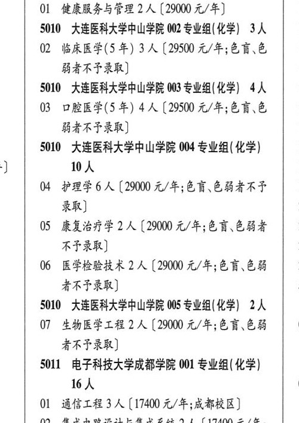

# 5010 大连医科大学中山学院

- PDF页码：190
- 书内页码：239
- 专业组：5；专业条目：13

## 001专业组

- 选科要求：不限
- 招生计划：2 人
- 校验：review

| 专业代码 | 专业名称 | 计划人数 | 学费（元/年） | 备注/完整OCR内容 |
|---|---|---:|---:|---|
|  | 结构化OCR未稳定切分，请查看下方原文及源图 |  |  |  |

<details><summary>本专业组OCR原文</summary>

```text
5010大连医科大学中山学院001专业组（不限）2人
```
</details>

## 002专业组

- 选科要求：OCR未稳定识别
- 招生计划：3 人
- 校验：ok

| 专业代码 | 专业名称 | 计划人数 | 学费（元/年） | 备注/完整OCR内容 |
|---|---|---:|---:|---|
| 02 | 临床医学(5 年) | 3 | 29500 | 【29500 元/年;色言,色 1 BARTER) 1 |

<details><summary>本专业组OCR原文</summary>

```text
5010 大连医科大学中山学院 002 专业组(化学| 3人   1
02 临床医学(5 年) 3 人【29500 元/年;色言,色   1
BARTER)               1
```
</details>

## 003专业组

- 选科要求：化学
- 招生计划：4 人
- 校验：ok

| 专业代码 | 专业名称 | 计划人数 | 学费（元/年） | 备注/完整OCR内容 |
|---|---|---:|---:|---|
| 03 | 口腔医学(5 年) | 4 | 29500 | 【29500 元/年;色盲\色 1 弱者不予录取] 1 |

<details><summary>本专业组OCR原文</summary>

```text
S010 ”大连医科大学中山学院 003 专业组(化学) 4人   1
03 口腔医学(5 年) 4 人【29500 元/年;色盲\色   1
弱者不予录取]               1
```
</details>

## 004专业组

- 选科要求：化学
- 招生计划：OCR未稳定识别 人
- 校验：review

| 专业代码 | 专业名称 | 计划人数 | 学费（元/年） | 备注/完整OCR内容 |
|---|---|---:|---:|---|
| 04 | 护理学 | 6 | 29000 | 【29000 元/年;色盲、色弱者不了 1 录取] 2 |
| 05 | 康复治疗学 | 2 | 29000 | 【29000 元/年;色言\色弱者 \| 2 RFR) 2 |
| 06 | 医学检验技术 IA ( |  | 2900 | 2900 元/年;色盲色弱 2 者不予录取] 5 |

<details><summary>本专业组OCR原文</summary>

```text
5010 大连医科大学中山学院 004 专业组( 化学) J      WA                  1
04 护理学6 人【29000 元/年;色盲、色弱者不了   1
录取]                   2
05 康复治疗学 2 人【29000 元/年;色言\色弱者 | 2
RFR)                 2
06 医学检验技术 IA (2900 元/年;色盲色弱   2
者不予录取]                5
```
</details>

## 005专业组

- 选科要求：OCR未稳定识别
- 招生计划：2 人
- 校验：review

| 专业代码 | 专业名称 | 计划人数 | 学费（元/年） | 备注/完整OCR内容 |
|---|---|---:|---:|---|
| 07 | 生物医学工程 | 2 | 29000 | 【29000 元/年;色盲色弱 0 者不予录取] 5S011 电子科技大学成都学院 001 专业组( 化学) |
| 16 | 人 0 |  |  | 16人 0 |
| 01 | 通信工程 | 3 | 17400 | [17400 元/年;成都校区] |
| 02 | 集成电路设计与集成系统 | 2 | 17400 | 【17400 元/年; 价 成都校区] 0 |
| 03 | 计算机科学与技术 | 3 | 17400 | 【17400 元/年;大一、 KHPA ERE, AZ AGRA DRE) |
| 04 | 数字媒体技术 3A ( |  | 17400 | 17400 元/年;大一大二 0 什郭校区就读,大三\大四成都校区就读] |
| 05 | 电子与计算机工程 A ( |  | 17400 | 17400 元/年;成都校 区] 0 |
| 06 | 飞行器质量与可靠性 | 2 |  | 【17400 A/F HB 校区] |

<details><summary>本专业组OCR原文</summary>

```text
5010 大连医科大学中山学院 005 专业组(化学| 2人
07 生物医学工程 2 人【29000 元/年;色盲色弱   0
者不予录取]
5S011 电子科技大学成都学院 001 专业组( 化学)
16人                  0
01 通信工程 3 人[17400 元/年;成都校区]
02 集成电路设计与集成系统 2 人【17400 元/年;
价     成都校区]                 0
03 计算机科学与技术 3 人【17400 元/年;大一、
KHPA ERE, AZ AGRA DRE)
04 数字媒体技术 3A (17400 元/年;大一大二   0
什郭校区就读,大三\大四成都校区就读]
05 电子与计算机工程 A (17400 元/年;成都校
区]                    0
06 飞行器质量与可靠性 2人【17400 A/F HB
校区]
```
</details>

## 附：院校完整OCR原文

```text
--- PDF第190页（书内第239页），第2栏 ---
5010 大连医科大学中山学院 001 Sw AR) 2 人   0
Ol 健康服务与管理 2 人【29000 元/年]      1
5010 大连医科大学中山学院 002 专业组(化学| 3人   1
02 临床医学(5 年) 3 人【29500 元/年;色言,色   1
BARTER)               1
S010 ”大连医科大学中山学院 003 专业组(化学) 4人   1
03 口腔医学(5 年) 4 人【29500 元/年;色盲\色   1
弱者不予录取]               1
5010 大连医科大学中山学院 004 专业组( 化学)
J      WA                  1
04 护理学6 人【29000 元/年;色盲、色弱者不了   1
录取]                   2
05 康复治疗学 2 人【29000 元/年;色言\色弱者 | 2
RFR)                 2
06 医学检验技术 IA (2900 元/年;色盲色弱   2
者不予录取]                5
5010 大连医科大学中山学院 005 专业组(化学| 2人
07 生物医学工程 2 人【29000 元/年;色盲色弱   0
者不予录取]
5S011 电子科技大学成都学院 001 专业组( 化学)
16人                  0
01 通信工程 3 人[17400 元/年;成都校区]
02 集成电路设计与集成系统 2 人【17400 元/年;
价     成都校区]                 0
03 计算机科学与技术 3 人【17400 元/年;大一、
KHPA ERE, AZ AGRA DRE)
04 数字媒体技术 3A (17400 元/年;大一大二   0
什郭校区就读,大三\大四成都校区就读]
05 电子与计算机工程 A (17400 元/年;成都校
区]                    0
06 飞行器质量与可靠性 2人【17400 A/F HB
校区]
```

## 源图

