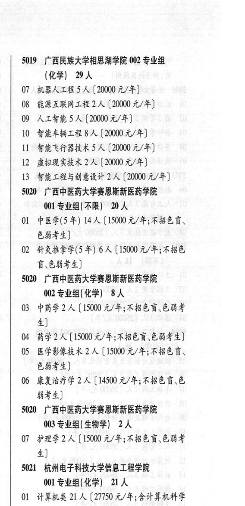

# 5020 广西中医药大学赛恩斯新医药学院

- PDF页码：191
- 书内页码：240
- 专业组：0；专业条目：0

## 附：院校完整OCR原文

```text
--- PDF第191页（书内第240页），第3栏 ---
5020 广西中医药大学赛思斯新医药学院
001 专业组( 不限】 20 人
01 中医学(5年) 14 人【15000 元/年;不招色言、
色弱考生]
02 针灸推拿学(5 年) 6 人【15000 元/年;不招色
盲\色弱考生]
5020 广西中医药大学赛思斯新医药学院
002 专业组(化学) 8人
03 中药学 2 人【15000 A/F; FEA OBE
生]
04 药学2 人【15000 元/年;不招色盲色弱考生]
05 医学影像技术 2A (15000 元/年;不招色育、
EHF)
06 康复治疗学 2 人【14500 元/年;不招色育、色
能考生]
50200 广西中医药大学赛恩斯新医药学院
003 专业组( 生物学) 2 人
07 护理学2 人【15000 元/年;不招色育、色弱考
生]
S021 杭州电子科技大学信息工程学院
001 专业组(化学| 21人
01 计算机类 21 人【27750 元/年;含计算机科学
与技术\软件工程网络工程、物联网工程]
S021 杭州电子科技大学信息工程学院
002 专业组(化学) 10 人
02 通信工程 10 A (20000 元/年]
S021 杭州电子科技大学信息工程学院
003 专业组(化学| 10 人
03 电子信息类 10 人【27750 元/年;含电子信息
科学与技术\电子信息工程]
```

## 源图

