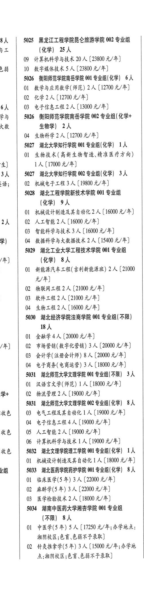
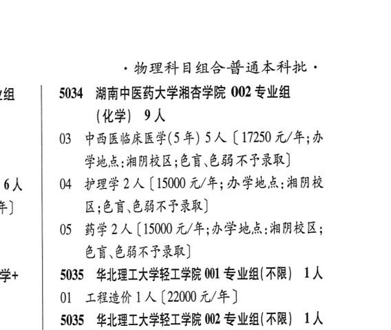

# 5034 湖南中医药大学湘杏学院

- PDF页码：192
- 书内页码：241
- 专业组：2；专业条目：4

## 001专业组

- 选科要求：ARR
- 招生计划：8 人
- 校验：ok

| 专业代码 | 专业名称 | 计划人数 | 学费（元/年） | 备注/完整OCR内容 |
|---|---|---:|---:|---|
| 01 | 中医学(5 年) | 5 | 17250 | 【17250 元/年;办学地点; 湘阴校区;色盲.色弱不予录取] |
| 02 | ”针灸推拿学(5 年) | 3 | 15000 | 【15000 元/年;办学地 A RARE OW EBRFRR) 物理科目组合普通本科批， |

<details><summary>本专业组OCR原文</summary>

```text
5034 湖南中医药大学湘耕学院 001 专业组 (ARR) 8人
01 中医学(5 年) 5 人【17250 元/年;办学地点;
湘阴校区;色盲.色弱不予录取]
02 ”针灸推拿学(5 年) 3 人【15000 元/年;办学地
A RARE OW EBRFRR)
物理科目组合普通本科批，
```
</details>

## 002专业组

- 选科要求：OCR未稳定识别
- 招生计划：4 人
- 校验：sum-corrected

| 专业代码 | 专业名称 | 计划人数 | 学费（元/年） | 备注/完整OCR内容 |
|---|---|---:|---:|---|
| 03 | 中西医临床医学(5年) 5A (17250 元/年;办 PAARL, CD EBATRE) J 04 护理学 | 2 | 17250 | 【15000 元/年; AFA: AR 区;色盲.色弱不予录取] |
| 05 | 药学 | 2 | 15000 | [15000 元/年;办学地点:湘阴校区; 色盲色弱不予录取] |

<details><summary>本专业组OCR原文</summary>

```text
5034 湖南中医药大学湘可学院 002 专业组 (化学| 9人
03 中西医临床医学(5年) 5A (17250 元/年;办
PAARL, CD EBATRE)
J 04 护理学2 人【15000 元/年; AFA: AR
区;色盲.色弱不予录取]
05 药学2 人[15000 元/年;办学地点:湘阴校区;
色盲色弱不予录取]
```
</details>

## 附：院校完整OCR原文

```text
--- PDF第192页（书内第241页），第2栏 ---
5034 湖南中医药大学湘耕学院 001 专业组
(ARR) 8人
01 中医学(5 年) 5 人【17250 元/年;办学地点;
湘阴校区;色盲.色弱不予录取]
02 ”针灸推拿学(5 年) 3 人【15000 元/年;办学地
A RARE OW EBRFRR)

--- PDF第192页（书内第241页），第3栏 ---
物理科目组合普通本科批，
5034 湖南中医药大学湘可学院 002 专业组
(化学| 9人
03 中西医临床医学(5年) 5A (17250 元/年;办
PAARL, CD EBATRE)
J 04 护理学2 人【15000 元/年; AFA: AR
区;色盲.色弱不予录取]
05 药学2 人[15000 元/年;办学地点:湘阴校区;
色盲色弱不予录取]
```

## 源图


