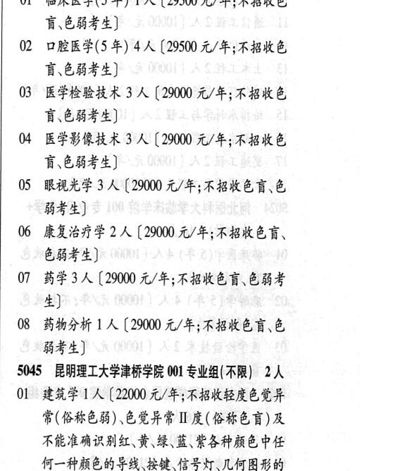

# 5044 锦州医科大学医疗学院

- PDF页码：193
- 书内页码：242
- 专业组：1；专业条目：5

## 001专业组

- 选科要求：化学
- 招生计划：OCR未稳定识别 人
- 校验：review

| 专业代码 | 专业名称 | 计划人数 | 学费（元/年） | 备注/完整OCR内容 |
|---|---|---:|---:|---|
| 20 | 人 |  |  | 20人 |
| 01 | 临床医学(5 4A) 1A ( |  | 29500 | 29500 元/年;不招收色 讶色弱考生] |
| 02 | 口腔医学(5 年) | 4 | 29500 | [29500 元/年;不招收色 讶色弱考生] |
| 03 | 医学检验技术 | 3 | 29000 | 【29000 元/年;不招收色 盲\色弱考生] 4 医学影像技术 3 A (29000 元/年;不招收色 B68 4) |
| 05 | 了眼视光学 3 A (29000 元/年;不招收色言、色 能考生] J6 康复治疗学 | 2 | 29000 | [29000 元/年;不招收色言、 色弱考生] ] 药学3 人[29000 元/年;不招收色盲、色弱考 生] 8 药物分析 1 人【29000 元/年;不招收色盲、色 能考生] |

<details><summary>本专业组OCR原文</summary>

```text
5044 锦州医科大学医疗学院 001 专业组( 化学)
20人
Ol 临床医学(5 4A) 1A (29500 元/年;不招收色
讶色弱考生]
02 口腔医学(5 年) 4 人[29500 元/年;不招收色
讶色弱考生]
03 医学检验技术 3 人【29000 元/年;不招收色
盲\色弱考生]
4 医学影像技术 3 A (29000 元/年;不招收色
B68 4)
05 了眼视光学 3 A (29000 元/年;不招收色言、色
能考生]
J6 康复治疗学 2 人[29000 元/年;不招收色言、
色弱考生]
] 药学3 人[29000 元/年;不招收色盲、色弱考
生]
8 药物分析 1 人【29000 元/年;不招收色盲、色
能考生]
```
</details>

## 附：院校完整OCR原文

```text
--- PDF第193页（书内第242页），第3栏 ---
5044 锦州医科大学医疗学院 001 专业组( 化学)
20人
Ol 临床医学(5 4A) 1A (29500 元/年;不招收色
讶色弱考生]
02 口腔医学(5 年) 4 人[29500 元/年;不招收色
讶色弱考生]
03 医学检验技术 3 人【29000 元/年;不招收色
盲\色弱考生]
4 医学影像技术 3 A (29000 元/年;不招收色
B68 4)
05 了眼视光学 3 A (29000 元/年;不招收色言、色
能考生]
J6 康复治疗学 2 人[29000 元/年;不招收色言、
色弱考生]
] 药学3 人[29000 元/年;不招收色盲、色弱考
生]
8 药物分析 1 人【29000 元/年;不招收色盲、色
能考生]
```

## 源图

