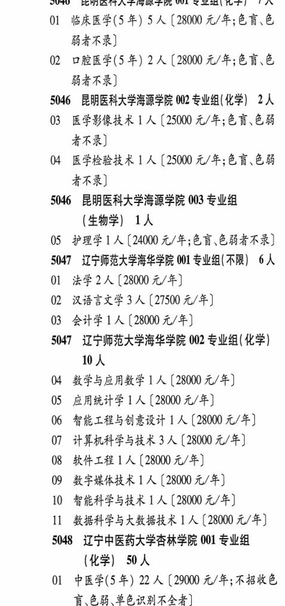

# 5046 昆明医科大学海源学院

- PDF页码：194
- 书内页码：243
- 专业组：3；专业条目：5

## 001专业组

- 选科要求：OCR未稳定识别
- 招生计划：OCR未稳定识别 人
- 校验：review

| 专业代码 | 专业名称 | 计划人数 | 学费（元/年） | 备注/完整OCR内容 |
|---|---|---:|---:|---|
| 01 | 临床医学(5 年) | 5 | 28000 | 【28000 元/年;色盲、色 BARR) |
| 02 | 口腔医学(5 年) 2A ( |  | 28000 | 28000 元/年;色盲、色 BARR) |

<details><summary>本专业组OCR原文</summary>

```text
5046 昆明医科大学海源学院 001 专业组{化学| 7A BARR)
Ol 临床医学(5 年) 5 人【28000 元/年;色盲、色
BARR)
02 口腔医学(5 年) 2A (28000 元/年;色盲、色
BARR)
```
</details>

## 002专业组

- 选科要求：化学
- 招生计划：2 人
- 校验：ok

| 专业代码 | 专业名称 | 计划人数 | 学费（元/年） | 备注/完整OCR内容 |
|---|---|---:|---:|---|
| 03 | 医学影像技术 | 1 | 25000 | 【25000 元/年;色盲、色弱 者不录] |
| 04 | 医学检验技术 | 1 | 25000 | 【25000 元/年;色育、色弱 者不录] |

<details><summary>本专业组OCR原文</summary>

```text
5046 昆明医科大学海源学院 002 专业组(化学) 2人
03 医学影像技术 1 人【25000 元/年;色盲、色弱
者不录]
04 医学检验技术 1 人【25000 元/年;色育、色弱
者不录]
```
</details>

## 003专业组

- 选科要求：OCR未稳定识别
- 招生计划：1 人
- 校验：sum-corrected

| 专业代码 | 专业名称 | 计划人数 | 学费（元/年） | 备注/完整OCR内容 |
|---|---|---:|---:|---|
| 05 | 护理学 | 1 | 24000 | 【24000 元/年;色盲、色弱者不录] |

<details><summary>本专业组OCR原文</summary>

```text
5046 昆明医科大学海源学院 003 专业组 (生物学| 工人
05 护理学1 人【24000 元/年;色盲、色弱者不录]
```
</details>

## 附：院校完整OCR原文

```text
--- PDF第194页（书内第243页），第1栏 ---
5046 昆明医科大学海源学院 001 专业组{化学| 7A
Ol 临床医学(5 年) 5 人【28000 元/年;色盲、色
BARR)
02 口腔医学(5 年) 2A (28000 元/年;色盲、色
BARR)
5046 昆明医科大学海源学院 002 专业组(化学) 2人
03 医学影像技术 1 人【25000 元/年;色盲、色弱
者不录]
04 医学检验技术 1 人【25000 元/年;色育、色弱
者不录]
5046 昆明医科大学海源学院 003 专业组
(生物学| 工人
05 护理学1 人【24000 元/年;色盲、色弱者不录]
```

## 源图

