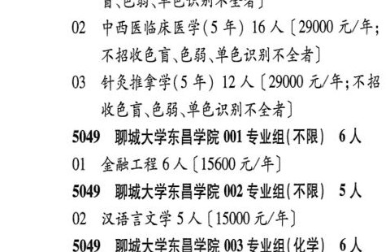

# 5048 辽宁中医药大学杏林学院

- PDF页码：194
- 书内页码：243
- 专业组：1；专业条目：3

## 001专业组

- 选科要求：化学
- 招生计划：50 人
- 校验：review

| 专业代码 | 专业名称 | 计划人数 | 学费（元/年） | 备注/完整OCR内容 |
|---|---|---:|---:|---|
| 01 | 中医学(5 年) | 22 | 29000 | 【29000 元/年;不招收色 HER BERNA) |
| 02 | 中西医临床医学(5 #) 16 A ( |  | 29000 | 29000 元/年; 不招收色盲色弱、单色识别不全者] |
| 03 | 针灸推拿学(5 年) | 12 | 29000 | 【29000 元/年;不招 KEW EB ERMA) |

<details><summary>本专业组OCR原文</summary>

```text
5048 辽宁中医药大学杏林学院 001 专业组 (化学) 50人
01 中医学(5 年) 22 人【29000 元/年;不招收色
HER BERNA)
02 中西医临床医学(5 #) 16 A (29000 元/年;
不招收色盲色弱、单色识别不全者]
03 针灸推拿学(5 年) 12 人【29000 元/年;不招
KEW EB ERMA)
```
</details>

## 附：院校完整OCR原文

```text
--- PDF第194页（书内第243页），第1栏 ---
5048 辽宁中医药大学杏林学院 001 专业组
(化学) 50人
01 中医学(5 年) 22 人【29000 元/年;不招收色
HER BERNA)
02 中西医临床医学(5 #) 16 A (29000 元/年;
不招收色盲色弱、单色识别不全者]
03 针灸推拿学(5 年) 12 人【29000 元/年;不招
KEW EB ERMA)
```

## 源图

