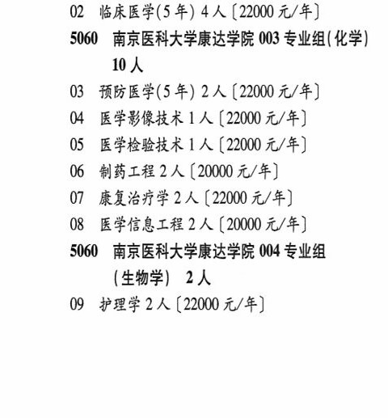

# 5060 南京医科大学康达学院

- PDF页码：196
- 书内页码：245
- 专业组：4；专业条目：10

## 001专业组

- 选科要求：OCR未稳定识别
- 招生计划：OCR未稳定识别 人
- 校验：review

| 专业代码 | 专业名称 | 计划人数 | 学费（元/年） | 备注/完整OCR内容 |
|---|---|---:|---:|---|
| 01 | 公共事业管理( 卫生事业管理) 1 ( |  | 18000 | 18000 元/年] |

<details><summary>本专业组OCR原文</summary>

```text
5060 南京医科大学康达学院 001 专业组{ 不限】 1A
01 公共事业管理( 卫生事业管理) 1 (18000
元/年]
```
</details>

## 002专业组

- 选科要求：OCR未稳定识别
- 招生计划：4 人
- 校验：review

| 专业代码 | 专业名称 | 计划人数 | 学费（元/年） | 备注/完整OCR内容 |
|---|---|---:|---:|---|
| 02 | 临床医学(5年) 4A ( |  | 22000 | 22000 元/年] |

<details><summary>本专业组OCR原文</summary>

```text
5060 南京医科大学康达学院 002 专业组(化学| 4人
02 临床医学(5年) 4A (22000 元/年]
```
</details>

## 003专业组

- 选科要求：化学
- 招生计划：OCR未稳定识别 人
- 校验：review

| 专业代码 | 专业名称 | 计划人数 | 学费（元/年） | 备注/完整OCR内容 |
|---|---|---:|---:|---|
| 10 | 人 |  |  | 10人 |
| 03 | 预防医学(5 年) 2A ( |  | 22000 | 22000 元/年] |
| 04 | 医学影像技术 | 1 | 22000 | 【22000 元/年] |
| 05 | ”医学检验技术 | 1 | 22000 | 【22000 元/年] |
| 06 | 制药工程 | 2 | 20000 | [20000元/年] |
| 07 | 康复治疗学 | 2 | 22000 | 【22000 元/年] |
| 08 | 医学信息工程 | 2 | 20000 | 【20000 元/年] |

<details><summary>本专业组OCR原文</summary>

```text
5060 南京医科大学康达学院 003 专业组(化学)
10人
03 预防医学(5 年) 2A (22000 元/年]
04 医学影像技术 1 人【22000 元/年]
05 ”医学检验技术 1 人【22000 元/年]
06 制药工程2人[20000元/年]
07 康复治疗学2 人【22000 元/年]
08 医学信息工程 2 人【20000 元/年]
```
</details>

## 004专业组

- 选科要求：OCR未稳定识别
- 招生计划：2 人
- 校验：ok

| 专业代码 | 专业名称 | 计划人数 | 学费（元/年） | 备注/完整OCR内容 |
|---|---|---:|---:|---|
| 09 | 护理学 | 2 | 22000 | 【22000 元/年] |

<details><summary>本专业组OCR原文</summary>

```text
5060 ”南京医科大学康达学院 004 专业组 (生物学| 2人
09 护理学2 人【22000 元/年]
```
</details>

## 附：院校完整OCR原文

```text
--- PDF第196页（书内第245页），第1栏 ---
5060 南京医科大学康达学院 001 专业组{ 不限】 1A
01 公共事业管理( 卫生事业管理) 1 (18000
元/年]
5060 南京医科大学康达学院 002 专业组(化学| 4人
02 临床医学(5年) 4A (22000 元/年]
5060 南京医科大学康达学院 003 专业组(化学)
10人
03 预防医学(5 年) 2A (22000 元/年]
04 医学影像技术 1 人【22000 元/年]
05 ”医学检验技术 1 人【22000 元/年]
06 制药工程2人[20000元/年]
07 康复治疗学2 人【22000 元/年]
08 医学信息工程 2 人【20000 元/年]
5060 ”南京医科大学康达学院 004 专业组
(生物学| 2人
09 护理学2 人【22000 元/年]
```

## 源图

