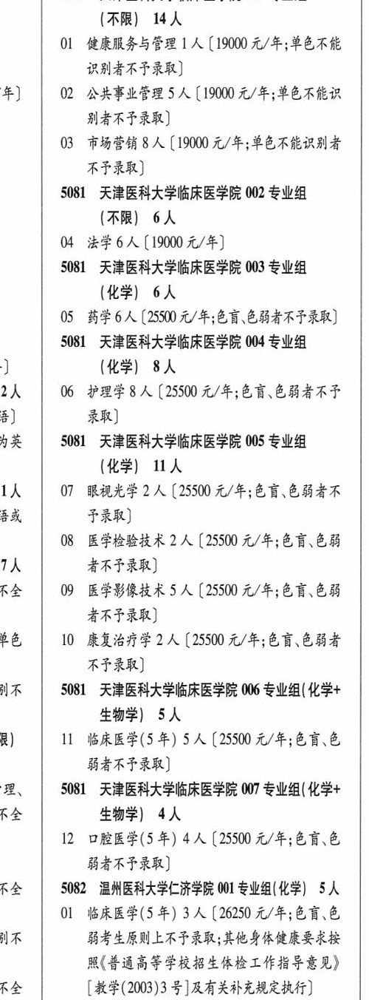

# 5081 天津医科大学临床医学院

- PDF页码：198
- 书内页码：247
- 专业组：7；专业条目：6

## 001专业组

- 选科要求：AR
- 招生计划：14 人
- 校验：review

| 专业代码 | 专业名称 | 计划人数 | 学费（元/年） | 备注/完整OCR内容 |
|---|---|---:|---:|---|
| 01 | 健康服务与管理 | 1 | 19000 | 【19000 元/年;单色不能 识别者不子录取] 年] 02 ”公共事业管理 5 (19000 元/年;单色不能识 BART RE) |
| 03 | 市场营销 A ( |  | 19000 | 19000 元/年;单色不能识别者 RFRR) |

<details><summary>本专业组OCR原文</summary>

```text
5081 天津医科大学临床医学院 001 专业组 (AR) 14人
Ol 健康服务与管理 1 人【19000 元/年;单色不能
识别者不子录取]
年] 02 ”公共事业管理 5 (19000 元/年;单色不能识
BART RE)
03 市场营销 A (19000 元/年;单色不能识别者
RFRR)
```
</details>

## 002专业组

- 选科要求：AR
- 招生计划：6 人
- 校验：ok

| 专业代码 | 专业名称 | 计划人数 | 学费（元/年） | 备注/完整OCR内容 |
|---|---|---:|---:|---|
| 04 | 法学 | 6 | 19000 | [19000元/年] |

<details><summary>本专业组OCR原文</summary>

```text
5081 天津医科大学临床医学院 002 专业组 (AR) 6人
04 法学6人[19000元/年]
```
</details>

## 003专业组

- 选科要求：OCR未稳定识别
- 招生计划：6 人
- 校验：ok

| 专业代码 | 专业名称 | 计划人数 | 学费（元/年） | 备注/完整OCR内容 |
|---|---|---:|---:|---|
| 05 | 药学 | 6 |  | [25500 A/F; 88 CHARTER) |

<details><summary>本专业组OCR原文</summary>

```text
5081 天津医科大学临床医学院 003 专业组 (化学| 6人
05 药学6人[25500 A/F; 88 CHARTER)
```
</details>

## 004专业组

- 选科要求：OCR未稳定识别
- 招生计划：8 人
- 校验：review

| 专业代码 | 专业名称 | 计划人数 | 学费（元/年） | 备注/完整OCR内容 |
|---|---|---:|---:|---|
|  | 结构化OCR未稳定切分，请查看下方原文及源图 |  |  |  |

<details><summary>本专业组OCR原文</summary>

```text
5081 天津医科大学临床医学院 004 专业组 ]      (化学| 8人
]      (化学| 8人
2h   06 护理学8 人【25500 A/F; 68 CHAFF
3)     录取]
```
</details>

## 005专业组

- 选科要求：OCR未稳定识别
- 招生计划：2 人
- 校验：sum-corrected

| 专业代码 | 专业名称 | 计划人数 | 学费（元/年） | 备注/完整OCR内容 |
|---|---|---:|---:|---|
| 08 | 医学检验技术 | 2 | 25500 | 【25500 元/年;色盲色弱 7人 者不予录取] RA 09 医学影像技术 5 人【25500 4/4; 6868 ARF RB) a 10 康复治疗学 2 人【25500 元/年;色盲色弱者 RF RR) |

<details><summary>本专业组OCR原文</summary>

```text
AX | 3081 天津医科大学临床医学院 005 专业组 (化学| UA 1A 07 RRL 2A (25500 4/4; 68 EHR
(化学| UA
1A 07 RRL 2A (25500 4/4; 68 EHR
BA     FRB)
08 医学检验技术 2 人【25500 元/年;色盲色弱
7人     者不予录取]
RA 09 医学影像技术 5 人【25500 4/4; 6868
ARF RB)
a   10 康复治疗学 2 人【25500 元/年;色盲色弱者
RF RR)
```
</details>

## 006专业组

- 选科要求：化学+生物学
- 招生计划：5 人
- 校验：review

| 专业代码 | 专业名称 | 计划人数 | 学费（元/年） | 备注/完整OCR内容 |
|---|---|---:|---:|---|
|  | 结构化OCR未稳定切分，请查看下方原文及源图 |  |  |  |

<details><summary>本专业组OCR原文</summary>

```text
由不 | 5081 天津医科大学临床医学院 006 专业组(化学+ 生物学) 5人
生物学) 5人
R)   11 临床医学(5 年) SA (25500 4/4; 68.6
弱者不子录取]
```
</details>

## 007专业组

- 选科要求：化学+RE生物学
- 招生计划：4 人
- 校验：ok

| 专业代码 | 专业名称 | 计划人数 | 学费（元/年） | 备注/完整OCR内容 |
|---|---|---:|---:|---|
| 12 | 口腔医学(5 年) | 4 | 25500 | 【25500 元/年;色盲,色 HARF RK) |

<details><summary>本专业组OCR原文</summary>

```text
理、 | 5081 天津医科大学临床医学院 007 专业组( 化学+ RE     生物学) 4人
12 口腔医学(5 年) 4 人【25500 元/年;色盲,色
HARF RK)
```
</details>

## 附：院校完整OCR原文

```text
--- PDF第198页（书内第247页），第2栏 ---
5081 天津医科大学临床医学院 001 专业组
(AR) 14人
Ol 健康服务与管理 1 人【19000 元/年;单色不能
识别者不子录取]
年] 02 ”公共事业管理 5 (19000 元/年;单色不能识
BART RE)
03 市场营销 A (19000 元/年;单色不能识别者
RFRR)
5081 天津医科大学临床医学院 002 专业组
(AR) 6人
04 法学6人[19000元/年]
5081 天津医科大学临床医学院 003 专业组
(化学| 6人
05 药学6人[25500 A/F; 88 CHARTER)
5081 天津医科大学临床医学院 004 专业组
]      (化学| 8人
2h   06 护理学8 人【25500 A/F; 68 CHAFF
3)     录取]
AX | 3081 天津医科大学临床医学院 005 专业组
(化学| UA
1A 07 RRL 2A (25500 4/4; 68 EHR
BA     FRB)
08 医学检验技术 2 人【25500 元/年;色盲色弱
7人     者不予录取]
RA 09 医学影像技术 5 人【25500 4/4; 6868
ARF RB)
a   10 康复治疗学 2 人【25500 元/年;色盲色弱者
RF RR)
由不 | 5081 天津医科大学临床医学院 006 专业组(化学+
生物学) 5人
R)   11 临床医学(5 年) SA (25500 4/4; 68.6
弱者不子录取]
理、 | 5081 天津医科大学临床医学院 007 专业组( 化学+
RE     生物学) 4人
12 口腔医学(5 年) 4 人【25500 元/年;色盲,色
HARF RK)
```

## 源图

