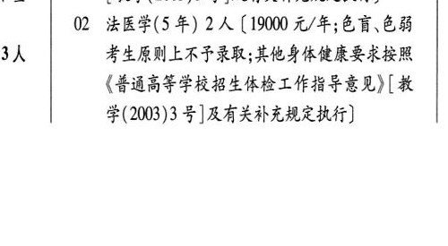
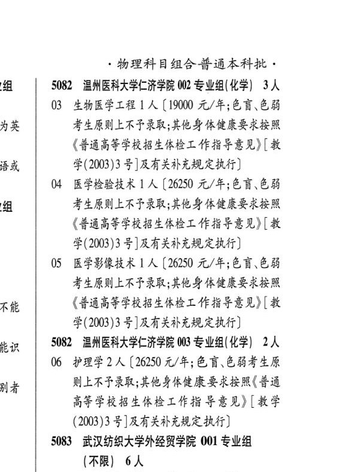

# 5082 温州医科大学仁济学院

- PDF页码：198
- 书内页码：247
- 专业组：3；专业条目：6

## 001专业组

- 选科要求：化学
- 招生计划：5 人
- 校验：ok

| 专业代码 | 专业名称 | 计划人数 | 学费（元/年） | 备注/完整OCR内容 |
|---|---|---:|---:|---|
| 01 | 临床医学(5 年) | 3 | 26250 | 【26250 元/年;色盲、.色 不 弱考生原则上不予录取;其他身体健康要求按 照(普通高等学校招生体检工作指导意见》 ws [教学(2003)3 号]及有关补充规定执行] |
| 02 | 法医学(5 年) | 2 | 19000 | 【19000 元/年;色盲色弱 3人 考生原则上不也录取;其他身体健康要求按照 《普通高等学校招生体检工作指导意见》[教 学(2003)3 号]及有关补充规定执行] ' 物理科目组合普通本科批 |

<details><summary>本专业组OCR原文</summary>

```text
Re | 5082 温州医科大学仁济学院 001 专业组(化学) 5 人
Ol 临床医学(5 年) 3 人【26250 元/年;色盲、.色
不     弱考生原则上不予录取;其他身体健康要求按
照(普通高等学校招生体检工作指导意见》
ws      [教学(2003)3 号]及有关补充规定执行]
02 法医学(5 年) 2 人【19000 元/年;色盲色弱
3人     考生原则上不也录取;其他身体健康要求按照
《普通高等学校招生体检工作指导意见》[教
学(2003)3 号]及有关补充规定执行]
' 物理科目组合普通本科批
```
</details>

## 002专业组

- 选科要求：化学
- 招生计划：3 人
- 校验：review

| 专业代码 | 专业名称 | 计划人数 | 学费（元/年） | 备注/完整OCR内容 |
|---|---|---:|---:|---|
| 03 | 生物医学工程 \| ( |  | 1900 | 1900 元/年;色盲.色弱 : 考生原则上不予录取;其他身体健康要求按照 《普通高等学校招生体检工作指导意见)[教 i 学(2003)3 号]及有关补充规定执行] |
| 04 | 医学检验技术 1A (2650 4/4;68 68 考生原则上不予录取;其他身体健康要求按照 《普通高等学校招生体检工作指导意见》[教 学(2003)3 号]及有关补充规定执行 |  |  | 04 医学检验技术 1A (2650 4/4;68 68 考生原则上不予录取;其他身体健康要求按照 《普通高等学校招生体检工作指导意见》[教 学(2003)3 号]及有关补充规定执行] |
| 05 | 医学影像技术 | 1 | 26250 | 【26250 元/年;色盲色弱 考生原则上不予录取;其他身体健康要求按照 《普通高等学校招生体检工作指导意见)[教 学(2003)3 号]及有关补充规定执行] |

<details><summary>本专业组OCR原文</summary>

```text
5082 温州医科大学仁济学院 002 专业组(化学) 3 人
03 生物医学工程 | (1900 元/年;色盲.色弱
:     考生原则上不予录取;其他身体健康要求按照
《普通高等学校招生体检工作指导意见)[教
i             学(2003)3 号]及有关补充规定执行]
04 医学检验技术 1A (2650 4/4;68 68
考生原则上不予录取;其他身体健康要求按照
《普通高等学校招生体检工作指导意见》[教
学(2003)3 号]及有关补充规定执行]
05 医学影像技术 1 人【26250 元/年;色盲色弱
考生原则上不予录取;其他身体健康要求按照
《普通高等学校招生体检工作指导意见)[教
学(2003)3 号]及有关补充规定执行]
```
</details>

## 003专业组

- 选科要求：化学
- 招生计划：2 人
- 校验：ok

| 专业代码 | 专业名称 | 计划人数 | 学费（元/年） | 备注/完整OCR内容 |
|---|---|---:|---:|---|
| 06 | 护理学 | 2 | 26250 | 【26250 元/年;色盲色弱考生原 . 则上不子录取;其他身体健康要求按照(普通 高等学校招生体检工作指导意见》[教学 (2003)3 号]及有关补充规定执行] |

<details><summary>本专业组OCR原文</summary>

```text
a   5082 温州医科大学仁济学院 003 专业组(化学) 2人
06 护理学2 人【26250 元/年;色盲色弱考生原
.     则上不子录取;其他身体健康要求按照(普通
高等学校招生体检工作指导意见》[教学
(2003)3 号]及有关补充规定执行]
```
</details>

## 附：院校完整OCR原文

```text
--- PDF第198页（书内第247页），第2栏 ---
Re | 5082 温州医科大学仁济学院 001 专业组(化学) 5 人
Ol 临床医学(5 年) 3 人【26250 元/年;色盲、.色
不     弱考生原则上不予录取;其他身体健康要求按
照(普通高等学校招生体检工作指导意见》
ws      [教学(2003)3 号]及有关补充规定执行]
02 法医学(5 年) 2 人【19000 元/年;色盲色弱
3人     考生原则上不也录取;其他身体健康要求按照
《普通高等学校招生体检工作指导意见》[教
学(2003)3 号]及有关补充规定执行]

--- PDF第198页（书内第247页），第3栏 ---
' 物理科目组合普通本科批
5082 温州医科大学仁济学院 002 专业组(化学) 3 人
03 生物医学工程 | (1900 元/年;色盲.色弱
:     考生原则上不予录取;其他身体健康要求按照
《普通高等学校招生体检工作指导意见)[教
i             学(2003)3 号]及有关补充规定执行]
04 医学检验技术 1A (2650 4/4;68 68
考生原则上不予录取;其他身体健康要求按照
《普通高等学校招生体检工作指导意见》[教
学(2003)3 号]及有关补充规定执行]
05 医学影像技术 1 人【26250 元/年;色盲色弱
考生原则上不予录取;其他身体健康要求按照
《普通高等学校招生体检工作指导意见)[教
学(2003)3 号]及有关补充规定执行]
a   5082 温州医科大学仁济学院 003 专业组(化学) 2人
06 护理学2 人【26250 元/年;色盲色弱考生原
.     则上不子录取;其他身体健康要求按照(普通
高等学校招生体检工作指导意见》[教学
(2003)3 号]及有关补充规定执行]
```

## 源图


