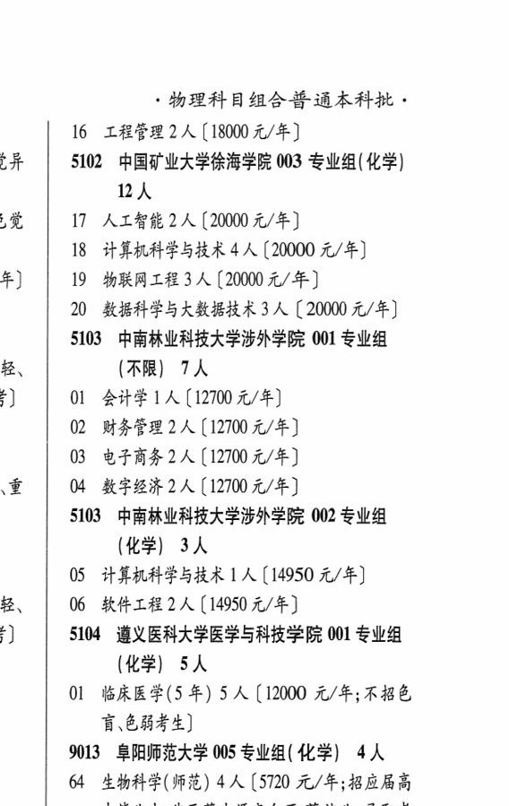

# 5104 遵义医科大学医学与科技学院

- PDF页码：200
- 书内页码：249
- 专业组：1；专业条目：1

## 001专业组

- 选科要求：OCR未稳定识别
- 招生计划：5 人
- 校验：ok

| 专业代码 | 专业名称 | 计划人数 | 学费（元/年） | 备注/完整OCR内容 |
|---|---|---:|---:|---|
| 01 | 临床医学(5 年) | 5 | 12000 | 【12000 元/年;不招色 讶色弱考生] |

<details><summary>本专业组OCR原文</summary>

```text
5104 遵义医科大学医学与科技学院 001 专业组 (化学| 5人
Ol 临床医学(5 年) 5 人【12000 元/年;不招色
讶色弱考生]
```
</details>

## 附：院校完整OCR原文

```text
--- PDF第200页（书内第249页），第3栏 ---
5104 遵义医科大学医学与科技学院 001 专业组
(化学| 5人
Ol 临床医学(5 年) 5 人【12000 元/年;不招色
讶色弱考生]
```

## 源图

