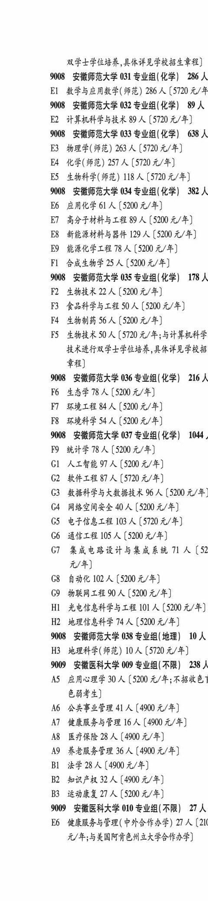
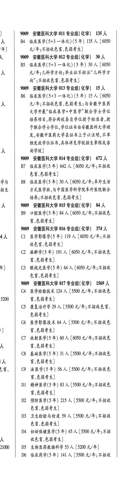

# 9009 安徽医科大学

- PDF页码：204
- 书内页码：253
- 专业组：10；专业条目：2

## 009专业组

- 选科要求：不限
- 招生计划：238 人
- 校验：review

| 专业代码 | 专业名称 | 计划人数 | 学费（元/年） | 备注/完整OCR内容 |
|---|---|---:|---:|---|
|  | 结构化OCR未稳定切分，请查看下方原文及源图 |  |  |  |

<details><summary>本专业组OCR原文</summary>

```text
9009 安徽医科大学 009 专业组( 不限) 238 人
AS 应用心理学 30 人【5200 元/年;不招收色1
6HF2)
AG 公共事业管理 41 A (4900 4/4)
AT 健康服务与管理 16 人【4900 4/4)
AS 医疗保险 28 A (4900 4/4)
AY 养老服务管理 36 A (4900 元/年]
Bl 法学28 人[4900元/年]
B2 知识产权 32 人【4900 元/年]
B3 运动康复 27 A (5200 元/年]
```
</details>

## 010专业组

- 选科要求：不限
- 招生计划：27 人
- 校验：review

| 专业代码 | 专业名称 | 计划人数 | 学费（元/年） | 备注/完整OCR内容 |
|---|---|---:|---:|---|
|  | 结构化OCR未稳定切分，请查看下方原文及源图 |  |  |  |

<details><summary>本专业组OCR原文</summary>

```text
9009 安徽医科大学 010 专业组(不限) 27 人
E6 健康服务与管理( 中外合作办学) 27 人 【21
元/年:与美国阿肯色州立大学合作办学]
```
</details>

## 011专业组

- 选科要求：化学
- 招生计划：135 人
- 校验：review

| 专业代码 | 专业名称 | 计划人数 | 学费（元/年） | 备注/完整OCR内容 |
|---|---|---:|---:|---|
|  | 结构化OCR未稳定切分，请查看下方原文及源图 |  |  |  |

<details><summary>本专业组OCR原文</summary>

```text
)    9009 安徽医科大学 011 专业组(化学) 135 人
天    B4 临床医学(5+3 一体化) (5 年) 135 人【6050
年]     元/年;不招收色盲色弱考生]
```
</details>

## 012专业组

- 选科要求：化学
- 招生计划：30 人
- 校验：review

| 专业代码 | 专业名称 | 计划人数 | 学费（元/年） | 备注/完整OCR内容 |
|---|---|---:|---:|---|
|  | 结构化OCR未稳定切分，请查看下方原文及源图 |  |  |  |

<details><summary>本专业组OCR原文</summary>

```text
人    9009 安徽医科大学 012 专业组(化学) 30 人
B5 临床医学(5+3 一体化) (5 年) 30 A (6050
人     元/年;儿科学方向;毕业证不标注“儿科学方
向";不招收色盲色弱考生]
```
</details>

## 013专业组

- 选科要求：化学
- 招生计划：15 人
- 校验：review

| 专业代码 | 专业名称 | 计划人数 | 学费（元/年） | 备注/完整OCR内容 |
|---|---|---:|---:|---|
|  | 结构化OCR未稳定切分，请查看下方原文及源图 |  |  |  |

<details><summary>本专业组OCR原文</summary>

```text
9009 安徽医科大学 013 专业组(化学) 15 人
B6 临床医学(5+3 一体化) (5 #) 15 A (6050
人     元/年;不招收色盲.色弱考生;与安徽中医药
大学开展“临床医学+中医学"联合学十学位
培养项目,符合两校各自学位授予标准者,授
耶联合学士学位,学位证书由安徽医科大学颂
A RRPRHAPFARHLT AUER, RE
人     询学校]
```
</details>

## 014专业组

- 选科要求：化学
- 招生计划：672 人
- 校验：review

| 专业代码 | 专业名称 | 计划人数 | 学费（元/年） | 备注/完整OCR内容 |
|---|---|---:|---:|---|
|  | 结构化OCR未稳定切分，请查看下方原文及源图 |  |  |  |

<details><summary>本专业组OCR原文</summary>

```text
9009 安徽医科大学 014 专业组(化学) 672 人
B7 临床医学(5年) 642 人【6050 元/年;不招收
色盲色弱考生]
学与   B8 临床医学(5 年) 30 人【6050 元/年;重外生活
招生     方式医学班,与中国医学科学院掉外医院联合
培养;不招收色盲.色弱考生]
```
</details>

## 015专业组

- 选科要求：化学
- 招生计划：84 人
- 校验：review

| 专业代码 | 专业名称 | 计划人数 | 学费（元/年） | 备注/完整OCR内容 |
|---|---|---:|---:|---|
|  | 结构化OCR未稳定切分，请查看下方原文及源图 |  |  |  |

<details><summary>本专业组OCR原文</summary>

```text
人   9009 安徽医科大学 015 专业组(化学) 84 人
BO 口腔医学(5年) 84 A (6050 元/年;不招收色
盲\色弱考生]
```
</details>

## 016专业组

- 选科要求：化学
- 招生计划：374 人
- 校验：review

| 专业代码 | 专业名称 | 计划人数 | 学费（元/年） | 备注/完整OCR内容 |
|---|---|---:|---:|---|
| 65 | 6844) |  |  | 65,6844) |

<details><summary>本专业组OCR原文</summary>

```text
9009 安徽医科大学 016 专业组(化学) 374 人
4人   Cl 医学影像学(5 年) 119 A (6050 元/年;不招
收色盲、色弱考生]
C2 ARES #) 191 A (6050 元/年;不招收色
HeH44)
)   C3. 眼视光医学(5 年) 64 A (6050 元/年;不招收
65,6844)
```
</details>

## 017专业组

- 选科要求：化学
- 招生计划：1569 人
- 校验：review

| 专业代码 | 专业名称 | 计划人数 | 学费（元/年） | 备注/完整OCR内容 |
|---|---|---:|---:|---|
|  | 结构化OCR未稳定切分，请查看下方原文及源图 |  |  |  |

<details><summary>本专业组OCR原文</summary>

```text
9009 安徽医科大学 017 专业组( 化学) 1569 人
C4 医学检验技术 124 人【5500 元/年;不招收色
5200     讶色弱考生]
CS 康复治疗学 29 人【5500 元/年;不招收色言、
色弱考生]
C6 医学影像技术 64 人【5500 元/年;不招收色
由      盲\色弱考生]
C7 放射医学(5年) 60 A (6050 元/年;不招收色
人      Fb8F4)
C8 基础医学(5年) 31 A (5500 元/年;不招收色
人     BtH44)
ae   C9 法医学(5 #) 56A (5500 元/年;不招收色
育\色弱考生]
DI 精神医学(5 年) 83 人【5500 元/年;不招收色
育\色弱考生]
D2 预防医学(5 #) 215 人【5500 元/年;不招收
én, 6844)
D3 卫生检验与检疫 59 A (5500 元/年;不招收
8.6842)
D4 妇幼保健医学(5 年) 45 A (5500 元/年;不招
人      KED EHF 4)
21000 | DS 生物医药数据科学 53 A (5200 元/年]
D6 临床药学(5 年) 141 A (5500 元/年;不招收
物理科目组合普通本科批。
色育、色弱考生]
0   D7 药学 154 人【5500 元/年; 不招收色盲,色弱
考生]
D8 中药学 60 人[5500 元/年; ROKER EB
0     考生]
了   D9 生物技术 68 人【5200 元/年;不招收色盲、色
弱考生]
El 生物信息学 74 人【5200 元/年;不招收色盲、
0     色弱考生]
§   E2 生物医学工程 105 A (5200 元/年;不招收色
i     育\色弱考生]
& | 了3 智能医学工程 102 人[5200 元/年;不招收色
i     言\色弱考生]
& | EL 化学生物学46 人[5200 元/年;不招收色盲、
色弱考生]
```
</details>

## 018专业组

- 选科要求：化学
- 招生计划：321 人
- 校验：review

| 专业代码 | 专业名称 | 计划人数 | 学费（元/年） | 备注/完整OCR内容 |
|---|---|---:|---:|---|
| 60 | 中医学(5+3 一体化) (5 #) 15 A ( |  | 6325 | 6325 元/年与安徽医科大学开展“中医学+临床医 5 学"联合学士学位培养项目，符合两校各自学 位授予标准者,授予联合学 士学位,学位证书 由安徽中医药大学颁发,安徽医科大学在证书 a 上了予以注明,不单独发放学 位证书，,具体详见 学校招生章程或咨询学校; 不招色觉异常(含 5 &H 68) F4) |

<details><summary>本专业组OCR原文</summary>

```text
9009 安徽医科大学 018 专业组 ( 化学) 321 人
ES 护理学321 A (5500 元/年;不招收色盲色弱
ia     #4)
9010 安徽中医药大学 008 专业组(不限) 60 人
£ | 59 中医学(5+3 一体化) (5 #) 45 人【6325
人     元/年;不招色觉异常(含色讶色弱)考生]
60 中医学(5+3 一体化) (5 #) 15 A (6325
元/年与安徽医科大学开展“中医学+临床医
5         学"联合学士学位培养项目，符合两校各自学
位授予标准者,授予联合学 士学位,学位证书
由安徽中医药大学颁发,安徽医科大学在证书
a     上了予以注明,不单独发放学 位证书，,具体详见
学校招生章程或咨询学校; 不招色觉异常(含
5     &H 68) F4)
```
</details>

## 附：院校完整OCR原文

```text
--- PDF第204页（书内第253页），第1栏 ---
9009 安徽医科大学 009 专业组( 不限) 238 人
AS 应用心理学 30 人【5200 元/年;不招收色1
6HF2)
AG 公共事业管理 41 A (4900 4/4)
AT 健康服务与管理 16 人【4900 4/4)
AS 医疗保险 28 A (4900 4/4)
AY 养老服务管理 36 A (4900 元/年]
Bl 法学28 人[4900元/年]
B2 知识产权 32 人【4900 元/年]
B3 运动康复 27 A (5200 元/年]
9009 安徽医科大学 010 专业组(不限) 27 人
E6 健康服务与管理( 中外合作办学) 27 人 【21
元/年:与美国阿肯色州立大学合作办学]

--- PDF第204页（书内第253页），第2栏 ---
)    9009 安徽医科大学 011 专业组(化学) 135 人
天    B4 临床医学(5+3 一体化) (5 年) 135 人【6050
年]     元/年;不招收色盲色弱考生]
人    9009 安徽医科大学 012 专业组(化学) 30 人
B5 临床医学(5+3 一体化) (5 年) 30 A (6050
人     元/年;儿科学方向;毕业证不标注“儿科学方
向";不招收色盲色弱考生]
9009 安徽医科大学 013 专业组(化学) 15 人
B6 临床医学(5+3 一体化) (5 #) 15 A (6050
人     元/年;不招收色盲.色弱考生;与安徽中医药
大学开展“临床医学+中医学"联合学十学位
培养项目,符合两校各自学位授予标准者,授
耶联合学士学位,学位证书由安徽医科大学颂
A RRPRHAPFARHLT AUER, RE
人     询学校]
9009 安徽医科大学 014 专业组(化学) 672 人
B7 临床医学(5年) 642 人【6050 元/年;不招收
色盲色弱考生]
学与   B8 临床医学(5 年) 30 人【6050 元/年;重外生活
招生     方式医学班,与中国医学科学院掉外医院联合
培养;不招收色盲.色弱考生]
人   9009 安徽医科大学 015 专业组(化学) 84 人
BO 口腔医学(5年) 84 A (6050 元/年;不招收色
盲\色弱考生]
9009 安徽医科大学 016 专业组(化学) 374 人
4人   Cl 医学影像学(5 年) 119 A (6050 元/年;不招
收色盲、色弱考生]
C2 ARES #) 191 A (6050 元/年;不招收色
HeH44)
)   C3. 眼视光医学(5 年) 64 A (6050 元/年;不招收
65,6844)
9009 安徽医科大学 017 专业组( 化学) 1569 人
C4 医学检验技术 124 人【5500 元/年;不招收色
5200     讶色弱考生]
CS 康复治疗学 29 人【5500 元/年;不招收色言、
色弱考生]
C6 医学影像技术 64 人【5500 元/年;不招收色
由      盲\色弱考生]
C7 放射医学(5年) 60 A (6050 元/年;不招收色
人      Fb8F4)
C8 基础医学(5年) 31 A (5500 元/年;不招收色
人     BtH44)
ae   C9 法医学(5 #) 56A (5500 元/年;不招收色
育\色弱考生]
DI 精神医学(5 年) 83 人【5500 元/年;不招收色
育\色弱考生]
D2 预防医学(5 #) 215 人【5500 元/年;不招收
én, 6844)
D3 卫生检验与检疫 59 A (5500 元/年;不招收
8.6842)
D4 妇幼保健医学(5 年) 45 A (5500 元/年;不招
人      KED EHF 4)
21000 | DS 生物医药数据科学 53 A (5200 元/年]
D6 临床药学(5 年) 141 A (5500 元/年;不招收

--- PDF第204页（书内第253页），第3栏 ---
物理科目组合普通本科批。
色育、色弱考生]
0   D7 药学 154 人【5500 元/年; 不招收色盲,色弱
考生]
D8 中药学 60 人[5500 元/年; ROKER EB
0     考生]
了   D9 生物技术 68 人【5200 元/年;不招收色盲、色
弱考生]
El 生物信息学 74 人【5200 元/年;不招收色盲、
0     色弱考生]
§   E2 生物医学工程 105 A (5200 元/年;不招收色
i     育\色弱考生]
& | 了3 智能医学工程 102 人[5200 元/年;不招收色
i     言\色弱考生]
& | EL 化学生物学46 人[5200 元/年;不招收色盲、
色弱考生]
9009 安徽医科大学 018 专业组 ( 化学) 321 人
ES 护理学321 A (5500 元/年;不招收色盲色弱
ia     #4)
9010 安徽中医药大学 008 专业组(不限) 60 人
£ | 59 中医学(5+3 一体化) (5 #) 45 人【6325
人     元/年;不招色觉异常(含色讶色弱)考生]
60 中医学(5+3 一体化) (5 #) 15 A (6325
元/年与安徽医科大学开展“中医学+临床医
5         学"联合学士学位培养项目，符合两校各自学
位授予标准者,授予联合学 士学位,学位证书
由安徽中医药大学颁发,安徽医科大学在证书
a     上了予以注明,不单独发放学 位证书，,具体详见
学校招生章程或咨询学校; 不招色觉异常(含
5     &H 68) F4)
```

## 源图



