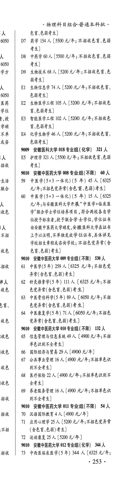
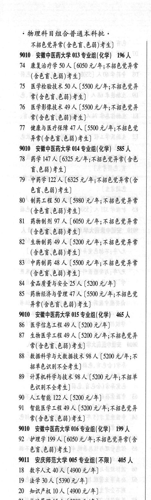
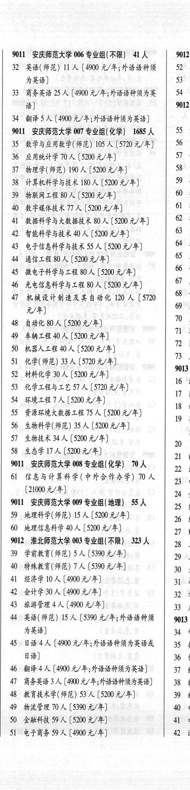

# 9010 安徽中医药大学

- PDF页码：204, 205
- 书内页码：253, 254
- 专业组：9；专业条目：42

## 008专业组

- 选科要求：不限
- 招生计划：60 人
- 校验：review

| 专业代码 | 专业名称 | 计划人数 | 学费（元/年） | 备注/完整OCR内容 |
|---|---|---:|---:|---|
| 60 | 中医学(5+3 一体化) (5 #) 15 A ( |  | 6325 | 6325 元/年与安徽医科大学开展“中医学+临床医 5 学"联合学士学位培养项目，符合两校各自学 位授予标准者,授予联合学 士学位,学位证书 由安徽中医药大学颁发,安徽医科大学在证书 a 上了予以注明,不单独发放学 位证书，,具体详见 学校招生章程或咨询学校; 不招色觉异常(含 5 &H 68) F4) |

<details><summary>本专业组OCR原文</summary>

```text
9010 安徽中医药大学 008 专业组(不限) 60 人
60 中医学(5+3 一体化) (5 #) 15 A (6325
元/年与安徽医科大学开展“中医学+临床医
5         学"联合学士学位培养项目，符合两校各自学
位授予标准者,授予联合学 士学位,学位证书
由安徽中医药大学颁发,安徽医科大学在证书
a     上了予以注明,不单独发放学 位证书，,具体详见
学校招生章程或咨询学校; 不招色觉异常(含
5     &H 68) F4)
```
</details>

## 009专业组

- 选科要求：KR
- 招生计划：71 人
- 校验：sum-corrected

| 专业代码 | 专业名称 | 计划人数 | 学费（元/年） | 备注/完整OCR内容 |
|---|---|---:|---:|---|
| 63 | PRRGHE(S 年) 89 A (6050 元/年;不招 s 色党异常(含色言、色弱)考生] 的“中医康复学(5年) | 71 | 6050 | 【6050 元/年;不招色 5 觉异常(含色言\色弱)考生] |

<details><summary>本专业组OCR原文</summary>

```text
9010 安徽中医药大学 009 专业组 (KR) 530 人
k | 61 中医学(5年) 259 人【6325 元/年;不招色觉
异常(含色盲色弱)考生]
i    62 针灸推拿学(5 年) 111 人【〔 6325 元/年;不招
5     CEFF (SER CH) F 4)
63 PRRGHE(S 年) 89 A (6050 元/年;不招
s     色党异常(含色言、色弱)考生]
的“中医康复学(5年) 71 人【6050 元/年;不招色
5     觉异常(含色言\色弱)考生]
```
</details>

## 010专业组

- 选科要求：AR
- 招生计划：553 人
- 校验：sum-corrected

| 专业代码 | 专业名称 | 计划人数 | 学费（元/年） | 备注/完整OCR内容 |
|---|---|---:|---:|---|
| 65 | 信息管理与信息系统 | 499 | 4900 | 【4900 元/年;不招 单色识别不全考生] 5 66 国际经济与贸易 29 A (4900 元/年] |
| 61 | 公共事业管理 | 16 | 4900 | 【4900 元/年;不招单色识 5 别不全考生] |
| 68 | 医疗保险 | 22 | 4900 | 【4900 元/年;不招单色识别不 5 全考生] |
| 69 | ”养老服务管理 | 16 | 4900 | 【4900 元/年;不招单色识 别不全考生] |

<details><summary>本专业组OCR原文</summary>

```text
9010 安徽中医药大学 010 专业组 (AR) 132 人
65 信息管理与信息系统 499 人【4900 元/年;不招
单色识别不全考生]
5   66 国际经济与贸易 29 A (4900 元/年]
61 公共事业管理 16 人【4900 元/年;不招单色识
5     别不全考生]
68 医疗保险 22 人【4900 元/年;不招单色识别不
5     全考生]
69 ”养老服务管理 16 人【4900 元/年;不招单色识
别不全考生]
```
</details>

## 011专业组

- 选科要求：不限
- 招生计划：25 人
- 校验：sum-corrected

| 专业代码 | 专业名称 | 计划人数 | 学费（元/年） | 备注/完整OCR内容 |
|---|---|---:|---:|---|
| 71 | 应用心理学 | 25 | 5200 | 【5200 元/年;不招色觉异党 8 (468.68) 44) T2 运动康复 25 A (5200 A/F) |

<details><summary>本专业组OCR原文</summary>

```text
9010 安徽中医药大学 011 专业组(不限】 54 人
71 应用心理学 25 人【5200 元/年;不招色觉异党
8     (468.68) 44)
T2 运动康复 25 A (5200 A/F)
```
</details>

## 012专业组

- 选科要求：化学
- 招生计划：344 人
- 校验：review

| 专业代码 | 专业名称 | 计划人数 | 学费（元/年） | 备注/完整OCR内容 |
|---|---|---:|---:|---|
|  | 结构化OCR未稳定切分，请查看下方原文及源图 |  |  |  |

<details><summary>本专业组OCR原文</summary>

```text
9010 安徽中医药大学 012 专业组 (化学) 344 人
i | 73 中西医临床医学(5 +) 344 人【6325 元/年;
253 +
物理科目组合普通本科批。
不招色觉异常(含色盲色弱)考生]
```
</details>

## 013专业组

- 选科要求：OCR未稳定识别
- 招生计划：146 人
- 校验：sum-corrected

| 专业代码 | 专业名称 | 计划人数 | 学费（元/年） | 备注/完整OCR内容 |
|---|---|---:|---:|---|
| 14 | 康复治疗学 | 50 | 6050 | 【6050 元/年;不招色觉异常 (469,68) 44) 1S 医学检验技术 50 人【5500 元/年;不招色觉异 常(含色言色弱)考生] |
| 16 | 医学影像技术 | 49 | 5500 | 【5500 元/年;不招色觉异 常(含色言\色弱)考生] |
| 77 | 健康与医疗保障 | 47 | 5500 | 【5500 元/年;不招色觉 异常(含色盲、色弱)考生] |

<details><summary>本专业组OCR原文</summary>

```text
9010 安徽中医药大学 013 专业组(化学| 19%6 人
14 康复治疗学 50 人【6050 元/年;不招色觉异常
(469,68) 44)
1S 医学检验技术 50 人【5500 元/年;不招色觉异
常(含色言色弱)考生]
16 医学影像技术 49 人【5500 元/年;不招色觉异
常(含色言\色弱)考生]
77 健康与医疗保障 47 人【5500 元/年;不招色觉
异常(含色盲、色弱)考生]
```
</details>

## 014专业组

- 选科要求：OCR未稳定识别
- 招生计划：585 人
- 校验：review

| 专业代码 | 专业名称 | 计划人数 | 学费（元/年） | 备注/完整OCR内容 |
|---|---|---:|---:|---|
| 78 | 药学147 A ( |  | 6325 | 6325 元/年;不招色觉异常(含色 Fb8)F4) |
| 19 | 中药学 | 122 | 6325 | 【6325 元/年;不招色觉异常(含 色育\色弱)考生] |
| 80 | 制药工程 50 A ( |  | 5980 | 5980 元/年;不招色觉异常 (469,68) 44) |
| 81 | 药物制剂 9]) A ( |  | 6050 | 6050 元/年;不招色觉异常 (469,68) 42) |
| 82 | 生物制药 49 A ( |  | 5200 | 5200 元/年;不招色觉异常 (含色盲色弱)考生] |
| 83 | 中药制药 48 A ( |  | 5500 | 5500 元/年;不招色觉异常 (Ab8, 68) 44) |
| 84 | 食品质量与安全 | 25 | 5200 | 【5200 元/年] |
| 85 | ”药物经济与管理 | 47 | 5500 | 【5500 元/年;不招色觉 异常(含色言\色能)考生] |

<details><summary>本专业组OCR原文</summary>

```text
9010 安徽中医药大学 014 专业组化学) 585 人
78 药学147 A (6325 元/年;不招色觉异常(含色
Fb8)F4)
19 中药学 122 人【6325 元/年;不招色觉异常(含
色育\色弱)考生]
80 制药工程 50 A (5980 元/年;不招色觉异常
(469,68) 44)
81 药物制剂 9]) A (6050 元/年;不招色觉异常
(469,68) 42)
82 生物制药 49 A (5200 元/年;不招色觉异常
(含色盲色弱)考生]
83 中药制药 48 A (5500 元/年;不招色觉异常
(Ab8, 68) 44)
84 食品质量与安全25 人【5200 元/年]
85 ”药物经济与管理 47 人【5500 元/年;不招色觉
异常(含色言\色能)考生]
```
</details>

## 015专业组

- 选科要求：OCR未稳定识别
- 招生计划：465 人
- 校验：review

| 专业代码 | 专业名称 | 计划人数 | 学费（元/年） | 备注/完整OCR内容 |
|---|---|---:|---:|---|
| 86 | 医学信息工程 | 9 | 5200 | 【5200元/年] |
| 87 | 生物医学工程 | 49 | 5200 | [5200 元/年;不招色觉异 常(含色言\色弱)考生] |
| 88 | ABA PH AMAA 98 A ( |  | 5200 | 5200 元/年;不 招单色识别不全考生] |
| 89 | 计算机科学与技术 | 98 | 5200 | 【5200 元/年;不招单 色识别不全考生] |
| 90 | ALAM | 122 | 5200 | 【5200 元/年] |
| 91 | 智能医学工程 | 9 | 5200 | [5200 元/年;不招色觉异 常(含色盲色弱)考生] |

<details><summary>本专业组OCR原文</summary>

```text
9010 安徽中医药大学 015 专业组(化学| 465 人
86 医学信息工程 9 人【5200元/年]
87 生物医学工程 49 人[5200 元/年;不招色觉异
常(含色言\色弱)考生]
88 ABA PH AMAA 98 A (5200 元/年;不
招单色识别不全考生]
89 计算机科学与技术 98 人【5200 元/年;不招单
色识别不全考生]
90 ALAM 122 人【5200 元/年]
91 智能医学工程 9 人[5200 元/年;不招色觉异
常(含色盲色弱)考生]
```
</details>

## 016专业组

- 选科要求：化学
- 招生计划：9 人
- 校验：review

| 专业代码 | 专业名称 | 计划人数 | 学费（元/年） | 备注/完整OCR内容 |
|---|---|---:|---:|---|
| 68 | 68) 44) 9%011 安庆师范大学 005 专业组(不限) | 405 |  | 68,68) 44) 9%011 安庆师范大学 005 专业组(不限) 405 人 |
| 18 | 数字人文 | 0 | 4900 | (4900元/年] |
| 19 | 法学 | 30 | 5390 | [5390元/年] |
| 20 | 知识产权 | 10 | 4900 | 【4900 元/年] |
| 21 | 物流管理 | 15 | 5390 | 【5390 元/年] |
| 22 | 数字经济 | 40 | 4900 | 【4900 元/年] |
| 23 | 人金融工程 6 A (4900 4/4) |  |  | 23 人金融工程 6 A (4900 4/4) |
| 24 | 国际经济与贸易 | 20 | 4900 | 【4900元/年] |
| 25 | 新闻学 | 10 | 4900 | 【4900元/年] |
| 26 | 网络与新媒体 | 80 | 4900 | 【4900 元/年] |
| 27 | 科学教育(师范) | 30 | 4900 | 【4900 元/年] |
| 28 | 旅游管理 | 20 | 4900 | 【4900 元/年] |
| 29 | 小学教育(师范) | 20 | 5390 | 【5390 元/年] |
| 30 | 应用心理学 | 15 | 5200 | 【5200 元/年] |
| 31 | 运动康复 | 10 | 5200 | 【5200元/年] “254 ， 9%011 安庆师范大学 006 专业组(不限) 41 人 9012 |
| 32 | 英语(师范) A ( |  | 4900 | 4900 元/年; 外语语种须 \| 52 者 为英语] 33 4 |
| 33 | 商务英语 | 25 | 4900 | 【4900 元/年; 外语语种须为英 \| 54 人 话] 9012 |
| 34 | IES A ( |  | 4900 | 4900 元/年;外语语种须为英语] |

<details><summary>本专业组OCR原文</summary>

```text
9010 安徽中医药大学 016 专业组(化学) 1%9 人
68,68) 44)
9%011 安庆师范大学 005 专业组(不限) 405 人
18 数字人文 0 人 (4900元/年]
19 法学30人[5390元/年]
20 知识产权 10 人【4900 元/年]
21 物流管理 15 人【5390 元/年]
22 数字经济 40 人【4900 元/年]
23 人金融工程 6 A (4900 4/4)
24 国际经济与贸易 20 人【4900元/年]
25 新闻学 10 人【4900元/年]
26 网络与新媒体 80 人【4900 元/年]
27 科学教育(师范) 30 人【4900 元/年]
28 旅游管理 20 人【4900 元/年]
29 小学教育(师范) 20 人【5390 元/年]
30 应用心理学15 人【5200 元/年]
31 运动康复 10 人【5200元/年]
“254 ，
9%011 安庆师范大学 006 专业组(不限) 41 人    9012
32 英语(师范) A (4900 元/年; 外语语种须 | 52 者
为英语]                 33 4
33 商务英语 25 人【4900 元/年; 外语语种须为英 | 54 人
话]                   9012
34 IES A (4900 元/年;外语语种须为英语]
```
</details>

## 附：院校完整OCR原文

```text
--- PDF第204页（书内第253页），第3栏 ---
9010 安徽中医药大学 008 专业组(不限) 60 人
£ | 59 中医学(5+3 一体化) (5 #) 45 人【6325
人     元/年;不招色觉异常(含色讶色弱)考生]
60 中医学(5+3 一体化) (5 #) 15 A (6325
元/年与安徽医科大学开展“中医学+临床医
5         学"联合学士学位培养项目，符合两校各自学
位授予标准者,授予联合学 士学位,学位证书
由安徽中医药大学颁发,安徽医科大学在证书
a     上了予以注明,不单独发放学 位证书，,具体详见
学校招生章程或咨询学校; 不招色觉异常(含
5     &H 68) F4)
9010 安徽中医药大学 009 专业组 (KR) 530 人
k | 61 中医学(5年) 259 人【6325 元/年;不招色觉
异常(含色盲色弱)考生]
i    62 针灸推拿学(5 年) 111 人【〔 6325 元/年;不招
5     CEFF (SER CH) F 4)
63 PRRGHE(S 年) 89 A (6050 元/年;不招
s     色党异常(含色言、色弱)考生]
的“中医康复学(5年) 71 人【6050 元/年;不招色
5     觉异常(含色言\色弱)考生]
9010 安徽中医药大学 010 专业组 (AR) 132 人
65 信息管理与信息系统 499 人【4900 元/年;不招
单色识别不全考生]
5   66 国际经济与贸易 29 A (4900 元/年]
61 公共事业管理 16 人【4900 元/年;不招单色识
5     别不全考生]
68 医疗保险 22 人【4900 元/年;不招单色识别不
5     全考生]
69 ”养老服务管理 16 人【4900 元/年;不招单色识
别不全考生]
9010 安徽中医药大学 011 专业组(不限】 54 人
& | 10 汉语国际教育4 人[4900元/年]
71 应用心理学 25 人【5200 元/年;不招色觉异党
8     (468.68) 44)
T2 运动康复 25 A (5200 A/F)
9010 安徽中医药大学 012 专业组 (化学) 344 人
i | 73 中西医临床医学(5 +) 344 人【6325 元/年;
253 +

--- PDF第205页（书内第254页），第1栏 ---
物理科目组合普通本科批。
不招色觉异常(含色盲色弱)考生]
9010 安徽中医药大学 013 专业组(化学| 19%6 人
14 康复治疗学 50 人【6050 元/年;不招色觉异常
(469,68) 44)
1S 医学检验技术 50 人【5500 元/年;不招色觉异
常(含色言色弱)考生]
16 医学影像技术 49 人【5500 元/年;不招色觉异
常(含色言\色弱)考生]
77 健康与医疗保障 47 人【5500 元/年;不招色觉
异常(含色盲、色弱)考生]
9010 安徽中医药大学 014 专业组化学) 585 人
78 药学147 A (6325 元/年;不招色觉异常(含色
Fb8)F4)
19 中药学 122 人【6325 元/年;不招色觉异常(含
色育\色弱)考生]
80 制药工程 50 A (5980 元/年;不招色觉异常
(469,68) 44)
81 药物制剂 9]) A (6050 元/年;不招色觉异常
(469,68) 42)
82 生物制药 49 A (5200 元/年;不招色觉异常
(含色盲色弱)考生]
83 中药制药 48 A (5500 元/年;不招色觉异常
(Ab8, 68) 44)
84 食品质量与安全25 人【5200 元/年]
85 ”药物经济与管理 47 人【5500 元/年;不招色觉
异常(含色言\色能)考生]
9010 安徽中医药大学 015 专业组(化学| 465 人
86 医学信息工程 9 人【5200元/年]
87 生物医学工程 49 人[5200 元/年;不招色觉异
常(含色言\色弱)考生]
88 ABA PH AMAA 98 A (5200 元/年;不
招单色识别不全考生]
89 计算机科学与技术 98 人【5200 元/年;不招单
色识别不全考生]
90 ALAM 122 人【5200 元/年]
91 智能医学工程 9 人[5200 元/年;不招色觉异
常(含色盲色弱)考生]
9010 安徽中医药大学 016 专业组(化学) 1%9 人
时“护理学199 人【6050 元/年;不招色觉异常(含
68,68) 44)
9%011 安庆师范大学 005 专业组(不限) 405 人
18 数字人文 0 人 (4900元/年]
19 法学30人[5390元/年]
20 知识产权 10 人【4900 元/年]
21 物流管理 15 人【5390 元/年]
22 数字经济 40 人【4900 元/年]
23 人金融工程 6 A (4900 4/4)
24 国际经济与贸易 20 人【4900元/年]
25 新闻学 10 人【4900元/年]
26 网络与新媒体 80 人【4900 元/年]
27 科学教育(师范) 30 人【4900 元/年]
28 旅游管理 20 人【4900 元/年]
29 小学教育(师范) 20 人【5390 元/年]
30 应用心理学15 人【5200 元/年]
31 运动康复 10 人【5200元/年]
“254 ，

--- PDF第205页（书内第254页），第2栏 ---
9%011 安庆师范大学 006 专业组(不限) 41 人    9012
32 英语(师范) A (4900 元/年; 外语语种须 | 52 者
为英语]                 33 4
33 商务英语 25 人【4900 元/年; 外语语种须为英 | 54 人
话]                   9012
34 IES A (4900 元/年;外语语种须为英语]
```

## 源图



